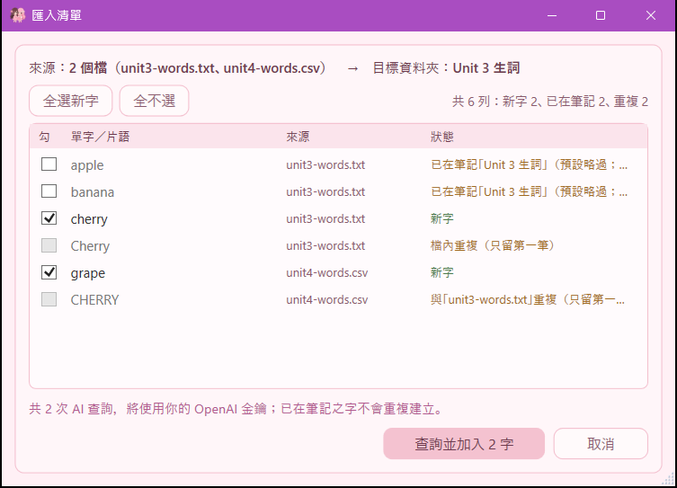
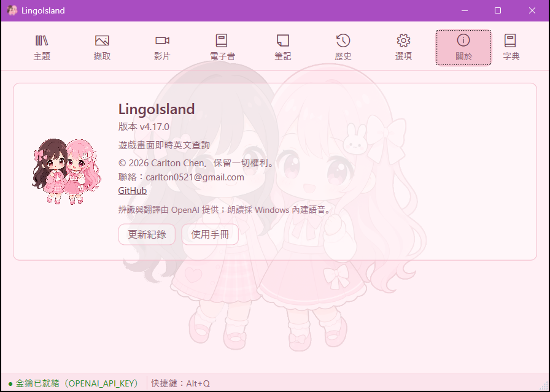

# solLingoIsland — 遊戲畫面英文即時查詢工具

> **本文件為產品使用手冊**，內容依已發行版本之實作校準；尚未實作之行為不在此臆造。各節標註「vX.Y.Z 起」者為該行為開始生效的版本。

## 產品定位

玩英文遊戲遇到看不懂的字句時，按 `Alt+L` 框選畫面上的文字，立即取得**英文原文、KK 音標、繁體中文翻譯**，還能整句朗讀、**點選單字查該字字義**、或**編輯辨識錯的原文重新翻譯**——全程不用切出遊戲、不中斷操作。

- Windows 常駐；安裝版**啟動時自動檢查更新**（背景下載、重啟套用，免手動換版），另提供免安裝 Portable 版；工作列常駐主控入口隨時找得到（不依賴系統匣顯示設定）
- 辨識與翻譯使用你自己的 OpenAI API 額度（金鑰只存在環境變數，程式不儲存）
- 朗讀使用 Windows 內建語音，離線可用、不另計費
- **（v4.9.0 起）中英文都會唸**：同一段裡中英文夾雜也照唸——英文段用英文語音、中文段用中文語音，一句之內自動換聲。系統若還沒裝中文語音，中文段會以預設語音念，並提示你到「設定 → 語言 → 語音」加裝
- 每次查詢自動留存**查詢歷史**，可隨時開啟回顧、重聽、刪除或清除（只存在你本機）
- 把值得記的字句**加入我的筆記**：以自訂資料夾分類、拖曳排序、長期保存（不受歷史清除影響）
- 對筆記**練習發音**：在筆記卡片播音鈕旁**按住麥克風鈕錄音、放開由 AI 評分**，唸得夠標準旁邊**成績框轉綠顯分**（最佳分本機保存、可一鍵清空重練）
- 可管理多個**命名應用主題**（輸入文字，或**貼上／上傳遊戲畫面由 AI 自動解釋**），擇一使用讓翻譯更貼切
- **（v2.0.0 新增）影片擷取**：貼一支 YouTube 英文影片，導引播放**到句暫停**、點字幕單字即查、存進同一套「我的筆記」——螢幕與影片是兩個並排的**擷取來源**，下游查詢／筆記／發音練習完全共用
- **（v3.6.0 新增）自製字幕檔直接匯入**：手上已有字幕檔（自己聽打或整理的 `.srt`／`.vtt`）就**直接給檔**——選檔或拖進來即可，不必先傳上網取得網址。字幕檔還能**自己帶著影片網址**（寫在檔頭註解），一個檔就是一課的完整資料，輸入框連打字都省了；**一次拖多個檔就批次加入整季**。自帶時間軸的字幕檔走免費解析，**不花 OpenAI 額度**
- **（v3.15.0 新增）電子書擷取**：把你自己的 **EPUB 電子書**加入**書櫃**——選檔或拖進 `.epub`（可一次多本批次），程式讀出書名、作者與章節目錄、擺上有**封面縮圖**的書櫃，可**依主題整理、依加入時間／書名／作者／主題排序**，同一本書不會重複收；藏書長期保存在你本機、換電腦可隨資料備份一起帶走。翻開內文閱讀、逐段導讀與朗讀見下方 v4.0.0（本階段先把「加入書櫃、整理保存」做好）
- **（v4.0.0 新增）電子書內容閱讀**：把書櫃裡的書**翻開來讀**——**逐段導讀**（上一段／下一段／繼續、雙擊章節或段落跳讀、讀到哪記到哪）、聽 **TTS 朗讀**（唸完自動接下一段）、**點字查詞**並加進「我的筆記」、對白**依說話人上色**；沿用你熟悉的查詢／筆記／朗讀那套，不必另學（詳見下方「電子書內容閱讀」一節）

## 使用前提

- Windows 11（或 Windows 10 1903 以上）
- 遊戲以**無邊框視窗化（borderless windowed）**執行（獨占全螢幕下遮罩無法覆蓋）
- 自備 OpenAI API 金鑰與額度
- Windows 已安裝英文語音包（預設通常已有）

## 快速開始

1. **安裝程式**：自 [GitHub Releases](https://github.com/twMoonBear-Laboratory/solLingoIsland/releases/latest) 下載 `LingoIsland-win-Setup.exe` 執行（安裝至使用者目錄、不需系統管理員權限；之後**新版會自動更新**）。不想安裝可改下載 `LingoIsland-win-Portable.zip` 解壓到任意資料夾。想讓 Windows 認得發行者的話，**先做完下方「（選用）認得這個發行者」再執行安裝檔**。若跳出「Windows 已保護您的電腦」，確認檔案來自本專案 Release 頁後點「**其他資訊**」→「**仍要執行**」即可（詳見下方「常見問題」）。

> **（選用）認得這個發行者**——做完之後，安裝與執行時 Windows 會顯示發行者名稱，不再是「未知的發行者」。**請在執行安裝檔之前完成**（下載完先別雙擊）。
>
> 1. 自同一個 Release 頁下載 `LingoIsland-publisher.cer`（公開憑證，非機密），放在下載資料夾即可。匯入前建議先**核對指紋**——在放憑證的資料夾執行 `(Get-PfxCertificate -FilePath .\LingoIsland-publisher.cer).Thumbprint`，顯示的值應與該 Release 頁說明中的「簽章憑證指紋」完全相同；不同就別匯入。
> 2. **開一般 PowerShell**（不必系統管理員），`cd` 到放憑證的資料夾後執行——一次即可，之後每一版都認得：
>
>    ```powershell
>    Import-Certificate -FilePath .\LingoIsland-publisher.cer -CertStoreLocation Cert:\CurrentUser\Root
>    Import-Certificate -FilePath .\LingoIsland-publisher.cer -CertStoreLocation Cert:\CurrentUser\TrustedPublisher
>    ```
>
>    執行第一行（匯入 Root）時 Windows 會跳出「安全性警告」問是否安裝此憑證，確認是本專案的 `LingoIsland-publisher.cer` 後按「**是**」。
>
>    > 這是**只對目前登入帳號生效**的裝法，單人電腦用這個就好。要整台機器所有帳號都認得，改用 `Cert:\LocalMachine\Root` 與 `Cert:\LocalMachine\TrustedPublisher`，但**必須以系統管理員身分執行 PowerShell**，否則會出現 `Access is denied.`；那個視窗預設開在 `C:\Windows\System32`，記得用憑證的完整路徑。
>
> 3. 下載回來的安裝檔另需**解除封鎖**（Windows 對網路下載的檔案會加註記）：
>
>    ```powershell
>    Unblock-File .\LingoIsland-win-Setup.exe
>    ```
>
>    Portable 版改為解壓前先執行 `Unblock-File .\LingoIsland-win-Portable.zip`。
>
> 想確認有沒有生效：`(Get-AuthenticodeSignature .\LingoIsland-win-Setup.exe).Status` 應顯示 `Valid`（匯入前是 `UnknownError`）。
>
> **這兩步各解各的**：匯入憑證解掉「未知的發行者」；解除封鎖是讓 SmartScreen 不對該檔發作。**匯入憑證不會讓 SmartScreen 消失**——它查的是微軟雲端的檔案信譽，不看你本機信任了誰。
>
> **之後想移除這張憑證**（例如不再使用 LingoIsland）：在放憑證的資料夾開一般 PowerShell 執行下列兩行；刪 Root 那筆時 Windows 會再跳一次確認，按「**是**」。用 `LocalMachine` 裝的，把路徑換成 `Cert:\LocalMachine\…` 並以系統管理員身分執行（該視窗預設開在 `C:\Windows\System32`，記得先 `cd` 到憑證所在資料夾或改用完整路徑）。
>
> ```powershell
> $tp = (Get-PfxCertificate -FilePath .\LingoIsland-publisher.cer).Thumbprint
> Remove-Item "Cert:\CurrentUser\Root\$tp", "Cert:\CurrentUser\TrustedPublisher\$tp"
> ```

2. **設定金鑰**：設定使用者環境變數 `OPENAI_API_KEY`。PowerShell 一行完成：

   ```powershell
   [Environment]::SetEnvironmentVariable('OPENAI_API_KEY','sk-你的金鑰','User')
   ```

   也可以直接在 app 裡設（Portable 版請先雙擊 `LingoIsland.exe` 開啟）：主視窗「選項」分頁 →「AI 辨識與翻譯（OpenAI）」→ 於「API 金鑰（OPENAI_API_KEY）」欄貼上金鑰 → 捲到該頁最下方按右側「儲存」；效果與上面那行相同（同樣存進你的使用者環境變數），且**立即生效、不必重開**。用 PowerShell 設定時若 LingoIsland 已在執行（安裝完會自動啟動），請先結束它（主視窗 ✕）再從開始功能表（Portable 版從檔案總管雙擊）重新開啟，新金鑰才讀得到。

3. **啟動常駐**：安裝後自動啟動（之後可從開始功能表啟動；Portable 版雙擊 `LingoIsland.exe`），**主視窗開在「影片」分頁、工作列出現 LingoIsland 按鈕**即代表就緒；主視窗底部狀態列顯示「● 金鑰已就緒（OPENAI_API_KEY）」表示金鑰已讀到；若顯示「○ 金鑰未設定（OPENAI_API_KEY）」，回第 2 步改用 app 內「選項」分頁設定（立即生效）。主視窗可最小化（喚起快捷鍵照樣有效），隨時可從工作列或 `Alt+Tab` 找回它查看狀態、開設定；按主視窗 ✕ 會**結束整個程式**。
4. **開始查詢**：進入遊戲，看到不懂的英文 → 按 `Alt+L`（左右 Alt 皆可）→ **畫面凍結為靜止畫格** → 拖曳框選文字（或在某句上**雙擊**由 AI 自動判斷該句）→ 放開滑鼠。凍結期間點擊／雙擊不會傳到背後遊戲。
5. **查看結果**：結果顯示於**獨立的「字典」視窗**（原文／KK 音標／中譯）；點英文下方的 `▶ 播音` 聽整句（中譯下方另有一顆唸中文），英文句中的單字可以點：**單擊＝朗讀該字、雙擊＝查該字字義**（查完按頂部返回鈕「‹」回到原句；連查多字時逐層返回），辨識有錯可按頂部**鉛筆鈕**改原文、按「重新翻譯」重譯；字典視窗會浮在無邊框遊戲之上、**與主視窗共存互不干擾**，`Alt+Tab` 回遊戲即可。也可直接在字典視窗頂部輸入列**打字查詢**（或按下拉挑選查詢歷史）。

## 操作說明

> 下表用的是**現行介面字樣**。後面各「（vX.Y.Z）」小節記的是該版新增功能時的作法與截圖：v3.5.0 以前的小節沿用當時的英文按鈕名（如 Load、Edit YAML、Clear all、AI speakers）；**v3.5.0 起介面全面改為繁體中文**，按鈕與選單名稱一律以本表為準。

| 動作 | 操作 |
| --- | --- |
| 喚起選區 | 預設 `Alt+L`（左右 Alt 皆可）；可於主視窗「擷取」分頁【獲得】自訂為其他鍵盤組合或滑鼠鍵 |
| 變更快捷鍵 | 主視窗「擷取」分頁 →【獲得】→ 快捷鍵「變更」→ 進入監聽、直接按下想用的鍵盤組合或滑鼠鍵（中鍵／側鍵／左右同按）→ `Esc` 取消（v3 起自「選項」頁移到這裡，擷取設定集中一處） |
| 手動擷取 | 不按快捷鍵也可以：主視窗「擷取」分頁 →【獲得】→「擷取螢幕」鈕（按下後主視窗會先收起來，不會把自己截進去） |
| 框選文字 | 畫面凍結後按住滑鼠左鍵拖曳、放開即送出查詢；或在某句文字上**雙擊**，由 AI 自動判斷該句 |
| 取消／關閉 | `ESC` 於擷取遮罩階段可取消、回遊戲；字典視窗按 `ESC` 或「✕」＝**收起來、不是關掉**（內容和視窗位置大小都留著，下次喚出還在）；下一次查詢、或自歷史/筆記「檢視」，會**更新**字典視窗的內容 |
| 整句發音 | 字典視窗英文原文下方的「▶ 播音」鈕（重按會重新播放）；中譯下方另有一顆「▶ 播音」唸中文，兩顆旁各有「自動播放」勾選 |
| 單字查詢 | 英文原句中的單字：**單擊＝朗讀該字、雙擊＝查詢該單字字義**（原文/音標/中譯；查詢中游標轉圈、避免連點）；用頂部**返回**鈕（‹）回到原句、**前進**鈕（›）可再回到剛查的單字，單字查詢結果不會自動加入筆記 |
| 編輯重新翻譯 | 辨識錯字時，字典視窗頂部**鉛筆鈕**→改英文原文→按「重新翻譯」重譯；筆記／歷史條目**右鍵「編輯文字」**亦可就地校正原文，按「儲存並重新翻譯」自動更新中文 |
| 開啟主視窗 | 點工作列 LingoIsland 按鈕／`Alt+Tab`，或雙擊系統匣圖示（或右鍵 →「開啟主視窗」，兩者都開在「筆記」分頁）→ 開啟**統一主視窗**（上方分頁依序：**主題**／**擷取**／**影片**／**電子書**／筆記／歷史／選項／關於；功能列**右端「字典」鈕**不是分頁，按了會喚出獨立的字典視窗） |
| 電子書書櫃 | 「電子書」分頁：**最左＝常駐書目清單**（封面縮圖卡〔**主題在最上、書名在下；書名太長會自動換行完整顯示，不會被切掉**〕／依主題篩選／依加入時間·書名·作者·主題排序／右鍵或 `Delete` 刪、清空；v4.5.2 頁面整併）｜**右側子頁籤【內容】（閱讀器）／【獲得】＝匯入卡片**（選檔或拖入 `.epub`、可批次、彙總確認匯入；同一本書依 dc:identifier 去重）。翻開閱讀見「電子書內容閱讀」一節 |
| 截圖管理 | 「擷取」分頁分**【內容】／【獲得】**兩個子頁籤：**【內容】＝截圖庫**（左＝截圖清單〔全部清除置頂、依主題篩選；右鍵或 `Delete` 鍵刪單張〕｜右＝所屬主題指派＋放大預覽）；**【獲得】＝擷取管理**（「擷取螢幕」鈕＋喚起快捷鍵顯示與「變更」）。每次擷取自動保存（縮圖含擷取時間＋使用中主題） |
| 查看查詢結果 | 結果在**獨立的「字典」視窗**——收起來以後，按主視窗功能列**右端「字典」鈕**（或系統匣右鍵選單「字典」）就能再喚出來：已開著＝帶到前景／已收起＝把收起前的內容帶回前景（內容不會被換掉）／視窗裡還沒有結果但有查詢歷史（例如剛啟動）＝以最新一筆開卡／完全沒有歷史＝右下角提示「尚無查詢結果」 |
| 查詢歷史 | 主視窗「歷史」分頁：左側選日期 → 右側該日紀錄（新在上）；**點一下即選取**（卡片深粉框標示）；行尾藍色播音鈕直接朗讀；**雙擊＝檢視**；條目**右鍵**＝「▶ 播音」「檢視」「編輯文字」「加入筆記」「刪除」；頂部「全部清除」 |
| 加入我的筆記 | 字典視窗**底部**「＋ 加入我的筆記」，或歷史條目右鍵「加入筆記」→ 右下角閃示「✓ 已加入我的筆記」（加入的是別的資料夾時顯示「✓ 已加入「資料夾名」」；已收藏過則提示「已在筆記中」） |
| 自動加入筆記 | 勾選字典視窗底部「自動加入筆記」→ 之後每次查詢成功自動去重收藏（類比自動播放） |
| 我的筆記 | 主視窗「筆記」分頁：左側**多層資料夾樹如檔案總管**——頂部「＋ 新增資料夾」、節點**右鍵選單**（新增子資料夾／更名〔`F2` 原地編輯〕／刪除〔`Del`〕）、**同層自動依名稱排序**、拖曳只改所屬資料夾（目標夾高亮）；右側該夾條目可拖曳排序（顯示插入位置線；**拖到清單上／下緣時清單會自動跟著捲動**，長清單重排免中斷）**或拖到左側資料夾改歸屬**，**每卡原文下小字顯示登記時間**（很舊的版本收藏、沒有時間紀錄的筆記不顯示）；右上**三顆排序鈕「字母」「日期」「自訂」**——每顆點一下切**遞增／遞減**（使用中那顆字尾顯示 ▲／▼）、再點一下翻方向，**目前使用中的鈕會醒目標示（toggle）**；字母／日期是**檢視排序、不會動到你手動拖曳的順序**，「自訂順序」就是你拖曳排出的那個順序（可正／反）——**在字母／日期排序下若拖曳某張卡，會自動切回「自訂順序」並套用你的拖曳**（不會白拖）；**排序模式與方向會各資料夾各自記住、重啟沿用**，加上「**清除練習紀錄**」把該夾所有成績框歸零；**點一下即選取**（卡片深粉框標示）；條目**右鍵**＝最上「編輯文字」、分隔線後**直接列底色選項**（無底色＋**十種粉彩色**、目前色打勾）、最下方分隔線後「刪除」（播音請按行尾播音鈕、檢視請雙擊；選取後按 `Delete` 鍵也可刪），**雙擊＝檢視**，**行尾＝播音鈕｜麥克風鈕｜成績框** |
| 匯入英文清單 | 「筆記」分頁：先在左側點選要放進去的資料夾 → 左欄頂部**「匯入清單」**鈕 → 選一個或**一次選多個** `.txt`（每行一個字或片語）或 `.csv`（只取第一欄）——**也可以直接把檔案從檔案總管拖進筆記分頁**（匯入目前選取的資料夾）→ 跳出**確認表**（首行寫明來源檔與**目標資料夾**，先看一眼有沒有選對夾；多個檔會合併成一張表、每列標出來自哪個檔）：每字一列，**已經在筆記裡（任一資料夾）的字會標「已在筆記」並預設不勾**、重複的字（含跨檔）只留第一筆，可逐列勾選或取消、也可「全選新字」「全不選」；勾「已在筆記」的字＝花一次查詢**重新查並更新那筆的音標中譯**（留在原夾、不會多一筆）；表下方寫明會用幾次 AI 查詢 → 按「查詢並加入 N 字」→ 逐字線上查詢（音標＋中譯）後加進該資料夾，進度視窗可隨時取消（已加入的留著）；某個字查失敗不影響其他字，結束時結果表會列出失敗的字與原因 |
| 發音練習 | 筆記卡片播音鈕旁的**麥克風鈕**：**按住錄音、放開送 AI 評分**（錄音會上傳 OpenAI 評分、不留存本機）。旁邊**成績框**顯示你的**最佳分**——**綠**＝達門檻通過、**紅**＝未達、**灰「—」**＝還沒練；**按住錄音時框內藍色音量條隨音量跳動（看得到有沒有收到聲）、評分中顯示轉圈**、得分先閃這次分再回落最佳分；**沒有真的唸（靜音／只有背景雜訊）不會給分（顯 0、不通過）**、唸太短／沒麥克風／沒網路會**各自明確提示**、成績框不誤判通過；**評分結果與提示以 Windows 系統通知呈現、會進通知中心可回頭看**（通知標題含你在練的那句、內文含分數/門檻/AI 建議；勿擾／專注或全螢幕遊戲時只進通知中心不跳橫幅；未安裝的可攜/開發版則退回右下角小浮層）；過關與否只看成績框顏色（門檻調整或清除練習紀錄會跟著重判），**卡片底色不因過關而改變**——卡片背景透明度改由「選項」分頁「筆記／歷史條目」的「背景不透明度」統一調整（0%＝完全透明、透出背後的小公主圖案）；右上「清除練習紀錄」把整個資料夾的成績框歸零重練 |
| 應用主題 | 主視窗「主題」分頁：按「＋ 新增主題」建立命名主題（輸入文字，或按「從剪貼簿貼上」／「上傳檔案」放入畫面後按「🔎 從圖片自動解釋」）、「儲存」、「設為使用中」；查詢時注入該主題描述；未選任何主題＝維持預設翻譯 |
| 開啟設定 | 主視窗「選項」分頁，或系統匣圖示右鍵 →「選項」 |
| 查看常駐狀態 | 主視窗**底部狀態列**顯示金鑰狀態與當前快捷鍵；系統匣圖示右鍵亦可看狀態 |
| 系統匣選單 | 系統匣圖示**右鍵**：最上方一行顯示金鑰狀態（灰字、不可點），其下依序「開啟主視窗」「字典」「查詢歷史」「我的筆記」「擷取」「選項」「關於」「使用手冊」，分隔線後「結束」；**雙擊**圖示＝開啟主視窗（筆記分頁） |
| 收合視窗 | **最小化**主視窗 → 程式仍常駐（熱鍵照常可用）。**注意：主視窗的「✕」＝結束整個程式**（不是收合）；字典視窗的「✕」則只收字典、不影響主程式 |
| 結束程式 | 主視窗「✕」，或系統匣圖示右鍵 →「結束」 |
| 開啟使用手冊 | 主視窗「關於」分頁按**「使用手冊」**（「更新紀錄」右邊那顆），或系統匣圖示右鍵 →**「使用手冊」** → 以預設瀏覽器開啟**與你目前安裝版本相符**的這份說明（GitHub 上該版的 README，含截圖）；需要網路（偵測到這台電腦完全沒有連線中的網路時，會先跳提示告訴你手冊頁可能載入不了，按確定後仍幫你打開瀏覽器）。萬一瀏覽器開不起來，會跳出提示並附上網址——在提示視窗按 `Ctrl+C` 複製整段訊息後，取出其中的網址貼到瀏覽器網址列開啟 |
| 自動更新 | 啟動時背景檢查新版並靜默下載；就緒後底部狀態列提示、主視窗「關於」分頁可按「重啟以更新」；未按者結束程式後下次啟動即為新版。「關於」分頁亦可手動「檢查更新」 |
| 資料搬遷（換電腦） | 「選項」分頁 →「資料備份與搬遷」：**匯出資料…** 存成一個 zip（含筆記/歷史/主題/截圖/影片/**電子書藏書**與設定）；新電腦裝好 LingoIsland 後 **匯入資料…** 選該 zip、程式關閉重開即接續使用（金鑰在環境變數、不在備份內，需再設一次） |
| 移除 | 結束程式後於「設定 → 應用程式」解除安裝（Portable 版刪除資料夾）＋刪除環境變數；個人資料（筆記/歷史/主題/設定，`%APPDATA%\LingoIsland`）視需要自行刪除 |

> **v1.0.0 → v1.0.1（現行）**：v1.0.0 曾把查詢結果併入主視窗的 Dictionary 分頁；**v1.0.1 已改回獨立的「字典」視窗**——因為在筆記頁檢視單字時，主視窗會整個跳到 Dictionary 分頁、打斷正在進行的發音練習。現行字典視窗可直接打字查詢＋下拉挑選查詢歷史，會記住你擺放的位置與大小，`ESC`／「✕」＝收起來而非關掉。


## 匯入英文清單到筆記（v4.16.0，#309；多檔與拖放 v4.18.0，#320）

手上已經有一份生詞清單（課本生詞表、自己整理的 txt、別的工具匯出的 csv）？不必逐字到字典視窗打字查、再按加入——到「筆記」分頁一次匯進去。

1. **先選資料夾**：左側資料夾樹點選要放進去的那一夾（可以是子資料夾）。開頁時程式會預選第一夾，**所以鈕一直是亮的——別以為亮著就代表選對了**；確認表的第一行會寫出目標資料夾的完整路徑（「父夾 › 子夾」），按下去之前先看一眼。
2. **按「匯入清單」、選檔**：（金鑰還沒設的話，按下去那一刻就會提醒你到「選項」分頁設定、不會讓你白選檔；用拖放的話則是放開後先提醒。）**可以一次選多個檔**（按住 `Ctrl` 逐一點選，或 `Shift` 選一段）——例如每課一個檔的整學期生詞表，一次匯完。**也可以不按鈕、直接把檔案從檔案總管拖進「筆記」分頁的任何地方**（卡片下方的空白處也可以）：拖進來時右欄上方會出現一條「放開後先開確認表——匯入到「某夾」」的提示，放開後**一樣先開確認表**、不會直接花額度；目標是**目前選取的資料夾**（不是你放開時游標底下那一夾——要換夾請先在左側點選）；拖的若不是 `.txt`／`.csv`（例如 `.docx` 或整個資料夾），游標會變成「禁止」圖示並跳出提示「只能拖入 .txt／.csv 清單檔」，不會匯入；一批還在確認或查詢中時再拖檔進來也不會受理（游標顯示禁止圖示）。接受 `.txt`（每行一個單字或片語；行首的 `1.`／`1)` 編號、以及 tab 後面的欄位〔Anki 匯出格式〕會自動去掉）或 `.csv`（**只取第一欄**；有雙引號的欄位也看得懂；第一列的第一欄若正好是 `word`／`words`／`english`／`vocabulary`／`term`／`phrase` 這幾個英文表頭字會自動略過——其他表頭請在確認表取消勾選）。空行、前後空白會自動忽略；UTF-8 有沒有 BOM 都可以（檔案若是舊式 ANSI／Big5 編碼而讀出亂碼，會請你先另存成 UTF-8，不會拿亂碼去查）。一次最多 500 個不重複的字（且不超過 5000 行；選多個檔時**合起來算**，所選檔合計也不能超過 2 MB），超過會整批拒收並告訴你（不會偷偷只匯一部分）；只選一個檔而它是空檔時也會直接告訴你、不開確認表。**選多個檔時，其中哪個檔讀不了（編碼不對、是空檔、讀取失敗）不會連累其他檔**——其餘照常進確認表，讀不了的會在確認表上方「未納入」一行寫出檔名與原因（拖放時混進去的非 `.txt`／`.csv` 檔也列在這裡），按下去之前看得到少了誰；全部都讀不了才會直接告訴你、不開確認表。Anki 匯出檔開頭的 `#separator:tab` 之類註解行會自動略過。
3. **看確認表再決定**：每個字一列——**新字預設打勾**；**已經在筆記裡（任何一個資料夾）的字會標「已在筆記「所在資料夾」」並預設不勾**——不勾就完全不動它；**勾了＝花一次查詢把那筆的音標、中譯重新查一遍更新**（留在原來的夾、不會多一筆，練習成績也保留），適合早期只存了原文的舊筆記；檔內重複的字只留第一筆、其餘標「檔內重複」且不能勾。表上有一欄「**來源**」寫出每個字來自哪個檔（滑鼠停在上面看完整路徑；只匯一個檔時各列都是同一檔名）。**多個檔時**：檔案依**檔名順序**合併（`unit1`、`unit2`…，不是你點選的先後），跨檔重複的字同樣只留最先出現那筆、其餘標「與「某檔」重複」且不能勾；表頂端計數的最後一項此時寫「重複」（含跨檔）。可以逐列改、也可以「全選新字」「全不選」。表下方寫明**會用幾次 AI 查詢**（＝勾選數），按下去之前就知道要花多少；`Enter`＝主鈕、`Esc` 或 ✕＝取消。
4. **按「查詢並加入 N 字」**：進度視窗逐字顯示「查詢中 i/N：…」，可以隨時取消——**已經加好的字會留著**（取消後結果表照樣逐字列出已加入的字）。沒網路這類「每個字都會失敗」的情況，前 3 個字連續失敗就會自動停下來、不會讓你等完整份清單。加進去的字**依清單順序排在該夾最上面**（多個檔時＝確認表由上而下的順序）。每個字用的是和字典視窗一樣的查詢（單字查字義、片語整句翻譯），查到就立刻寫進你選的那一夾（含音標、中譯、預設底色，之後可照常發音練習）。
5. **結果表**：結束時列出已加入（逐字）／更新／略過／失敗的字數（略過只在極端情況出現：加入當下那筆剛被別處刪掉；若目標資料夾在匯入途中被刪，會明說改加到第一個資料夾）；**某個字查失敗不會中斷其他字**，失敗的字與原因會逐一列出，之後可以再匯一次只勾那幾個。

> 匯入**不會改動你的原始檔**；確認表按「取消」或視窗 ✕ 就什麼都不會查、不花額度。



## 影片擷取 · 學習查詢（v2.0.0）

把 **YouTube 英文影片**當成螢幕以外的第二個擷取來源——不用切出遊戲/影片，字幕本身就是文字（免辨識）：

1. 開主視窗 **Video 分頁**，在頂部貼上 YouTube 連結或影片 ID，按 **Load**。
2. 版面（v4.5.3 頁面整併，比照電子書）：**最左＝常駐影片清單**（上方 Clear all；載過的影片留在此、可點切換載入、依 theme 篩選、四鍵排序；**右鍵或 `Delete` 鍵刪單項**；每張卡片**主題在最上、片名在下，片名太長會自動換行完整顯示，不會被切掉**）｜**右側子頁籤【內容】**（播放器＋當前句字幕帶＋控制與逐句英文字幕清單）**／【獲得】**（貼影片與字幕網址、或拖入自製字幕檔）。欄寬可拖拉調整。
3. 按導引播放：**播到一句就自動暫停**，畫面下方顯示那句字幕（可續播／重播該句／跳下一句）。
4. 暫停時**點字幕裡任一英文單字**，即查它的原文／KK 音標／中譯並可朗讀（與螢幕查詢同一套結果與朗讀）。
5. 想記的字或整句按 **＋ Add to Notes** 存進「我的筆記」，沿用去重、資料夾分類與發音練習。


> **字幕來源**：優先抓影片的**人工（真人）字幕**（VTT、乾淨句級）；若該片只有 YouTube **自動字幕**，改以 **json3** 事件級格式取得（避開自動字幕 VTT 之逐字滾動渲染破碎）——一樣乾淨可用，狀態列標示為「機器轉錄」（仍可能有辨識誤差）。
> 需要：Windows 11（內建 WebView2；缺失時 Video 分頁明確提示安裝、不影響其他功能）；查詢一樣用你自備的 OpenAI 金鑰。**本工具只取字幕文字、不下載影片內容。**
>
> ※ 上述「抓影片內建字幕」為本版（v2.5.0）作法，需本機 `yt-dlp`。自 **v3.0.0** 起字幕來源改為**字幕檔／逐字稿網址或本機自製字幕檔**（以內建 `curl` 取得，不再需要 `yt-dlp`），詳見下方 v3.0.0 一節。
> 本版只做「學習查詢」（點字查、存筆記）；限定角色的「代言／跟讀練習」與完整影片庫管理為後續版本。

### 說話人字幕・依說話人篩選・整檔 YAML 編修（v2.5.0）

字幕每句可標示**是誰在說**（右側清單與當前句字幕帶皆前置說話人），並能依說話人篩選、或以整份 YAML 一次修訂：

- **說話人前置**：字幕若含說話人（人工字幕之 VTT `<v 名字>` 語音標記即自動帶入、非 AI 推斷），每句前面顯示「說話人：內容」；沒有標示的句子照常只顯示內容。
- **依說話人篩選**：右側清單上方下拉選單可只看某位說話人的句子（`All speakers` ／各說話人 ／`(no speaker)` 未標示）。**篩選只影響顯示**，不改變導引播放與到句暫停。
- **整檔 YAML 編修**：按 **Edit YAML** 把整份字幕攤成一個 YAML 檔（每句 `speaker`／`start`／`end`／`text`）一次編修——合併或拆分斷句、補上說話人都比逐行改容易；**Apply** 解析回逐句字幕（YAML 有語法錯會留在編修模式提示），**Cancel** 放棄。


> **說話人來源（本版）**：僅取自人工字幕內含的 `<v 名字>` 語音標記，或你在 YAML 編修時**手動標註**——皆為確定來源、非推斷。以 **AI 推斷**自動補全說話人見下節（v2.6.0）；參考網路資料（wiki）為後續版本；「指定某說話人才暫停」亦為後續版本。

### AI 說話人推斷疊加（v2.6.0）

人工／YAML 是「確定來源」；這一版加上**第一個推斷來源**——按一顆按鈕，讓 AI 依台詞替沒有標示說話人的句子補上「大概是誰說的」：

- 影片頁右側「**AI speakers**」按鈕（會用到你的 OpenAI 金鑰，故手動觸發、非自動）。
- **非破壞疊加**：只補**未標示**的句子；人工字幕原本就有的說話人（VTT `<v>` ground truth）一律保留，AI 判斷不出的句子（如背景音）維持空白。
- 這是**根據台詞文字＋常識的推斷、不是看畫面**——狀態列明白標示「inference from dialogue, not ground truth」；不準的地方可再用整檔 YAML 編修手動修正。


> 之後版本再加**第二顆來源按鈕**（參考 PAW Patrol Wiki 等網路台詞、同一套疊加架構）。

### 依 theme 篩選、指定說話人才暫停、字幕改「播到下一句」（v2.8.0）

- **依 theme 篩選（清單頂端圖文下拉）**：**截圖清單**與**影片清單**頂端各有一個 theme 下拉（縮圖＋名稱），選了就只看該主題的截圖／影片（`All themes` 看全部）——依你正在學的作品分別管理。


- **指定說話人才暫停**：影片下方控制列多一個「**Pause at**」下拉——選 `Everyone` 每句都停；選某位說話人（如 Rocky），導引播放**只在那個人的句子暫停**、其他人照放不停，方便只練某個角色。


- **字幕改「只留開始時間、播到下一句才暫停」**：以前每句「講完」就停（句尾未必接到下一句、字幕帶會空一下）；現在一句**一直顯示到下一句開始**、就在下一句要開口前才暫停，節奏更順、字幕不留空窗。遇超長靜默（配樂）會在**本句開始後約 8 秒**先停一次、不讓你乾等（本句仍顯示）。

### 螢幕截圖頁與影片頁統一版面（v2.10.0）

兩頁採**同一套版面**——左＝清單、右＝操作：

- **左欄**：標題＋**Clear all**（置頂）＋依 theme 篩選＋清單。刪除單項改**在清單項上按右鍵選「Delete」，或選取後按 `Delete` 鍵**（不再有底部刪除按鈕）。
- **右上（獲取區塊）**：螢幕截圖頁＝擷取控制（Capture Screen＋快捷鍵 Change）；影片頁＝網址輸入（Load）。
- **右下（內容區塊）**：螢幕截圖頁＝放大預覽；影片頁＝播放器＋當前句字幕帶＋控制＋逐句字幕。
- 影片清單另有 **Clear all**（一次清空、含確認）。


### 主題頁統一版面＋字幕雙擊跳播＋YAML 自動換行（v2.11.0）

- **主題頁**也採同一版面：左＝主題清單（**New Theme** 置頂、右鍵或 `Delete` 鍵刪）｜右＝編輯區卡片（名稱／描述／圖片／配色）。三個擷取來源相關頁（主題／截圖／影片）版面一致。
- **字幕清單雙擊跳播**：逐句字幕清單改**雙擊**某句才跳到該處並播放（單擊只選取），瀏覽時不會誤跳。
- **整檔 YAML 編修自動換行**：YAML 編輯框長行自動換行、不再水平超出畫面。


> 在主題頁改了東西沒存就想切走時，程式會先問你——見下方「[主題頁／選項頁改了沒存，切走前會先問你](#主題頁選項頁改了沒存切走前會先問你)」。

### 依關鍵字搜尋 YouTube＋影片清單縮圖＋主題搜尋關鍵字（v2.12.0）

不用先去 YouTube 找連結——直接在影片頁**打關鍵字搜尋、點結果載入**：

- **主題加「Search keywords」欄位**：在主題頁替每個主題填搜尋關鍵字（如「Paw Patrol episode」）。影片頁會**自動預填使用中主題的關鍵字**。
- **影片頁依關鍵字查 YouTube**：載入網址列上方多了搜尋列——按 **🔎 Search**（或 Enter），以本機 `yt-dlp` 搜尋 YouTube（免額外金鑰）；結果以**下拉選單**（縮圖＋標題）顯示，**點一個就直接載入**。也可照舊直接貼連結。
- **影片清單附縮圖**：載過的影片清單每筆都有 YouTube 縮圖（比照主題清單），一眼認出。


### 影片功能大改：以字幕檔（逐字稿）為單一主線（v3.0.0，epic #178，進行中）

> epic #178 把影片功能由「多路工具箱」收斂為**以字幕檔（逐字稿）為單一主線**。增量 1〔清理〕已隨本版落地（下附實測截圖）；後續增量之操作步驟與截圖於各自 code 階段校準。

- **增量 1〔清理〕（#180）**：移除「依關鍵字搜尋 YouTube」與「貼網址載入」兩路找片入口、移除內容頁「講話人補強」列的「🧠 AI 推斷」（AI speakers）與「🌐 Script」兩顆按鈕——影片改由**單一「由逐字稿」入口**取得（輸入主題→找有公開逐字稿之影片→結果表 Load 載入），說話人一律取自字幕本身之人工標記（VTT `<v>`）。**上述 v2.6.0（AI 說話人推斷疊加）與 v2.12.0（依關鍵字搜尋 YouTube）兩節所述功能自本版起移除。**


- **增量 2〔由逐字稿改造〕（#182，v3.1.0）**：「由逐字稿」入口由「輸入主題」改為**貼字幕檔網站／網址**（站台無關）——可貼單一逐字稿頁，或**一頁列多份逐字稿連結的目錄頁**。以 OpenAI `web_search`（gpt-4.1）**兩階段**處理：先讀輸入頁列出各逐字稿連結、再逐支開啟驗證**含說話人**、配對 YouTube。可設 **Find up to N** 找片上限、勾 **Skip videos I already have** 只看新的；字幕檔原始 URL 隨候選帶入（供後續增量）。
  > **✅ 此限制已由增量 5′（v3.2.0）解除**：字幕改以「字幕檔（含說話人）＋Whisper 聲音對齊」為主、不再需要 YouTube 內嵌字幕，配到的影片一律可載入（詳下）。


- **增量 5′〔字幕主線 pivot〕（#186，v3.2.0）**：字幕來源改為**字幕檔（含說話人）＋Whisper 聲音對齊**，**完全移除依賴 YouTube 內嵌字幕（auto/manual）**。載入一支影片時：讀取其字幕檔 → AI 整理成逐句（說話人＋台詞）→ 以 Whisper 轉錄影片實際語音取得時間軸 → AI 逐句把字幕檔台詞對齊到聲音時間 → 得到**帶說話人＋真實時間**的字幕。說話人來自字幕檔本身（非 AI 臆測、非 YouTube 字幕）、時間來自真實發音（不再受 YouTube 自動字幕漂移影響）——**這正是本 app 差異化「比對說話人」的落地**。**首次載入才建立**（每支一次 Whisper＋AI，跑前確認費用，約 US$0.1–0.2／集），建立後存檔、重載免重花；來源顯示改「Subtitle file + Whisper timing」。此舉同時解除增量2「需 YouTube 字幕才能載入」之限制（灰螢幕卡死／找到卻 0 結果之根因）。
  > **實測（Pups and the Pirate Treasure，真 API 端對端）**：貼 PAW Patrol Wiki 逐字稿網址 → 配到 YouTube 全集 → 載入建立字幕：AI 由字幕檔整理出 **316 句對白、說話人精準**（Cap'n Turbot／Ryder／Marshall…；導覽雜訊與純音效舞台指示如 `(Sighing)`／`(squawking)` 全濾、只留可學對白）、Whisper 轉 **23 分鐘**實際語音、逐句對齊後 **279/316（88%）帶真實時間**。**時間精度**：對齊採「AI 挑每句對應的**聲音段編號**、取該段 Whisper **精確時間**」（非 AI 估算秒數），實測各句與 YouTube 播放器字幕**誤差 &lt;1 秒**（「Come on…」50.0s vs 49.8s、「nice booby bird」69.0s vs 69.2s）。單集實際花費 **約 US$0.16（NT$5.2）**。說話人來自字幕檔（非臆測、非 YouTube），時間來自真實發音。

  > **⚠ 此段之「Whisper 聲音對齊」已於增量 6′-B〔時間 pivot〕廢止**：實測發現「AI 逐句對齊到聲音時間」會把句序弄亂（場景倒敘、片尾曲另計時等），故改為**直接採用字幕檔自帶的時間**——不對齊、不跑 Whisper。改制後**標準字幕檔（含你自製的 SRT）走免費解析、零 API 花費**，只有「網頁式逐字稿讀不到時間」才需 AI 抽取（跑前確認、約 NT$1–3／頁）。上段所述之 Whisper 流程與費用（US$0.1–0.2／集）自該版起不再適用。

- **增量 6′〔輸入 pivot〕（#187，v3.3.0）**：【獲得】頁簡化為**單一輸入框**——貼含**具體 YouTube 影片網址＋字幕檔網址**的自然語言文字（例：一行標題＋「影片：`https://www.youtube.com/watch?v=…`」＋「字幕：`https://…/Transcript`」，或 ChatGPT 給的 markdown 連結），程式抽出兩個網址即建立字幕、加入【內容】頁。**要求具體 URL、不做關鍵字搜尋**（影片＝可解析出 YouTube ID 者、字幕＝非 YouTube 者；缺任一即當場回報所缺、不花費）——刻意不再靠 AI 關鍵字自動配片（前版常「找到卻 0 結果」、鬼打牆），改由使用者直接給定可靠配對；保留跑前費用確認。**已移除原 finder（web_search 配片）＋搜尋結果表**，介面大幅簡化。
- **自製字幕檔匯入〔#193，v3.6.0〕**：【獲得】頁除了貼網址，**多一條完全不必上網的路**——把你自己做的字幕檔直接給它。
  1. 開主視窗 **影片** 分頁 →【**獲得**】子頁籤。
  2. 按「**📄 選擇字幕檔…**」挑檔，**或直接把 `.srt` 拖進輸入框**（兩者都可一次給多個檔）。
  3. 若字幕檔**檔頭寫了影片網址**（見下），輸入框**可以完全留空**；沒寫的話，在輸入框補上該片的 YouTube 網址即可。
  4. 按主鈕——它會**告訴你接下來會發生什麼**：單檔顯示「**＋ 加入並播放**」、多檔顯示「**＋ 批次加入 N 部**」。單檔＝看一眼摘要（綁到哪支影片、幾句、哪些說話人、多長）確認後直接載入播放；多檔＝先出**彙總確認表**逐檔列清楚（每檔可選加入／覆寫／略過），確認後批次加入【內容】清單（**不會自動播放**，你自己挑要看哪支）。

  **讓字幕檔自己帶影片網址**（推薦，一個檔就是一課的完整資料）：在檔頭加一行註解寫上該片網址即可，程式會自動認出來——

  ```srt
  ; YouTube URL: https://www.youtube.com/watch?v=E2MPOr2g0zg
  ; Transcript source: https://peppapig.fandom.com/wiki/Best_Friend/Transcript

  1
  00:00:02,535 --> 00:00:04,437
  Peppa: I'm Peppa Pig. (SNORTS)
  ```

  > **不挑寫法**：程式只認含 `-->` 的時間行，其他行一律略過——所以 `;`、`#` 或直接貼一行網址都讀得到，你的檔案拿去別的播放器一樣正常。第二行的逐字稿出處只是給你自己看的註記，程式不會去連它。
  >
  > **說話人照樣有**：行首 `Peppa:`／`Daddy Pig:` 會自動變成說話人；**合唸句 `Peppa/Suzy:` 也認得**（拆成 Peppa 與 Suzy 兩位，勾選面板兩邊都停得到）。
  >
  > **費用怎麼算**：**自帶時間軸就免費**（標準 SRT／VTT 都有時間軸，走免費解析、全程不用 AI）；**沒有時間軸才需要 AI 幫忙讀**，那會**先問過你**才花（約 NT$1–3，同一支片只花一次）。注意這取決於「檔案裡有沒有時間軸」，**不是「給檔就一定免費」**——你自己做的檔通常都有，所以通常免費。
  >
  > **批次不會偷花錢**：一次匯入多檔時，沒有時間軸的檔只會標「需 AI 抽取·已略過」**放著不動**，要不要花錢由你在彙總表上逐檔勾選、合併確認一次。已經加過的影片預設略過（也可以在彙總表上改成覆寫，重匯修正版字幕不用一支一支來）。
  >
  > **你的檔案不會被動到**：程式只讀不寫，不會修改、回寫或搬動你的字幕檔。唯一例外是「沒有時間軸、你自己按了確認」時，該檔全文會送去 OpenAI 讓 AI 讀時間戳——確認視窗會明講這件事；批次模式不觸發 AI，所以不會上傳任何檔案內容。

  **選檔／拖放的當下就會顯示長度**（例：`peppa_s01e06_the_playgroup.srt　（自檔頭偵測）　已有字幕（單檔會問覆寫／批次預設略過）· 長度 約 4:59`），這樣你一眼就知道是不是要的那一集。長度取自「字幕最後一句的時間」——**不做全檔解析**，所以一次拖整季數十個檔也不會卡畫面；也因此它比真實片長略短（片尾曲沒台詞），標示為「約」，載入播放後會自動換成播放器回報的實際片長。

  
  > 上圖為設計稿。**本功能之實機驗證由使用者手測完成**（v3.6.0 發布前三輪：單檔選檔載入、拖放、已匯入檔之狀態與長度顯示），並由 725 個自動化單元測試涵蓋解析、編碼、檔頭區抽取、合唸說話人與批次判斷邏輯。

- **後續增量**：非影片頁介面繁中化（#179）；標題列顯示版號（詳 epic #178）。

> 需要網路連線；搜尋只列清單、不下載影片，縮圖取自 YouTube 縮圖。（此關鍵字搜尋為 v2.12.0 作法、當時以本機 `yt-dlp` 搜尋；自 **v3.0.0「輸入 pivot」**起改為直接貼具體影片＋字幕檔網址、不再做關鍵字搜尋，亦不再需要 `yt-dlp`。）

### 說話人清單顯示語句數（v3.7.0）

影片頁右側字幕清單下方的**說話人勾選面板**，現在每個名字尾端會用括弧標出**這位說話人在本片講了幾句**——例如 `Peppa (42)`、`Suzy (37)`、`（全部說話人） (128)`、`(無說話人) (6)`。一眼就看出誰是主角、誰只有一兩句，方便你決定要勾選誰來篩選、加入筆記或設暫停：

- **具名說話人**＝他名下的句數（**合唸句照算**：`Peppa/Suzy:` 那句會同時計進 Peppa 與 Suzy，和勾選面板把合唸拆成兩人的作法一致）。
- **`（全部說話人）`**＝本片總句數；**`(無說話人)`**＝沒有標示說話人的句數。
- 數字**即時更新**：你在整檔 YAML 編修裡改了說話人、或右鍵指定／修正某句的說話人後，面板重建時句數一起重算。
- 這只是**顯示上多了個數字**——勾選、篩選、暫停、字型配色的行為完全不變（名字本身仍是這些功能的比對依據，括弧內的數字不影響它們）。

### 說話人清單依人上色、依語句數排序（v3.8.0）

同一個**說話人勾選面板**再做兩件事，讓它和字幕看起來一致、也更好讀：

- **依人套主題色**：說話人清單裡每個名字，**用他在字幕裡的顏色顯示**（和字幕同一套主題色、來源相同），色系一眼對得起來；沒配到主題色的說話人（主題色的色彩描述沒點到這個名字）維持預設色，和字幕一致。因為**說話人清單與右側逐句字幕清單都是小字白底**，太淺的主題色（如亮黃）會**自動壓深到讀得清楚**（保留同一色相、只是加深）——這兩個小字清單一致處理、彼此顏色也一致；至於下方**當前句字幕帶是大字**，維持原本的鮮明色不壓暗。
- **依語句數排序**：清單改成**講最多的人排最上面**（依括弧裡的語句數由多到少）；`（全部說話人）` 永遠在最上、`（無說話人）` 永遠在最下，中間才是各說話人依句數多寡排列。誰是主角一眼就在頂端。

> 顏色與排序都只動**呈現**——勾選、篩選、暫停、加入筆記的行為完全不變（名字本身仍是這些功能的比對依據；括弧數字與顏色都不影響它們）。


> 上圖為設計預覽——其**顏色為 `ColorMath.ReadableOnLight` 對預設主題 12 色之實際輸出、排序為 `SpeakerTally.OrderByLineCountDesc` 之實際結果**（兩者皆有單元測試涵蓋）；實機外觀之最終確認由使用者手測完成（比照 v3.6.0 自製字幕匯入之驗證方式）。

### 影片欄排序（v3.9.0）

影片累積多了之後，靠捲動找片太慢——影片欄（【內容】頁左側清單）在主題篩選下拉**下方多了一個排序下拉**，四種排法（⚠ 現行版已改為**四顆排序鈕**，點一下切換、再點一下翻遞增／遞減，排法同下）：

- **加入時間 新→舊**（預設）：跟原本一樣，最近加入的在最上面。
- **名稱 A→Z**：照標題排（不分大小寫；`e02` 會排在 `e10` 前面，跟檔案總管一樣的自然排序）——整季影集照集數找片最好用。
- **長度 短→長**：想先練短片就選這個；清單每筆的小字也會顯示長度（加入時間 · 長度 · 主題）。還不知道長度的影片排最後（**載入或播過就會記住長度**，之後就會歸位；自字幕檔批次加入的整季一開始就有長度）。
- **主題**：同主題的影片群組在一起（照主題名排、沒歸屬主題的在最後），跨作品瀏覽一目了然。

選了就即時重排、**下次開程式也記得**；排序只改顯示順序，和主題篩選同時作用，正在播的影片仍會自動選中。


> 上圖為設計預覽——其**清單順序為 `VideoStore.SortVideos` 對示例資料之實際輸出**（四鍵排序、無長度值排末、穩定排序皆有單元測試涵蓋）；實機外觀之最終確認由使用者手測完成（比照 v3.8.0 說話人面板之驗證方式）。

### 內容頁快速鍵＋「上一句」不再彈回（v3.10.0）

逐句練習時手不用離開鍵盤——影片【內容】頁支援三個快速鍵：

- **`Space`**＝繼續／暫停切換（同「▶ 播放/繼續」鈕；播放中按下暫停、暫停中按下續播）。
- **`←`**＝上一句、**`→`**＝下一句（同 ⏮／⏭ 鈕）。
- 打字的地方不受影響：獲得頁輸入框、時間偏移框、YAML 編修中按這些鍵照常打字；影片清單上按 `Delete` 仍是刪除。
- 小提醒：如果剛點過**播放器畫面本身**，鍵盤焦點會在播放器裡（Windows 限制收不到）——點一下字幕帶或任一按鈕就回來了。
- 取捨說明：在影片頁內，`Space` 一律是播放控制——焦點停在說話人勾選框或按鈕上時，`Space` 不再切換勾選／按鈕（用滑鼠點即可，`Enter` 仍可按鈕）；`←`／`→` 也不再做清單/分隔條的鍵盤導航。
- 導航優先於篩選在**每種等待模式都成立**：包含「不等待」模式下按 `←`／`→`，也會把那句播完停在句末（要連續跳句就連按、要續播按 `Space`）。

同時修正一個回報過的怪象：**開著「在勾選的說話人暫停」時按「上一句」，畫面播一下又自己彈回原句**（像鬼打牆一直循環）。現在按上一句／下一句／雙擊跳句，**一定會把你要看的那句播完、停在句末**，之後才恢復「只在勾選說話人暫停」的規則——導航永遠優先於篩選。

> 快速鍵與導航行為的暫停判定沿用 `PauseDecider` 純函式（「導航句必停句末、不被勾選跳過」與「病因對照」皆有單元測試涵蓋）；快速鍵接線與播放器焦點限制由使用者實機手測確認。

### 資料備份與搬遷——換電腦整包帶走（v3.11.0）

累積的筆記、主題、影片與字幕不用重建——「選項」分頁多了**資料備份與搬遷**區塊：

- **匯出資料…**：把設定、我的筆記、查詢歷史、主題、截圖、影片清單與字幕**整包存成一個 zip**（預設檔名帶日期，如 `LingoIsland-backup-20260723-2105.zip`）。
- **匯入資料…**：在另一部電腦（或重灌後）裝好 LingoIsland，選匯出的 zip → 確認後以備份內容覆蓋本機同名資料（其餘保留）→ 程式關閉、重新開啟就全部回來了。
- **金鑰要另外設**：OpenAI API 金鑰存在你的環境變數、**不會**跟著備份走（也不該落在檔案裡）——新電腦照「快速開始」再設一次 `OPENAI_API_KEY` 即可。
- 防呆：選到**不是** LingoIsland 備份的 zip 會明確拒絕、本機資料一檔不動；匯入前建議先匯出一份現況備援。

> 打包／還原／備份識別皆為 `BackupService` 純函式（roundtrip、拒收任意 zip、目的地選在資料夾內不會「zip 吃到自己」皆有單元測試涵蓋）；對話與關閉重啟流程由使用者實機手測確認。

## 電子書擷取 · 書櫃（epic #228 / 增量 1，v3.15.0）

> **本階段（增量 1）只做「把電子書加入書櫃、整理保存」**——翻開章節閱讀內文、逐段導讀、朗讀與逐字查詞為後續版本。

把你自己的 **EPUB 電子書**當成螢幕、影片以外的第三個擷取來源——先把書收進書櫃、依主題整理好：

1. 開主視窗 **電子書** 分頁（最左為**常駐書目清單**，v4.5.2 頁面整併）→ 右側【**獲得**】子頁籤。
2. 按「**選擇 EPUB 檔…**」挑檔，**或直接把 `.epub` 拖進來**（兩者都可一次給多本）。程式會讀出每本的**書名、作者、章節目錄與封面**，擺進右側「已選檔」清單。
3. 按主鈕——單本顯示「**匯入並開啟書櫃**」、多本顯示「**匯入 N 本**」；按下會先出**彙總確認**，逐本列出將匯入哪些、略過哪些（**同一本書不會重複收**，已在書櫃者自動略過；非 EPUB／壞檔也會標示略過）——想排除某本，先在右側「已選檔」清單按該列的 **✕**。確認後加入左側**書櫃**。
4. **書櫃**裡每本是一張**封面縮圖卡**——由上而下＝**主題／書名／作者／章數**（v4.8.0 起主題移到最上；**書名太長會自動換行完整顯示、不會被切掉**，同系列書才分得出是哪一本）；上方可**依主題篩選**、**依加入時間／書名／作者／主題排序**（點一下切遞增／遞減、再點翻向；選擇會記住）；想丟掉哪本就在它上面**右鍵「刪除」或按 `Delete` 鍵**，也可以一次「清空書櫃」。
5. 收進來的書**長期保存在你本機**（每本一個資料夾，含書名／作者／目錄等資料、原始 `.epub` 複本與封面）；關掉重開書櫃原樣還在，換電腦時跟著「選項 → 資料備份與搬遷」的匯出／匯入一起帶走。


> 上圖為實機截圖：匯入 The Wind in the Willows／A Christmas Carol／Aesop's Fables 三本樣書後之書櫃。EPUB 2（舊版 ncx 目錄）與 EPUB 3（新版 nav 目錄）都讀得到，封面缺漏會以佔位圖示顯示、不會當掉；壞檔或非 EPUB 會明確標示並略過、不中斷整批。


> 上圖為 v4.8.0 之卡片版式：**主題（`PHPCI 2026`）在最上、書名在下且自動換行完整顯示**。舊版書名單行截尾，四本 `PHPCI 2026 Autumn School Simulat…` 看起來一模一樣、分不出是 Level 幾。影片櫃同款版式。

- **只讀不改**：本工具只讀取解析你的 `.epub`、把複本收進書櫃資料夾，**不會修改、回寫或搬動你的原檔**。
- **不上網、不花額度**：加入書櫃只是本機讀檔與整理，**不需要網路、也不用 OpenAI 金鑰**（閱讀時的翻譯／查詞等要用到金鑰的功能屬後續版本）。
- **內容閱讀（v4.0.0）**：翻開書逐章閱讀、逐段導讀、朗讀、點字查詞、把字句加入「我的筆記」、依說話人上色——都沿用你已熟悉的那套查詢／筆記／發音練習。詳見下節「電子書內容閱讀」。

## 電子書內容閱讀（epic #228 / 增量 2，v4.0.0）

> **v4.0.0 已實作**——把已收進書櫃的書翻開來逐段導讀閱讀（讀、聽、查詞、加筆記、對白依說話人上色）。閱讀渲染本版先做段落純文字，EPUB 內嵌圖片與複雜排版留待後續版本。

把已經收進書櫃的書**翻開來讀、邊讀邊學**——這一版讓電子書從「收藏」進到「閱讀」：

1. 先在 **電子書** 分頁**最左書目清單雙擊一本書**開始閱讀（右側自動切到【**內容**】子頁籤，v4.5.2 頁面整併）；**右側章節清單**列出該書各章（v4.5.1 版面整理：原左欄章節樹與右欄逐段清單整併為這一份），點選某章即從那章讀起。
2. 內文以**一段一段**呈現，**目前這段會放大highlight**；用底下的「**⏮ 上一段**」「**⏭ 下一段**」「**▶ 播放/繼續**」逐段往下讀，或**點右側某一章、點閱讀區裡某一段**直接跳過去讀（段落上按右鍵可複製整段、加入筆記）。**讀到哪一章、哪一段會記住**，關掉程式下次打開接著讀。場景圖下方的「**顯示**」下拉可調說話人呈現：全部顯示／只顯示勾選角色的段落（章節標題與目前這段仍會顯示）／只加粗／只上色。
3. 想用聽的——按「**▶ 播放/繼續**」，用 Windows 內建語音從**這一段**唸起，**唸完自動接下一段**（像有聲書一路讀下去；再按一次暫停）；只想聽這一段一次就按「**朗讀單段**」（不自動前進）；可以**續讀／重聽這段／調語速**（沿用你原本的朗讀語音與語速設定）。**（v4.9.0 起）中英文都會唸**：同一段裡中英夾雜也照唸，英文段用英文語音、中文段用中文語音，一句之內自動換聲；系統若還沒裝中文語音，中文段會以預設語音念並提示你到「設定 → 語言 → 語音」加裝。
4. 讀到不懂的字，**點那個英文單字**就查——原文／KK 音標／中文翻譯照樣出來、可以聽發音，還能一鍵**加入「我的筆記」**（跟螢幕、影片來源的筆記收在一起，一樣能去重、分資料夾、練發音）。
5. 對白多的書（劇本、故事對話），段落開頭若寫了「**角色名：**」，就會**依角色替那段上色**（沿用你在影片頁熟悉的**說話人面板**——可以只看某幾個角色、或讓導讀**只在某個角色的段落停下來**）；換主題配色就跟著換。


> 上圖為**實機截圖**：翻開自製對白樣書「A Rainy Day」逐段導讀，對白依說話人（Anna／Ben／Mum／Dad）上色。閱讀渲染本版先做**段落純文字**，EPUB 內嵌的圖片與複雜排版留待後續版本。


> 上圖為 v4.9.0 之中英雙語朗讀實機驗證：三段皆中英夾雜之樣書，按「播放/繼續」後英文段以英文語音、中文段以中文語音唸出，**唸完自動前進**到下一段、導讀不中斷。

- **編輯文稿·補角色名（v4.6.0）**：轉檔有錯字、或對白少了「角色名：」沒上色？在閱讀區**某段上按右鍵「編輯此段…」**，跳出小視窗改寫這段文字（要標角色就在段首寫「**角色名：**」）；按確定**立刻生效**——重新上色、重抽說話人、連朗讀都照改後的念。**改動只存在你這本書裡**（原始 EPUB 一個字不動、可還原）：想反悔就把編輯框清空、或右鍵「還原此段原文」，改回原樣也會自動當作還原。
- **匯出書本（v4.6.0）**：在書目清單**某本書上按右鍵「匯出書本包…」**，選個位置存成一個 `.zip`——裡面是這本書的完整資料（原始 EPUB＋你的**編輯後文稿**＋封面），可拿來**備份或分享**；換電腦、想留一份都方便。（想用其他閱讀器開，可解壓取用裡面的原始 `.epub`；標準 EPUB 直接匯出與書本包再匯入為後續版本。）
- **項目符號式對白也讀得到（v4.6.1 修正）**：不少電子書（尤其情境會話、教材類）會把**旁白寫成一般段落、對白寫成項目符號清單**。舊版遇到這種「混排」的章，會**只讀到旁白、整章對白一句都不出現**（不報錯、看起來就像書本來就這樣，很難察覺）——v4.6.1 起兩者都會依原文順序讀出來，對白的角色名（無論寫成「角色名：」或由電子書自己標好）都能正確辨識上色。目錄、章節連結那種**純導覽清單不會被當成內文朗讀**。
  - **既有藏書請留意**：因為過去被漏掉的對白現在會補回來，**同一本書的段落順序會往後位移**。若你先前用過「編輯此段…」或有閱讀進度，這些是**依段落順序記住**的，補回內容後可能對不上原本那一段——重新編輯或重新點一次章節即可，你的書本身與筆記都不受影響。
- **圖看大一點、還是字看多一點，自己拉（v4.6.2 修正）**：有插圖的書，**場景圖與內文之間有一條粉色分隔線**——按住往上拉，圖變小、**內文區同時變大**；往下拉則反過來。你拉出來的比例**整本書都記著**，翻章不會跳回去；純文字的書不會出現這條線。（舊版往上拉會在圖和內文之間留下一大片空白、內文區完全不長，v4.6.2 起修正。）


> 上圖為**實機截圖**：把分隔線往上拉 160px 後，場景圖塊縮 161px、內文區同步長 161px（互為消長），「顯示：」篩選列高度不變、圖與篩選列之間無空白帶。
- **鍵盤讀完一章，手不用離開（v4.7.0 新增）**：閱讀時 `←`／`↑` 上一段、`→`／`↓` 下一段、`Space` 播放／繼續、`PageUp`／`PageDown` 上／下一章。新增的是**章界雙擊**——**讀到一章最後一段時，快速連按兩下 `↓`（或兩下 `Space`）就直接翻到下一章**；同樣地**停在一章第一段時連按兩下 `↑` 回上一章**。只有在章頭／章尾才會這樣，**章節中間連按兩下就是單純多走一段／再按一次播放，行為完全不變**，也不會為了等你按第二下而讓按鍵變慢。（在輸入框或下拉選單裡打字時，這些鍵一律不會被搶走。）
- **沿用同一套、不另學**：查詞、加筆記、朗讀、說話人上色，用的都是你已經熟悉的那幾套；電子書只是多一個「翻書逐段讀」的入口。
- **讀書進度只在本機**：讀到哪一章／段記在你自己電腦（跟書櫃一起），換電腦時隨「選項 → 資料備份與搬遷」一起帶走。

## 發音練習畫面（v0.31.0）

「我的筆記」每張卡片播音鈕旁有**麥克風鈕（錄音）＋成績框（狀態）**：按住麥克風鈕錄音、放開送 AI 評分。**成績框**顯示最佳分——**綠**＝通過、**紅**＝未達、**灰「—」**＝未練；**按住錄音時框內藍色音量條回饋收音、評分中顯示轉圈**，得分先閃這次分再回落最佳分。**沒有真的唸（只有背景雜訊）不會給分（顯 0）。** 評分結果與提示會以 **Windows 系統通知**呈現、**進通知中心可回頭看**（通知標題含你在練的那句、內文含分數/門檻/AI 建議）——不像原本右下角一閃即逝；勿擾/專注或全螢幕遊戲時只進通知中心不跳橫幅（Windows 行為）。右上「清除練習紀錄」把該夾成績框全歸零（不刪筆記）。麥克風鈕與播音鈕同為藍色圓鈕、錄音中才轉紅。


評分完成後，結果與提示以 **Windows 系統通知**呈現、進**通知中心可回頭看**（標題含你正在練的那句、內文含分數/門檻/AI 建議）：


「選項」分頁的「發音練習」可調**及格門檻**（0–100，滑桿＋數值，預設 80）與**評分模型**（`gpt-audio-1.5`）；錄音上傳 OpenAI 評分、不留存本機。


## 朗讀中，游標會告訴你「還沒輪到你」

**v4.12.0 起。** 電子書逐段朗讀時，段與段之間會有停頓，以前分不出**是程式還在唸、還是在等你念**。

現在**朗讀中，把滑鼠移到中間的內文區，游標會是「忙碌但仍可操作」的樣式**（箭頭旁多一個忙碌指示）；唸完、暫停、跳段、切書、切章就回復成平常的手指游標。按「朗讀單段」時也一樣，唸完那一段就回復。

> **要看哪裡**：只有**中間內文區**會變。按下播放鈕的當下滑鼠多半還停在按鈕上，那裡不會變——把滑鼠移進內文就看得到。左邊章節目錄、右邊說話人面板不屬於朗讀範圍，游標不受影響。

游標**不是**那種「沙漏／轉圈」的等待樣式——那代表畫面卡住不能動。朗讀中你**照樣**可以逐字點選查詞、跳段、暫停、切章，所以用的是「程式在動，但你隨時可以插手」那一款。單字上也是同一個忙碌樣式（不再是手指），但**點下去照樣查得到字**。

## 改了配色，其他頁馬上跟著變

**v4.11.0 起。** 以前在「主題」分頁改了顏色、按了儲存，**切到電子書或影片頁，說話人的顏色還是舊的**——得重開程式才會更新。

> **要改的欄位在哪**：「主題」分頁選一個主題後，右側編輯區有一塊「**顏色（12）— 點按色票即可更改**」，點色票改色；每格右邊那欄是**說明**（寫哪個角色用這個顏色，例：角色名稱），留空＝這格沒在用。改完按「儲存」。

> **要看到效果的前提**：該主題得**正在被使用**（設為使用中），且電子書／影片的字幕行有對應到那個說話人——否則畫面上本來就沒有那個顏色可變。

現在**按下儲存的當下就套用**，不用切分頁、更不用重開：

- 電子書內容頁、影片內容頁的**說話人字色**
- 各頁頂端的**主題篩選下拉**
- 書櫃與影片清單卡片上的**主題標籤**
- 螢幕擷取頁的**主題篩選下拉**與截圖清單上的**主題名**

主題的新增、更名、刪除、設為使用中也一樣即時。**沒按儲存前不會套用**，所以改到一半不會外溢到其他頁。

（筆記卡片底色這一軌這版還沒納入。）

## 主題頁／選項頁改了沒存，切走前會先問你

**v4.10.0 起。** 在**主題**分頁改了東西、**沒按「儲存」就切走，改的內容以前會直接不見、連問都不問**。現在會先跳提示：


對話框**內文**寫明三個選項，**按鈕**則是系統標準的 `Yes`／`No`／`Cancel`（跟 Windows 顯示語言走）：

- **`Yes`＝儲存並離開** —— 存不起來就**不會離開**，會留在頁上告訴你原因。
- **`No`＝捨棄變更並離開** —— 把這次的改動丟掉，回到上次儲存的內容。
- **`Cancel`＝留在原處** —— 你改到一半的內容**原封不動**，分頁也不會跳走。按 `ESC` 或關掉這個提示，也等於選 `Cancel`。

**會先問你的時機**：

- 切到別的分頁
- 在左邊清單**改點另一個主題**（選「取消」時清單會跳回你原本在編輯的那個）
- 按「**＋ 新增主題**」
- 按「**設為使用中**」
- **關掉程式**——右上角 ✕、`Alt+F4`、以及**系統匣選單的「結束」**都會問

（**刪除**你正在編輯的那個主題不會另外問未儲存的變更——刪除本身仍會跟你確認一次。）

**算「有改過」的欄位有六種**：主題名稱、主題描述、自動屏蔽字串、12 格顏色、12 格顏色說明、以及剛貼上／上傳但還沒儲存的圖片。只要一項跟載入時不一樣就算有改；按過「儲存」就回到沒改的狀態，之後切分頁不會再問。沒動過任何東西時也不會多問。

> **範圍**：目前會這樣提醒的是**主題分頁**和**選項分頁**。其他分頁還沒有——例如影片頁的「📝 編輯 YAML」也是可以編輯的地方，這一版不會提醒你。
>
> **選項頁**原本切分頁時的提醒**跟以前完全一樣**，只是同一版起**關掉程式時也會先問你**。

## 選用設定（appsettings.json）

`%APPDATA%\LingoIsland\appsettings.json` 可調整（下表只列常用欄位；皆有預設值、可不理會；由「選項」分頁儲存時自動建立。舊版存於 exe 旁者，首次啟動會自動搬移）：

| 參數 | 預設 | 說明 |
| --- | --- | --- |
| `paramModel` | `gpt-4o-mini` | 查詢使用的 OpenAI 模型 |
| `paramHotkey` | `Alt+L` | 喚起選區的快捷鍵綁定；建議由主視窗「擷取」分頁 →【獲得】→ 快捷鍵「變更」以監聽方式變更（支援鍵盤組合與滑鼠中鍵／側鍵／左右同按） |
| `paramQueryTimeoutSec` | `15` | 單次查詢逾時秒數；填 `0` 或負值時自動套用安全下限 `15` 秒 |
| `paramQueryMaxRetries` | `2` | 查詢遇暫時性錯誤（逾時、連線中斷、429、5xx）時的最大重試次數（指數退避；`0`＝不重試）；金鑰無效等永久性錯誤不重試 |
| `paramTtsVoice` | （空＝系統預設英文語音） | 朗讀語音名稱；亦可由主視窗「選項」分頁「朗讀語音（Windows 內建）」挑選已安裝的 Windows 語音 |
| `paramContextHint` | （空） | #14 遺留單一主題；#36 起由「主題」分頁之命名主題清單取代，此欄若有值會在首次啟動**遷移**為一則「預設主題」。日常改用「主題」分頁 |
| `paramHistoryMax` | `200` | 查詢歷史保留筆數上限；超過時自動汰除最舊；填 `0` 或負值時套用預設 `200` |
| `paramPronPassThreshold` | `80` | 發音練習及格門檻（0–100）；唸出的分數達到此值，該筆筆記成績框才轉綠通過。建議由「選項」分頁調整 |
| `paramPronModel` | `gpt-audio-1.5` | 發音評分使用的 OpenAI 音訊模型（`gpt-audio` 系列、須支援語音輸入）；沿用同一把 `OPENAI_API_KEY`，不另設金鑰 |
| `paramEntryFontSize` | `18` | 筆記／歷史條目原文字級（8–48）；建議由「選項 → 筆記／歷史條目」調整 |
| `paramEntryBold` | `true` | 筆記／歷史條目原文是否粗體 |
| `paramEntryWrap` | `false` | 條目原文是否自動換行（`false`＝過長顯示一行加 `…`） |
| `paramResultFontSize` | `28` | 字典結果基準字級（14–48；音標／中譯等比縮放）；建議由「選項 →字典結果」調整 |
| `paramEntryCardOpacity` | `40` | 筆記／歷史條目卡片背景不透明度（0–100；`0`＝完全透明、透出背後小公主，`100`＝不透明）；建議由「選項 → 筆記／歷史條目」的「背景不透明度」調整。（舊版的 `paramPassedCardTransparent`「過關卡透明底」自 v1.0.1 起已不使用） |

> **「選項」分頁新增兩區＋守衛**：**筆記／歷史條目**（字級／粗體／長文字換行／**背景不透明度**）、**字典結果**（基準字級）；另外在選項頁改了設定**沒按「儲存」就切到別的分頁**時，會**三選提示**：**是＝儲存並離開／否＝捨棄變更並離開／取消＝留在原頁**（選「是」會先存檔、成功才離開，存不起來就不離開、留在頁上告訴你原因）；而**按「儲存」成功時改為在底部狀態列輕量閃示「已儲存 ✓」、不再彈出對話框**。（v4.10.0 起**關掉程式時也會先問你**，見上節「主題頁／選項頁改了沒存，切走前會先問你」。）

> **筆記／歷史條目微調（v0.40.0）**：卡片**外框加深、更好認**；灰色底色調成不偏粉的冷灰；登記時間改**兩行**（上：年月日、下：時間、字更小），兩頁一致、不再過寬。
>
> **更新檢查訊息更準（v0.40.0）**：檢查更新失敗不再一律說「檢查你的網路」——分辨**離線、查詢過於頻繁（稍後再試）、伺服器暫時忙碌、更新來源異常**各給對應說明；暫時性問題會自動重試幾次，下載時顯示「下載更新中… X%」。


## 關於頁 · 更新紀錄（v2.7.0）

「關於」分頁只放版本／版權／連結；**更新紀錄改一顆「更新紀錄」按鈕**，按了才**跳出獨立的「更新紀錄」視窗**（可捲動、按「關閉」關閉）——不再常駐佔掉半頁（一般慣例）。


### 使用手冊鈕（v4.17.0）

「更新紀錄」右邊多了一顆**「使用手冊」**，系統匣右鍵選單「關於」下方也有同名一項——兩個入口做的是同一件事：用預設瀏覽器打開**你這一版**的使用手冊（就是本文件），所以手冊講的功能和畫面跟你手上的程式對得上，不會看到還沒出的新功能。



* 偵測到這台電腦完全沒有連線中的網路時，會先跳出「目前沒有網路連線」的提示（附網址），按確定後仍幫你打開瀏覽器；連上網後在瀏覽器重新整理即可。有些情況偵測不到（例如裝了 VPN 或虛擬機器的網路卡），這時只會看到瀏覽器自己的「無法連線」頁。程式本身不受影響。
* 若瀏覽器因網址關聯損壞或被系統原則封鎖等原因開不起來，會跳出「無法開啟瀏覽器」提示並附上完整網址；提示視窗的文字無法用滑鼠選取，請直接按 `Ctrl+C` 複製整段訊息，再把其中的網址貼到任一瀏覽器即可。

## 成功判定

- 啟動後工作列出現 LingoIsland 按鈕（可 `Alt+Tab` 尋得）、主控視窗**底部狀態列**顯示「● 金鑰已就緒（OPENAI_API_KEY）」；換版／換資料夾後仍可從工作列找到，不需重設系統匣顯示。
- 主控視窗**最小化**後程式續常駐、`Alt+L` 照常可用；按主控視窗「✕」或系統匣「結束」＝**結束整個程式**（有未儲存的主題／選項變更時會先問你）。字典視窗的「✕」只收起字典、不影響主程式。
- 遊戲中按 `Alt+L` 於 0.3 秒內畫面凍結為靜止遮罩；框選或雙擊後 1～3 秒內顯示三欄結果。
- 框選範圍與實際截圖內容一致（多螢幕、DPI 縮放亦然）。
- 金鑰未設定時，查詢會顯示明確錯誤，並指引到主視窗「選項」分頁設定金鑰（或設定同名環境變數後重新啟動），程式不會當掉。
- 查詢後開主視窗「歷史」分頁（或系統匣「查詢歷史」）可見剛才那筆；重啟程式後歷史仍在，頂部「全部清除」後清單為空。
- 在筆記頁選一夾、按「匯入清單」選一個含 3 個新字與 1 個已收藏字的 txt：確認表 4 列、已收藏那列標「已在筆記」且未勾、主鈕顯「查詢並加入 3 字」；按下後該夾多出 3 筆（含音標中譯、依清單順序排在最上面）；若其中一個字查詢失敗（例如網路瞬斷），結果表列出該字與原因、其餘兩字照常加入。一次選兩個檔（或把兩個檔拖進筆記分頁）：確認表合併成一張、每列「來源」欄是所屬檔名、兩檔都有的字只留一筆；拖一個 `.docx` 進來則不會開確認表、會跳出「只能拖入 .txt／.csv 清單檔」提示；拖一個 txt 加一個 docx 進來，確認表照常開出、上方「未納入」寫出那個 docx。
- 對某則筆記按住麥克風鈕唸一次、放開後 AI 回評分：達門檻成績框轉綠、重啟後仍綠；「清除練習紀錄」後該夾成績框回未練；無麥克風或錄音太短時明確提示、成績框不會誤判通過。

## 常見問題

- **裝的時候跳出「Windows 已保護您的電腦」（SmartScreen）？** 本安裝檔**已簽章，但用的是自簽憑證**（未購買商業程式碼簽章憑證）。SmartScreen 查的是微軟雲端的「檔案信譽」，**自簽憑證累積不到信譽**，故下載量少的新版仍會被攔。確認檔案是從本專案 GitHub Release 頁下載後，點「**其他資訊**」→「**仍要執行**」即可安裝。不放心的話可改用 `LingoIsland-win-Portable.zip`（免安裝，解壓縮直接執行）——但 Portable 版**一樣是網路下載的檔案**，解壓後的 `LingoIsland.exe` 照樣可能被 SmartScreen 攔；請在**解壓前**先對 zip 執行 `Unblock-File .\LingoIsland-win-Portable.zip`（見 ＜快速開始＞ 之「（選用）認得這個發行者」第 3 步），或被攔時同樣點「其他資訊」→「仍要執行」。
- **安裝時顯示「未知的發行者」？** 匯入本專案的發行者憑證即可顯示發行者名稱——見 ＜快速開始＞ 之「（選用）認得這個發行者」。**那一步只解「未知的發行者」，不解 SmartScreen**，兩者是不同的東西。
- **遮罩蓋不住遊戲？** 遊戲顯示設定改為「無邊框視窗化」。
- **查詢一直失敗？** 依序確認：`OPENAI_API_KEY` 已設且有效（主視窗底部狀態列應顯示「● 金鑰已就緒」；未設可到「選項」分頁設定）→ 網路可連 OpenAI → 額度未用罄。
- **沒有聲音？** 確認 Windows 已安裝英文語音包（設定 → 時間與語言 → 語音）。
- **發音練習麥克風鈕沒反應／唸完成績框不轉綠？** 確認 Windows 隱私權→麥克風已允許桌面應用存取（設定 → 隱私權與安全性 → 麥克風），錄音時**要真的把句子唸出來**（只有背景雜訊、沒有朗讀會判 0 分＝紅、不通過）、說得夠久（太短會忽略），且能連上 OpenAI；成績框是否轉綠取決於分數是否達「選項」分頁設定的及格門檻（也可能只是未達門檻＝紅）。

---

設計文件見 [docs/design.md](docs/design.md)；本 repo 開發流程依增量 Issue 工單推進。
