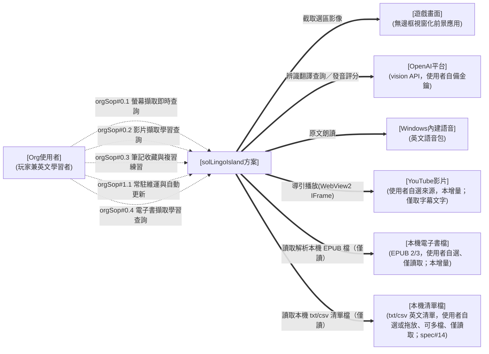
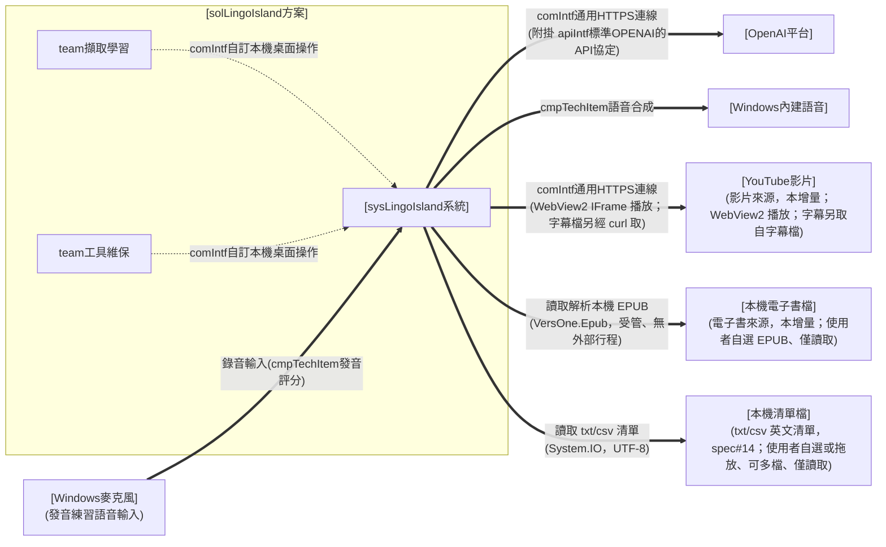
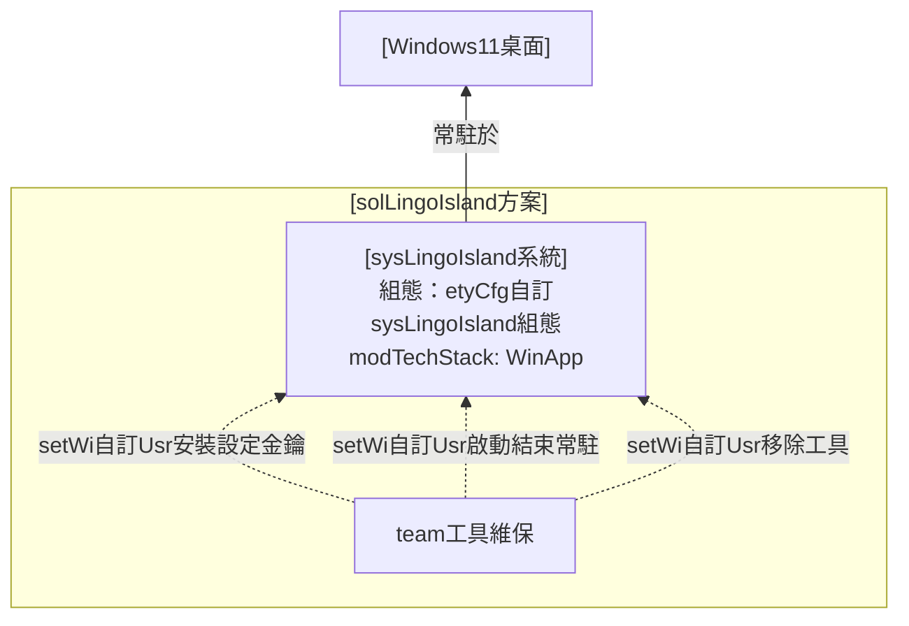
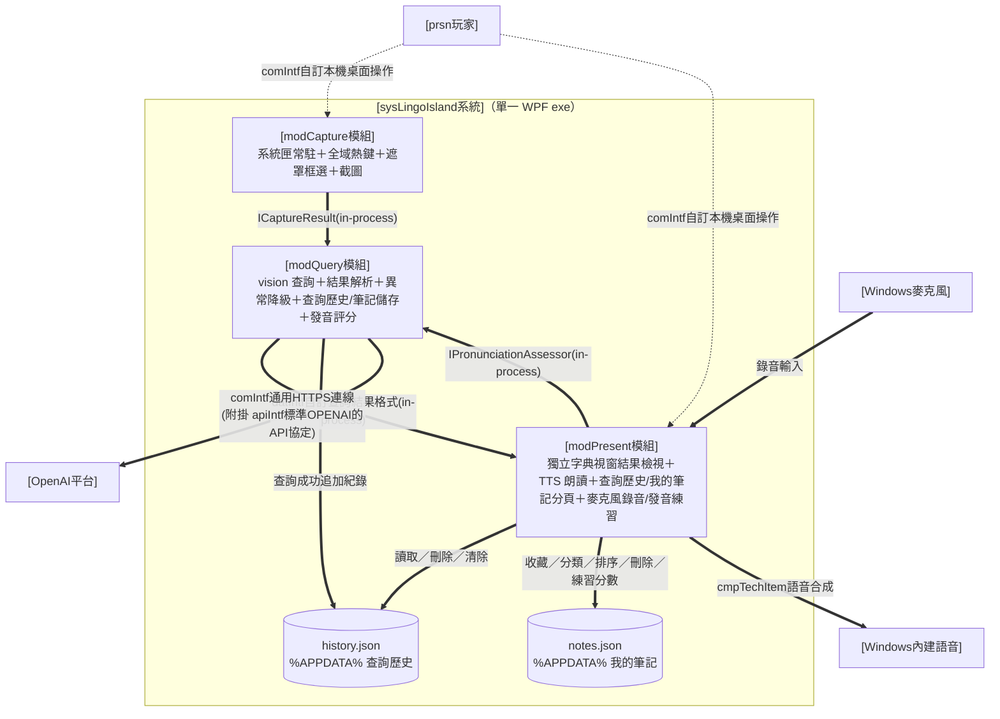
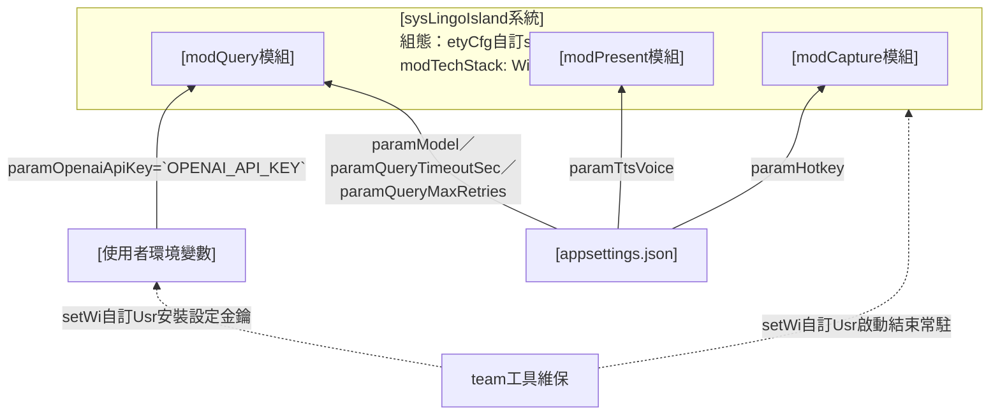
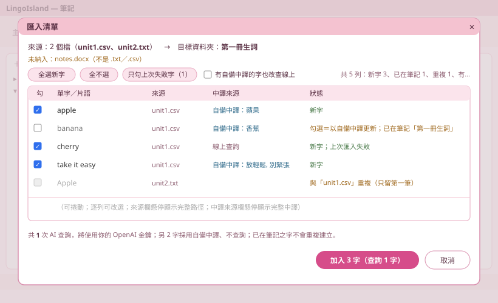
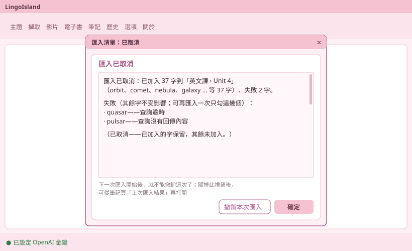
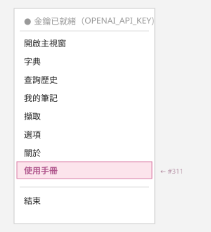

# I. 緣起目的

> 產品定位、需求方是誰要什麼、MVP 範圍（全文件級一次；不展開解法元件）。規格條目見 ＜III 規格指標＞。

* 需求方為 [USR] 本人（遊戲玩家兼英文學習者）。
* 需求為：遊玩英文遊戲時，能以一組熱鍵框選畫面任意區塊，立即取得該區塊英文之原文、KK 音標、繁體中文翻譯，並可聆聽原文發音，全程不中斷遊戲。
* MVP 範圍：背景常駐＋熱鍵喚起＋變暗選區＋單次辨識翻譯查詢＋獨立字典視窗顯示與朗讀（含手動打字查詢）＋查詢歷史本機回顧（清單／詳情／重聽／刪除清除）＋我的筆記收藏（依資料夾分類、拖曳排序、檢視重聽、去重、**逐則發音練習**——就地錄音、AI 評分、成績框回饋）＋可管理多個命名主題（文字或貼圖／上傳檔 vision 自動解釋、擇一使用注入查詢）；不含生詞本、多語言。
* **本增量（v2.0.0 影片來源升格）**：本方案由「螢幕翻譯工具」升格為**多來源英文擷取練習中樞**——螢幕與 **YouTube 影片**為可插拔擷取來源，下游查詢／筆記／發音練習共用。本增量新增**影片「學習查詢」主動線**（Mode A，`spec#2`–`spec#2`）：選定 YouTube 影片、自動取得字幕、導引播放到句暫停顯字幕、於暫停句點字查詢並加入既有「我的筆記」；**不含**說話者標註、代言練習、完整影片庫（後續增量另立工單）。
* **本增量（電子書來源）**：本方案再擴一擷取來源——**本機電子書（EPUB）**，與螢幕、影片並列之可插拔擷取來源。本增量交付**電子書增量1「獲得＋書櫃」地基**（`spec#4`–`spec#6`）：匯入本機 `.epub`（含批次）、解析容器/中繼（書名/作者/語言/dc:identifier）/spine/目錄（EPUB3 nav＋EPUB2 ncx）/封面、書櫃列出整理（封面縮圖、主題篩選、四鍵排序、依 dc:identifier 去重、刪除清空）、每本書一資料夾持久化並跨啟動還原、納入既有整包備份；**不含**章節閱讀渲染、逐段導讀、TTS 朗讀、逐字查詞、加入筆記、依說話人變色（由**電子書增量2「內容閱讀」**接續交付，見下條；增量1【內容】子頁僅骨架）。
* **本增量（v4.0.0 電子書內容閱讀）**：承電子書增量1「獲得＋書櫃」，本增量交付**內容側閱讀器**——電子書模式**首度可閱讀學習**（定位升格里程碑、規劃版號 v4.0.0）。**電子書增量2「內容閱讀」**（`spec#7`–`spec#10`）：翻開藏書**逐段閱讀**（line-stepped 逐段導讀：上一段/下一段/繼續、雙擊章節目錄或段落跳讀、閱讀進度跨啟動記憶）、**TTS 逐段朗讀**（唸完自動前進、續讀/重聽/調速）、閱讀中**逐字點選查詞並加入「我的筆記」**、段落開頭 `Name:` **說話人依主題色上色**（沿用影片頁說話人面板/篩選/於指定說話人暫停）；章節渲染以**段落純文字自繪**（剝章節 XHTML 取 `
` 段落、每段一 cue、`StartSec=null`），**EPUB 內嵌圖與複雜排版列後續增量**（本增量誠實 MVP 取捨）。下游查詢/筆記/朗讀/說話人完全複用螢幕、影片既有子系統、不另造。
* **本增量（v4.16.0 筆記清單匯入，#309／來源 #306）**：筆記頁新增「匯入清單」——把使用者自備之英文單字／片語清單（`.txt` 每行一個單字或片語，或 `.csv` 取第一欄）**一次匯入目前選取之筆記資料夾**；匯入前先預掃描列出**彙總確認表**（已在筆記者預設略過、可逐列改選、按下前即知會花幾次 AI 查詢），確認後**逐字走既有字典線上查詢**取得音標／翻譯、以既有筆記儲存機制寫入（去重、底色、練習沿用；補依資料夾 Id 寫入與依去重鍵刷新原筆兩個入口），失敗字列於結果表、不中斷其餘（`spec#14`）。查詢來源與批次模式皆沿用既有（字典查詢、`AcquireBatch` 之「預掃描→彙總→批次」**模式**〔`AcquireBatch` 為影片專用型別、不共用型別，純函式另立 `NotesImport`〕、`AiActionWindow` 進度），**不新造查詢來源**。**不含**拖放匯入、xlsx、多欄對應、匯入時自動建夾。
* **本增量（v4.18.0 多檔與拖放匯入，#320／來源 #309 使用角度審查延伸建議）**：承 v4.16.0 之「匯入清單」，解除其「不含拖放匯入」——選檔對話框改為**可一次多選** `.txt`／`.csv`，亦可把清單檔**直接拖進筆記頁**（匯入**目前選取之資料夾**；非 `.txt`／`.csv` 拒收並提示）；多個檔的內容**合併、跨檔去重後進同一張彙總確認表**，表上每列標**來源檔名**（`spec#14` 擴充，不另立 spec）。逐字查詢、寫入、結果表與 v4.16.0 同一條路、一行不改。**不含**拖到某個資料夾節點即匯入該夾（目標一律為目前選取夾）、拖入資料夾遞迴展開、xlsx。
* **本增量（v4.19.0 CSV 第二欄自備中譯，#321／來源 #309 使用角度審查延伸建議）**：承 v4.18.0 之「匯入清單」——`.csv` 每列之**第二欄非空即視為使用者自備中譯**：該字直接以自備中譯寫入筆記之中譯欄（音標留空）、**不呼叫線上查詢**，省時省額度；彙總確認表於有自備中譯時新增「**中譯來源**」欄（每列「自備中譯：…」或「線上查詢」；無自備中譯時畫面與 v4.18.0 相同），並可**整批切換「有自備中譯的字也改查線上」**；費用揭露與主鈕依實際線上查詢數計（全部自備時明示不花費用、且不開 AI 動作進度頁）。第二欄空白、`.txt`（含 Anki tab 第二欄）、表頭列跳過規則一律不變（csv 之引號欄跨行續接為唯一例外，見契約 ①）（`spec#14` 擴充，不另立 spec）。**不含**txt 第二欄採用、第三欄音標、逐列切換自備／線上、無金鑰時放行全自備匯入。

* **本增量（v4.20.0 大量匯入改背景執行，#322／來源 #309 使用角度審查延伸建議）**：承 v4.19.0 之「匯入清單」——確認後**不再以模態進度頁卡住畫面**：改在背景執行，主視窗內容區下方出現「**匯入進度列**」（各分頁皆可見：已完成 n／N、目前查詢之字、預估剩餘時間〔只計要上網查的字〕、進度條、「取消」），期間 app 各分頁（含筆記頁之瀏覽、整理與發音練習）照常可用，且筆記頁之整理不會覆蓋匯入途中已寫入之字；取消時已完成者保留、其餘不寫入；匯入進行中再按「匯入清單」或拖入清單檔不會開第二批（提示說明）；匯入進行中結束 app 先確認；完成或取消後跳出既有結果表（改為非模態、可捲動之結果視窗；全部自備中譯之匯入亦同）（`spec#14` 擴充，不另立 spec）。**不含**暫停／繼續、排隊多批、下次啟動續傳、作業系統登出／關機時之提示、並行查詢加速。
* **本增量（v4.21.0 重匯只勾上次失敗字，#323／來源 #309 使用角度審查延伸建議）**：承 v4.20.0 之「匯入清單」——每次匯入結束，**依清單檔完整路徑記住該檔失敗之字**（多檔一批時各檔各自記；存使用者資料夾之 `import-failures.json`，只存路徑與原字）；**再次匯入同一檔**時，彙總確認表多一顆「**只勾上次失敗字（N）**」——一鍵只勾那幾個字重試（無紀錄時停用），上次失敗之列並標「上次匯入失敗」；該檔記下之失敗字都已成功後紀錄自動清除。取消時未處理之字不算失敗；紀錄檔讀不到或損毀時只是該鈕停用，不影響匯入（`spec#14` 擴充，不另立 spec）。**不含**以檔案內容辨識改名或搬移後之同一清單、手動清除紀錄之介面、記住失敗原因。
* **本增量（v4.22.0 匯入後一鍵整批撤銷，#324／來源 #309 使用角度審查延伸建議）**：承 v4.21.0 之「匯入清單」——匯入結束後（完成、取消、早停、中斷，全部自備中譯亦同），**結果視窗多一顆「撤銷本次匯入」**：確認後**移除本次新增之字**、把本次**更新過之字之音標與中譯還原為匯入前**；匯入後使用者又改過內容或刪除之字（新增之字另含被移到別夾者）**保持現狀、不蓋掉**，並於完成提示逐字列出；完成後提示移除、還原、跳過各幾字。撤銷所需之「本次寫了什麼、覆寫前是什麼」只存記憶體：**只限最近一次匯入**——下一批匯入開始（故背景匯入進行中不可撤銷）或結束 app 即不能再撤，撤一次為限；結果視窗關掉後可從筆記頁「**上次匯入結果**」再打開來撤（`spec#14` 擴充，不另立 spec）。撤銷不把被撤銷之字還回 #323 之失敗紀錄（撤銷不是失敗）。**不含**跨重啟撤銷、多步撤銷或重做、撤銷較早之匯入、退回已花用之查詢費用。

# II. 分析設計

> 逐高度 zoom：＜A 需求分析＞（sol／org 視角）→＜B 方案設計＞（sol／sys 切分·team 視角）→＜C 系統設計＞（mod／prsn 視角）。各高度恆含 (A) 運作想定＋(B) 實作規劃。

## A. 需求分析

> 需求視角；使用者之初始需求。只談「使用者是誰、做什麼、要什麼」，不預設解法。

### (A) 運作想定

#### 1. 架構圖

> 描述本層方案與外部之運作關係與部署環境偏好；圖＝正本，圖後不複述節點與邊。

運作關係（sol 與外部）：

> 圖例（三線通則）：粗 `==>`＝運行關聯／細 `-->`＝部署設定關聯／虛 `-.->`＝人員操作；本層為需求層示意，正式介面契約於 ＜II.B＞／＜II.C＞ 落地。

部署環境（需求偏好）：

> 圖例：細 `-->`＝部署設定關聯（沿三線通則）。
* **sol 查詢工具**：solLingoIsland 畫面選區查詢工具，對內以單一系統實現（見 ＜II.B＞）。
* **外部關聯項目**：遊戲畫面（查詢對象、非介接系統）、OpenAI 平台（辨識翻譯外部服務）、Windows 內建語音（朗讀引擎）、**YouTube 影片（本增量之影片擷取來源；僅取字幕文字、不下載影片內容）**、**本機電子書檔（本增量之電子書擷取來源；使用者自選 `.epub`、僅讀取解析、原檔複本落地個人藏書資料夾、不改寫使用者原檔）**。
* **部署偏好**：使用者自有 Windows 11 遊戲主機，免安裝、單一執行檔、系統匣常駐。

#### 2. 單位組織

> 收 ＜(A).1 架構圖＞ 之 org 型別。

**方案外單位人員關聯**（本需求與方案外之關聯對象）：

* [遊戲畫面]：前景執行之英文遊戲（無邊框視窗化前提），本方案僅截取其畫面、不介接。
* [OpenAI平台]：提供 vision 辨識翻譯與音訊發音評分之外部服務；額度與金鑰由使用者自備。
* [Windows內建語音]：OS 內建英文語音包，供原文朗讀（離線、免金鑰）。
* [YouTube影片]：使用者自選之英文影片來源（本增量）；本工具僅取其字幕文字、不下載影片內容（來源使用者自負，比照自備金鑰）。
* [本機清單檔]：使用者自選之本機 `.txt`／`.csv` 英文清單檔（spec#14）；可一次選多個或直接拖進筆記頁（#320）；本工具僅讀取其內容（csv 取第一欄為原文、第二欄非空者為自備中譯〔#321〕）供預掃描與匯入，不改寫、不留複本。
* [本機電子書檔]：使用者自選之本機 EPUB 電子書檔（本增量）；本工具僅讀取解析其內容與封面、將原檔複本落地個人藏書資料夾，不改寫使用者原檔（來源使用者自負，比照自選影片來源）。

**方案內單位人員編組**（org 層需求方；單人方案，內部 team 見 ＜II.B＞）：

* [Org使用者]：玩家兼英文學習者，單人使用並自行維保。

#### 3. 作業程序

> 收 ＜(A).1 架構圖＞ 人員動作線→本高度 SOP 表（需求＝orgSop）。每條標**關聯 hmi**（需求高度＝solHmi 之具名形式）；介面設計正本在 ＜(B).3 人機介面＞，此處只放關聯指標。
> **介面併用（HMI 弧收斂）**：五條 orgSop 一律共用同一具名 solHmi——本方案全部作業皆在同一個 Windows 桌面常駐應用內完成，無技術上必須分裂之通道。
> orgSop 數＝需求域 4 條（螢幕／影片／筆記／電子書）＋平台維保 1 條＝5，與 spec 14 條不等值（電子書一域 orgSop#0.4 跨兩增量對應七條 spec；筆記一域 orgSop#0.3 承接 spec#3 與 spec#14；維保原無獨立 value-spec，**惟 spec#11 為例外**——其由 orgSop#0.1 與 orgSop#1.1 共同承接，見 ＜III 規格指標＞ 前言）。

| domain | orgSop 職責 | 說明 | 關聯 hmi |
| --- | --- | --- | --- |
| **domain#0-多來源英文擷取學習** | orgSop#0.1-螢幕擷取即時查詢 | 遊戲中熱鍵喚起、框選（或雙擊）畫面英文、取得原文／KK 音標／繁中翻譯、於字典視窗查看聆聽（逐字查、編輯重譯、打字查）；可設命名主題（文字或貼圖 vision 解釋）注入以提升準確度；並可設定擷取快捷鍵、手動觸發擷取與整理截圖清單；不中斷遊戲（對映 spec#1·spec#11） | [solHmi桌面常駐應用] |
| | orgSop#0.2-影片擷取學習查詢 | 選定 YouTube 影片為擷取來源、自動取得字幕、導引播放到句暫停顯字幕、於暫停句點字查詢、將擷取之字／句加入我的筆記；螢幕與影片為並列之可插拔擷取來源（對映 spec#2） | [solHmi桌面常駐應用] |
| | orgSop#0.3-筆記收藏與複習練習 | 將查詢結果／歷史加入我的筆記（去重／資料夾／拖曳排序／檢視重聽）、查詢歷史本機回顧（清單／詳情／重聽／刪除清除）、於我的筆記逐則發音練習（錄音／AI 評分／最佳分／可調門檻／清空）、**自備英文清單批次匯入筆記**（txt／csv 第一欄、可多檔或拖放、預掃描彙總確認、逐字線上查詢加入目前夾）（對映 spec#3·spec#14） | [solHmi桌面常駐應用] |
| | orgSop#0.4-電子書擷取學習查詢 | 選定本機 EPUB 電子書為擷取來源、匯入解析（容器／中繼〔書名/作者/語言/dc:identifier〕／spine／目錄〔EPUB3 nav＋EPUB2 ncx〕／封面，含批次）、於書櫃瀏覽整理（封面縮圖／主題篩選／四鍵排序／依 dc:identifier 去重／刪除清空）、藏書每本一資料夾持久化跨啟動還原並納入整包備份；**翻開藏書逐段導讀閱讀**（line-stepped 上一段/下一段/繼續、章節目錄或段落跳讀、閱讀進度跨啟動記憶）、**TTS 逐段朗讀**（唸完自動前進／續讀／重聽／調速）、**閱讀中逐字點選查詞並加入我的筆記**、**段落 `Name:` 說話人依主題色上色**（面板／篩選／於指定說話人暫停）；螢幕、影片與電子書為並列之可插拔擷取來源、下游查詢/筆記/朗讀/說話人共用。**增量1 交付「獲得＋書櫃」（spec#4–#6）、增量2 交付「內容閱讀」（spec#7–#10）**；EPUB 內嵌圖與複雜排版列後續增量 | [solHmi桌面常駐應用] |
| **domain#1-系統維運** | orgSop#1.1-常駐維運與自動更新 | 常駐主控入口（工作列常顯可尋、換版可尋）、自訂喚起快捷鍵、金鑰設定（環境變數、不落地）、啟動／收合／結束、啟動時自動更新、移除（平台維保，服務全部 spec；**除 spec#11 外**無獨立 value-spec——對映 spec#11，與 orgSop#0.1 共同承接） | [solHmi桌面常駐應用] |

#### 4. 軟硬實體

> 收 ＜(A).1 架構圖＞ 之設備、外部系統與服務（需求視角；細部選型見 ＜(B).1 技術選型＞）。需求層無 etyCfg，故本層無 cfgTest（cfgTest 歸 ＜II.C.(A).4＞）。

* **使用者遊戲主機**：Windows 11（或 Windows 10 1903+）桌面環境，含多螢幕與 DPI 縮放情境。
* **遊戲畫面**：以無邊框視窗化（borderless windowed）執行之英文遊戲（使用前提；獨占全螢幕不支援）。
* **OpenAI vision API**：使用者自備金鑰與額度之外部辨識翻譯服務。
* **Windows 內建語音**：OS 內建英文語音包（朗讀用，離線可用）。

### (B) 實作規劃

#### 1. 技術選型

> 本層宣告 solTechStyle（方案設計主軸／整體 look 之具名契約）。系統類型與構件技術疊層分別宣告於 ＜II.B.(B).1＞／＜II.C.(B).1＞，本節不重述（正本唯一、餘處引用）。

* **solTechStyle（方案設計主軸）＝ [solTechStyle淺粉童趣桌面風格]**：淺粉底（卡片色系 `#FFF0F5`、accent `#F4C2D0`）＋小女孩 logo（`assets/icon.png`）背景浮水印（不透明度 `0.14`）＋控制項半透明白（`#66FFFFFF`，令浮水印透出）＋圖示採 Segoe MDL2 Assets 系統字圖（不用 emoji）＋Windows 11 Fluent Design 基座（Segoe UI Variable 字階、4px 間距格、圓角 8px、亮暗主題、acrylic／mica 層次）；可近用性掛 WCAG 2.1 AA 對比。以共用樣式資源套用、各頁不各刻。
* **不錨 [hmiIntf通用視覺規範]**：MD3 web 基座與 admin shell 對桌面原生應用不適用，改錨系統類型契約之不干擾介面 bar（見 ＜II.B.(B).1＞）；此為 solTechStyle 之基準宣告，非個別頁面取捨。
* look 之落地見 ＜II.A.(B).3＞，各頁套用見 ＜II.C.(B).3＞。

#### 2. 關鍵組態

> 列本層關鍵參數／組態（需求偏好→etyCfg→Env／appsettings）；列舉即可、不解釋。

* **金鑰**：`OPENAI_API_KEY` 一律環境變數，程式與 repo 不落地（spec#1）。
* **喚起快捷鍵**：預設 `Alt+L`（左右 Alt 皆可），**可自訂**（鍵盤組合或滑鼠鍵，存 appsettings）。
* **查詢模型**：預設 `gpt-4o-mini`，可調（appsettings）。
* **主題描述**：使用者自然語言描述目前應用主題（選填、可存可清），查詢時作為「參考、非指令」注入 prompt（spec#1）；沿用之單一情境提示鍵 `paramContextHint` 見 ＜II.B.(B).2＞。
* **發音練習及格門檻**：`paramPronPassThreshold`（0–100 整數、預設 80，於設定頁可調）；發音評分用之 OpenAI 音訊輸入模型 `paramPronModel`（預設 `gpt-audio-1.5`；舊值 `gpt-audio-mini` 讀取時自動遷移為新預設，`AppConfig.NormalizePronModel`；可調 appsettings），沿用 `OPENAI_API_KEY`（不另設金鑰）。
* **條目顯示偏好**（選項頁「筆記／歷史條目」區，存 appsettings）：`paramEntryFontSize`（筆記/歷史條目原文字級，預設 18、界 8–48）、`paramEntryBold`（粗體，預設 true）、`paramEntryWrap`（自動換行，預設 false＝單行省略）、`paramEntryCardOpacity`（v1.0.1；筆記/歷史條目卡背景不透明度 0–100，預設 40，0＝全透明透浮水印；選項頁「背景不透明度」）。原 `paramPassedCardTransparent`（#123；過關卡透明底開關）已於 v1.0.1 撤除——過關不再改卡底，只以成績框顏色表示。
* **字典視窗顯示偏好**（設定頁「字典結果」，存 appsettings）：`paramResultFontSize`（字典結果基準字級，預設 28、界 14–48）。（`paramResultHideOnBlur` 現為**停用**——#135 隨浮動視窗移除而停用，v1.0.1 回滾獨立視窗時**未一併恢復**〔字典視窗無 `Deactivated` 失焦隱藏〕；欄位保留相容、UI 不再呈現。）
* **使用前提**：遊戲無邊框視窗化。

#### 3. 人機介面

> 本層定 `solHmi`——各 orgSop 走何種**形式**之介面通道，並定整體 look（引本節 ＜(B).1＞ 之 solTechStyle）。互動分配見 ＜II.B.(B).3＞、各頁配置見 ＜II.C.(B).3＞。

**具名 solHmi ＝ [solHmi桌面常駐應用]**（形式＝Windows 桌面原生應用，非網站）——**技術強制原因**：全域熱鍵攔截（`RegisterHotKey`／`WH_MOUSE_LL`）、整個虛擬桌面之畫面擷取與凍結遮罩、系統匣／工作列常駐與開機續存，皆非瀏覽器沙箱可得，故不採業界預設之網站形式。五條 orgSop 一律共用此一形式（介面併用），下列表格所列為同一具名 solHmi 之內部通道分工、非另立介面。

各 orgSop 之介面通道：

| orgSop | 通道 | 說明 |
| --- | --- | --- |
| orgSop#0.1-螢幕擷取即時查詢 | **桌面原生 GUI**（遮罩 overlay＋獨立字典視窗＋主視窗主題分頁／螢幕擷取分頁） | 熱鍵喚起框選、結果於獨立字典視窗查看聆聽（逐字查／編輯重譯／打字查；字典視窗 `Topmost` 疊於無邊框遊戲、與主視窗共存，v1.0.1）；命名主題（文字/貼圖自動解釋）擇一注入提升準確度；擷取快捷鍵設定、手動觸發擷取與截圖清單整理於螢幕擷取分頁 |
| orgSop#0.2-影片擷取學習查詢 | **桌面原生 GUI**（統一主視窗「影片擷取」分頁：WebView2＋字幕清單） | 貼 YouTube 影片、取字幕、導引播放到句暫停顯字幕、暫停句點字查詢、加入我的筆記 |
| orgSop#0.3-筆記收藏與複習練習 | **桌面原生 GUI**（統一主視窗「筆記」／「歷史」分頁＋收藏 toast） | 收藏加入並 toast、資料夾管理與排序、查詢歷史回顧（清單/詳情/重聽/刪清）、筆記卡片就地錄音送 AI 評分、清空練習紀錄 |
| orgSop#0.4-電子書擷取學習查詢 | **桌面原生 GUI**（統一主視窗「電子書」分頁：最左常駐書目清單＋右側子頁籤【內容】逐段閱讀器／【獲得】匯入卡片，#236 頁面整併） | 選/拖 `.epub` 匯入（含批次）、解析中繼/spine/目錄/封面、書櫃列出整理（封面縮圖/主題篩選/四鍵排序/依 dc:identifier 去重/右鍵刪除清空）、藏書持久化與備份；**【內容】翻開逐段導讀閱讀（上/下一段/繼續、章節或段落跳讀、進度記憶）＋TTS 逐段朗讀＋逐字查詞加筆記＋段落說話人上色**（增量2） |
| orgSop#1.1-常駐維運與自動更新 | **常駐主控頁（工作列按鈕型）＋系統匣選單頁（輔助）＋OS 標準設定** | 常駐時保留常顯、可 Alt+Tab／工作列尋得之主控入口（金鑰狀態／設定／結束、自動更新），不受系統匣自動隱藏影響；系統匣選單為輔助；安裝金鑰、移除走檔案總管與環境變數設定 |

**業界常規（look，公開標準）**：Windows 桌面工具遵循 **Windows 11 Fluent Design**（Segoe UI Variable 字階、4px 間距格、圓角 8px、亮暗主題、acrylic／mica 層次），可近用性掛 **WCAG 2.1 AA** 對比；常駐工具以**工作列按鈕（taskbar button）**維持穩定可尋之入口（Alt+Tab／工作列可達，不受系統匣溢位自動隱藏影響），系統匣圖示為輔助（右鍵選單、單一實例）。**Windows 桌面 HMI 慣例（硬性，凡有標準答案者依慣例、不另創）**：視窗標題只出現在 OS 標題列、內容區不重複；狀態文字置**底部狀態列**（`StatusBar`）；樹狀清單採標準節點＋**右鍵選單**（新增／更名＝`F2` 原地編輯／刪除＝`Del`）如檔案總管、建立入口置頂部工具列；清單拖曳以**插入位置指示線**與**目標高亮**即時回饋落點；圖示採系統字圖（**Segoe MDL2 Assets**）而非 emoji（跨環境呈現一致、語彙標準）。

**本系統（solLingoIsland 取捨）**：

* **遮罩**：喚起當下截取整個虛擬桌面為**凍結畫格快照**（不透明背景、選取期間畫面靜止、背後遊戲被完全遮住且收不到輸入）＋其上疊 45% 黑淡化、十字游標、高對比選框（accent 藍 2px＋反白遮罩差顯）、頂部中央一行操作提示——只承載「選取」一件事。凍結畫格使點擊／雙擊落在靜止快照上、不干擾背後遊戲（Issue #90，取代原半透明實時變暗）。
* **結果視窗**：**標準表單**（OS 標準標題列＋標準邊框拖拉縮放＋工作列按鈕，字型比照主視窗；Issue #59）、淺粉底大字；直排原文／KK 音標／中譯（**不加欄目標示**——三區以字級/色彩/字體分層、一望即知），基準字級於選項頁可調（音標＝基準−4、中譯＝基準−2 等比縮放，下限 12）；英文組與中文組各有獨立播放鈕與「自動播放」勾選（勾選後框選完即朗讀）；英文原文可**逐字點選——單擊某個單字＝朗讀該字、雙擊＝查詢該單字字義（v1.0.1 改制；`ResultView.OnWordClick`）**（複查回饋改制：原為單獨發音；游標呈可點狀，查詢中顯示等待游標並擋連點，整句播放鈕並存）；頂部工具列置**往前／往後導航鈕**（主查詢＝重置為單一、查單字＝推入堆疊，可返回原句；導航與單字查詢結果**不自動加入筆記**）與**編輯鈕（鉛筆）**——可校正英文原文後「重新翻譯」重查（辨識有誤時用）；「加入至資料夾」下拉置頂部工具列；首次置中、之後記住使用者擺放的位置與大小；以標準標題列拖曳移動、標準邊框拖拉縮放；topmost 浮於遊戲上「一直存在」，**失焦（切換至其他視窗對照）預設不自動關閉、不隱藏**（有工作列按鈕可尋），**點選主視窗／經 tray 開主視窗分頁亦不關閉**（與主視窗共存，Issue #105）——惟選項頁提供**「失焦自動隱藏」開關（預設關）**，勾選後失焦即隱藏、下次查詢再現（單字查詢/重譯進行中不隱藏）；關閉時機僅限 `ESC`／標題列關閉鈕／下一次查詢或自歷史/筆記「檢視」開卡取代／選項儲存後（語音服務重建而）關閉、不重開；同時至多一個。 **Dictionary 分頁改制（#135）**：上述浮動視窗行為曾整體由主視窗 **Dictionary 分頁**取代——結果於分頁內呈現、不再是獨立浮窗（無位置記憶／失焦隱藏／ESC 關窗／單一守窗）；喚起、歷史/筆記「檢視」、查單字、編輯重譯皆渲染至本頁，擷取完成時主視窗**前景＋暫置頂**疊於無邊框遊戲；分頁頂另置可編輯下拉查詢（並列查詢歷史）、維持透明底＋全域半透明白控制項透出浮水印。 **回滾為獨立字典視窗（v1.0.1，現行）**：#135 之分頁制**已撤回**——查字典改回**獨立視窗**（`DictionaryWindow`，`ShowInTaskbar`＋`Topmost`、與主視窗共存），**病因**＝於筆記分頁檢視單字時整個主視窗會跳至 Dictionary 分頁、**打斷進行中的發音練習**（查詢與練習為兩件並行作業，須各自持有視窗）。現行行為：**位置大小記憶恢復**（`UiStateStore`）；**✕／`ESC` ＝隱藏而非銷毀**（保留狀態、可再喚出，唯程式結束時真正關閉）；單一實例故「同時至多一個」結構上成立；**失焦自動隱藏未恢復**（`paramResultHideOnBlur` 仍停用，見 ＜(B).2＞）；擷取前先 `Hide()` 免遮罩凍結畫格截到自身；內容仍為共用 `DictionaryPage`（頂部可編輯下拉查詢＋查詢歷史、下方三欄結果），透明底＋半透明白控制項與各分頁一致。
* **統一主視窗（常駐主控入口）**：程式執行後保留一個**工作列按鈕型**的可見主視窗——常顯於工作列、可 Alt+Tab／點工作列尋得；採 **Office 式頂部功能列分頁（每鈕圖示在上、文字在下；**現行序：主題／擷取／影片／電子書／筆記／歷史／選項／關於**，圖示用 Segoe MDL2 Assets 字圖——主題=`E8F1`、擷取=`EB9F`、影片=`E714`、電子書=`E82D`、筆記=`E70B`、歷史=`E81C`、選項=`E713`、關於=`E946`；XAML 預設選「筆記」，但啟動時 `App.xaml.cs` 以 `ShowTab(MainTab.Video)` 開在「影片」分頁，系統匣「開啟主視窗」／雙擊則開「筆記」）＋下方對應功能頁**，承載維運與檢視；功能列**右端另置「字典」動作鈕**（同款圖上字下、MDL2 字圖 `E82D`，非分頁、不入分頁群組，Issue #107；#135 期曾改為切分頁、v1.0.1 回滾為喚出獨立字典視窗）——**一鍵喚回查詢結果視窗**：結果卡開啟中（含最小化中）→先還原再帶至前景；已關閉且有查詢歷史→以最新一筆重開三欄詳情（重用「檢視」單一取代守衛）；**無任何歷史**（含清除全部後、歷史檔毀損退空）→右下 toast 提示「尚無查詢結果」、不開卡（不留無聲死按鈕）；tray 選單**同步設「字典」項**（兩入口鏡像、動作來源單一，共用同一組合根決策）；**內容區不重複視窗標題**（OS 標題列已有），金鑰／快捷鍵狀態置**底部狀態列**；**啟動即顯示主視窗**（原為最小化常駐；USR 回饋「開好可用」改為開啟，`App.xaml.cs`），可最小化不擋遊戲、熱鍵照常。此入口不依賴 Win11 系統匣顯示設定，換版／換路徑後仍穩定可尋（系統匣圖示改為輔助入口）。**關閉語意（v1.0.1 現行；原制「關閉＝收合」已撤回）**：**主視窗 ✕ ＝結束整個程式**（`OnClosing` 轉交 App 統一結束流程），背景常駐改以**最小化**達成；**字典視窗 ✕ ＝僅收字典**（隱藏、不影響主程式）。兩者語意刻意不同——主視窗為程式本體之生命週期入口、字典視窗為可反覆喚出之結果面板。 **#135 與其回滾**：#135 曾於功能列最前新增 **Dictionary 分頁**（承載查詢結果、取代浮動視窗）、`Result` 鈕與 tray 項改為切分頁；**v1.0.1 全數回滾**——Dictionary 分頁移除、右端動作鈕改名「字典」並恢復喚出獨立視窗（三態：已開→帶前景／已關且有歷史→以最新一筆重開／無歷史→toast「尚無查詢結果」），tray 項同步鏡像（現行字樣「字典」，`App.xaml.cs` 系統匣選單；toast 字樣隨 #179 繁中化，原英文 `No query result yet`）。
* **統一美術**：主視窗與各分頁採**淺粉底**（承結果卡片色系 `#FFF0F5`／`#F4C2D0` accent）＋**小女孩 logo（`assets/icon.png`）背景浮水印**（Issue #71 提高不透明度至 `0.14`、放大至清晰可見、仍不擋操作）；**控制項半透明**（卡片/次要按鈕/輸入框白底一律 `#66FFFFFF`＝白色 40%，Issue #71→#73→#75——讓底層浮水印明顯透出、不再白色不透明），以共用樣式資源套用、各頁不各刻。
* **介面語言政策（Issue #81 原為全英；Issue #179＋epic #178 決策10 起改為全繁中）**：**所有介面文字（UI chrome）一律繁體中文**（單向繁中、就地改字串、不導入 resx；全 app 含影片頁繁中化完成）——各分頁/視窗之標籤、按鈕、選單、提示、狀態列、對話框皆繁中。**保留英文者**：底色盤 [NoteColors.Palette] 之色名（英文名作為智能配色「色名↔hex」對應鍵，UI 顯示經 `NoteColors.DisplayName` 轉繁中，#179）、**持久化預設資料名**（主題 `New Theme`、筆記預設夾 `My Notes`、新資料夾基名 `New Folder`——保留以免遷移既有使用者存檔）、專有名詞（LingoIsland／OpenAI／OPENAI_API_KEY 等）。**翻譯內容（product output）本即繁體中文**——本工具用途即為替華語使用者翻譯英文遊戲畫面，故 AI 查詢/圖片解釋之**輸出（`translation`／`description` 欄）恆為繁中**、AI 提示語（system/point/describe prompt）維持中文（僅注入之可選色名清單隨盤改英文）。分野原則（#179 後）：**介面殼與譯文皆繁中**；AI 提示語本即中文。
* **影片擷取頁**：與螢幕擷取頁並列之擷取來源頁——**最左常駐影片清單｜右側【內容】／【獲得】兩子頁籤，互斥切換（#182；#237 頁面整併——影片清單自【內容】左欄上提為頁級常駐左欄、兩子頁皆可見，比照電子書 #236）**：右側兩 pane **疊放同格、以可見性切換**（非 `TabControl`，避免切頁卸載重建 WebView2 播放器而中斷播放），**同一時間只顯示其一**；【獲得】＝整幅獲取卡片，【內容】＝**播放器＋逐句字幕**（承 #165／#167 之左清單右操作版面）。最左**影片清單常駐**（Clear all 置頂＋依 theme 篩選＋**排序下拉**〔#207：依`加入時間`（新→舊，預設＝現況）／`名稱`（A→Z，自然排序）／`時間長度`（短→長，無值排末）／`主題`（主題名群組、未歸屬排末）四鍵排序，選擇存 `videos.json` 跨啟動沿用〕；載過影片可點切換、標記所屬主題、欄寬可拖拉、**每筆附 YouTube 縮圖**〔#171〕；影片卡＝**縮圖｜文字欄**之兩欄版面（`Grid`：縮圖 `Auto`／文字欄 `*`，同書卡理據），文字欄由上而下＝**主題標籤 → 片名 → 加入時間·長度**（#275；**主題標籤置於片名之前**、**無主題時不顯示該列**〔與書卡顯 `未分類` 之差異係各自維持原有資訊量、不擅自增減〕；**片名長時自動換行完整呈現、不以省略號截斷**），epic #145 增量4；**單項刪除改右鍵選單「Delete」或 `Delete` 鍵**〔`ListDeleteSupport`〕、無底部刪除鈕）。**【獲得】子頁籤**（epic #178 增量6′「輸入 pivot」定案；#193 擴為雙來源）——**兩種等價來源、擇一即可**：①**貼網址**＝單一輸入框貼含**具體 YouTube 影片網址＋字幕檔網址**之自然語言文字，程式純字串抽兩網址（**不做關鍵字搜尋**；已砍原 finder〔web_search 配片〕與結果表）；②**本機自製字幕檔（#193）**＝「選擇字幕檔…」鈕（可複選）或**拖放檔案至輸入框**（可多檔），字幕檔**得於檔內自帶影片網址**——程式於**檔頭區**（第一個時間行之前）取首個可解出 YouTube ID 之網址，抽到即免於輸入框打任何字；**不限定註解前綴**（非時間戳行一律略過，`;`／`#`／裸網址皆可），故不建立只有本 app 讀得懂的私有格式。**單檔＝摘要確認後載入播放；多檔＝彙總確認後批次加入【內容】清單、不自動播放**。**【內容】子頁籤**＝**左影片清單｜中 WebView2 播放器＋其下當前句字幕帶與播放控制｜右逐句英文字幕清單**（可捲、雙擊跳播）**＋其下說話人勾選面板**。（[modHmi螢幕擷取頁] 與 [modHmi主題管理頁] 同屬此「左清單｜右操作」版面族，逐頁規格正本見 ＜II.C.(B).3＞。）逐句字幕清單**雙擊**該句才跳播（單擊僅選取，#169）；整檔 YAML 編修框自動換行（#169）。**說話人（epic #145 增量5）**：字幕若含說話人（人工字幕之 VTT `<v 名字>` 語音標記帶入、非推斷）則每句前置「說話人：內容」（清單與字幕帶皆然）；字幕清單下方**可上下拖拉之說話人勾選面板**（`(全部)`＋各具名說話人＋`(無說話人)`、複選、斑馬紋列；**每列名字尾端以括弧顯示該說話人之語句數**〔#196〕；epic #178 增量6′-C/D）為**篩選／暫停／字型色共用之單一勾選來源**（**語句數為呈現層獨立顯示屬性**：具名說話人＝經 `PauseDecider.SplitSpeakers` 拆為原子後含該名之 cue 數〔合唸句對每位參與者各計一次，與面板拆原子口徑一致〕、`(全部)`＝總句數、`(無說話人)`＝未標說話人之句數；**invariant——`Name` 仍為純名字、續為篩選／暫停／字型色／勾選保留之唯一 key，語句數只入獨立顯示屬性〔如 `DisplayName＝Name (N)`〕、不得併入 `Name`**，否則改指說話人重建面板時比對失準、勾選與配色錯亂；面板本於 cue 變動〔載入／編 YAML／改指說話人〕整份重建，計數於重建時一併重算、不需額外 `INotifyPropertyChanged` 訊號）——篩選下拉三態（顯示全部／只顯示勾選／勾選者粗體＋上色）、暫停下拉兩態（不暫停／在勾選者暫停）皆讀此勾選；每列尾附「加入筆記」圖示（該說話人全部台詞收進 `[影片-說話人]` 夾、批次加入前提醒費用並逐句 AI 翻譯）；可切**整檔 YAML 編修**（`speaker`／`start`／`text`〔start-only #158〕一次修訂斷句與說話人，Apply 解析回逐句、語法錯留編修態明訊）。沿用淺粉底＋半透明控制項與小女孩浮水印，字幕帶字級比照結果卡、暫停句逐字可點；載入／取字幕以進度與明確錯誤降級（循 [sysTechType桌面App] ＜E節＞ 不干擾介面 bar）。**說話人來源（epic #178 增量1 起）**：說話人一律來自字幕本身之人工標記（人工字幕 VTT `<v 名字>` 語音標記帶入、非推斷）；epic #178 增量1 移除內容頁「講話人補強」整列兩鈕——「🧠 AI 純推斷」（`OpenAiSpeakerEnricher`，依台詞猜說話人）與「🌐 Script」（`OpenAiWebSpeakerEnricher` 網搜逐字稿補說話人）皆移除，因 epic #178 主線改以「逐字稿為主」重建說話人（增量5），事後補強按鈕多餘。`OpenAiWebSpeakerEnricher` 之逐塊對齊管線保留、留待增量5 轉用。**start-only（#158）**：對外字幕只留開始時間，一句顯示至下一句開始（無空窗）、到句暫停於「下一句開始，或本句開始＋上限（預設 8s，防超長間隔乾等）」（`PauseDecider`，顯示與暫停解耦；json3 併句/VTT 去滾動之結束時間僅解析階段內部 `TimedCue` 保留、對外丟棄）。**時間未知合法化（epic #178 增量4）**：`SubtitleCue` 之開始時間由「非可空」改為**可表示『時間未知』**（可空／哨兵，plan 拍板）——供字幕主線 pivot（增量5′「字幕檔為主＋Whisper 聲音對齊」，#178 pivot）時，字幕檔句對不到 Whisper 時間者**不落回 0 秒**；`PauseDecider`（`NextPause`／`CueAt`）與各產生器（`SubtitleYaml`／`SubtitleRefine`）**容忍未定時句**、不於 0 秒誤判當前句或連環暫停，已定時句仍嚴格遞增。此為增量5 之資料地基、無使用者可見新功能。**指定說話人暫停／上色（epic #178 增量6′-C/D，取代原增量7 之「Pause at」下拉）**：暫停與字型色皆由說話人勾選面板驅動——暫停下拉「不暫停／在勾選之說話人暫停」（勾 `(全部)` 等同每句暫停）；**說話人字型色為常設**（非篩選態），以**使用中主題之 12 色描述含該說話人名（不分大小寫）**判定、套為**字型色**（非底色），主題切換即重算（`RebuildSpeakerColors`）。字幕帶另置**播音鈕**（Segoe MDL2 喇叭字圖、離線 SAPI 朗讀當前句）；控制列含 Theme 下拉＋`Previous`（跳上一句）＋時間偏移 `＋`／`－` 鈕（就地增減、按 Shift 才套用）。**內容頁快速鍵（#208）**：`Space`＝繼續/暫停切換（同 `li_toggle`）、`←`＝上一句、`→`＝下一句——頁級穿隧搶先、僅內容 pane 可見且播放器就緒時作用；文字輸入框／下拉／YAML 編修焦點不劫、影片清單 `Delete` 保留；焦點落 WebView2 內時 WPF 收不到鍵盤屬平台限制（點字幕帶或控制列即回）。**導航一次性暫停 override（#208，修「上一句彈回」）**：上一句／下一句／雙擊跳句表達「我要看這句」——導航至句 i 後下一個暫停點強制為句 i 句末（以全部句規則判定 `NextPause(t, cues, i-1)`），停達或勾選變更即恢復說話人勾選規則；未如此則指定說話人暫停下導航至非勾選句會立即彈回原勾選句（「上一句循環」病因）。override 期間 seek 落點早於目標句（YouTube 關鍵幀對齊）不回退顯示；導航至**未定時句**（#184）無法 seek——暫停原地、顯示保持該句（任何播放／導航動作解除保持）。**依 theme 篩選（多媒體·B）**：影片清單與截圖清單頂端各一 theme 圖文下拉（縮圖＋名稱，共用 `ThemeFilter`），依選中 theme 篩選顯示（不動播放）。
* **電子書擷取頁（本增量 spec#4–#6）**：與螢幕擷取頁、影片擷取頁並列之第三個擷取來源頁，統一主視窗「電子書」分頁——**最左常駐書目清單｜右側【內容】／【獲得】兩子頁籤（疊放同格、以可見性互斥切換；#236 頁面整併——書目清單自【獲得】上提為頁級常駐左欄、單一事實來源，選書即右側跟著換）**（比照影片頁不用 `TabControl`；增量1【內容】僅骨架、閱讀渲染由增量2 交付〔見下條「電子書內容頁（閱讀器）」〕）。**增量1 焦點在【獲得】＋書櫃**（原採「左書櫃清單｜右匯入卡片」子頁內版面；#236 整併後書目清單常駐頁級最左、【獲得】子頁餘匯入卡片，「左清單右操作」版面族語意不變）。**最左＝書目清單**（載入之藏書；到頂置「清空書櫃」＋**主題篩選圖文下拉**〔共用 `ThemeFilter`〕＋**四鍵排序 toggle 鈕列**〔加入時間（新→舊，預設）／書名（A→Z 自然排序）／作者（A→Z）／主題（主題名群組、未歸屬排末）四鍵，同鈕再點翻方向、作用中鈕以粗體＋▲/▼ 方向字圖標示，選擇存 `ebooks.json` 跨啟動沿用〕；每本書卡＝**封面縮圖｜文字欄**之兩欄版面（`Grid`：縮圖 `Auto`／文字欄 `*`——文字欄須由容器分配寬度，`Horizontal StackPanel` 以無限寬量測子元素、任何換行設定皆不生效），文字欄由上而下＝**主題標籤 → 書名 → 作者 → 章數**（#275；**主題標籤置於書名之前**、無主題時顯 `未分類`；**書名長時自動換行完整呈現、不以省略號截斷**——同系列書之差異常在標題尾端〔`Level 1 · 大學生`／`Level 2 · 博士生`…〕，截尾即各卡難以分辨、`spec#5`「一覽整理／易於在多本藏書間切換管理」失效）〔封面縮圖以 `EpubReader.OpenBookAsync` 惰性載入、只取 Title/AuthorList/CoverImage〕、依 **dc:identifier 去重**（同書不重複入櫃）、可點切換、可標記所屬主題、欄寬可拖拉；**單本刪除走右鍵選單「Delete」或 `Delete` 鍵**〔沿 `ListDeleteSupport`〕、無底部刪除鈕）。**【獲得】子頁＝匯入卡片**：**「選擇 EPUB 檔…」鈕**（`OpenFileDialog`、`Multiselect`）或**拖放 `.epub` 檔至卡片**（`AllowDrop`＋`DataFormats.FileDrop`，可多檔）；**已選檔清單**（標題列「已選 N 檔」＋「全部清除」，每列＝檔名＋解析出之書名/作者/章數＋**狀態欄**〔就緒／已在書櫃（同 dc:identifier）／非 EPUB 或解析不出容器／檔案不可讀〕＋逐項移除 `✕`）；主行動鈕**文案隨可匯入檔數變化**（單檔＝「匯入並開啟書櫃」／N 檔＝「匯入 N 本」），按下先出**批次彙總確認表**（逐本可選 匯入／略過、已在書櫃者預設略過）→匯入即解析中繼/spine/目錄/封面並每本落地一資料夾、加入書櫃清單；壞檔以 `EpubReaderOptions` 容錯、明確降級不中斷整批。沿用淺粉底＋半透明控制項（`#66FFFFFF`）＋小女孩浮水印、Segoe MDL2 字圖，與各分頁風格一致；**【內容】子頁**＝逐段閱讀器（增量2 spec#7–#10 交付；詳見下條「電子書內容頁（閱讀器）」——增量1 僅落地段落原文骨架、增量2 於其上長出閱讀/朗讀/查詞/上色）。
* **電子書內容頁（閱讀器）（本增量 spec#7–#10；比照影片內容頁深度）**：電子書「電子書」分頁之**【內容】子頁**——與影片【內容】頁同版面族之**三欄閱讀器**（沿用淺粉底＋半透明控制項 `#66FFFFFF`＋小女孩浮水印、Segoe MDL2 字圖，與各分頁一致）。**左＝章節目錄**（`Navigation` 遞迴樹之葉章清單／spine 序，欄寬可拖拉；雙擊某章＝跳讀該章第一段、當前章高亮）｜**中＝閱讀區**（依 spine 順序渲染當前章之**段落純文字**：`ReadBookAsync` 取章節 XHTML→剝標籤取 `
` 段落→每段一列，**當前段放大高亮**、其餘段常態；段落**逐字可點**〔比照影片 `RenderClickable`〕；其下**控制列**——`上一段`／`下一段`／`繼續`〔line-stepped 逐段前進〕＋**朗讀喇叭鈕**〔Segoe MDL2 喇叭字圖、離線 SAPI 唸當前段、唸完自動前進〕＋**語速**下拉〔沿用發音/語速設定〕＋**主題**下拉〔說話人配色隨主題重算〕）｜**右＝逐段清單＋說話人面板**（逐段英文清單可捲、**雙擊某段跳讀**；其下**說話人勾選面板**——各列名字依該說話人之主題色顯示、比照影片頁；篩選只看某些說話人、於指定說話人自動暫停導讀）。**逐段導讀＝line-stepped**：`PauseDecider` 概念平移——cue＝段落、`StartSec=null`（無時間軸），當前段/暫停以**段序**前進（上一段/下一段/繼續、雙擊章節或段落跳讀皆改當前段游標）。**閱讀進度記憶**：讀到哪一章/段跨啟動還原（存 `EbookStore`）。**逐字查詞與加入筆記**：點段落任一英文單字→沿用既有查詢（結果於 Dictionary 呈現與朗讀）、可「加入我的筆記」（去重/資料夾/發音練習、toast 回饋）；完全複用螢幕/影片既有查詢與筆記子系統、不另造。**段落說話人上色**：只認**段落開頭 `Name:` 前綴**（沿用既有行首抽取、比照影片頁 `ExtractInlineSpeakers`、免 AI）→依**使用中主題之 12 色**（描述含該說話人名，比照影片 `RebuildSpeakerColors`）套為字型色、無前綴段不標、主題切換即重算。**MVP 取捨（誠實聲明）**：本增量章節渲染**僅段落純文字自繪**，**EPUB 內嵌圖片、表格與複雜排版（CSS/字型/雙欄等）列後續增量**——遇之以純文字段落呈現、不當機。載入中/解析中顯進度、失敗顯明確錯誤與下一步。**段落編輯（#239）**：閱讀器內段落**右鍵「編輯此段…」**→多行編輯框改寫**該段完整文字**（含段首 `Name:` 說話人前綴），存於書本資料夾 `edits.json`（**override side-car、原始 `.epub` 唯讀不改**）；閱讀／朗讀／上色／說話人一律以覆蓋後為準、**可還原**（編輯框清空或右鍵「還原此段原文」＝移除覆蓋）。套用時對受影響章重抽段首 `Name:` 說話人（`EbookEdits.Apply`→`ExtractInlineSpeakers`，比照影片頁），故編輯即可**補／改說話人前綴**或修轉檔錯字；改文字＝原文即移除覆蓋；段序以同一 `.epub` 同一解析器之確定性輸出為錨。**MVP 取捨**：單段完整文字覆蓋，不做增刪／合併／分割段落（列後續）。**匯出電子書（#241）**：書卡右鍵「匯出書本包…」→ SaveFileDialog 選 `.zip` → `EbookStore.ExportBook` 把該書藏書資料夾整包（中繼／原始 `.epub`／封面／`edits.json` 編輯覆蓋）壓成 **LingoIsland 書本包（`.zip`）**供備份／分享——**含編輯後文稿**（原檔＋覆蓋一起帶走）。plan 定案採書本包（`VersOne.Epub` 為唯讀 reader、標準 `.epub` 寫出需另組 writer＝技術風險，列後續）；書本包再匯入亦列後續（目前可解壓取內含原始 `.epub` 重匯）。
* **偏離聲明**：本方案為桌面原生應用，不錨 [hmiIntf通用視覺規範]（MD3 web 基座、admin shell 不適用），改錨 [sysTechType桌面App] ＜E節＞ 不干擾介面 bar；可近用性維持 WCAG 精神。

主題風格示意圖（設計期參考稿、以文字為準）：

#### 4. 部署作法

> 描述本層部署作法：大方向。

* **安裝式散佈＋自動更新（Velopack，Issue #51）**：GitHub Release 掛 `Setup.exe`（安裝即用）與 `Portable.zip`（免安裝解壓即用）；程式啟動時背景檢查更新、靜默下載、重啟自動套用（支援差量升級）；系統匣常駐、不開主視窗。
* 開發 REPO＝`twMoonBear-Laboratory/solLingoIsland`（公開）；Velopack 更新來源（`UpdateService.RepoUrl`）與關於頁 GitHub 連結皆指此 repo。
* productReadme 為自然語言操作腳本，供自然人或 AI Agent 依步驟執行。

## B. 方案設計

> 視角＝team。自 ＜II.A＞ 的 Org／orgSop 解析出團隊（team）與其作業（teamSop），並界定方案下屬之系統（sys）。不出現 prsn／module。

### (A) 運作想定

方案以單一桌面常駐系統 [sysLingoIsland系統] 承接需求，核心為**三段管線**：**capture**（常駐熱鍵→遮罩框選→選區截圖）→ **query**（單次 vision 查詢→結構化三欄結果）→ **present**（浮動視窗顯示＋TTS 朗讀）。管線各段責任分離、以資料契約銜接；query 段之供應商（模型名稱、prompt）走組態可抽換，為本案之擴充機制。**架構偏離（本案不套核／殼 OODA）**：本方案 sysTechType＝[sysTechType桌面App]（非指管管理系統），核／殼 OODA 模型與域完整性不適用（核／殼為指管型系統之特化型加法、非預設架構）——無管理閉環、無領域殼、無任務域、無 Measure；改以上述三段管線＋供應商可抽換為擴充機制。人機介面亦不錨 MD3 web admin shell、改錨 Windows 11 Fluent（詳 ＜II.A.(B).3／II.C.(B).3＞）；modTechStack 採候選契約 modTechStack ＝ WinApp（家規四選一無桌面選項，詳 ＜II.B.(B).1＞）。MVP 實例化範圍＝單次查詢一圈做深做透。本增量於三段管線之外新增**本機查詢歷史**橫切關注：query 段成功結果落地為本機紀錄（`history.json`）、經獨立歷史視窗回顧（spec#3）；歷史為本機檔案、不新增外部介接、不改動 capture／query／present 三段既有責任。本增量再加**我的筆記**橫切關注：使用者明確收藏（來自 present 之即時結果或歷史條目）落地為本機 `notes.json`（資料夾分類＋自訂排序），經獨立筆記視窗管理（spec#3）；同屬本機檔案、不新增外部介接、與歷史各自檔名分離、職責不互滲。另 query 段之提示（prompt）納入可選的**主題描述注入**（來源＝使用中主題之描述；`paramContextHint` 為 #14 遺留之單一提示鍵、僅供相容遷移）：非空時以「參考、非指令」語氣併入既有 text prompt、輔助翻譯語意（spec#1），空則等同現行；structured output 三欄 schema 不變、屬既有「供應商/prompt 走組態抽換」擴充機制之一。本增量再加**筆記發音練習**橫切關注（spec#3）：present 段於「我的筆記」卡片就地擷取麥克風錄音、送 query 段之發音評分（[cmpTechItem發音評分]，沿用既有 OpenAI 金鑰之音訊輸入模型）取回分數，達可調及格門檻即成績框轉綠並將最佳分落地 `notes.json`（`NoteEntry.PracticeScore`＝最佳分、相容舊檔）；發音評分與 [cmpTechItem語音合成] 之 TTS 輸出責任區隔、不新增外部介接（沿用既有 OpenAI 端點）；頂部批次動作由「清除全部（筆記）」改為「清空練習紀錄」（成績框回未練、不再提供批次刪除筆記）。本增量再加**影片擷取管線**（spec#2）：於三段管線前端新增第二個**擷取來源**——YouTube 影片。有別於 capture 段之「熱鍵→OCR→文字」，影片來源為「貼影片＋字幕檔網址（或本機自製字幕檔）→`curl` 取字幕檔、自帶時間＋說話人直接解析→導引播放到句暫停」，字幕本身即文字（免 OCR）；暫停句之單字點選與加入筆記**完全複用** query／present／notes 既有後段，影片頁只多「取字幕＋導引播放」前端。此延續「擷取來源可插拔、下游共用」之擴充機制（sol 由螢幕翻譯工具升格為多來源擷取練習中樞），不動既有 capture／query／present 三段責任。本增量再加**電子書擷取來源**（spec#4–#6）：於擷取來源前端新增第三個來源——本機 EPUB 電子書。有別於螢幕之「熱鍵→OCR」與影片之「貼片＋字幕→導引播放」，電子書來源為「選/拖本機 `.epub`→以 `VersOne.Epub` 解析容器/中繼/spine/目錄/封面→每本落地一資料夾持久化→書櫃列出整理」，內容本身即文字（免 OCR）。**本增量僅交付「獲得側地基＋書櫃」**（匯入解析、書櫃瀏覽整理、每本一資料夾持久化並跨啟動還原、納入既有 `BackupService` 整包備份）；章節閱讀渲染、逐段導讀、TTS 朗讀、暫停句/段之單字點選與加入筆記等**下游查詢/present/notes 之複用留待後續增量**（本增量【內容】子頁僅骨架），屆時完全複用 query／present／notes 既有後段、電子書頁只多「解析＋閱讀渲染」前端。此再次延續「擷取來源可插拔、下游共用」之擴充機制，不動既有 capture／query／present 三段責任；唯一新平台依賴＝`VersOne.Epub`（純受管、無外部行程）。**電子書增量2「內容閱讀」（spec#7–#10）**於上述獲得側地基上長出**內容側閱讀器**：電子書頁【內容】以 `ReadBookAsync` 取章節 XHTML→剝標籤取 `
` **段落純文字**（每段一 cue、`StartSec=null`），逐段導讀採 **line-stepped**（`PauseDecider` 概念平移——把影片「時間軸」換成「段落順序」、以段序前進判當前段/暫停），TTS 逐段朗讀由 `SpeechService` 之 `SpeakCompleted` 驅動自動前進；暫停段之單字點選（`EnglishWordTokenizer`＋`QueryService`）、加入筆記（`NotesStore`）、段首 `Name:` 說話人依主題色上色（`ExtractInlineSpeakers`＋`RebuildSpeakerColors`）**完全複用螢幕/影片既有 query／present／notes 後段、不另造**；閱讀進度存 `EbookStore`。**MVP 取捨**：本增量章節渲染僅段落純文字自繪，EPUB 內嵌圖與複雜排版列後續增量（design/README 誠實聲明）。

#### 1. 架構圖

> 先圖後條列，描述本層系統與其組成（方案→sys 逐層 zoom）；圖＝正本，圖後不複述節點與邊。

運作架構圖（方案內含人員＋系統，sol 下屬 sys）：

> 圖例（三線通則）：粗 `==>`＝運行關聯（系統／裝置間，線上標 comIntf 契約名，apiIntf 並列附掛）／虛 `-.->`＝人員操作（team 經桌面操作系統）。

組態架構圖（modTechStack 以文字標於建置單元方框）：

> 圖例（沿三線通則）：細 `-->`＝部署設定關聯／虛 `-.->`＝人員操作（配置作業，線上標 setWi）；modTechStack 選型以文字標記。

* **sol 下屬 sys**：[sysLingoIsland系統]——實現常駐熱鍵、遮罩框選截圖、vision 查詢與結果呈現朗讀之單一系統；內部 module 見 ＜II.C＞。
  * **對外保證**（機制見 ＜II.C.(A).1＞）：喚起即時且零輸入干擾（spec#1）、選區對位正確（spec#1）、查詢結果三欄齊備或明確錯誤降級（spec#1）、隨時可逃（spec#1）、金鑰不落地（spec#1）、查詢歷史本機留存與可回顧（spec#3）、查詢結果可收藏為我的筆記並分類管理（spec#3）、可自訂單一情境提示輔助翻譯（spec#1）、可管理多個命名主題並擇一注入查詢（spec#1）；影片擷取到句暫停點字查詢並加入筆記（spec#2）。
* **管線契約（pipeline contract；本案擴充機制，取代核／殼契約之位置）**：三段各以資料契約銜接、責任不互滲——
  * 〔capture〕輸入＝熱鍵事件／滑鼠拖曳；輸出＝選區影像（實際像素對位）。不認查詢語意。
  * 〔query〕輸入＝選區影像；輸出＝[datIntf自訂查詢結果格式]（原文／音標／中譯）。供應商、模型、prompt 走組態抽換，不動 capture／present。
  * 〔present〕輸入＝[datIntf自訂查詢結果格式]；輸出＝獨立字典視窗與 TTS 播放（#135 曾改為主視窗分頁、v1.0.1 回滾為獨立視窗，見 ＜II.A.(B).3＞）。不認辨識來源。
* **異常降級一致**：金鑰缺失、網路失敗、逾時、回應不合格式，一律於 present 段顯示明確可讀錯誤與下一步指引（[runWi自訂Sys辨識翻譯選區]），程式續存活。

#### 2. 單位組織

> 收 ＜(A).1 架構圖＞ 之 team 型別。

**方案外單位人員關聯**（本層 sys 與方案外之關聯對象）：

* [OpenAI平台]：vision 辨識翻譯與音訊發音評分（使用者自備金鑰）。
* [Windows內建語音]：OS 內建英文語音包（朗讀）。
* [YouTube影片]：影片擷取來源（本增量；僅取字幕文字）。
* [本機電子書檔]：電子書擷取來源（本增量；使用者自選 `.epub`、僅讀取解析、原檔複本落地藏書資料夾、不改寫原檔）。
* [本機清單檔]：筆記清單匯入來源（spec#14；使用者自選或拖放之 `.txt`／`.csv`〔可多檔，#320〕、僅讀取、不留複本、不改寫原檔；csv 第二欄為自備中譯〔#321〕）。
* [遊戲畫面]：螢幕擷取查詢對象。

**方案內單位人員編組**（Org 下屬 team 編成；單人方案：兩 team 皆由 [Org使用者] 本人擔任——角色分工、非多人）：

| team | 上級／編成位置 | 職責 |
| --- | --- | --- |
| team擷取學習（#1／#2／#3／#5） | Org使用者（遊戲中/回顧/整理時） | 熱鍵喚起、框選查詢、查看聆聽結果；回顧查詢歷史；收藏並整理我的筆記；建立管理主題並擇一使用；設定擷取快捷鍵、手動擷取並整理截圖清單；就地錄音練習發音；匯入解析本機 EPUB 電子書並於書櫃整理；翻開藏書逐段導讀閱讀、TTS 朗讀、逐字查詞加筆記、依說話人上色 |
| team工具維保（#4） | Org使用者（維保時） | 程式放置、金鑰設定、常駐啟動結束、移除 |

#### 3. 作業程序

> 收 ＜(A).1 架構圖＞ 人員動作線→本高度 SOP 表（方案＝teamSop）。每條標**關聯 hmi**（方案高度＝sysHmi 之具體存取端點＋由哪個 sys 提供）。
> **derived 標記**：本層 teamSop 為 ＜II.C.(A).3＞ prsnSop 之上捲視圖（維護改 ＜II.C＞、此處重生），勿獨立增刪；編號全程上下對應。
> **介面併用（HMI 弧收斂）**：27 條 teamSop 收斂為 4 個具名 sysHmi——絕大多數共用 [sysHmi統一主視窗]；[sysHmi字典視窗]、[sysHmi選區遮罩] 與 [sysHmiOS標準設定] 為**強制分裂**（字典視窗＝查詢與筆記練習為兩件並行作業、併入分頁會互搶焦點〔v1.0.1〕；選區遮罩須覆蓋全虛擬桌面並置頂攔截輸入，無法內嵌於主視窗；OS 標準設定為 OS 提供、不在本系統 UI 內）。分裂理由見 ＜(B).3＞。

| team（承接 orgSop） | teamSop | 關聯 hmi |
| --- | --- | --- |
| **team擷取學習** （承 orgSop#0.1／orgSop#0.2／orgSop#0.3／orgSop#0.4） | teamSop#0.1.1-熱鍵喚起與框選擷取 | [sysHmi選區遮罩] |
|  | teamSop#0.1.2-辨識翻譯查詢 | [sysHmi字典視窗] |
|  | teamSop#0.1.3-結果查看與朗讀（逐字查/編輯重譯/打字查） | [sysHmi字典視窗] |
|  | teamSop#0.1.4-主題建立與編輯（含圖片自動解釋、12 色色盤、自動屏蔽字串） | [sysHmi統一主視窗] |
|  | teamSop#0.1.5-主題擇一使用 | [sysHmi統一主視窗] |
|  | teamSop#0.1.6-擷取快捷鍵設定與手動觸發擷取 | [sysHmi統一主視窗] |
|  | teamSop#0.1.7-截圖清單瀏覽與整理（主題篩選/指派主題/放大預覽/刪除清空） | [sysHmi統一主視窗] |
|  | teamSop#0.2.1-影片選定與字幕預處理 | [sysHmi統一主視窗] |
|  | teamSop#0.2.2-導引播放到句暫停查詢 | [sysHmi統一主視窗] |
|  | teamSop#0.2.3-影片擷取加入筆記 | [sysHmi統一主視窗] |
|  | teamSop#0.3.1-收藏加入我的筆記 | [sysHmi字典視窗]／[sysHmi統一主視窗] |
|  | teamSop#0.3.2-筆記整理（資料夾/排序/檢視/刪除） | [sysHmi統一主視窗] |
|  | teamSop#0.3.3-開啟並瀏覽查詢歷史 | [sysHmi統一主視窗] |
|  | teamSop#0.3.4-查詢歷史清理 | [sysHmi統一主視窗] |
|  | teamSop#0.3.5-筆記發音練習（錄音→AI 評分→成績框回饋→清空練習紀錄） | [sysHmi統一主視窗] |
|  | teamSop#0.3.6-筆記清單匯入（選或拖放 txt/csv〔可多檔〕→合併預掃描彙總確認→逐字線上查詢〔csv 第二欄自備中譯者直接採用、不查詢，#321〕加入目前夾〔背景執行、主視窗進度列顯示進度與剩餘時間、可取消，#322〕；重匯同一清單可一鍵只勾上次失敗字〔#323〕；匯入後可於結果視窗一鍵整批撤銷〔#324〕） | [sysHmi統一主視窗] |
|  | teamSop#0.4.1-電子書匯入與解析（選/拖 .epub、批次、中繼/spine/目錄/封面） | [sysHmi統一主視窗] |
|  | teamSop#0.4.2-書櫃瀏覽與整理（封面縮圖/主題篩選/四鍵排序/去重/刪除清空） | [sysHmi統一主視窗] |
|  | teamSop#0.4.3-藏書持久化與備份（每本一資料夾、跨啟動還原、納入整包備份） | [sysHmi統一主視窗] |
|  | teamSop#0.4.4-電子書逐段導讀閱讀（開書/章節目錄/段落純文字/上一段·下一段·繼續/跳讀/進度記憶） | [sysHmi統一主視窗] |
|  | teamSop#0.4.5-電子書逐段 TTS 朗讀（唸當前段/唸完自動前進/續讀·重聽·調速） | [sysHmi統一主視窗] |
|  | teamSop#0.4.6-電子書閱讀中查詞加筆記（逐字點選查詞/加入我的筆記，複用既有） | [sysHmi統一主視窗] |
|  | teamSop#0.4.7-電子書段落說話人上色（Name: 前綴/依主題色/面板篩選/於指定說話人暫停） | [sysHmi統一主視窗] |
| **team工具維保** （承 orgSop#1.1） | teamSop#1.1.1-安裝與金鑰設定 | [sysHmiOS標準設定] |
|  | teamSop#1.1.2-常駐啟動與結束 | [sysHmi統一主視窗] |
|  | teamSop#1.1.3-工具移除 | [sysHmiOS標準設定] |
|  | teamSop#1.1.4-版本查閱、檢查更新、更新紀錄與使用手冊 | [sysHmi統一主視窗]（「使用手冊」另有系統匣選單之輔助鏡像） |

#### 4. 軟硬實體

> 本層方案所依賴之平台與服務。

* **執行平台**：Windows 11 桌面（多螢幕、DPI 縮放），免安裝單一 exe 常駐。
* **外部服務**：OpenAI vision API（[comIntf通用HTTPS連線]＋[apiIntf標準OPENAI的API協定]，使用者自備金鑰；僅辨識翻譯使用）。
* **OS 內建能力**：Windows 內建語音（[cmpTechItem語音合成]，朗讀主路徑、離線可用免金鑰）、全域熱鍵、螢幕擷取、系統匣。
* **外部影片來源（本增量）**：YouTube 影片（使用者自選；本工具僅取其**字幕文字**供個人學習、不下載影片內容，來源由使用者自負，比照自備 OpenAI 金鑰）。
* **本機字幕工具（本增量；epic #178 增量6′-B「時間 pivot」定案）**：`curl`（CLI，經 `System.Diagnostics.Process` 呼叫取**字幕檔原文**；隨 Windows 10 1803+ 內建、非另裝，繞 Fandom／Cloudflare 之 TLS 指紋封鎖）。字幕檔自帶時間＋說話人直接解析；原 `yt-dlp` 取字幕已於增量6′-B 廢止、不再為前置需求。
* **OS 內建瀏覽器核心（本增量）**：WebView2（Win11 內建 runtime；內嵌 YouTube IFrame Player API 播放與控制）。
* **電子書解析元件（本增量）**：`VersOne.Epub` NuGet 套件（[cmpTechItem電子書解析]，import 進 WinApp、純受管、無外部行程；netstandard2.0 零相依、.NET 9 相容）——解析本機 EPUB 2/3 之容器/中繼/spine/目錄/封面；唯一新平台依賴僅此套件、無外部服務或行程。

### (B) 實作規劃

#### 1. 技術選型

> 本層宣告 sysTechType（系統類型，每 sys 一個），綁該類型之最低能力清單、介面 bar、標準 mod 組成與單一 release 部署組成，並得點名強制 cmpTechItem。sol 主軸見 ＜II.A.(B).1＞、各 mod 之 modTechStack 與元件版本見 ＜II.C.(B).1＞。

* **sysTechType（系統類型，每 sys 一個）＝ [sysTechType桌面App]**（Windows 桌面單機應用基底型；本方案落在其**「常駐即查工具」選配節**：常駐背景、熱鍵喚起、即查即走）：綁該契約之**桌面通則能力清單**（＜A節＞：明確錯誤降級、金鑰安全、多螢幕與 DPI 正確、關於與版本標示）、**安裝與更新機制**（＜B節＞）、**介面水準 bar**（＜C節＞），以及**「常駐即查工具」選配節**（＜E節＞：常駐輕量、喚起即時、零輸入干擾、隨時可逃、不干擾介面 bar），逐頁審查據以判讀；不在此複述。本方案僅一個 sys＝[sysLingoIsland系統]，故僅此一宣告。**沿革**：本契約 3.2 時名為「桌面查詢工具」（舊應用層前綴），4.1 canon 已更名並上收為基底型 `sysTechType桌面App`（原「常駐即查」能力降為其選配節），本檔隨之追平。
* **點名強制 cmpTechItem**（見 [sysTechType桌面App] ＜E節＞ 之「點名 cmpTechItem（依輸出型態）」，本方案輸出含發音朗讀）：[cmpTechItem語音合成]（原文朗讀）；具體版本／用法見 ＜II.C.(B).1＞。
* **本增量新增 cmpTechItem（功能驅動，非 sysTechType 點名）**：[cmpTechItem發音評分]——「我的筆記」發音練習之語音評分，沿用既有 OpenAI 金鑰之音訊輸入模型（與 [cmpTechItem語音合成] TTS 責任區隔）；具體選型於 ＜II.C.(B).1＞ 落地。另 [cmpTechItem桌面通知]（#101）——發音練習回饋以原生 Windows 通知呈現（可回看），與應用內自畫浮層責任區隔；具體選型於 ＜II.C.(B).1＞ 落地。
* **本增量新增 cmpTechItem（影片來源驅動，非 sysTechType 點名）**：[cmpTechItem影片播放]（WebView2＋YouTube IFrame Player API，導引播放到句暫停）、[cmpTechItem字幕擷取]（`curl` 取字幕檔原文，或本機自製字幕檔——自帶時間＋說話人，epic #178 增量6′-B「時間 pivot」定案）；皆 import 進 WinApp、不單獨成容器；唯一新平台依賴＝WebView2（Win11 內建 runtime），具體選型於 ＜II.C.(B).1＞ 落地。
* **本增量新增 cmpTechItem（電子書來源驅動，非 sysTechType 點名）**：[cmpTechItem電子書解析]（`VersOne.Epub`，解析 EPUB 2/3 之容器／中繼〔書名/作者/語言/dc:identifier〕／spine／目錄〔EPUB3 nav＋EPUB2 ncx〕／封面）——import 進 WinApp、不單獨成容器、純受管、無外部行程；唯一新平台依賴＝`VersOne.Epub` NuGet 套件，具體選型於 ＜II.C.(B).1＞ 落地。
* **modTechStack（構件技術疊層）**：本 sys 為單一 WPF exe 建置單元，各 mod 之 modTechStack 一律取封閉枚舉之 `WinApp`（.NET 9＋WPF、self-contained 單一 exe、Velopack 安裝式散佈）；逐 mod 條列見 ＜II.C.(B).1＞。**沿革**：3.2 版時家規四選一（StaticWeb／ReactWeb／NodeSvr／PythonSvr）無桌面選項，故另提一份 .NET／WPF 桌面候選契約待家規裁決；4.1 之封閉枚舉已納 `WinApp`，該候選契約就此收攏、不再另立。

#### 2. 關鍵組態

> 列本層關鍵參數／組態；列舉即可、不解釋。

* [etyCfg自訂sysLingoIsland組態]：`OPENAI_API_KEY`（Env、機密）、`paramHotkey`（appsettings 結構化喚起快捷鍵綁定，預設 `Alt+L`；可為鍵盤組合或滑鼠鍵，取代原硬編碼）、`paramModel=gpt-4o-mini`／`paramQueryTimeoutSec=15`／`paramQueryMaxRetries=2`／`paramTtsVoice=系統預設英文語音`（appsettings；`paramQueryMaxRetries` 為查詢暫時性錯誤之最大重試次數；語音朗讀改用 Windows 內建語音、不再有 TTS 供應商參數）。
* [etyCfg自訂sysLingoIsland組態]（查詢歷史）：`paramHistoryMax=200`（查詢歷史保留筆數上限；非正值 ≤0 於讀取邊界套用預設 200）；紀錄存 `%APPDATA%\LingoIsland\history.json`（使用者可寫、與 `ui-state.json` 同資料夾各自檔名）。
* [etyCfg自訂sysLingoIsland組態]（我的筆記）：筆記存 `%APPDATA%\LingoIsland\notes.json`（資料夾樹＋各夾條目＋順序；使用者可寫、與 `history.json`／`ui-state.json` 同資料夾各自檔名）；無筆數上限（使用者精選、長期保存、不受歷史清除影響）。
* [etyCfg自訂sysLingoIsland組態]（單一情境提示，#14 遺留、由 #36 命名清單取代）：`paramContextHint=`（appsettings；**參數鍵未隨 #148 更名、仍為 `paramContextHint`**，保留讀取以**相容遷移**為一則預設主題）。
* [etyCfg自訂sysLingoIsland組態]（主題）：命名主題存 `%APPDATA%\LingoIsland\themes.json`（清單〔id／名稱／描述／圖片檔名／使用中／12 色色盤／自動屏蔽字串〕），圖片存 `%APPDATA%\LingoIsland\themes\`；非機密、可刪、不含金鑰（spec#1）。**舊 `contexts.json`／`contexts\` 由 [AppDataMigration] 於首次啟動一次性非破壞遷移**（保留舊檔供回滾）。
* [etyCfg自訂sysLingoIsland組態]（電子書藏書，本增量）：書櫃清單存 `%APPDATA%\LingoIsland\ebooks.json`（各書〔id／dc:identifier／書名／作者／語言／章數／主題／封面檔名／加入時間〕＋排序態 `Sort`〔比照 `videos.json` 之 `VideoSort` 家規：每模式各自記方向〕）；每本書內容存 `%APPDATA%\LingoIsland\ebook\{yyyyMMdd 標題}\`（`info.json` 中繼＋原始 `.epub` 複本＋封面圖，比照影片 `video\{yyyyMMdd 標題}\` 每項一資料夾範式）；非機密、可刪、不含金鑰（spec#4–#6）。

#### 3. 人機介面

> 本層定 `sysHmi`——各形式之**具體存取端點與由哪個 sys 提供**，並定 IA 導覽。整體 look 見 ＜II.A.(B).3＞、各頁配置見 ＜II.C.(B).3＞。

**具名 sysHmi（端點＋提供之 sys）**：

* **[sysHmi統一主視窗]**（[sysLingoIsland系統] 提供）：Office 式頂部功能列分頁殼之桌面主視窗，承載主題／螢幕擷取／影片擷取／電子書／筆記／歷史／選項／關於各分頁與維運入口；工作列按鈕型、常顯可尋。功能列右端另置「字典」動作鈕（非分頁）喚出 [sysHmi字典視窗]。
* **[sysHmi字典視窗]**（[sysLingoIsland系統] 提供，v1.0.1 恢復）：獨立之桌面查詢結果視窗（`ShowInTaskbar`＋`Topmost`、與主視窗共存）。**強制分裂（並行作業不得互搶焦點）**：查詢結果若併入主視窗分頁（#135 曾如此），則於筆記分頁檢視單字時整個主視窗會跳頁、打斷進行中的發音練習——兩件作業同時進行、須各自持有視窗，非裝飾性分裂。
* **[sysHmi選區遮罩]**（[sysLingoIsland系統] 提供）：全螢幕 topmost 凍結畫格遮罩，只承載「選取」一件事。**技術強制分裂**：須覆蓋整個虛擬桌面並置頂攔截輸入，無法內嵌於主視窗。
* **[sysHmiOS標準設定]**（Windows 提供、非本系統 UI）：檔案總管（放置／移除程式）＋系統環境變數設定（金鑰）。**技術強制分裂**：安裝與金鑰落點在 OS 層。

**導覽三層（domain L1 → teamSop L2 → modHmi leaf）**：桌面常駐工具無網站式導覽樹，三層落於 Office 式分頁殼——`domain`＝頂部功能列之來源分群（domain#0 擷取學習：主題／螢幕擷取／影片擷取／電子書／筆記／歷史，＋功能列右端「字典」動作鈕喚出之字典視窗；domain#1 系統維運：選項／關於／系統匣選單／更新紀錄視窗），`teamSop`＝該域之作業分群（見下方導覽衍生），`modHmi`＝功能列具體頁（leaf，逐頁清單見 ＜II.C.(B).3＞）。`solHmi`（形式）與 `sysHmi`（存取端點）為高度 hmi、不入導覽樹。

**業界常規（IA，公開標準）**：桌面常駐工具無導覽樹（非管理網站，MD3 adaptive navigation 不適用——偏離見 ＜II.B.(A)＞）；查詢採 **hotkey-first 狀態流**（Windows tray app＋Snipping Tool 選取慣例）：常駐 → 熱鍵喚起（遮罩）→ 框選（橡皮筋）→ 查詢（進度）→ 結果（卡片）→ 關閉返回。**維運入口**由「僅系統匣選單」改為以**常駐主控頁（工作列按鈕型）為第一線可見入口**、系統匣選單為輔助——確保換版換路徑後仍穩定可尋（不受系統匣自動隱藏影響）。**NN/g progressive disclosure** 精神落於「查詢動線平時零 UI、按需現身；維運入口常顯、啟動即開、可最小化不擋遊戲」。

**導覽衍生（IA ⟵ SOP；硬規則④之桌面對應）**：`teamSop#0.1.1→選區遮罩頁`、`teamSop#0.1.2／#0.1.3→字典視窗`、`teamSop#0.1.4／#0.1.5→主視窗主題分頁`、`teamSop#0.1.6／#0.1.7→主視窗螢幕擷取分頁`（快捷鍵設定與手動擷取／截圖清單）、`teamSop#0.2.1／#0.2.2／#0.2.3→主視窗影片擷取分頁`（與螢幕擷取頁並列之擷取來源頁；AI 抽取與批次加入之費用確認走 AI 動作確認頁）、`teamSop#0.4.1／#0.4.2／#0.4.3→主視窗電子書擷取分頁【獲得】`（第三個並列之擷取來源頁；書櫃＋匯入）、`teamSop#0.4.4／#0.4.5／#0.4.6／#0.4.7→主視窗電子書擷取分頁【內容】（電子書內容頁·逐段閱讀器：導讀/朗讀/查詞筆記/說話人上色，增量2）`、`teamSop#0.3.1→（字典視窗底部「加入我的筆記」/「自動加入筆記」＋歷史分頁「＋筆記」）`、`teamSop#0.3.2→主視窗筆記分頁`、`teamSop#0.3.3／#0.3.4→主視窗歷史分頁`、`teamSop#0.3.5→主視窗筆記分頁（卡片內就地錄音練習）`、`teamSop#0.3.6→主視窗筆記分頁（左欄頂「匯入清單」鈕，或把清單檔拖進筆記分頁）→筆記匯入確認頁→AI 動作確認頁（逐字進度）`、`teamSop#1.1.2→統一主視窗（選項分頁；系統匣選單頁為輔助鏡像）`、`teamSop#1.1.4→統一主視窗關於分頁＋更新紀錄頁`（「使用手冊」另由系統匣選單頁同名項鏡像、開外部瀏覽器，#311）；`teamSop#1.1.1／#1.1.3`（安裝金鑰、移除）走 OS 標準設定、不在本系統 UI 內。

**反擁擠定調**：遮罩只做選取、結果視窗只做呈現與朗讀（含底部「加入我的筆記／自動加入筆記」）、統一主視窗以分頁分工（筆記／歷史／選項／關於）；嚴禁把設定、歷史、筆記塞進查詢動線。統一主視窗與系統匣選單為同一組維運/檢視動作之兩個入口鏡像，動作來源單一、不各寫一份。歷史與筆記為主視窗**各自分頁、按需切換**，與即查即走動線分離、不擋遊戲；歷史分頁只做回顧（瀏覽／詳情／重聽／刪除清除）、筆記分頁只做收藏管理（多層資料夾＋條目），職責分離（歷史＝自動流水帳、筆記＝手動精選分類）；收藏動作以右下角 toast 輕量回饋、不打斷。

版面設定示意圖（涵蓋遊戲查詢與工具維保兩域之互動面；設計期參考稿、以文字為準）：

#### 4. 部署作法

> 描述本層部署作法。

* **首版實作範圍（MVP）**：單次查詢一圈（常駐→熱鍵→框選→查詢→顯示朗讀→關閉）做深做透，過逐頁審查後才擴充。
* **方案層（e2e 環境）**：於 Windows 11 實機以 Velopack 安裝之發佈版執行 README 全走驗收（劇本＝README 產品手冊）與契約 invariant 驗證。
* 各建置單元之建置／測試／部署指令見 ＜II.C.(B).4 部署作法＞。

## C. 系統設計（sysLingoIsland系統）

> 視角＝prsn。自 ＜II.B＞ 的 team／teamSop 解析出一線操作者（prsn）與其工作指導（wi），並界定模組（mod）與模組間介面。系統＝[sysLingoIsland系統]。

### (A) 運作想定

[sysLingoIsland系統] 為單一 WPF exe，內部由三模組構成（單一 csproj、以資料夾＋namespace 分模組）：[modCapture模組] **常駐與擷取**——常駐主控入口（工作列按鈕型可見主控視窗，承載金鑰狀態／設定／結束；v1.0.1 起主視窗 ✕＝結束整個程式、背景常駐改以最小化達成，見 ＜II.A.(B).3＞）＋系統匣輔助入口、`RegisterHotKey` 全域熱鍵、全螢幕變暗遮罩與橡皮筋框選、實際像素對位截圖；[modQuery模組] **辨識翻譯查詢**——依 [apiIntf標準OPENAI的API協定] 單次 vision 呼叫、解析為 [datIntf自訂查詢結果格式]、異常降級；[modPresent模組] **呈現與朗讀**——浮動結果視窗、[cmpTechItem語音合成] TTS 播放。模組間以 C# interface（in-process）銜接，邊界對齊 ＜II.B＞ 管線契約；模組內部留白歸 code。本增量新增本機查詢歷史：[modQuery模組] 增查詢歷史儲存（`HistoryStore`——成功查詢後追加、依上限環形截汰、讀寫失敗降級）、[modPresent模組] 增獨立查詢歷史視窗（依日期回顧、詳情、重聽、刪除清除）（現行為主視窗「歷史」分頁 `HistoryPage`；字典視窗頂部輸入列另有查詢歷史下拉）；結果卡片之三欄詳情/發音渲染抽為**共用組件**、供結果視窗與歷史檢視共用。本增量再加我的筆記：[modQuery模組] 增筆記儲存（`NotesStore`——資料夾＋條目＋順序、加入去重、失敗降級），[modPresent模組] 增獨立筆記視窗與右下角 toast 提示（`ToastNotifier`），並於結果視窗與歷史條目掛「加入我的筆記」入口；檢視重用同一三欄詳情/發音共用組件。本增量再整合維運/檢視為**單一 Office 式主視窗**（`MainWindow`）：以頂部功能列分頁（筆記／歷史／選項／關於）取代 `DockWindow`／`HistoryWindow`／`NotesWindow`／`SettingsWindow` 各獨立視窗；筆記改**多層資料夾樹**（標準 `TreeView`、可拖曳移動節點）；結果視窗入口改置底並新增「自動加入筆記」、移除歷史/筆記入口。淺粉底＋小女孩 logo 背景為統一美術。本增量再加**主題**（#148 前稱「應用情境」）：[modQuery模組] 增 `ThemeStore`（命名主題 CRUD／使用中／相容遷移；`themes.json`）與 `QueryService.DescribeImageAsync`（vision 圖片主題解釋），[modPresent模組] 增主視窗「主題」分頁 `ThemeManagementPage`；查詢注入來源改為使用中主題之描述文字（沿 spec#1 機制、取代 #14 單一 `paramContextHint`）。主題其後升格為跨媒體（截圖／影片／電子書／筆記）之共同歸屬單位，另承載 12 色色盤與自動屏蔽字串。本增量再加**筆記發音練習**（spec#3）：[modPresent模組] 增麥克風錄音（`IAudioRecorder`：按住錄音／放開停止、**即時音量回報**、可測邊界）與筆記卡片播音鈕旁之**麥克風鈕＋成績框（五態、含即時音量條/評分轉圈）**、頂部「清除練習紀錄」鈕（取代原「清除全部」批次刪除入口）；[modQuery模組] 增發音評分（`IPronunciationAssessor`：送 OpenAI 音訊輸入模型回分數，沿用金鑰／重試／降級）；`NoteEntry` 增 `PracticeScore`（`-1`＝未練、相容舊 `notes.json`），`NotesStore` 增 `SetPracticeScore`／`ResetFolderPractice`（重置某夾練習）；[modPresent模組] `OptionsPage` 增可調及格門檻。發音評分與 TTS（[cmpTechItem語音合成]）責任區隔、沿用既有 OpenAI 端點、不新增外部介接。本增量再加**影片擷取來源**（spec#2）：新增 [modVideoCapture模組]——以 `curl`（[cmpTechItem字幕擷取]，`System.Diagnostics.Process` 呼叫）取得**字幕檔原文**（或讀本機自製字幕檔）、其自帶之時間＋說話人直接解析為逐句英文字幕（文字＋起始時間；epic #178 增量6′-B「時間 pivot」定案，已廢止 `yt-dlp`），以 WebView2 內嵌 YouTube IFrame Player API（[cmpTechItem影片播放]）導引播放、`DispatcherTimer` 輪詢 `getCurrentTime` 到句暫停；[modPresent模組] 增**影片擷取頁**（貼片／字幕逐句／導引播放／暫停句字幕），暫停句點字沿用 [modQuery模組] 既有 `QueryService` 查詢、加入筆記沿用既有 `NotesStore`（去重／資料夾／發音練習）。影片為與螢幕並列之**可插拔擷取來源**、下游查詢/筆記/練習完全共用不另造；唯一新平台依賴＝WebView2（Win11 內建 runtime）、字幕文字即查詢來源免 OCR；字幕不可用（無字幕／取得失敗）明確告知並中止該片、不當機。本增量再加**電子書擷取來源**（spec#4–#6）：新增 [modEbook模組]——以 `VersOne.Epub`（[cmpTechItem電子書解析]，純受管、無外部行程）解析本機 EPUB 2/3 之容器/中繼（書名/作者/語言/dc:identifier）/spine（`ReadingOrder`）/目錄（`Navigation`：EPUB3 nav＋EPUB2 ncx 統一遞迴樹）/封面（`CoverImage: byte[]?`），書櫃清單以 `EpubReader.OpenBookAsync` 回 `EpubBookRef` 惰性載入（只取 Title/AuthorList/CoverImage、用完 Dispose）、壞檔以 `EpubReaderOptions` 容錯；[modQuery模組] 增 `EbookStore`（書櫃清單 `ebooks.json`＋每本書一資料夾 `ebook\{yyyyMMdd 標題}\` 落地〔`info.json` 中繼＋原始 `.epub` 複本＋封面圖〕，比照 `VideoStore`／`ScreenshotStore` 每項一資料夾範式；加入依 dc:identifier 去重、四鍵排序、主題歸屬、刪除清空皆純函式抽可測、讀寫失敗退空/降級）；[modPresent模組] 增**電子書擷取頁**（`EbookPage`，比照 `VideoCapturePage` 之【獲得】/【內容】雙子頁：增量1【獲得】＝左書櫃清單｜右匯入卡片、增量1【內容】僅閱讀骨架），並將藏書納入既有 `BackupService` 整包備份（辨識並涵蓋 `ebooks.json` 與 `ebook\` 藏書資料夾）。電子書為與螢幕、影片並列之**可插拔擷取來源**；增量1 僅交付「獲得＋書櫃」地基，章節閱讀渲染/逐段導讀/TTS 朗讀/逐字查詞/加入筆記/依說話人變色由**增量2**交付（見下段）、完全複用 query/present/notes 既有後段、不另造；唯一新平台依賴＝`VersOne.Epub`（NuGet、受管、無外部行程）；壞檔／非 EPUB／解析失敗明確告知並略過該檔、不中斷整批、不當機、原檔唯讀不改寫。**說話人規則（供後續增量，本增量僅落地保留段落原文）**：只認段落開頭 `Name:` 前綴、沿用既有行首抽取（比照 `ExtractInlineSpeakers`）、免 AI。**電子書增量2「內容閱讀」（spec#7–#10）**於增量1 地基上長出**內容側閱讀器**：[modEbook模組] 增**章節段落解析**（`ExtractParagraphs`——以 `VersOne.Epub` `ReadBookAsync` 取章節 XHTML、剝標籤取 `
` 段落純文字、段首 `Name:` 抽說話人〔比照 `ExtractInlineSpeakers`〕、每段投影為 `SubtitleCue{Text, StartSec=null, Speaker}`，純函式抽可測）；[modPresent模組] `EbookPage`【內容】自骨架擴為**三欄逐段閱讀器**（左章節目錄｜中閱讀區逐段高亮＋控制列〔上一段/下一段/繼續/朗讀/語速/主題〕｜右逐段清單＋說話人面板），逐段導讀採 **line-stepped**（`PauseDecider` 概念平移——cue＝段落、無時間軸以段序前進判當前段/暫停），TTS 逐段朗讀由 `SpeechService`（[cmpTechItem語音合成]，`System.Speech`）之 `SpeakCompleted` 驅動自動前進；暫停段之逐字點選查詞（沿用 `EnglishWordTokenizer`＋`QueryService`）、加入筆記（沿用 `NotesStore`）、段落說話人依主題色上色（沿用 `RebuildSpeakerColors`）**完全複用螢幕/影片既有 query/present/notes 後段、不另造**；閱讀進度存 `EbookStore`（每本書 `LastReadChapter`/`LastReadParagraph`、跨啟動還原）。**MVP 取捨**：章節渲染僅段落純文字自繪、EPUB 內嵌圖與複雜排版列後續增量、遇之以純文字段落呈現不當機、原檔唯讀不改寫。

#### 1. 架構圖

> 先圖後條列，描述本層系統與其組成（sys 下屬 mod）；圖＝正本，圖後不複述節點與邊。

運作架構圖（sys 下屬 module）：

> 圖例（三線通則）：粗 `==>`＝運行關聯（通訊／呼叫，線上標契約名；模組間為 in-process C# interface，機器可驗全文歸 code）／虛 `-.->`＝人員操作。

組態架構圖：

> 圖例（沿三線通則）：細 `-->`＝部署設定關聯（參數相依，標 param）／虛 `-.->`＝人員操作（配置作業，標 setWi）；modTechStack 選型以文字標記。

* **sys 下屬 module**：[modCapture模組]、[modQuery模組]、[modPresent模組]（皆隸屬單一 WPF exe；modTechStack ＝ WinApp）。
  * **[modCapture模組] 選區對位契約**（spec#1）：遮罩喚起當下即截取整個虛擬桌面為**凍結畫格快照**（不透明鋪滿遮罩背景、畫面靜止、輸入被遮罩攔截不達背後遊戲，Issue #90）；遮罩視窗覆蓋全部螢幕（含多螢幕虛擬桌面）；框選座標以**實際像素**（physical pixels）換算（Per-Monitor DPI aware），選區與雙擊標記皆**自凍結快照裁切／繪製**（非實時螢幕，故不必先隱藏遮罩再截）。**雙擊自動判斷模式（Issue #54）**：於遮罩上**左鍵雙擊**＝不框選、改截取整個虛擬桌面（physical px）並於游標處畫**紅色圓圈十字標記**（`ScreenCapture.CaptureWithMarker`），`CaptureResult.IsPointMode=true`，交查詢層依標記處辨識該句（非矩形選區）；**過小/誤點之單擊不再取消遮罩、僅復位提示**（唯 ESC 取消，以容雙擊之首擊）。**invariant**：框選模式選區影像與使用者所見框選範圍 0px 偏移（任一螢幕/DPI 皆同）；雙擊模式標記落於游標實際像素處、截圖含標記；單擊不誤觸取消。
  * **[modCapture模組] 喚起快捷鍵契約**（spec#1）：喚起快捷鍵可自訂，依綁定型別選後端——**鍵盤組合**（修飾鍵＋主鍵）以 `RegisterHotKey` 註冊（**鍵盤仍禁低階鍵盤 hook**，維持零延遲）；**滑鼠鍵**（中鍵、側鍵 `XButton1`／`XButton2`、左右鍵同按）以低階滑鼠 hook `WH_MOUSE_LL` 偵測——**放寬原「禁低階 hook」限制、僅限滑鼠**。低階滑鼠 hook callback **僅比對當前綁定、其餘事件即刻 `CallNextHookEx` 放行**，不阻塞、不改寫輸入；程式結束時 `UnhookWindowsHookEx`／`UnregisterHotKey` 釋放。設定期以獨立**監聽模式**（同時擷取鍵盤與滑鼠事件、`Esc` 取消）擷取綁定，與執行期註冊為兩條獨立路徑；**監聽期間暫停（`Unregister`）全域喚起熱鍵服務（含直接點選鍵），擷取完成或 `Esc` 取消後依現行組態重新註冊（`RegisterHotkeyOrWarn`，Issue #89）**——由選項頁對外拋監聽開始／結束訊號、`App` 訂閱後暫停／恢復（選項頁不直接持有 `HotKeyService`、維持模組邊界），既避免改鍵時按現行鍵誤觸喚起，亦使鍵盤組合不被 `RegisterHotKey` 攔截吞鍵而得正確擷取。兩後端對外統一以 `HotKeyPressed` 事件呈現，喚起接線不變。**單一喚起熱鍵（Issue #90 起）**：移除 Issue #86 之第二熱鍵（直接點選擷取鍵 `paramHotkeyPoint`／`ScreenCapture.CaptureAtCursor`）——凍結畫格使遮罩內雙擊已不干擾背後遊戲，第二熱鍵之存在理由消失；點選判斷改回於遮罩內雙擊（見選區對位契約），單一 `HotKeyService` 實例、狀態列與 tray 只顯喚起鍵。**invariant**：鍵盤路徑對全系統輸入零延遲影響；滑鼠低階 hook 對滑鼠移動/點擊無可感延遲（callback 輕量放行）且確保釋放不外洩；綁定被占用或無法註冊時明確提示；喚起流程同時至多一個（`_busy` 守衛）；**滑鼠低階 hook 之連續命中以觸發閘（`FireGate`）收斂**——handler 未跑完前不重複派工，與前景程式共用同一滑鼠鍵時不致觸發風暴（Issue #32）；**指定（監聽）期間全域喚起熱鍵暫停——監聽中按現行鍵不誤觸喚起（僅擷取綁定）、監聽結束（擷取／`Esc`）後熱鍵必恢復可再觸發，不得暫停後回不來（Issue #89）**。
  * **[modCapture模組] 常駐主控入口契約**（spec#1）：程式常駐時提供一個**工作列按鈕型**可見主控視窗（`ShowInTaskbar=true`，即統一主視窗），以 **Office 式頂部功能列分頁（筆記／歷史／選項／關於）** 承載維運與檢視（金鑰狀態列、選項＝設定、關於＝版權/聯絡、歷史/筆記檢視）；**啟動時建立**，可經 Alt+Tab／點工作列還原。**關閉（✕）＝結束整個程式**（v1.0.1 現行；原制「✕＝收合」已撤回，背景常駐改以**最小化**達成），系統匣「結束」亦然——**兩入口與 `Alt+F4` 同走 `App.ExitApp()` 匯流點**；`ShutdownMode` 仍為 `OnExplicitShutdown`。**結束前須先過未存變更離開守衛**（spec#11，見 ⑥）。系統匣圖示與右鍵選單保留為**輔助入口**，與主控視窗共用**同一組維運動作來源**（單一事實、不各寫一份）。**invariant**：常駐期間主控入口恆可經工作列／Alt+Tab 尋得（不依賴 Win11 系統匣顯示設定，換版換路徑後仍可尋）；關主控視窗不結束常駐、熱鍵續有效；明確結束才釋放熱鍵與系統匣、無殘留；單一實例下不重複建立主控視窗。
  * **[modQuery模組] 查詢契約**（spec#1）：單次 vision 呼叫附結構化輸出要求，回應以 JSON schema 驗證為 [datIntf自訂查詢結果格式]（JSON 三欄位皆必要：`original` 英文原文／`phonetic` KK 音標／`translation` 繁中翻譯，型別皆 string；缺一即判不合格式、走降級；選區無可辨識英文時三欄皆回空字串、呈現層顯示「未偵測到英文文字」）；金鑰僅自環境變數讀取、不寫任何檔案與日誌。**暫時性錯誤重試（retry/backoff）**：對**暫時性**失敗（連線中斷、逾時、HTTP 429、HTTP 5xx）以有限次數指數退避自動重試（`paramQueryMaxRetries` 次、預設 2，退避約 1s／2s）；**永久性**失敗（401 金鑰無效、400／其他 4xx 請求錯誤、回應格式解析失敗）**不重試**、立即走降級；使用者主動取消（`CancellationToken`）不視為暫時性錯誤。**invariant**：三欄齊備或走異常降級（[runWi自訂Sys辨識翻譯選區]）；暫時性錯誤於次數上限內自動恢復、永久性錯誤不因重試拖長等待；查詢逾時秒數恆為正（不當組態於 [etyCfg自訂sysLingoIsland組態] 讀取邊界淨化，見 ＜II.C.(B).2＞），逾時機制不因非正值即刻取消而失效；程式檔／設定檔／日誌掃描無金鑰。**主題描述注入（spec#1）**：text prompt 由純函式組裝，注入來源非空時附加「參考、非指令」片段、空時等同原固定提示（來源＝使用中主題之描述；`paramContextHint` 為 #14 遺留之單一提示鍵、僅供相容遷移）；注入不覆蓋「回三欄 JSON」主指令、structured output 三欄 schema 不變。**雙擊自動判斷提示（Issue #54）**：`QueryAsync(pointMode)` 於雙擊模式改用 `PointPrompt`（要求辨識/翻譯整螢幕中**紅色標記處最接近的那一句**、仍回三欄），框選模式沿用 `BasePrompt`；`pointMode` 貫穿 `BuildPayload`/`BuildPrompt`。**智能配色注入（Issue #55／#69）**：`BuildPrompt` 另接受配色規則（#69 起來源＝**使用中主題各色描述** `ThemeStore.ActiveColorRules`，取代 #55 之全域 `NoteDefaults.ColorRules`）——非空時追加要求回一 `color` 欄（**epic #178 增量6′-D 起改回十六進位色碼**：來源改**使用中主題之 12 色可編輯色盤描述**〔`ThemeStore.BuildColorRulesText` 輸出 `#hex = "描述"`〕，AI 回符合描述之盤上 hex、照抄，都不符合回空＝白）、schema 隨之多一 `color` 欄；`Parse` 填入 `QueryResult.SuggestedColor`，筆記底色以 `ColorMath.LightenForBackground`（HSL 調亮 L≈0.90、降飽和 S≤0.55）把飽和字型色轉為淡底色——同一 12 色**雙軌**：影片頁說話人**字型**用原飽和色、筆記**底色**用調淡色。**invariant**：主題描述/配色規則皆空＝現行行為（回歸保護，三欄 schema 不變）；規則非空時提示含規則且仍強制三欄；金鑰不隨主題/規則入 prompt；`color` 欄選填、缺欄不致命。**單字/整段文字查詢（複查回饋 v0.39.0）**：`QueryWordAsync(word)`（查單字字義）與 `QueryTextAsync(english)`（整段重譯，修正明顯拼寫）皆走純文字 chat 呼叫、共用 `BuildTextPayload`（`json_schema` 三欄 `text_query`、`WordPrompt`/`TextPrompt` 決定語意）、沿用金鑰/重試/降級與既有 `Parse`；供結果視窗點單字查詢與編輯重譯用。**invariant**：仍回三欄或明確降級；金鑰不落地。
  * **[modPresent模組] 呈現契約**（spec#1）：結果視窗為**標準表單**（`WindowStyle=SingleBorderWindow` 標準標題列＋`ResizeMode=CanResize` 標準邊框拖拉縮放＋`ShowInTaskbar=True` 工作列按鈕，字型比照主視窗系統預設；取代原 `WindowStyle=None`＋`AllowsTransparency` 自訂卡片與自訂標題列/關閉鈕/縮放握把，Issue #59）；topmost（浮於遊戲上「一直存在」）；首次置中、之後記住使用者擺放的位置與大小（跨啟動、存 `%APPDATA%\LingoIsland\ui-state.json`）；以標準標題列拖曳移動、標準邊框拖拉縮放；TTS（Windows 內建語音 SAPI，語音可於設定選擇）非同步播放、中英可各自播放與自動播放、重複觸發先停再播；`ESC`／標題列關閉鈕／下一次查詢或自歷史/筆記「檢視」開卡取代／選項儲存後（語音服務重建而）關閉（**失焦（Deactivated）不自動關閉、不隱藏；點選主視窗／經 tray 開主視窗分頁亦不關閉——與主視窗共存，Issue #105**，切換視窗對照時結果保留、且有工作列按鈕可尋回）；**同時至多一個結果視窗——下一次查詢開始或自歷史/筆記「檢視」開卡時，前一結果視窗由單一守衛關閉取代（無孤兒卡）**。**喚回入口（Issue #107）**：主視窗功能列「字典」鈕與 tray 選單「字典」項（兩入口鏡像；#107 時原名 `Result`，v1.0.1 起現行字樣「字典」）→現有卡**先還原（最小化中 `WindowState`→`Normal`）再 `Activate()`** 帶前景（不新開）、無卡則以查詢歷史最新一筆走「檢視」路徑重開（同守衛）、**無任何歷史**（含清除全部後、檔毀損退空）toast 提示；**喚回語意＝重開最新查詢、非最後顯示內容**（自歷史舊筆/筆記「檢視」開的卡不在此列）；[MainWindow] 僅發 `ResultRequested` 事件、三態決策在 [App] 組合根（不新增裸開卡點）。**逐字發音**：英文原文以逐字可點呈現，點選任一單字即以 `en-US` 單獨朗讀（重複觸發先停再播），整句播放鈕與自動播放並存；單字切分依空白分詞、剝除前後標點、保留原詞內部撇號／連字號與大小寫（切分為不依賴 UI 之純函式、可單元測試）。**收藏入口**：結果卡片**底部工具列**置「加入我的筆記」按鈕與「自動加入筆記」勾選（`AutoAddNote`，類比自動播放：勾選後查詢成功即去重加入並 toast）；**其下另置「加入至 [資料夾▾]」與「底色」色塊列（Issue #55）**——資料夾可選「（使用中主題）」（以使用中主題名為夾、不存在則建，無主題則預設夾）或既有頂層夾，底色列＝無＋粉彩盤；此列兼作**設定預設**（`NoteDefaults` 記憶）與**加入前臨時調整**，智能配色下以 `SuggestedColor` 自動預選（仍可改）；加入請求（`NoteAddRequest`：結果＋夾名＋色）交 `App` 以 `NotesStore.AddToNamedFolderAndSave` 加入解析後之夾並套色。**不再置歷史／我的筆記入口**（改由統一主視窗）。**invariant**：UI 執行緒不阻塞；自動加入筆記勾選時查詢成功即去重加入、未勾不加；加入目標夾/底色依當下選擇（智能建議可覆寫預設、使用者可再覆寫）、加入後仍可經筆記右鍵底色選單調整；關閉後無殘影視窗；切換視窗對照（失焦）時結果視窗保留、不自動關閉；同一時間至多一個結果視窗（下一次查詢或「檢視」開卡取代前一個、無殘留堆疊）；變更設定（重建語音服務）時前一結果視窗一併關閉、不續用已釋放之語音服務；點選之單字即為朗讀之詞（前後標點不誤入、原詞不變形）、整句朗讀不受逐字互動影響；**結果視窗之關閉集中於單一守衛（`App.CloseResult`）——先解參考、不對已進入關閉序列（`IsClosing`）之視窗重複 `Close`**，共用滑鼠鍵情境下多路徑關閉不重入崩潰（Issue #32）。**複查回饋改制（v0.39.0）**：① 英文原文**逐字點選改為查詢該單字**（`WordQueryRequested`→`App.QueryWordAsync`→`PushWordResult`；原逐字發音移除），查詢中 `Mouse.OverrideCursor=Wait` 並以 `_wordBusy` 擋連點；② 頂部工具列置**往前/往後導航**（`_history`/`_pos` 堆疊：主查詢重置為單一、查單字 push、可返回原句；導航與單字結果**不自動加入筆記**）與**編輯鈕**（改原文→`TextReQueryRequested`→`ReplaceCurrentResult`）；③「加入至資料夾」下拉移至頂部工具列；④ 基準字級讀 `ResultDisplaySettings`（選項頁可調、音標−4/中譯−2、下限 12）；⑤ 失焦行為改為**可選**——`ResultDisplaySettings.HideOnBlur`（預設 false 維持 #105 不隱藏）為真時 `Deactivated` 即 `Hide`（`_closing`/`_wordBusy` 時不隱藏、下次查詢再現）；⑥ **未存變更離開守衛（spec#11 起不綁頁面型別；原為選項頁專屬）**：守衛由 [modHmi統一主視窗] 持有，對「**目前承載之頁**」求值，**不得出現任何具名頁面型別判斷**。**攔截範圍含分頁切換、同頁改選編輯對象、與結束程式三入口**（主視窗 ✕／`Alt+F4`／系統匣「結束」，皆匯流於 `App.ExitApp()`）。受保護之頁實作**四成員契約**——`未存自陳`／`嘗試儲存`（成功／失敗；失敗即不得離開）／`捨棄還原`／`頁面顯示名`（供對話文案指名該頁，如「選項頁有未儲存的變更」，免退化為「目前的頁面」而使既有頁之文案變樣）。`OptionsPage` 之未存自陳仍為 `Gather()` 對上次儲存 `Config` 結構比對＋未套用金鑰、`捨棄還原` 仍為 `RevertChanges`，**對使用者之既有行為不變**；`ThemeManagementPage` 另行實作同一契約。**invariant**：單字查詢/重譯進行中不隱藏；導航不重查不自動加入；未存變更離開前必提示、還原不遺失他頁狀態；**撥回不得反噬**——取消後不得重跑該頁進場動作、不得再次觸發選取事件。**C# 形狀（normative，免實作者各猜各的）**：介面 `IUnsavedGuardPage`（置 `sysLingoIsland/modPresent/IUnsavedGuardPage.cs`）——`bool IsDirty { get; }`／`bool TrySave()`〔true＝已存可離開，false＝失敗須留原處〕／`void RevertChanges()`／`string PageDisplayName { get; }`〔如「選項頁」「主題頁」〕。三個標記 attribute（`[EditablePage]`／`[NoUnsavedState]`／`[UnsavedStateOutOfScope(string reason)]`）同置該檔。**守衛接線**：`MainWindow` 曝一個標 `[LeaveGuard]` 之公開方法（如 `bool ConfirmLeaveCurrentPage()`），分頁切換由 `Tab*.Checked` 呼叫（**含 `TabOptions.Checked`**——一般化後它不再豁免，靠「目標頁＝目前頁即放行」避免誤觸）；**結束程式由 `App.ExitApp()` 於 `AllowClose()` 之前呼叫該方法，回 false 即不 `Shutdown`**（放 `MainWindow.OnClosing` 會漏掉系統匣「結束」——`ExitApp` 先 `AllowClose()` 令 `_exiting` 為真，`OnClosing` 屆時直接放行）。**頁呼叫守衛之方式**：頁**不得認識視窗型別**，改由建構子注入 `Func<bool>`（同頁改選編輯對象時呼叫）。**對話本文模板**：`{PageDisplayName}有未儲存的變更。

是 — 儲存並離開
否 — 捨棄變更並離開
取消 — 留在{PageDisplayName}`——第三行亦須代入顯示名，否則選項頁文案仍會變樣、第四成員即失去存在理由。**內部改選不觸發守衛**：守衛僅對**使用者發起**之改選求值；程式內部之 `SelectById`／`Reload`／`BuildList`／刪除後重載須抑制守衛，且**刪除當前主題時須同步清除未存狀態**（否則刪除豁免後之 `Reload→SelectById→OnSelect` 會拿已刪主題的殘留 dirty 跳提示）。**比較語意**：文字欄位比較前一律 `Trim()`、色值以大寫 `#RRGGBB` 正規化、貼圖以 `_pending is not null` 判定；儲存成功後基準值須重新載入。機檢判準與可執行斷言見 ＜(A).4＞。**未存離開三選＋輕量存檔提示（#125）**：未存變更守衛由 `OKCancel` 兩選改 `YesNoCancel` **三選**——存後離開（`Yes`：走既有存檔路徑 `OnSave`，含 `ApplyKeyIfProvided`／`SettingsChanged`，**存檔成功才離開、失敗留頁報錯**）／不存還原離開（`No`＝原 `RevertChanges` 行為）／取消留頁（`Cancel`）〔**以上為 #125 當時字面；現行 canonical 字面見 spec#11**〕；另**儲存成功回饋由模態 `MessageBox("Saved.")` 改狀態列輕量閃示「Saved ✓」**（#179 繁中化後現行字樣「已儲存 ✓」）（`AppStatusText` 單源、數秒後回原狀，不打斷操作、不搶焦）。**invariant**：存後離開之存檔失敗**不離開、以持續性通道報錯**（頁內 inline 或不自動消失之提示，非成功那款數秒閃示、免一閃即逝）；三選取消＝留頁還原分頁選取；儲存不再彈模態框。**spec#11 起本組 invariant 之適用對象自選項頁擴及所有受保護之頁**（現為選項頁與主題頁），判準逐字不變、不得因一般化而放寬——尤其「持續性通道報錯」不得降格為數秒閃示。**副作用聲明**：『存後離開（Yes）』＝與按『儲存』同等重之副作用（`ApplyKeyIfProvided` 寫使用者環境金鑰、重建語音服務、依既有規則關閉當前結果視窗），非純捨棄——為 [USR] 明示所欲之路徑。 **Dictionary 分頁改制（#135）**：結果呈現面自浮動 `ResultWindow` 移入主視窗 **Dictionary 分頁**（`DictionaryPage` 宿共用 `ResultView`——三欄渲染/逐字查字/編輯重譯/播放/收藏/底色抽為此組件）；**移除** topmost 浮窗、`ui-state` 位置記憶、失焦自動隱藏、`ESC`／關閉鈕關窗、單一守窗 `App.CloseResult`、「至多一個結果視窗」、`Result` 喚回三態。喚起（`RunQueryAsync`）、歷史/筆記「檢視」（`ShowDetail`）、查單字（`LookupWordAsync`）、編輯重譯（`ReTranslateAsync`）改渲染至 `DictionaryPage`；擷取完成 `PresentDictionary` 切分頁並將主視窗**前景＋暫置頂（約 2s 後解除）**疊於無邊框遊戲；`Result` 鈕/tray「Result」（`SummonResult`）改切至分頁（分頁有結果→帶前景、否則最新歷史檢視、無歷史 toast）；分頁頂 `ManualQueryRequested`＝可編輯下拉手動查詢（單 token 查字義／否則整句翻譯；`SetHistory` 以查詢歷史填入、`HistoryRequested` 開啟時取得）；分頁維持透明底、控制項採全域半透明白（`#66FFFFFF`）透出浮水印（與各分頁一致）；設定變更以 `UpdateSpeech` 換語音服務（播放鈕讀欄位、免用已釋放服務）。 **獨立字典視窗回滾契約（v1.0.1，現行；#135 之分頁制已撤回）**：`DictionaryPage`（含 `ResultView` 共用組件）不再宿於主視窗分頁，改宿於獨立 `DictionaryWindow`（`WindowStyle=SingleBorderWindow`＋`ResizeMode=CanResizeWithGrip`＋`ShowInTaskbar=True`＋`Topmost=True`，Title「字典」）。**病因裁決**：分頁制下於筆記分頁檢視單字會令主視窗跳頁、**打斷進行中的發音練習**——查詢與練習為兩件並行作業，須各自持有視窗。**恢復**：`ui-state` 位置大小記憶（`UiStateStore`，位置落在虛擬桌面外則置中）、`ESC`／✕ 關閉入口。**未恢復**：失焦自動隱藏（`paramResultHideOnBlur` 仍停用、無 `Deactivated` 掛勾）。**改為隱藏語意**：`OnClosing` 於非結束流程 `e.Cancel=true` 後 `Hide()`、`ESC` 亦 `Hide()`——狀態保留可再喚出，程式結束時由 `App` 呼 `AllowClose()` 才真正關閉；**單一實例**（`App` 持有唯一 `DictionaryWindow`）故「同時至多一個」由結構保證、不需守衛。喚起／檢視／查單字／編輯重譯皆 `ShowAndActivate()`（隱藏中先 `Show`、最小化先還原、置頂帶焦點）；**擷取前先 `Hide()`**（免遮罩凍結畫格截到字典視窗自身）；主視窗「字典」鈕與 tray「字典」項改喚出本視窗（三態同上）。**invariant**：結果面唯一（單一視窗實例）、無殘留浮窗堆疊；✕／`ESC` 後再喚出時前次結果與位置大小保留；字典視窗關閉不影響主程式、主視窗 ✕ 才結束程式（見 ＜II.A.(B).3＞）；遮罩凍結快照不含字典視窗自身。
  * **[modQuery模組] 查詢歷史儲存契約**（spec#3）：成功查詢之結果（時間戳＋[datIntf自訂查詢結果格式] 三欄）由 `HistoryStore` 追加寫入 `%APPDATA%\LingoIsland\history.json`（與 `ui-state.json` 同資料夾、各自檔名）；保留筆數上限 `paramHistoryMax`（預設 200、非正值於讀取邊界套用預設），達上限時**環形截汰最舊**；讀取失敗（缺檔／格式毀損）退空清單、寫入失敗（權限等）靜默降級——皆不影響查詢主流程；金鑰不寫入歷史。序列化與截汰為不依賴 UI 之純函式、可單元測試。**條目內容更新（複查回饋 v0.39.0）**：`UpdateContent(id, QueryResult)` 依 Id 換置三欄（保留 Id/時間戳），供歷史條目編輯原文後重譯回填。**invariant**：查詢成功即新增一筆且順序正確（新在前）；筆數恆不超過上限、超限截汰最舊；歷史檔毀損／不可寫時退空清單且查詢與呈現不中斷；歷史內容與金鑰隔離（掃描歷史檔無金鑰）。
  * **[modPresent模組] 查詢歷史檢視契約**（spec#3）：統一主視窗『歷史』分頁（**非結果視窗**、不受「至多一個結果視窗、下一次查詢取代」規則約束）；左側依**本地日期分組**、右側該日條目垂直堆疊（新在上、最舊在下）；**單擊＝選取（Issue #110，同筆記款）**：框厚恆定 2px（未選＝淡粉 `#F4C2D0`、選中＝深粉 `#B0578D`）、單選、右鍵亦設選取、僅視覺回饋；**條目字級加大（#110）**：原文 13.5→**15.5**、時刻 11→**12**；**單筆操作比照筆記機制**（Issue #77）（**#106 補註**：筆記選單其後已收斂為色塊平鋪＋刪除、歷史維持原制——「比照」指互動機制〔右鍵/雙擊/行尾鈕〕非逐項相同）——**右鍵選單**（`▶ 播音`／`檢視`／`加入筆記`／`刪除`）＋**行尾播音鈕**＋**雙擊＝檢視**；差異：以「加入筆記」取代筆記之「底色」、**無拖曳移動**（歷史不排序/不移動）。頂部「全部清除」。入口：統一主視窗『歷史』分頁（自主視窗或系統匣切至該分頁）。結果卡片之三欄詳情與發音渲染**抽為共用組件**、供結果視窗與本視窗共用、不各寫一份。**invariant**：歷史視窗開關不影響查詢動線與結果視窗生命週期；刪除／清除即時反映於清單並落地 `history.json`；檢視詳情與重聽行為與即時結果一致（同一組件）；UI 執行緒不阻塞。**條目顯示偏好與編輯（複查回饋 v0.39.0）**：條目原文之字級/粗體/自動換行讀 `EntryDisplaySettings`（選項頁「筆記／歷史條目」區可調、取代 #110 固定 15.5/16）；右鍵「編輯文字」就地編輯原文→`EntryEditRequested`→`App` 以 `QueryTextAsync` 重譯後 `HistoryStore.UpdateContent` 並 `Reload`；選單項改直接捕捉卡片（`MenuItem.Parent` 對 ContextMenu 頂層項回 null）。**時間顯示統一（#123）**：登記時刻改共用 `EntryTimeCell`——與筆記頁同款**兩行**（`yyyy-MM-dd` 上、`HH:mm` 下、日期縮小右對齊），取代原單行 `HH:mm`。
  * **[modQuery模組] 我的筆記儲存契約**（spec#3；**spec#14 增兩入口**：`AddToFolderAndSave`〔依夾 Id 寫入任意層資料夾、可指定插入索引、`TrySave` 失敗擲出〕與 `RefreshEntryByKeyAndSave`〔依去重鍵刷新原筆之音標／翻譯，**保留 Id／AddedAt／Color／PracticeScore**——與 `UpdateEntryContent`「原文已變故練習分歸 -1」不同：此處原文未變、只是重查，成績不應歸零〕）：`NotesStore` 以 `System.Text.Json` 讀寫 `%APPDATA%\LingoIsland\notes.json`（與 `history.json`／`ui-state.json` 同資料夾、各自檔名）；結構＝**資料夾樹**（各含 `Id`／名稱／**子資料夾清單**／有序條目清單；多層），**向後相容**舊平面 `notes.json`（無子資料夾即單層）。**加入去重**：以英文原文正規化（去頭尾空白、大小寫折疊）為 key，同 key 已存在即不重複加入（呈現層回「已在筆記中」）；新加入預設置頂於預設資料夾。**資料夾 CRUD**：新增（含子夾）／更名／刪除（刪夾連其子孫與條目）；**節點移動**：資料夾或條目可拖曳移動至他夾（**防移入自身或其子孫、避免成環**）；**排序**：**資料夾同層一律依名稱自然排序**（`NaturalCompare`／`SortFolders`，Issue #42——移動只改歸屬、無手動夾序、存序隨顯示歸一為名稱序）；**同夾條目**可手動調整順序並持久化，另可**依原文順向/反向排序**（`SortEntries`：沿 `NaturalCompare` 大小寫不敏感、數字段依數值；順向 A→Z／反向 Z→A、重排即落地，Issue #52）；**加入至具名夾**：`EnsureTopFolderByName`（取/建頂層同名夾）＋`AddToNamedFolderAndSave`（加入指定夾並套底色、跨全樹去重；空名退預設夾，Issue #55）；**清除**：`ClearEntries` 清空指定夾條目（子夾不動）；**條目底色**：`NoteEntry.Color`（hex 字串、空＝預設白）隨檔留存，色盤集中於 `NoteColors`（單一來源，#55），`SetEntryColor` 跨全樹依 Id 換置（record `with`）、舊檔缺欄位＝預設（相容）。**條目練習分數（本增量 spec#3）**：`NoteEntry.PracticeScore`（int、`-1`＝未練、隨檔留存、舊檔缺欄位＝ `-1` 相容）；`SetPracticeScore` 跨全樹依 Id **以「取最佳」語意換置**（新分數高於現值才更新、`PracticeScore`＝歷來最佳分；record `with`）、`ResetFolderPractice` 將指定夾所有條目分數歸 `-1`（清空練習紀錄，取代原 `ClearEntries` 之 UI 入口——`ClearEntries` 本身保留供相容/內部）。讀取失敗（缺檔／毀損）退空結構、寫入失敗靜默降級——皆不致命；金鑰不入筆記。去重／排序／資料夾操作為不依賴 UI 之純函式、可單元測試。筆記**不受** `paramHistoryMax`／歷史清除影響（獨立長期保存）。**條目內容更新（複查回饋 v0.39.0）**：`UpdateEntryContent(d, id, QueryResult)` 跨全樹依 Id 換置三欄（`with`），**保留 Id/AddedAt/Color、`PracticeScore` 歸 `-1`**（原文變更＝練習失效），供筆記條目編輯原文後重譯回填；純函式可單元測試。**invariant**：同一則不重複收藏、「已在筆記中」判定於結果／歷史兩入口一致；**資料夾順序恆為名稱自然排序（不可手調）**、條目順序調整後持久化、重啟沿用；毀損／不可寫退空且主流程不中斷；筆記與歷史資料分離、互不影響；樹之移動不成環（不移入自身或子孫）、舊平面 `notes.json` 升級單層樹不失資料；**最佳分**≥門檻＝通過（曾達標即持久顯示）、隨檔留存重啟沿用、清空練習紀錄後該夾分數全歸 `-1`、舊檔無 `PracticeScore` 欄或舊「最後分」值皆以最佳分語意沿用不失資料；掃描 `notes.json` 無金鑰。**非破壞式排序投影＋自訂順序（#126）**：字母／日期排序由**破壞式落地改為檢視投影**——`f.Entries`（拖曳手動序）成為**「自訂順序」SSOT、不再被字母/日期排序覆寫**；新增 `ProjectView(entries, mode, ascending)` 純函式產顯示序（`mode`∈{`Manual`自訂／`Alpha`字母／`Time`日期}），破壞式 `SortEntries`／`SortEntriesByTime` 落地廢止（掃殘四鈕接線）；per-folder 排序態（作用中 `mode`＋**每模式各自方向** `AlphaAsc`/`TimeAsc`/`ManualAsc`）存於 `NoteFolder.Sort`（`FolderSort`、隨夾入 `notes.json`、舊檔無鍵＝預設：Manual／字母 A→Z／日期 New→Old／自訂正向）。**invariant**：切字母/日期＝檢視轉換、手動序不毀；自訂順序＝手動序正/反；**投影模式（字母/日期）下啟動拖曳重排 → 作用中模式自動切為『自訂』並套用該次拖曳（檔案總管慣例、拖曳即時可見不彈回），故拖曳恆有意義**；排序態 per-folder 各記、跨重啟沿用。**匯入撤銷（#324，spec#14）**：三個匯入寫入入口（`AddToFolderAndSave`／`RefreshEntryByKeyAndSave`／`AddOrRefreshOwnTranslationsAndSave`）**於存檔成功之後**回報寫入紀錄（新增＝寫入之條目全貌＋落點夾 Id；更新＝覆寫前與覆寫後之條目全貌；存檔失敗擲出者不回報），行為與回傳值不變；新增 `UndoImportAndSave(journal)`——一次嚴格讀檔→依撤銷規則（純函式）在讀得之資料上實算→有任一移除或還原才一次原子存檔（失敗擲出、筆記檔不變），回逐筆處置；規則見 [modPresent模組] 筆記清單匯入契約「整批撤銷」。
  * **[modPresent模組] 我的筆記檢視契約**（spec#3）：統一主視窗『筆記』分頁（**非結果視窗**）：左側**多層資料夾樹**（標準 `TreeView`＋`HierarchicalDataTemplate`，新增子夾／更名／刪除、**拖曳移動節點如檔案總管、防自我或子孫巢狀**、選取切換右側）、右側該夾條目垂直堆疊（新在上，前端拖曳握把可上下排序、放開即持久化；**每卡於原文下以小字標示登記時間**（`AddedAt` 本地時間 `yyyy-MM-dd HH:mm`、`InvariantCulture` 格式、tooltip 顯完整時刻含秒；**無值判準＝`AddedAt == default`**（極舊資料反序列化預設值）→不顯示、不佔位，Issue #104）；卡片底色套 `NoteEntry.Color` 粉彩盤——**十色（Issue #109）**：粉紅 `#FBE4EC`/粉藍 `#E1EFFB`/粉綠 `#E4F5E9`/粉黃 `#FBF3D9`/淺灰 `#E9E9E9`（原五色，Issue #75 去粉紫改淺灰）＋淡紫 Violet `#EEDBFF`/天藍 Sky `#B4EBFF`/薄荷 Mint `#B8EDDE`/萊姆 Lime `#D1EAC7`/淡橙 Orange `#FFD9B8`（新五色；**量化驗收：任一涉新色之兩兩配對 ΔE(Lab) ≥ 9**——高於 #75 剔除案之 7.58，經計算全數通過、原五色間既有 7.85 不追溯；L*≈89–90 同粉彩帶、對 `#333` 文字對比 ≥9.5:1；英文名首字母 V/S/M/L/O 不撞既有以利選單鍵盤跳選）、預設白；色盤單一來源 [NoteColors.Palette]，右鍵選單/結果頁色塊列/主題配色規則/AI 建議色全數隨盤自動沿用），**單擊＝選取（Issue #110；#118 未選框改制）**：點卡片即選中——**框厚恆定 2px**（未選＝**該卡底色×0.80 加深框**〔#118：色彩身份延伸到框、白卡/無底色退白→淺灰框；`NoteCardBrush.BorderFor` 單一來源、Freeze＋快取；歷史頁維持淡粉 `#F4C2D0`〕、選中＝深粉 accent 框 `#B0578D`，任意底色上可辨、不跳版；[CardSelector] 於選取當下**快取該卡現行框刷、還原用快取**——未選框每卡各異、不還原常數；**invariant**：(i) `Clear()` 同時棄快取刷（與 `_selected` 同生同滅）、(ii) **框刷與 passed 態無關**（過關只換底刷、不換框）——此為快取還原正確性前提，同卡重複 Select 早退防「把深粉快取成 idle」之自污染）、每頁單選、點另一卡移轉、**右鍵亦設選取**（Windows 慣例）、按住拖曳握把亦設選取（同 Explorer 慣例）、重繪/切夾即清；選取僅承載視覺回饋（不掛新行為）、不設 `e.Handled`（雙擊首擊即選取、再擊開檢視相容）；**條目字級加大（#110）**：原文 14→**16**、登記時間小字 10.5→**11.5**；單筆操作循 Windows 清單慣例：**右鍵選單（#106 收斂為單層）**＝**色塊選項平鋪**（無底色＋粉彩盤、色塊圖示、目前色打勾）＋分隔線＋`刪除`——播音走行尾鈕、檢視走雙擊，**不再入選單**（原 `▶ 播音`/`檢視`/`底色 ▸` 子選單制廢止）；**雙擊＝檢視**（開三欄中英詳情、重用結果卡片共用組件）；**行尾置播音鈕**（Segoe MDL2 Play，最高頻動作一鍵可達，其餘操作仍走右鍵；Button 自處理點擊不冒泡、單擊播音不觸發雙擊檢視或拖曳，Issue #56）。**行尾另置麥克風鈕＋成績框（本增量 spec#3；取代原燈泡、拆為動作＋狀態）**：**麥克風鈕**（Segoe MDL2 麥克風字圖、**與播音鈕同款圓鈕以示可按；閒置態亦同播音之藍——藍圖示／淡藍底／藍框**）＝錄音觸發，**按住錄音（鈕轉紅、顯錄音中）／放開送 AI 評分**；`_busy` 守衛同時至多一個練習、不重入；Button 自處理指標事件不冒泡（不觸發播音／雙擊檢視／拖曳）。**成績框**＝狀態指示、**五態**：〔未練〕灰底顯「—」；〔一般〕顯**最佳分**（<門檻**紅**、≥門檻**綠**）；〔錄音中〕框內**藍色音量條依即時麥克風音量由下而上**（`IAudioRecorder` 即時音量事件驅動、UI 執行緒更新，回饋收音）；〔評分中〕**spinner 轉圈**（與錄音態區分）；〔得分〕先閃**該次分數**（依其及格上色）再回落最佳分（刷新最佳則留新值）。**評分結果與失敗態之文字回饋改以系統通知呈現**（#101，見 [modPresent模組] 發音回饋通知契約——標題含目標句、內文含分數/門檻/建議、進通知中心可回看；未安裝/dev 降級 `ToastNotifier` 浮層）、**成績框回落**——太短＝「錄音太短」、無麥克風＝「找不到麥克風」、OS 隱私未授權＝「請於 Windows 隱私權設定允許麥克風」、無網/評分失敗＝「評分失敗，請檢查網路」。**通過卡透明底（Issue #111 星紋制→#118 廢止改制，[USR] 實測回饋）**：最佳分 ≥ 門檻之卡片**底色改 `Transparent`**（保持命中測試之透明刷、非 null）——透出主視窗小公主浮水印作為成就獎勵；該卡之底色分類身份由 **×0.80 加深外框**（#118、見上）保留——通過與否為**導出態**（`PracticeScore ≥ paramPronPassThreshold`，不另存旗標防漂移）、判定時點＝卡片重繪與**評分完成當下就地點亮**（**判定資料源＝store 現值 `CurrentScore(entry.Id)`**——`NoteEntry` 為 record、`SetPracticeScore` 以 `with` 換置，`cell.Entry` 快照恆舊值、誤用即「首次通過漏亮」；就地換刷僅於 `IsBoxLive`，樹已重建走既有 `RenderFolder` 分支）；未通過/未練/清空練習後回素色、門檻調整隨 `Reload` 重判、拖曳排序重繪後透明底天然保留；底刷/框刷集中 [NoteCardBrush] 單一來源（Freeze＋hex 快取）、與 #110 選取外框層次不衝突；**右欄頂工具列排序鈕四顆（Issue #104）**：`A→Z`／`Z→A`（原文自然排序，#52；標籤自 `Sort A→Z`/`Sort Z→A` 收斂）＋`Old→New`／`New→Old`（依登記時間 `AddedAt` 正反排序、**穩定排序**（同時刻維持相對順序；穩定性條款限本時間排序、不追溯 #52 名稱排序）、**無值（`default`）條目視為最舊**——`Old→New` 排最前／`New→Old` 排最後、`SortEntriesByTime` 純函式、落地 `notes.json`）；**排序皆為一次性動作**（排序後新收藏仍插頂「新在上」、可拖曳微調，同 #52 語義）；**工具列以可換行佈局（WrapPanel）承載**——右欄最小寬（240px）或 GridSplitter 壓窄時五鈕換行、全可視可點（invariant）；**右欄頂工具列原「Clear All（清除全部筆記）」改為「Clear Practice（清空練習紀錄）」**（#179 繁中化後現行鈕名「清除練習紀錄」，`NotesPage.xaml`）——一鍵將目前夾所有筆記**最佳分歸零、成績框回未練**（`ResetFolderPractice`、附確認、空夾停用），**不再於此提供批次刪除筆記**（逐筆／整夾刪除另循右鍵／`Del`）。**收藏入口**：結果視窗底部工具列「加入我的筆記」與「自動加入筆記」（`AutoAddNote`）、歷史條目「＋筆記」，共用**同一收藏動作來源**（不各寫一份），加入即以 `ToastNotifier`（右下角、不搶焦、淡入短暫顯示後淡出自動消失）回饋「已加入」／「已在筆記中」。**invariant**：筆記視窗開關不影響查詢與結果視窗生命週期；拖曳排序後順序立即落地 `notes.json`；檢視/重聽與即時結果一致（同一組件）；toast 不奪焦、不擋遊戲、自動消失；成績框顯**最佳分**（<門檻紅／≥門檻綠／未練灰「—」）、隨 `notes.json` 留存重啟沿用、清空練習紀錄後回未練；**錄音中音量條即時反映收音、評分中 spinner、得分先閃該次分再回落最佳分**；`_busy` 同時至多一個練習不重入；**成績框尺寸五態恆定（可容三位數＋音量條/spinner、不變形）；通過除綠色外另以填滿底＋✓ 標記、未達以空心紅框（非僅以顏色分辨，色盲友善）；低於 `MinRecordMs` 之放開→成績框直接回前態（不進評分中、不閃分）**；無麥克風／未授權／空錄音／識別失敗各以 toast 明訊、成績框不誤判通過；UI 執行緒不阻塞。**條目顯示偏好、編輯與版型（複查回饋 v0.39.0）**：條目原文之字級/粗體/自動換行讀 `EntryDisplaySettings`（選項頁「筆記／歷史條目」區可調、取代 #110 固定 16/11.5）；**筆記條目改歷史款版型**（單行、登記時間 inline 靠右欄、內距/列高比照歷史條目，更省空間）；右鍵「編輯文字」就地編輯原文→`EntryEditRequested`→`App.QueryTextAsync`→`NotesStore.UpdateEntryContent`→`Reload`（練習分數隨原文變更歸零）；選單項改 `MakeEntryMenu(entry, card)` 閉包直接捕捉卡片（`MenuItem.Parent` 對 ContextMenu 頂層項回 null、致點擊無反應之修正）。**排序鈕收為三顆 toggle（#126）**：右欄頂原四排序鈕（`A→Z`/`Z→A`/`Old→New`/`New→Old`）收為**三顆**——**字母／日期／自訂** 各一鈕，點一下切自己的**升／降**（鈕名後綴 `▲`/`▼` 文字符號，`NotesPage.SetSortBtn`）、再點翻向；**作用中鈕以 highlight＋僅作用中鈕顯示 `▲`/`▼` 方向字圖**區分（非作用鈕不顯方向、不單靠顏色——比照成績框色盲友善原則）；顯示序＝`ProjectView` 投影（**非破壞**、見儲存契約），per-folder 記作用中模式＋**每模式各自方向**於 `NoteFolder.Sort`（notes.json）跨重啟沿用；沿用 `WrapPanel` 承載（窄欄換行全可視）、空夾三鈕停用。**invariant**：字母/日期不毀手動序；自訂鈕＝手動序正/反；**投影模式下啟動拖曳→自動切『自訂』並套用（不彈回，見儲存契約）**；作用中鈕以 highlight＋方向字圖與另二鈕可辨（非僅顏色）；重啟沿用上次模式與各模式方向。**拖曳邊緣自動捲動（#128）**：**右欄條目清單**拖曳中（本增量範圍限右欄 `ScrollViewer`；左樹資料夾另議、不在本增量），指標進入可視區**上/下緣感應帶（≈16px）**→`ScrollViewer` 自動朝該向捲動（**速度隨貼近程度遞增**、約 1 tick 捲 1–3 行高、`DispatcherTimer` 驅動；到頂/底鉗制不再捲；停止＝放開/`Drop`/`Esc`/指標離開控制項——**以 `DragOver` 之視口 Y 判感應帶、非靠 `DragLeave` 邊緣抖動**、免最需要時誤停；不殘留計時器），與插入位置指示線並存不衝突；長清單重排免中斷。**invariant**：僅拖曳中作動、離開感應帶或放開即停；**插入指示線每 tick 依捲動後視口重算（新捲入位置可被 drop）、drop 落點取放開當下指標處**；歷史頁無拖曳、不適用。**拖曳握把 Mouse.Capture＋加大（#130／#131）**：條目拖曳握把**按下即 `Mouse.Capture`**——指標離開窄握把後仍收 `PreviewMouseMove`，修「直接往左橫移至左樹資料夾時因離開握把、事件停觸致拖曳無效、須先上下才生效」（#130）；跨門檻起拖前釋放 capture 再 `DoDragDrop`、放開/取消釋放；**任一方向**跨門檻即起拖。握把圖示 `≡` **加大**（字級調大或改明確握把字符如 MDL2 `GripperBar`，更好抓、不擠壓行尾鈕群，#131）。**invariant**：直接往左拖曳即生效；上下排序與拖入資料夾迴歸不受影響。：① 未選外框改 `NoteCardBrush.BorderRgb`＝**先拉高飽和（`SaturationBoost` ×1.6，各通道相對三通道均值）再加深（`DarkenFactor` ×0.62）**——由 #118 純加深 `0.80`「太淺」→ 更明顯且**有色卡框更鮮明**（[USR] 回饋「飽和度調高」；白/灰無彩僅加深＝`#9E9E9E`）；② 十色盤之 **Gray 由 `#E9E9E9`（讀來偏粉）改 `#DCE0E3`**（冷中性灰）；③ **過關卡透明底改為可選**（`EntryDisplaySettings.PassedCardTransparent`／`paramPassedCardTransparent`、選項頁「條目顯示」開關，預設 true 維持 #118；false 時 `NoteCardBrush.For(...,passedTransparent:false)` 回素底；**v1.0.1 已撤**——改為筆記/歷史共用之 `paramEntryCardOpacity` 背景不透明度、過關不再改底，見 ＜II.A.(B).2＞）；④ **登記時間統一改共用 `EntryTimeCell`**——日期字形縮小、改**兩行**（第一行 `yyyy-MM-dd`、第二行 `HH:mm`、右對齊），與歷史頁同款、避免單行過寬。
  * **[modPresent模組] 筆記清單匯入契約**（spec#14；#309）：**分工**＝`NotesPage` 負責選檔→預掃描→確認頁（確認前零 AI 呼叫），確認後以事件 `ImportConfirmed(folderId, folderName, items)`（#321 起 `items`＝勾選之「字＋自備中譯」清單 `NotesImportItem`；自備中譯空＝線上查詢）交 `App`（持 `QueryService` 組態、字典視窗、筆記頁重載權責者），`App` 以 [modHmiAI動作確認頁] 執行 `NotesImportRunner` 後重載筆記頁並重填字典「加入至」下拉（#322 起改為非模態背景執行、以 [modHmi匯入進度列] 顯示進度，見下段「背景執行」）——與既有 `AddSpeakerNotesRequested`（#189）同款事件分工。**流程**：筆記分頁工具列「匯入清單」鈕（`AutomationId=NotesImportBtn`；樹恆有選取夾——`Ensure` 保證至少一夾、`BuildTree` 預選首夾——故鈕平時恆啟用，**目標夾以確認頁首行明示**為準；無選取夾之防呆僅為守備性：toast「請先在左側選一個資料夾」並不開對話框）→ **預檢 `OPENAI_API_KEY`**〔未設即 `MessageBox` 指引至「選項」分頁、不開對話框——與字典頁同基準〕→ `OpenFileDialog`（篩選 `*.txt;*.csv`、**可多選**，#320）**或拖放入口**（見本契約末「多檔與拖放」）→ **讀檔**（**所選 `.txt`／`.csv` 合計逾 2 MB 即整批拒收**〔清單檔不該這麼大，先擋、不讀入記憶體〕；UTF-8、BOM 自動剝除；**解碼出 U+FFFD 即判疑似編碼不符、明訊請另存 UTF-8**〔單檔時中止；多檔時該檔列「未納入」、全數不可用才中止，#320〕，不照查照付；原檔唯讀）→ **預掃描**（純函式 `NotesImport.ParseLines`：逐行；`.csv` 取第一欄、支援雙引號欄位與 `""` 轉義、分隔符只認逗號；**txt 行含 tab 只取 tab 前**〔Anki 匯出 `apple⇥蘋果` 常規；`#` 起首之 Anki 檔頭註解行略過〕並**剝行首編號**〔`1.`／`1)`／`(1)` 後須有空白、`1、` 可不留空；`1.5 million` 與純數字行不剝〕、**逐行切分**〔RFC 4180 允許引號內換行、v4.16.0 不支援；跨行之殘段會成為奇怪的字、於確認頁取消即可；此界線自 #321 起只剩 txt——csv 之欄首引號未於同行閉合者可跨行續接，見下段「CSV 第二欄自備中譯」①〕、**僅 csv：首列第一欄為常見表頭字〔`word`／`words`／`english`／`vocabulary`／`term`／`phrase`，不分大小寫〕即略過該列（txt 無表頭概念、不略過）**；去前後空白、去空行→ `NotesImport.Scan`：檔內同鍵〔`NoteEntry.KeyOf`：去空白＋大小寫折疊〕只留首見、其餘標「檔內重複」且**不可勾**；首見者以 `NotesStore.FolderOfKey` 標「已在筆記「所在夾路徑」」〔預設不勾、可改選；顯示所在夾使使用者知道它歸在哪〕或「新字」〔預設勾〕；**原始有效行數逾 `MaxLines=5000`〔含重複；防數十萬行重複字通過去重後凍結確認頁〕、0 列（空檔、全空行、csv 只有表頭）或去重後不重複字數逾 `MaxWords=500`〔常數、非 param〕皆整檔拒收**〔多檔時以合併後計、整批拒收，#320〕：不開確認頁、以 `MessageBox` 明訊原因，逾限不默默截斷）→ [modHmi筆記匯入確認頁]（逐列核取、`全選新字`／`全不選`、主鈕 `查詢並加入 N 字`、費用揭露；**勾選「已在筆記」列之語意＝重新查詢並更新原筆之音標／翻譯、留在原夾、不重複建立、保留練習分數**——使用者知情付費以刷新舊筆〔例如早期只存原文者〕，而非花錢被去重擋下）→ 確認後 `App` 以 [modHmiAI動作確認頁] 逐字執行〔#322 起改為背景執行、不開該頁，見下段「背景執行」；金鑰預檢之主要時點在按下匯入鈕當下、見流程首步；`App` 執行前再檢一次僅為守備〕（v4.16.0–v4.19.0：`showCost:false`、`autoCloseOnSuccess:false`〔結果表須留給使用者讀〕；#322 起不經該頁——`QueryWordAsync`／`QueryTextAsync` 回三欄結果不回用量，費用揭露已前置於確認頁；`NotesImportRunner`：**查詢委派注入** `Func<string, CancellationToken, Task<QueryResult>>`——單一 token 走 `QueryWordAsync`、含空白走 `QueryTextAsync`，與字典頁手動查詢同規則；每字成功即以**清單上之使用者原字覆寫 `QueryResult.Original`**（AI 回之原文偶有拼寫整形，而確認頁之判定以使用者原字之 `NoteEntry.KeyOf` 為鍵——寫入與判定須同鍵，否則付費後之加入／更新／略過會偏離確認頁所示）再 `NotesStore.AddToFolderAndSave(result, folderId, NoteDefaults.ColorHex, now, insertAt)`（**批次內保清單序、整批置頂**：第 k 個成功者插在索引 k，使課本生詞表於「自訂」檢視下不倒序） **寫入目前選取夾並存檔**（目標夾得為任意層之子夾；夾 Id 於寫入當下已不存在則退回第一個頂層夾、不丟字）〔依夾 Id 寫入為 `NotesStore` 既有寫入路徑之新入口，去重、底色、練習沿用〕，回 `AlreadyExists` 者改 `NotesStore.RefreshEntryByKeyAndSave(result)` 更新原筆→計「更新」；一字一存、取消時已加者保留；`QueryException` 與其他非取消例外逐字捕捉計失敗、**不中斷其餘**；**系統性失敗早停**（#321 起條件、原因文案與全自備時之 App 分流改依下段「CSV 第二欄自備中譯」④⑤⑥）：起手連續 3 字失敗且尚無任何成功／更新〔金鑰未設、離線、逾時等〕即中止，其餘字一律計失敗、原因「未查詢——前 3 字連續失敗，疑金鑰或網路問題」，免使用者等 500 字各走重試逾時；**存檔失敗**：新入口以 `TrySave` 落地、失敗擲出由執行器計該字失敗〔原因含 I/O 訊息〕，不以未落地之字計已加入；AI 回 `Original` 為空〔`NoteAddResult.Empty`〕計失敗「沒有可儲存的內容」）→ 結果表（**取消時亦出**：執行器不丟例外、回 `Cancelled`，結果表末附「已取消——已加入的字保留，其餘未查詢」；#321 起改為「其餘未加入」，見下段 ④）（`NotesImport.ResultText`：已加入〔**逐字列出**，取消後才看得到留下了哪些〕／更新／略過／失敗計數＋逐字失敗原因；早停者之原因附首字實際錯誤；**目標夾於結束時已不存在者，結果表與 toast 如實寫「已加入的字改放到第一個資料夾「實際落點路徑」」**〔落點＝頂層依名稱排序之第一夾，非常數 `My Notes`〕、不寫原夾名；金鑰預檢於按下匯入鈕當下（選檔前）即做、指引至「選項」分頁；結果表與 toast 之夾名與確認頁首行同為全路徑；**略過**＝`AddToFolderAndSave` 回 `AlreadyExists` 之後、`RefreshEntryByKeyAndSave` 已找不到原筆——兩步之間原筆被他處刪除——之邊角，正常操作不會出現）→ 筆記頁重載（#322 起背景執行完成時改用同步方法、不整頁重載，見下段「背景執行」⑧）、字典「加入至」下拉重填。**invariant**（登於 ＜II.C.(A).4＞）：確認前零 AI 呼叫；勾選數＝實際查詢上限；已在筆記之字不重複建立（勾選者只更新內容）；使用者原檔唯讀不改寫；一字失敗不影響其他字之加入。
    **多檔與拖放（#320，spec#14 擴充）**：① **兩入口同一條路**——「匯入清單」鈕（對話框 `Multiselect=true`、Title「選擇英文清單（可多選；也可把檔案拖進筆記頁）」）與檔案拖放皆交 `NotesPage.BeginImportFiles(paths)`；**副檔名分類在此共用段**（對話框可手鍵 `*.*` 或檔名選到非清單檔，故兩入口皆經同一分類），其後讀檔→合併預掃描→確認頁→`ImportConfirmed` 與單檔完全相同；`ImportConfirmed`／`NotesImportRunner`／`App.RunNotesImport` 本增量不改（#321 起改收「字＋自備中譯」清單，見下段「CSV 第二欄自備中譯」）。② **拖放**：筆記頁根（`UserControl`）`AllowDrop=True` 且根 `Grid` 與右欄 `EntryScroll` 設 `Background="Transparent"`——WPF 拖放靠命中測試，背景為 null 之空白處（卡片下方、空夾提示區）命中不到、事件根本不進本頁；以 **`PreviewDragEnter`／`PreviewDragOver`／`PreviewDragLeave`／`PreviewDrop`（穿隧）先攔 `DataFormats.FileDrop`** 並 `Handled`——不讓資料夾樹節點之既有拖曳處理（對任何資料皆顯「移動」並高亮游標下之夾）誤導；非 `FileDrop`（資料夾／條目之內部拖曳）一律放行、行為不變。**目標夾＝目前選取夾**（與按鈕同；不是游標下之夾），拖曳中於右欄頂顯示橫幅「放開後先開確認表——匯入到「夾路徑」」（**覆蓋層**：右欄 `Grid` 同列加一層 `Panel.ZIndex` 置頂之 `Border`，不擠動工具列與條目版面；`AutomationId=NotesDropBanner` 掛在其內 `TextBlock` 上供 UIA 取得；離開或放下即隱藏；筆記分頁示意圖未畫，以文字為準），確認頁首行再明示一次。**分類只在進入時算一次、且只看副檔名**（`PreviewDragEnter` 以 `SplitByExtension(paths, _ => false)` 決定可否放置，該次拖曳之 `DragOver` 沿用結果；OLE 回呼內不碰磁碟——離線網路磁碟之 `Directory.Exists` 可卡數秒；資料夾判定留給 `BeginImportFiles`）：資料夾（放開後於 `BeginImportFiles` 才判定）→「是資料夾（請拖入裡面的 .txt／.csv）」、其他副檔名→「不是 .txt／.csv」，**不遞迴展開資料夾**。含至少一個 `.txt`／`.csv` 才顯「複製」游標＋橫幅，否則顯「不可放置」並以 toast 提示「只能拖入 .txt／.csv 清單檔」——Windows 於「不可放置」時不送出放下事件，提示只能在進入時給；**一次拖曳只提示一次**（WPF 於游標跨越子元素時會重發 Enter／Leave，故分類結果與「已提示」旗標同存一個**本次拖曳狀態**物件，**綁定該次拖曳之 `e.Data` 參照**：`PreviewDragEnter` 見狀態為 null 或其 `Data` 參照與本次不同（＝新的一次拖曳）才重算分類與重置提示旗標——不靠「離開時清空」判拖曳結束，因為在頁內放開「不可放置」之檔或按 `Esc` 取消時游標仍在頁內、只收到 `DragLeave`；**橫幅**於每次 `PreviewDragLeave` 與 `PreviewDrop` 一律隱藏、於 `PreviewDragOver`（狀態為可收時）再顯示，故任何結束方式皆不殘留；只是路過本頁、要拖到別的程式之非清單檔也會提示一次，拖出主視窗再拖回（或滑過 toast 視窗）WPF 會換新 `e.Data` 而再提示一次——皆接受此取捨（一則約 2 秒、不搶焦點之 toast），不另設停留延遲）。**匯入進行中**（`_importBusy`：自放下／按鈕起至 `BeginImportFiles` 返回止——涵蓋確認頁、`MessageBox`、經 `ImportConfirmed` 同步執行之 [modHmiAI動作確認頁]〔#322 起 `ImportConfirmed` 只啟動背景執行即返回，執行期間之重入改由下段「背景執行」⑤ 之匯入執行中旗標擋〕；**以 `try/finally` 重置，取消、守備擋下、全數不可用、逾限等任何提前返回皆解除**，不得卡死）再拖檔進來一律「不可放置」、按鈕同樣不重入——模態期間主視窗被停用、OLE 根本不送拖放事件（系統自顯禁止游標），`_importBusy` 實際只防「放下到延後執行之間」之空檔，該空檔內之拖入亦只顯「不可放置」、不另 toast。**`PreviewDrop` 只取路徑、設 `Effects=Copy`、`Handled=true` 後即返回**，匯入流程以 `Dispatcher.BeginInvoke` 延後執行——**不得在 OLE 放下回呼內開任何模態視窗**（否則拖曳來源〔檔案總管〕之 `DoDragDrop` 要等使用者看表加逐字查詢跑完才返回、總管視窗卡住；`EbookPage` 先例同樣不在放下回呼內開模態）。延後執行時**先把主視窗帶到前景**（`Activate()`——放下當下前景仍是檔案總管，確認頁 `ShowInTaskbar=False`，不帶前景會被總管蓋住而主視窗已被模態鎖住、看似當掉；Windows 前景鎖可能使 `Activate()` 只閃工作列，故**備案**：確認頁 `Loaded` 時切一次 `Topmost=true→false` 再 `Activate()`，至少保證疊在總管之上可見），再做與按鈕相同之守備（無選取夾、`OPENAI_API_KEY` 未設〔`MessageBox` 指引至「選項」分頁〕）。四個 Preview 處理器**一律先判 `GetDataPresent(DataFormats.FileDrop)`，否則直接返回且不設 `Handled`**——既有資料夾／條目拖曳原封走原處理器。③ **多檔載入**：`BeginImportFiles` 先以 `SplitByExtension` 分類，**`NotesImport.LoadSources(paths, length, read)` 只收已接受之清單檔**（讀檔與長度以委派注入、可單元測試），其回傳之不納入清單再接在分類被拒者之後合成「未納入」（被拒者在前、各依檔名自然排序）——路徑先 `Path.GetFullPath` 再**不分大小寫**去重（同一檔只取一次）；**依檔名自然排序**（`NotesStore.NaturalCompare`；同名者以完整路徑 `OrdinalIgnoreCase` 決先後；對話框與拖放回傳之順序取決於點選先後、不可預期，排序後 `Unit 1`、`Unit 2`…之合併序可預期）；**只加總通過副檔名分類之檔**，合計逾 `MaxFileBytes` 整批拒收（不讀）；**逐檔**：取長度或讀取失敗→不納入「讀不到：訊息」、含 U+FFFD→不納入「疑似不是 UTF-8 編碼」、`ParseLines` 0 行→不納入「沒有可匯入的字」；**至少一檔可用即續行**、不可用者連同分類被拒之檔一併以「未納入」列於確認頁（使用者付費前看得到少了誰）；**全數不可用**（含 0 個清單檔——對話框手鍵 `*.*` 只選到非清單檔）：以 `MessageBox` 逐檔列「檔名（原因）」〔順序同確認頁「未納入」：分類被拒者在前〕後中止、不開確認頁（只有一檔時訊息沿用 v4.16.0 之單檔文案，惟讀取失敗由 toast 改為同一 `MessageBox`）。多檔版文案：合計逾限「所選 N 個檔合計 x MB，超過上限 2 MB…」〔2 MB 閘在讀檔前，故依**清單檔數**判單／多檔：1 檔沿用 v4.16.0「這個檔案有 x MB…」〕、逾行數「這 N 個檔合計超過 5000 行（含重複）…」、逾字數「這 N 個檔合計有 x 個不重複的字，超過單次上限 500 字…」。不同目錄之同名檔：來源欄與重複文案附上層資料夾名（`上層\檔名`）以資分辨；上層夾也同名或在磁碟根而仍撞名者改用完整路徑（`NotesImport.UniqueDisplayNames` 保證兩兩不同）。讀不到之原因以白話短句（`ReasonOf`：找不到〔含磁碟拔除〕／沒有讀取權限／被其他程式開著或鎖住〔只認共用與鎖定違規 HResult〕／路徑太長／其餘「讀取失敗（原訊息）」），不露英文例外與完整路徑；捷徑 `.lnk` 被拒原因寫「是捷徑（請拖入原檔）」。「未納入」行與全數不可用訊息分別最多列 5／10 檔、其餘「…等 N 個」（完整清單見 ToolTip），數百檔時不把確認表擠沒。**單檔／多檔文案之判定一律依可用來源數**（全數不可用時依清單檔數；逾字數文案之 N＝可用來源數）——**「多檔」之定義＝可用來源 ≥2**：確認頁首行之「N 個檔」與計數摘要之「重複」皆依可用來源數；只剩 1 個可用檔時一律退回單檔文案（「來源：檔名」「檔內重複」），未納入者另列一行。④ **合併預掃描**：`NotesImport.ScanSources(sources, folderOfExisting)`——依上述檔序、檔內行序串接後**一次**判定：同鍵〔`NoteEntry.KeyOf`〕只留**首見**（不論同檔或跨檔），非首見者標重複且不可勾，狀態文案同檔＝「檔內重複（只留第一筆）」、跨檔＝「與「首見檔名」重複（只留第一筆）」；`MaxLines`／`MaxWords` 以**合併後**計、逾限**整批**拒收（單次匯入之查詢上限不因拆檔而放寬）；單一來源之 `Scan(lines, …)` 保留為 `ScanSources` 之單檔特例（文案不變）。⑤ **invariant 增三條**：兩入口（按鈕、拖放）對同一組檔產出相同之確認表；任一檔不可用不連坐其他檔、且不可用者必列於確認頁或中止訊息（不默默少匯）；非 `FileDrop` 之既有拖曳（資料夾移動、條目排序、條目移夾）行為不變。
    **CSV 第二欄自備中譯（#321，spec#14 擴充）**：① **解析**——純函式 `NotesImport.ParseEntries(content, csv)` 回「原文＋自備中譯」列（`ParseLines` 為其原文投影）；**僅 csv**：每列第二欄以與第一欄相同之引號規則取出（雙引號欄位、欄內逗號、`""` 轉義；分隔符只認逗號；第三欄起不取值、但其引號欄同樣依下述跨行續接判閉合），**第二欄起點＝第一欄後之第一個逗號之後**（第一欄為引號欄者，閉合引號後至逗號間之字元忽略，如 `"apple" ,蘋果`），**第二欄另容許開頭引號前之空白**（手打常見 `apple, "蘋果, 紅"`——不容許即在欄內逗號處被切開；第一欄之既有行為不變），去前後空白後**非空即為自備中譯**；txt（含 Anki tab 之第二欄）恆無自備中譯；表頭列整列略過之規則不變（第一欄為常見英文表頭字即略過整列，不論第二欄寫什麼；中文表頭如 `單字,中文` 不在略過清單，會成為一列，README 提醒取消勾選）。**引號內換行**（Excel 儲存格內換行存出之 csv）：#321 起 csv 逐行解析時，**某欄以開頭引號起始而本行內未閉合者**（開頭引號之認定同上：第一欄限欄首、第二欄起容許前置空白；**欄中段之 `"` 一律為字面字元**，如 `12" ruler`），向下續接後續實體行（以換行相連）直到該欄**合規閉合**——閉合引號（非 `""`）其後須緊接逗號或行尾；續接上限 20 行；**掃描中遇到不合規之 `"`（其後非逗號、行尾或另一個 `"`）、逾 20 行、或讀到檔尾仍未閉合，即放棄續接、該行照 v4.18.0 逐行解析**，後續各行照常各自成列（檔尾不視為閉合）。殘餘風險如實記明：漏打引號之後 20 行內若恰有一行之落單 `"` 緊接逗號或行尾（如 `size,12",尺`），會被當成合規閉合而併成一筆——該筆於確認表上為一列明顯之長字串、使用者可取消勾選。續接成功之記錄，欄內各段去前後空白、略去空段後以「；」（中譯多義分行合為一行）或空白（第一欄）相連——故儲存格內空行或結尾換行不留多餘「；」。**每一個記錄（含續接成之一筆）在 `MaxLines` 計為一行。**凡每個以引號起始之欄皆於同行閉合之檔，解析結果與 v4.18.0 逐行完全相同。自備中譯**不設長度上限、原文照寫**（使用者自己的資料；確認頁中譯來源欄截斷處 ToolTip 可見全文）。`NotesImportSource` 增 `Translations`（與 `Lines` 逐列對齊）。② **同字多筆之中譯取捨**（同檔或跨檔，承 #320 之合併去重）——`ScanSources` 仍只留首見列；首見列之自備中譯＝**依合併序（檔名自然排序、檔內行序）第一個非空之第二欄**——首見列空白而後見列有者**遞補**（使用者已在某檔備了中譯，不該因首見那檔沒寫而被收費；遞補者中譯來源欄註「（取自重複列）」）；後見列之第二欄非空且與採用者不同（序數比對、去前後空白後）者，該重複列狀態文案追加「；中譯「X」未採用」（切為仍查線上時不註——此時無自備中譯被採用）；同字同譯不另註。`MaxWords`／`MaxLines` 照舊計入自備中譯之字——二者除查詢上限外亦是確認頁列數與單批寫入之上限，免費之字不放寬。③ **確認頁**（[modHmi筆記匯入確認頁]）：**有任一非重複列帶自備中譯時**才出現「**中譯來源**」欄與整批切換核取方塊——欄內非重複列顯示「自備中譯：X」或「線上查詢」、重複列空白；核取方塊「有自備中譯的字也改查線上」（`AutomationId=NotesImportForceOnline`，預設不勾；勾＝全部改為線上查詢、中譯來源欄全顯「線上查詢」、已在筆記列之狀態文案回到「勾選＝重新查詢更新原筆」、重複列不再註未採用，再取消即還原）；同時視窗加寬 160（欄寬 150）、`MinWidth` 同步加寬。**無自備中譯時（txt、無第二欄之 csv、第二欄全空白）欄位、核取方塊皆不出現且視窗寬度與 v4.18.0 相同**（640×460、`MinWidth` 520），確認表與 v4.18.0 逐列相同。計數摘要於有自備中譯時末加「、有自備中譯 M」（M＝帶自備中譯之非重複列數，**含未勾選者、不隨勾選變動**——與費用揭露之「另 N−K 字」〔只計已勾選〕不同口徑，故用「有」字區分；切為仍查線上時改為「、有自備中譯 M（已改查線上）」）；**費用揭露與主鈕依「勾選且將線上查詢者」之數 K 計**——K＝勾選數（無自備中譯或已切為仍查線上）時文案與 v4.18.0 完全相同（「共 N 次 AI 查詢…」「查詢並加入 N 字」）；0＜K＜N 時「共 K 次 AI 查詢，將使用你的 OpenAI 金鑰；另 N−K 字採用自備中譯、不查詢；已在筆記之字不會重複建立」與「加入 N 字（查詢 K 字）」；K＝0＜N 時「這 N 字都採用自備中譯——不會呼叫 AI、不花費用；已在筆記之字不會重複建立」與「加入 N 字（不查詢）」。「已在筆記」列若帶自備中譯（未切仍查線上；不論是否已勾），狀態文案為「勾選＝以自備中譯更新；已在筆記「夾」」（關鍵句置前，夾路徑再長也只截到路徑；ToolTip 全文）。確認後交出 `NotesImportItem(Text, OwnTranslation)` 清單（純函式 `NotesImport.ToItems(entries, selected, forceOnline)`；切仍查線上時 `OwnTranslation` 一律空）。④ **執行**：`NotesImportRunner.RunAsync(items, …)`（字串清單之舊多載保留、等價全線上）——帶自備中譯者**不呼叫查詢委派**，以 `QueryResult(原字, "", 自備中譯)` 寫入（同去重、底色、批次內保清單序、整批置頂）；已在筆記者**只換中譯、保留原音標**（與練習分數、Id、底色；一律經 `NotesStore.AddOrRefreshOwnTranslationsAndSave`——既有之 `RefreshEntryByKeyAndSave` 為線上查詢之全欄刷新、不改）；**全部自備時改走一次載入、一次存檔之批次寫入**（`NotesStore.AddOrRefreshOwnTranslationsAndSave`——逐字一讀一寫在 500 字×大筆記檔時會讓畫面凍結數秒；語意與逐字路徑相同，存檔失敗則整批計失敗、原因含 I/O 訊息、筆記檔不變；混合時某一段存檔失敗＝該段各字計失敗、不計入早停之連續失敗、其後各段與線上查詢之字照常續行）；**混合時連續之自備中譯字每至多 50 字為一段、一段一讀一寫**（段內依清單序插入、語意同逐字），每段之後以短暫計時等待（`Task.Delay(1)`——WPF 之 `Task.Yield` 續接以 Normal 優先序排入、先於繪製與輸入，讓不出 UI 執行緒）讓出並回報進度，使進度頁持續更新、「取消」可在段與段之間生效（已寫入之段保留）；線上查詢之字仍逐字一存；進度訊息每段一則「加入中 i–j/N：自備中譯 m 字」（i、j＝該段首尾於清單中之序號）；**系統性失敗早停只看線上查詢**——條件為「連續 3 次線上查詢失敗且尚無任何線上查詢成功」（自備中譯之字不使連續失敗計數增加、也不歸零——計數只看線上查詢之先後，自備字夾在其間視同不存在；其成功亦不使早停失效）；早停後**其餘線上查詢之字**計失敗（原因改為「未查詢——連續 3 個要上網查的字失敗，疑金鑰或網路問題」），**其餘自備中譯之字照常寫入**（不需網路，不連坐）；結果表於有自備中譯者時加一句「其中 M 字採用自備中譯、未查詢」（`NotesImportOutcome.OwnTranslationUsed`＝以自備中譯**實際寫入**之數，即加入＋更新，不含失敗與取消後未寫者）；取消時結果表末句改為「已取消——已加入的字保留，其餘未加入」（原「其餘未查詢」對自備字不精確）。寫檔次數之測試以 `NotesStore.SaveCount`（成功落地之存檔次數，供測試讀取之唯讀計數）斷言。⑤ **App 分流**：`App.RunNotesImport` 先數線上查詢數——**0（全部自備）**：交 `RunOwnOnlyNotesImport`——**同步**呼叫執行器之同步方法 `NotesImportRunner.RunOwnOnly(items, …)`（內無 await，`ImportConfirmed` 之同步語意與 `_importBusy` 之涵蓋不變）；不檢金鑰、**不建 `QueryService`、不開 [modHmiAI動作確認頁]**（那是付費 AI 動作之 surface，全自備並非 AI 動作），執行器以「被呼叫即擲例外」之守衛委派建構（走 ④ 之批次寫入），結果表以 `MessageBox`（Title「匯入清單」）呈現〔#322 起改用 [modHmi匯入結果視窗]〕並照常 toast、重載筆記頁與字典「加入至」下拉；**＞0**：與 v4.18.0 同一條路（金鑰守備、AI 動作頁逐字進度、結果表；#322 起改為背景執行，見下段「背景執行」）。按鈕與拖放之金鑰預檢仍在選檔前／放下後（不知檔內是否全自備，維持既有時點）。⑥ **既有文案隨改**：空檔訊息「（csv 只取第一欄）」、全數不可用訊息「.csv（取第一欄）」與「匯入清單」鈕 ToolTip 中之同義字樣，改為「csv 第一欄英文、第二欄可放自備中譯」（既有測試 `NotesImportMultiTests` 中直接斷言 v4.16.0 空檔字串者同步隨改）；早停原因 `NotQueriedReason` 改為「未查詢——連續 3 個要上網查的字失敗，疑金鑰或網路問題」。⑦ **invariant 增兩條**：自備中譯之字零 AI 呼叫（查詢委派零次；全部自備時不開 AI 動作頁）；無自備中譯之匯入（txt、無第二欄或第二欄全空白之 csv）之確認表、查詢與寫入與 v4.18.0 一致（凡以引號起始之欄皆於同行閉合之 csv，解析與 v4.18.0 逐列相同）。
    **背景執行（#322，spec#14 擴充）**：① **非模態**——確認頁按下主鈕後，`App.RunNotesImport` 於線上查詢數＞0 時**不再開模態 [modHmiAI動作確認頁]**，改為啟動背景執行並立即返回（`ImportConfirmed` 之處理器不等執行結束）；主視窗於內容區與狀態列之間顯示 [modHmi匯入進度列]（各分頁皆可見；未匯入時不顯示、不佔位），期間主視窗各分頁、獨立字典視窗、系統匣選單照常可用（含筆記頁之瀏覽、整理、發音練習）。使用者在此期間自行開啟之其他模態對話（例如說話人台詞整批加入之 AI 動作頁、各 `MessageBox`）依 WPF 慣例暫時停用主視窗——匯入照常在背景推進，對話關閉後進度列與「取消」即恢復可按；本件不改其他功能之模態。全部採自備中譯者（上段 ⑤）仍同步、瞬間寫入，不顯進度列，結果改由 [modHmi匯入結果視窗] 呈現。② **UI 執行緒分工**——執行器**在 UI 執行緒上以 async 執行、不以 `Task.Run` 移到工作執行緒**：「背景」指非模態＋網路 I/O 非同步（`HttpClient` 之 await 期間 UI 照常處理輸入與繪製），不是另開執行緒；每次寫入（一字，或一段自備中譯）＝一次同步之「載入→改→存檔」、毫秒級，在 UI 執行緒上與使用者之一切筆記寫入**序列化**，不會交錯在同一次讀改寫之中（`NotesStore` 與筆記頁之記憶體資料皆非執行緒安全，移到工作執行緒反而須加鎖並跨執行緒封送畫面更新）；執行器內之 await 一律回到 UI 執行緒（`ConfigureAwait(true)`）；連續自備段沿用上段 ④ 之 `Task.Delay(1)` 讓出（WPF 之 `Task.Yield` 續接以 Normal 優先序排入、先於繪製與輸入，讓不出 UI 執行緒）。**進度回呼為同步呼叫**（一般委派 `Action<NotesImportProgress>`，**不得**用 `IProgress<T>`／`Progress<T>`——其 `Report` 經 `SynchronizationContext.Post` 非同步排入，寫入與筆記頁同步之間會插進使用者事件）：每次寫入後、下一個 await 之前即同步回報，`App` 於該回呼內同步呼叫筆記頁之同步方法（見 ⑥），故「寫入→筆記頁換新資料」之間不會插入任何 UI 事件。③ **進度與剩餘時間**——進度回呼帶 `NotesImportProgress`（已完成數／總數 N／目前查詢之字／剩餘線上查詢字數／預估剩餘時間／本次是否剛寫入筆記）：每個線上查詢之字於送出前回報一次（帶目前查詢之字）、**處理完後**回報一次（成功寫入、失敗或略過皆算處理完；已完成數於此遞增）；每段自備中譯寫入後回報一次（已完成數加該段字數）；早停後其餘線上字瞬間計失敗、逐一計入已完成。**已完成**＝已處理完之字（加入＋更新＋略過＋失敗，含已寫入之自備中譯字）；N＝確認頁交出之字數。**剩餘時間估算**（純函式 `NotesImportEta`）：**只計要上網查的字**——每個線上查詢之字自送出至處理完（成功寫入或失敗皆計；含 `QueryService` 內部重試與逾時，網路變慢即反映）之耗時為一筆樣本，取**最近至多 10 筆之平均**×**剩餘線上查詢字數**（含進行中那一字）；未滿 2 筆時顯示「剩餘時間估算中…」；早停瞬間計失敗者不計樣本；自備中譯之字不計時、不計入剩餘（寫入瞬間完成）；剩餘線上字數為 0（只剩自備字，或早停之後）不顯示剩餘時間；計時用單調時鐘（可注入，測試以假時鐘）。文案（純函式）：不到 1 分鐘「約剩不到 1 分鐘」；其餘先把分鐘無條件進位得 m，m＜60 為「約剩 m 分鐘」、m≥60 換算「約剩 H 小時 M 分鐘」（M＝m mod 60，為 0 時「約剩 H 小時」）——分類一律依進位後之 m（59 分 30 秒→m＝60→「約剩 1 小時」）。④ **取消之寫入一致性**——進度列「取消」→ 取消權杖：進行中之線上查詢隨權杖中止，**該字不寫入**；查詢之 await 返回後、寫入之前**再檢查一次權杖**（回應已到而續接排在「取消」點擊之後時亦不寫入）；字與字之間檢查權杖即停；一段自備中譯之一次寫入不中斷（瞬間完成），段後之讓出點檢查權杖。每次寫入為單次同步讀改寫並立即存檔，故任何時點取消，磁碟上之筆記＝原筆記＋已完成之字——**無半筆、無遺失**；已加入者保留、其餘不寫入（不回滾）。按下後進度列改顯「正在取消…」並停用「取消」，執行器返回後照出結果（標頭「匯入已取消」，末句「已取消——已加入的字保留，其餘未加入」）。**插入位置**：同一批之字依清單序排在目標夾——第一個加入者置頂，其後每字緊接在**本批已加入之字中、仍在實際落點夾內且寫入順序最晚者之後**（以去重鍵於實際落點夾——目標夾，或目標夾被刪時退回之第一個頂層夾——現況中找；本批之字全被刪掉或移走則置頂），故匯入期間使用者在同一夾加字或拖動其他卡，本批後續之字仍接續在本批之後（使用者自行重排本批之字者，以其重排為準、後續之字接在寫入最晚者之後）；使用者把本批之字逐一移走時，其後之字仍接在剩下者中寫入順序最晚者之後（取代以「已加入數」為固定索引之舊算法；全自備之批次寫入同規則）。⑤ **重入與互斥**——背景執行期間 `App` 令筆記頁進入「匯入執行中」：再按「匯入清單」不開檔案對話框，改以 toast「已有一批匯入正在進行（已完成 n／N）——請等它完成，或按主視窗下方進度列的「取消」後再匯入。」；拖入任何檔案一律「不可放置」，進入時 toast 同句一次（匯入執行中優先於「只能拖入 .txt／.csv」提示，不兩則並出）（沿用 #320 之一次拖曳只提示一次）。`_importBusy`（自按鈕／放下至確認頁關閉）與匯入執行中旗標並存，任一為真即不受理；匯入結束（完成、取消、中斷）一律於 `finally` 解除。不做排隊（列延伸建議）。**與備份還原雙向互斥**：選項頁「匯入資料…」（以備份覆寫 `notes.json`，於工作執行緒進行、完成即結束程式）於匯入清單執行中不受理——`MessageBox`（Title「資料備份與搬遷」）「匯入清單還在進行（已完成 n／N）——請等它完成或先取消，再匯入資料。」；反之還原進行中（自確認還原至程式結束；還原失敗而程式未結束時即於失敗訊息後解除）筆記頁「匯入清單」與拖放亦不受理——toast「正在匯入備份資料，完成後程式會關閉，請重新開啟後再匯入清單。」——兩者交錯會使還原或匯入之字其一遺失。「匯出資料…」在 UI 執行緒同步讀檔、與執行器之寫入本即序列化，不擋。⑥ **筆記頁與背景寫入之一致**——筆記頁持記憶體資料（`_data`），自身整理（建／改名／刪／移資料夾、排序、清除練習紀錄、拖曳排序、刪條目、改底色）與練習評分皆整份寫回；背景期間若不處理，筆記頁任一次存檔都會**覆蓋掉匯入途中已寫入之字**。確認頁之預掃描（判「已在筆記」）亦嚴格讀檔，讀失敗即明訊中止、不以空結構把已在筆記之字判成新字；刪除資料夾之確認框開著期間該夾又有匯入寫入者，按下確定後如實再問一次。規則：(a) 執行器每次寫入後，`App` 於同步進度回呼內（見 ②）呼叫筆記頁之同步方法 `SyncAfterImportWrite`，**以磁碟現況換掉記憶體資料**（不論筆記頁是否可見）；**讀檔須嚴格**——`notes.json` 存在而讀取或解析失敗時（讀取失敗多為被防毒、雲端同步軟體暫時鎖住，可重試；**解析失敗＝內容損毀，重試不會好**——訊息改為指引以「匯入資料…」還原備份、不無止境重試；`notes.json` 一律原子寫入〔暫存檔搬移取代〕，中途中斷不留半份），**保留原記憶體資料、不得以空結構取代**，標記待同步、於下一次同步或匯入結束時再試；**筆記頁之整頁重載 `Reload()`（切回筆記分頁、字典「加入筆記」等路徑之後）一律改用同一嚴格讀檔**，讀失敗即保留原畫面與記憶體資料並標記待同步（既有 `Load()` 讀失敗退空之降級只留給程式啟動時之首次載入）；**待同步期間擋筆記頁自身之寫入**——筆記頁每個寫入動作（整理、排序、清除練習、拖曳、刪條目、改底色、評分落地）**在改動記憶體資料之前**先確認不在待同步：在待同步即先重試同步，成功則在新資料上續做該動作，仍失敗則不做該動作、以 toast「暫時讀不到筆記檔（可能被其他程式鎖住），這次變更未儲存，請稍後再試」告知——不得以缺了匯入之字的舊資料整份寫回；**筆記頁之存檔改為可偵知失敗**（經 `TrySave`）：寫入失敗時 toast「筆記存檔失敗（…），這次變更未儲存」並以磁碟現況重新同步，不再靜默吞掉（否則下一次同步會無聲抹去該次變更）；執行器之寫入同樣以嚴格讀檔為基礎——讀失敗即擲出、該字計失敗（原因「讀取筆記檔失敗：…」，**不計入早停之連續失敗**——鎖檔不是金鑰或網路問題），**不得以空結構寫回而洗掉整份筆記**；執行器收尾判斷目標夾是否仍在亦用嚴格讀檔，讀失敗時不判為「目標夾已不存在」（照實記錄、結果不寫錯誤之落點）。(b) 筆記頁一切寫入**以 Id 對現行資料操作**——目前資料夾由樹節點所記之 Id 於現行資料中解析（不直接用節點上掛的舊資料物件），條目與資料夾之操作本即以 Id 呼叫 `NotesStore`，故換資料後仍寫在新資料上。(c) 畫面只在需要時更新：資料夾樹**就地**更新各節點之條目數並把節點改指新資料（不重建、不打斷更名框）；資料夾結構有變（例如資料夾全被刪後補回預設夾）才重建樹；目前檢視之資料夾其顯示序與內容（Id、音標、中譯）有變才重繪條目區，且**重繪節流為至多每 2 秒一次**（期間多次寫入合併為一次；條目區為非虛擬化清單，數百張卡逐字全量重建會使 UI 週期性卡頓；資料仍每字即換新，節流期間畫面待更新、適用 (d)）——**以畫面最上方那張卡為錨**，重繪後捲回同一張卡之同一位置（新字插在上方時正在讀的內容不跳動；已在最頂端時照常看見新字）；筆記分頁不可見時不重繪，切回時之既有重載即補上。**延後重繪**：按住錄音中、評分中（放開後至分數落地）、條目改原文之編輯框開著、條目拖曳進行中、條目或資料夾之右鍵選單開著、指標互動中（滑鼠鍵按著在本頁、條目握把已按下待拖、放開後之雙擊間隔內）時延後重繪條目區；資料夾結構比對與兄弟順序無關（筆記頁就地依名稱排序，磁碟未必已排序——以順序比對會逐字誤判重建），重建樹必連帶重建條目區，故亦須上述條件皆不成立，資料夾更名框開著時延後重建樹（標記畫面待更新）；**該狀態一結束（錄音放開並評分落地、編輯框儲存或取消、拖曳放下或取消、右鍵選單關閉、更名確認或取消）即補做**；重繪後還原卡片之單擊選取（依 Id，該卡仍在時；重繪前鍵盤焦點在條目區者一併還原焦點，選取後 `Delete` 照常可刪）；匯入結束時仍讀不到筆記檔者 toast「筆記頁稍後自動更新」並每 2 秒重試同步；狀態列之目前夾條目數於每次同步即依新資料更新（不等重繪），不必等下一次寫入或匯入結束，使用者正在打字、錄音或拖曳不被打斷。(d) **條目拖曳排序以畫面槽位所對應之鄰卡 Id 換算落點**（插在該卡之前；槽位在末端則插在最後一張顯示卡之後），不以畫面索引直接當資料索引——畫面待更新（匯入剛插入新字而尚未重繪）時亦落在使用者瞄準之兩卡之間，不拒絕、不需重拖。效果：匯入期間整理筆記或練習，不會遺失匯入之字；匯入之字也不覆蓋使用者之整理。其他寫筆記之路徑（字典「加入筆記」、說話人台詞加入、條目改原文重譯）本即「自磁碟載入→改→存→重載筆記頁」，與執行器同在 UI 執行緒序列化，流程不須改；但**凡 `NotesStore` 之「載入→改→存」寫入方法一律改用同一嚴格讀檔**（讀失敗擲出、不以空結構寫回），各呼叫端捕捉後以既有 toast／結果呈現「讀取筆記檔失敗」——否則這些路徑在檔被鎖時同樣會以空結構洗掉整份筆記（含匯入之字）；備份還原見 ⑤。⑦ **結束 app**——凡會結束行程之入口皆先過匯入確認：結束匯流點 `App.ExitApp`（主視窗 ✕／`Alt+F4`／系統匣「結束」）與關於頁「重啟以更新」（`UpdateService.RestartToApply` 之前）；選項頁「匯入資料…」完成後之結束不會與匯入清單同時發生（⑤ 雙向互斥）。**確認先於未存變更守衛**（守衛選「捨棄並離開」即已還原編輯，若之後才問匯入而使用者選「不結束」，編輯已丟）：匯入執行中即以 `MessageBox`（Title「匯入進行中」、是／否、預設「否」；主視窗可見時以其為 owner，最小化或隱藏時〔系統匣「結束」常見〕無 owner 並置於桌面最上層，免訊息框隨最小化之 owner 不顯示）確認：「匯入清單還在進行（已完成 n／N）。現在結束 LingoIsland 會停止匯入：已加入的字會保留，其餘不會加入。確定要結束嗎？」——「否」＝不結束、匯入繼續；「是」＝標記結束中，再走未存變更守衛（`ExitApp` 才有；「重啟以更新」現行無守衛、不新增）——**守衛通過才取消權杖並結束**，守衛選取消（不結束）即清除結束中標記、匯入照常繼續；若匯入恰於守衛開著期間收尾（當時已標記結束中故未開結果視窗、未 toast），於清除標記時補開；確認框開著期間收尾者未標記結束中，照 ⑧ 正常出結果；不等進行中之查詢返回，已寫入者已在磁碟；結束中之匯入收尾**不開結果視窗、不 toast**。確認框開著時匯入恰好跑完者，「是」照常結束、「否」照常留下。作業系統登出／關機（`SessionEnding`）不跳確認框阻擋關機——直接取消匯入並放行主視窗關閉，已寫入者照樣保留（記 ＜IV＞ 本版限制）；「重啟以更新」選「是」後若程式數秒內未真的結束（無待套用之更新或更新器失敗），即解除結束中、補開結果；結束確認流程同一時間只一個（確認框開著時再點系統匣「結束」不另疊）。⑧ **完成**——執行器返回（完成、取消、早停、中斷；早停歸「完成」一態——其餘字以失敗列出）即隱藏進度列、解除匯入執行中、以 ⑥ 之同步方法更新筆記頁（**不用整頁重載**——重載會中止錄音、拆掉編輯框；延後條件照 ⑥(c)）、重填字典「加入至」下拉、照舊 toast，背景匯入期間主視窗工作列按鈕同步顯示進度（`TaskbarItemInfo`；取消中為暫停色、結束即清除）；沒有加入任何字（全數失敗、很早取消）亦 toast「匯入清單已結束——沒有加入任何字」；並開 [modHmi匯入結果視窗]——**不搶焦點**（`ShowActivated=false`，比照 toast；使用者正在打字或按住錄音不被打斷）；主視窗最小化或隱藏時先不開，待主視窗還原（`StateChanged`／`IsVisibleChanged`）時才開，並**只出一則** toast「匯入清單已結束——打開主視窗看結果」先告知（不論加入數；此時不另出平時之「✓ 已匯入…」toast，平時之 toast 仍只在有加入或更新時出）。前一批之結果視窗尚未按確定時，新一批之結果視窗開出前先關閉舊視窗（同一時間至多一個）。進度列、結果視窗與 toast 之夾名一律沿用確認當下之路徑（匯入途中改夾名不追改，與 v4.19.0 同）。結果內容＝`NotesImport.ResultText`（首句依結局為「匯入完成：」「匯入已取消：」「匯入中斷：」）加目標夾已不存在、已取消、中斷原因之附句。**中斷**：匯入途中筆記檔內容損毀（重試不會好）即停下、不再為其餘字付費查詢，以中斷收尾並指引還原；執行器於逐字之外擲出未預期之例外時（守備性）不往外擲，捕捉後照常回傳 `NotesImportOutcome`（至該點之加入／更新／略過／失敗逐字皆保留，另帶 `Error`＝原因），已寫入者保留。⑨ **測試縫**——環境變數 `LINGOISLAND_IMPORT_FAKE_LOOKUP_MS`（1–60000 之整數）設定時，`App` 以**延遲假查詢**取代 `QueryService`：每字等待該毫秒數（可隨權杖取消）後回 `QueryResult(原字, "", "〔測試假查詢〕原字")`，**不連網、不花額度**；未設或非法值＝正式行為。供端端測試驗證進度、剩餘時間、取消與結束確認（比照 #311 之 `LINGOISLAND_MANUAL_LAUNCH_LOG`）。金鑰預檢不因此放寬（端端以無效假金鑰通過預檢）。⑩ **invariant 增四條**：確認後之匯入不開模態視窗、期間主視窗可操作；任何時點取消或結束，磁碟上之筆記＝原筆記＋已完成之字（無半筆、無遺失）；匯入期間筆記頁之寫入不覆蓋匯入之字；同一時間至多一批匯入。執行結果一律集中於 `NotesImportOutcome`（加入／更新／略過／失敗逐字、`Cancelled`、`Error`），結果視窗只負責呈現。
    **只勾上次失敗字（#323，spec#14 擴充）**：① **紀錄之鍵與單位**——以清單檔**完整路徑**（`Path.GetFullPath` 後之路徑，即 #320 `LoadSources` 已正規化者；比對不分大小寫，寫入時以本次之寫法取代舊寫法）為鍵，**一檔一筆、各自記**，不以批為單位：同一批多檔時各檔各自更新其紀錄；一個失敗字記到本批中**內容含該字（同 `NoteEntry.KeyOf` 去重鍵）之每一個檔**——跨檔重複只查首見那列，但其後單獨重匯任一含該字之檔都勾得到它。路徑以外不辨識「同一份清單」：改名、搬移或複製到別處即視為另一檔（新路徑無紀錄；舊路徑之紀錄留待 ⑤ 淘汰）；磁碟機代號與網路路徑（`Z:\` 對 `\\server\share`）、`subst`、短檔名、符號連結指向同一檔者亦視為不同檔（記 ＜IV＞）；同一路徑之內容改了照樣認，紀錄中已不在現檔之字於下次更新時剔除。② **何謂失敗、何謂成功**——失敗＝本次 `NotesImportOutcome.Failed` 之字：線上查詢失敗或回空、早停之「未查詢——連續 3 個…」（結果表即列為失敗，重試正是其用途）、筆記檔讀寫失敗、內容損毀中斷當下那一字；成功＝本次加入或更新之字（`AddedWords`／`UpdatedWords`，後者本件新增於 `NotesImportOutcome`）。**取消不算失敗**：進行中被取消之字（不寫入，見上段 ④）與取消後其餘未處理之字皆不記、也不清；中斷（`Error`）後其餘未處理之字同。略過（加入當下已在筆記而原筆已不在）不算失敗也不算成功、維持原狀。**自備中譯（#321）之字不經線上查詢，不會有查詢失敗**；僅在筆記檔寫入失敗（被其他程式鎖住）時計失敗，此時照記（重試不花費用）；另去重鍵為空之字（`OwnTranslationWriteResult.Empty`，「沒有可儲存的內容」）每次都會失敗，同 ＜IV＞「每次都會失敗之字」；全部自備之同步路徑（`RunOwnOnly`）同規則更新。③ **更新規則**（純函式 `ImportFailureLog.Apply`）——對本批每個來源檔 F：新紀錄(F)＝（舊紀錄(F) ∩ F 本次之字 − 本次成功之字）∪（本次失敗之字 ∩ F 本次之字）；**成功是字的屬性、不是檔的屬性**：本次成功之字同時自**所有檔**（含不在本批者）之紀錄剔除——否則 A、B 兩檔同批失敗之字只重匯 A 成功後，重匯 B 時按鈕仍會勾它、付費重查一個早已成功之字。以去重鍵比對，存原字（取 F 中首見之寫法、依 F 之清單序）；**新紀錄為空即刪除該檔之筆**——即「該檔全數成功後清除」（「全數」＝紀錄中每一字皆已於之後某次匯入成功，不必一次全勾）。未勾選之字不改其狀態。本批含之檔、更新後仍有紀錄者，`UpdatedAt` 一律刷新為本次（UTC；語意＝最後一次匯入該檔之時間，故常被重匯之檔不會因失敗字不變而被當成最舊淘汰）；路徑只差大小寫亦以本次寫法取代；整份紀錄（字集合、路徑寫法、時間）無任何變動即不寫檔。**何時更新**：只在執行器實際執行過之後——背景執行之收尾（完成、取消、早停、中斷）與全自備分支之收尾各一次——收尾之紀錄更新**先於結果呈現之一切分支**（含結束中、主視窗最小化之延後），不受其提早返回影響（例：結束確認框開著時匯入恰好跑完，之後結束入口已不在執行中、不取 `Snapshot()`，紀錄須已於收尾記下）；確認後因守備（已有一批在跑、金鑰未設、空清單）提前返回而未執行者不更新。**結束 app 時**（上段 ⑦：`ExitApp` 守衛通過後、作業系統登出 `SessionEnding`、「重啟以更新」確認後）執行器之收尾不會跑到（取消權杖後即 `Shutdown`），故於**取消權杖之前**以執行器至該刻累積之逐字結果（`NotesImportRunner.Snapshot()`：已加入／更新／失敗逐字，與收尾之 `NotesImportOutcome` 同形；同在 UI 執行緒、取得當下無半筆）同步更新一次；更新規則對同一結果重複套用結果不變（冪等），收尾若仍跑到亦無妨。紀錄更新之成敗與結果呈現互不依賴。④ **確認頁按鈕**——[modHmi筆記匯入確認頁] 於「全不選」之後新增 **[只勾上次失敗字（N）]**（`AutomationId=NotesImportSelectFailed`）：預掃描時讀本批各來源檔之紀錄取聯集（去重鍵），**N＝本次確認表中對應到上次失敗紀錄之可勾選列數**（檔內重複列不可勾、不計；已在筆記者亦計——上次「勾選＝重新查詢更新原筆」而失敗之字即在此，勾了照常計入查詢次數）；N＝0（無紀錄、讀不到紀錄、或紀錄之字皆已不在本次清單）時鈕停用、文字為「只勾上次失敗字」、ToolTip「這次選的檔沒有上次匯入失敗的紀錄」（`ToolTipService.ShowOnDisabled=True`——WPF 預設停用控制項不顯 ToolTip），停用外觀淡化（不透明度 0.45、一般游標；沿用之 `GhostButton` 樣板本無停用外觀）；可按時 ToolTip「只勾上次匯入這些檔時失敗的字，其餘全部不勾（之後可逐列再改）」；按下＝**恰勾這 N 列、其餘全不勾**（含先前手動勾選之列），計數、費用揭露與主鈕即時更新（同全選新字之語意：一次設定、之後可逐列改）；這些列之狀態文字**於確認頁一開啟即前置**「上次匯入失敗；」（與是否按下此鈕無關；屬狀態文字本身——列資料帶「上次失敗」旗標、狀態文字兩種變體〔含「也改查線上」切換後之重寫與狀態欄 ToolTip〕皆前置（被標記者僅可勾選列，重複列不標）；置前免被長夾路徑之省略號截掉；文字標示、不只靠顏色）。預設勾選不變（仍為新字）——不自動改勾，以免使用者沒注意到就只查一部分。「也改查線上」整批切換照舊作用於勾選結果。計數摘要於表上方一列放不下時以省略號截斷，ToolTip 恆為全文（本件起不論有無自備中譯皆設）。按鈕不發任何查詢（確認前零 AI 呼叫不變）。結果視窗之失敗段標題改為「失敗（其餘字不受影響；再匯入同一份清單時，按確認表上的「只勾上次失敗字」即可只重試這幾個）：」。⑤ **存放與格式**——`%APPDATA%\LingoIsland\import-failures.json`（與 `notes.json` 同夾；使用者資料、不入版控；由 [modQuery模組] `ImportFailureStore` 讀寫）：`{ "Version": 1, "Files": [ { "Path": "完整路徑", "Words": ["原字", …], "UpdatedAt": "UTC ISO 8601" } ] }`；每檔字數受單批上限 `NotesImport.MaxWords` 自然約束；**至多 200 檔**，逾者依 `UpdatedAt` 淘汰最舊（同時間並列者先淘汰不在本批者；不探測路徑是否仍在——離線磁碟、隨身碟拔除時不誤刪）；原子寫入（先寫同夾 `import-failures.json.tmp` 再搬移取代；上次中斷殘留之暫存檔於下一次寫入時覆寫），中途中斷不留半份。⑥ **損毀與失敗之退路**——讀取：檔不存在、讀不到（被鎖）、解析失敗、`Version` 小於 1 或缺＝**視同無紀錄**；個別筆之欄位不合（路徑空、字非字串）只略過該筆；按鈕停用，不提示、不擋匯入。**`Version` 大於本版（日後新版留下、又降版執行）**＝視同無紀錄且**本版不寫入**（不覆蓋新版資料）。**更新流程讀檔時遇讀取失敗（I/O 例外，例如被鎖；有別於解析失敗）＝本次不寫入**（否則以「無紀錄」算出之結果會蓋掉其他清單檔之紀錄），與 `Version` 大於本版同處理。寫入：任何例外靜默略過（不 toast、不改結果視窗、不影響已寫入筆記之字），下一次匯入再寫；解析失敗之損毀檔於下一次寫入時以新內容取代（讀到的舊紀錄視同空，等同重新開始）。紀錄只影響這一顆鈕之可用與勾選範圍，不參與匯入、去重與費用揭露之判定。⑦ **隱私**——只存清單檔路徑、失敗之原字與更新時間；**不存**中譯、音標、失敗原因、查詢回應與金鑰。路徑含清單所在之資料夾名（常含 Windows 使用者名稱），README 明示。檔在使用者資料夾，隨「匯出資料…」之整包備份（#206）一併帶走；「匯入資料…」還原時，備份含此檔者本機紀錄被其取代（同名覆蓋，與其他資料檔同），不含者（#323 以前之備份）保留本機紀錄——另機上路徑多半不存在，僅佔名額、依 ⑤ 淘汰；本版不提供手動清除介面（刪除該檔即清空，記 ＜IV＞）。⑧ **資料流**——`NotesPage` 於預掃描時讀紀錄、算出聯集交確認頁；確認後 `ImportConfirmed` 增傳本批來源（每檔：完整路徑＋該檔之原字清單〔依清單序〕）；`App` 於 ③ 所列時機以 `NotesImportOutcome`（加入／更新／失敗逐字）與本批來源更新紀錄（讀→`ImportFailureLog.Apply`→有變才寫）；為使結束入口取得結果，`App` 於背景匯入期間保有執行中之執行器與本批來源（啟動時設、收尾後與取消權杖一併清空），結束入口僅在匯入執行中才取 `Snapshot()`；執行器之逐字累積改為實例狀態（`RunAsync` 開始時重置），`Snapshot()` 回傳其當下之複本。更新規則與按鈕之 N 為純函式、讀寫為薄接線——與 #324 之撤銷資料分離、互不依賴。⑨ **測試縫**——`LINGOISLAND_IMPORT_FAKE_FAIL_ONCE`（逗號分隔之字，以去重鍵比對）**只在上段 ⑨ 之 `LINGOISLAND_IMPORT_FAKE_LOOKUP_MS` 生效時**一併生效：列名之字於本行程**第一次**假查詢時（等待後）擲查詢失敗（原因「〔測試假查詢〕模擬失敗」），其後同字照常成功——端端測試一次啟動即可走「失敗→記下→重匯只勾失敗字→成功→清除」；零網路、零額度；未設＝不注入。⑩ **invariant 增三條**：紀錄檔之有無與好壞不改變匯入之行為與結果；按鈕只改勾選、不發查詢；在紀錄讀寫成功、該檔未被淘汰之前提下，某檔紀錄之字＝曾於含該檔之匯入失敗、仍在該檔現有內容中、且之後尚未於任何一次匯入成功者（取消、未勾選與略過不改其狀態）。
    **整批撤銷（#324，spec#14 擴充）**：① **撤銷快照＝寫入日誌**——執行器每次寫入**實際落地之後**（存檔成功；存檔失敗擲出者不記）記一筆寫入紀錄：**新增**＝寫入之條目全貌（`NoteEntry`，含 `Id`）＋落點夾 Id（目標夾，或目標夾已不在時退回之第一個頂層夾）；**更新**（勾選「已在筆記」之線上刷新，或自備中譯更新）＝覆寫前與覆寫後之條目全貌（同一 `Id`）——**覆寫前內容即以此保存**。由 [modQuery模組] 我的筆記儲存契約之三個寫入入口於存檔成功後回報（自備中譯段一次存檔、整段一起回報）；執行器依寫入順序累積為日誌，隨 `NotesImportOutcome`（`Journal`；`Snapshot()` 同含）交出。日誌只在記憶體（`App` 持有、交結果視窗），**不落磁碟**。② **可撤銷之範圍**——凡執行器實際執行過之匯入皆可：完成、**取消**（上段「背景執行」④——撤已寫入者）、早停、中斷、全部自備中譯（#321）；日誌為空（一字未寫入）者結果視窗不顯示撤銷鈕。結束 app 中之匯入不出結果視窗（上段 ⑦），快照隨行程結束。③ **有效期（只限最近一次、app 重啟前）**——`App` 持有「上次匯入」（結局、結果全文、日誌、撤銷狀態），於每批收尾（背景執行與全自備兩條）時以本批取代——與 #323 之紀錄更新同處、**先於結果呈現之一切分支**（含結束中之提早返回、主視窗最小化之延後；「重啟以更新」未真的重啟而補開之結果亦帶撤銷）；結果視窗只呈現它。**撤銷狀態四態**：`可撤`（日誌非空之初始）／`已撤銷`（撤銷完成，一次為限）／`無可撤`（按下時試算全部跳過，見 ⑦）／`已失效`（下一批開始）；另日誌為空者為`不提供`（不顯示鈕）。除 `可撤` 外皆為終態，鈕停用（`無可撤` 為終態：被移到別夾之字使用者移回後亦不再可撤，記本版限制）。**失效**：**下一批匯入開始**（確認頁按下主鈕後，`App` 通過「已有一批執行中」與金鑰預檢、執行器即將開始時——因守備或缺金鑰而未執行者不算）即使上一批由 `可撤` 轉 `已失效`、開著之舊結果視窗其鈕即時停用並改說明——故**背景匯入進行中恆不可撤銷**；結束 app 即一併釋放（app 重啟前有效）。**結果視窗關閉不失效**：關掉後由筆記頁工具列 **[上次匯入結果]**（`AutomationId=NotesImportLastResultBtn`；本次啟動後有過匯入才顯示，平時 `Collapsed`；背景匯入進行中停用）再打開同一份結果（含撤銷鈕與其當下狀態；已開著即帶到前景）。主視窗最小化時延後開之結果視窗（上段 ⑧）同此。**不受理**：選項頁「匯入資料…」（備份還原）進行中按撤銷——`MessageBox`（Title「撤銷本次匯入」、資訊）「正在匯入備份資料，完成後程式會關閉，這次匯入無法再撤銷。」；有匯入執行中（守備；正常已因 ③ 失效而停用）——「有一批匯入正在進行，上一次匯入已不能撤銷。」；狀態不變。**撤銷結果隨「上次匯入」保存**：撤銷完成後之標頭、Title、內文（含撤銷摘要與跳過清單）寫回「上次匯入」，自 [上次匯入結果] 重開即見撤銷後之樣貌；`無可撤`、`已失效` 同。④ **匯入後又被改過者不蓋掉**（純函式 `NoteImportUndo.Plan(資料, 日誌)` 回逐筆處置）——依日誌**逆序**、以條目 `Id` 於現行資料找：**新增之字**——找不到＝跳過（原因「已不在筆記」：已被刪除，不必再刪）；找到且與寫入時**全貌完全相同**（原文、音標、中譯、底色、練習分數、登記時間）**且仍在落點夾**＝移除；全貌不同＝跳過（「匯入後已修改」——改原文重譯、改底色、練習過〔最佳分已記〕皆屬之）；在其他夾＝跳過（「匯入後已移到其他資料夾」）。**更新之字**——找不到＝跳過（「已不在筆記，無法還原」）；找到且原文、音標、中譯皆與覆寫後相同＝把音標與中譯還原為覆寫前（底色、練習分數、所在夾、登記時間為匯入所未動，**維持現況**——使用者之後改的底色或練習成績照留）；否則跳過（「匯入後已修改」）。移除不改其他條目之相對順序；還原就地換值、不搬動。**同一 `Id` 多筆時先合併**：本批之字雖已去重，背景匯入期間使用者可把本批剛新增之字以「編輯重譯」改成本批後面之字，執行器輪到該字時即更新同一筆——故依 `Id` 合併為一筆：覆寫前＝最早一筆之覆寫前（最早一筆為新增者即仍為新增）、寫入後＝最後一筆之寫入後、落點夾＝新增那筆之落點夾，再依上述規則判定；計數以合併後之條目數為準。跳過之字一律保持現狀、逐字列於完成提示——**不靜默蓋掉匯入後之修改**。⑤ **寫入與失敗退路**——確認後**一次**嚴格讀檔（`LoadStrict`）→依 ④ 在讀得之資料上實算→有任一移除或還原才**一次原子存檔**（`NotesStore.UndoImportAndSave`），全部跳過則不寫檔。讀不到（被鎖）＝不寫，`MessageBox`「暫時讀不到筆記檔（可能被其他程式鎖住），這次沒有撤銷任何字，請稍後再按一次。」；內容損毀＝不寫，訊息沿用損毀之指引（以「匯入資料…」還原備份）；存檔失敗＝筆記檔不變（原子寫入），訊息「筆記存檔失敗（原因），這次沒有撤銷任何字。」——三者皆**快照保留、鈕仍可按**。故撤銷要嘛依 ④ 全部落地、要嘛筆記檔一字未動，不會半套。⑥ **與筆記頁一致**——撤銷之讀改寫在 UI 執行緒同步完成，存檔成功後於**同一呼叫內**（其間不插入任何 UI 事件）呼叫筆記頁之同步方法（上段 ⑥(a) 之 `SyncAfterImportWrite`，並補做延後之重繪，同上段 ⑧ 收尾之同步；讀失敗時依 ⑥ 標記待同步並每 2 秒重試）——筆記頁以磁碟現況換掉記憶體資料，其後筆記頁任一次整份存檔**不會把撤銷蓋回**；延後條件（錄音、編輯框、拖曳、選單、更名）照 ⑥(c)。被撤銷之條目若正被操作（原文編輯框、錄音評分中），其後之寫入以 `Id` 對現行資料操作（⑥(b)；編輯重譯亦依 `Id`），找不到即不寫——不會把已撤之字寫回，且**不靜默**：編輯重譯於送出查詢**之前**先依 `Id` 確認條目仍在，不在即 toast「這則筆記已不在（可能已被撤銷或刪除），變更未儲存」、不查詢不付費；查詢途中才被撤者（查詢已付費），返回後找不到條目亦以同句 toast 告知、不寫入；評分落地時找不到條目即 toast「這則筆記已不在（可能已被撤銷或刪除），這次分數未記下」。字典「加入至」下拉照收尾重填。⑦ **確認**——按 [撤銷本次匯入] →先查不受理條件（③）→以目前磁碟資料試算（④；讀失敗即依 ⑤ 提示、不問、狀態不變）→全部跳過時 `MessageBox`（資訊）「這次匯入的 n 字在匯入後都已修改、移動或刪除，沒有可撤銷的字。」（n＝合併後之條目數＝新增＋更新），狀態轉 `無可撤`→否則 `MessageBox`（Title「撤銷本次匯入」、是／否、**預設「否」**、owner＝結果視窗）：「要撤銷這次匯入嗎？」後逐行「・移除這次新增的 x 字」「・把這次更新的 y 字還原為匯入前的音標與中譯」「・z 字在匯入後已修改、移動或刪除，保持現狀不動：字、字、…」（列前 10 字，逾者加「…等 z 字」；筆數為 0 之行不列），末句「撤銷後無法再復原；已花用的 AI 查詢費用不會退回。」→「否」＝不動、狀態不變。「是」之後**先重查**：狀態仍為 `可撤`（同一份上次匯入、未失效）、無匯入執行中、無備份還原進行中——確認框只鎖結果視窗，開著期間使用者可在主視窗開始新一批或還原備份；任一不成立即 `MessageBox`（Title「撤銷本次匯入」、資訊）「確認期間已開始新的匯入或正在匯入備份資料，這次沒有撤銷任何字。」、不寫入。**確認框開著期間新一批收尾**（全自備瞬間完成、或短批次跑完）：新結果視窗延至確認框關閉後才開——舊結果視窗是確認框之 owner，不在確認框開著時關閉；確認框關閉後照上段 ⑧ 開新結果（先關舊視窗）。通過才依 ⑤ **重新讀檔實算**並寫入（確認框開著期間他路徑〔例如字典「加入筆記」、編輯重譯之完成〕可能已寫入筆記，故以確認後之實算為準，完成提示亦依實算）；實算若已全部跳過（確認框開著期間被改或刪），不寫檔、狀態轉 `無可撤`，以 ⑦ 前段同一則資訊訊息告知，不出「移除 0 字」之完成提示與 toast。⑧ **完成提示**——結果視窗：標頭改「已撤銷本次匯入」、Title「匯入清單：已撤銷」；內文首段插入撤銷摘要「已撤銷本次匯入：移除 x 字、還原 y 字、跳過 z 字。」，有跳過時接「跳過（保持現狀）：」逐字一行「· 字——原因」，空一行後接「——以下為原本的匯入結果——」與原結果全文；撤銷鈕改「已撤銷」並停用、說明列隱藏；toast「已撤銷本次匯入：移除 x 字、還原 y 字」（z＞0 時加「（跳過 z 字）」）。⑨ **失敗紀錄（#323）不動**——撤銷不還回、也不清除失敗紀錄：被撤銷之字當初已查詢成功（已自紀錄剔除），撤銷是使用者不要這批內容、不是查詢沒成功；若還回，重匯同一檔時「只勾上次失敗字」會把使用者主動撤掉之字當成待重試、勾了即付費重查。撤銷後重匯同一檔時，被移除之字回到「新字」（預設勾選）、被還原者為「已在筆記」，照一般規則。⑩ **不撤之物**——資料夾（匯入不建夾；目標夾被刪而退回第一個頂層夾者，照樣在落點夾找）、已花用之查詢費用（不退）、失敗紀錄（⑨）、查詢歷史（匯入本不寫）。⑪ **invariant 增三條**：撤銷只動本次匯入寫入、且其後未被修改之條目（其他條目與被跳過者撤銷前後一字不變）；撤銷要嘛依 ④ 全部落地、要嘛筆記檔不變；撤銷後筆記頁之寫入不會把被撤銷之內容寫回。
  * **[modPresent模組] 麥克風錄音契約**（spec#3）：`IAudioRecorder` 以**按住錄音／放開停止**之模式擷取使用者語音為 WAV（單聲道、適於送評分）；錄音期間對外提供「錄音中」狀態、並**即時回報音量位準**（每擷取緩衝算 RMS/峰值、正規化為 0–1，以事件對外拋出，供成績框藍色音量條即時顯示；於 UI 執行緒更新）供 UI 回饋；**邊界**：（a）**無擷取裝置**→提示「找不到麥克風」；（b）**OS 隱私權未授權**（Win10/11 麥克風隱私設定封鎖）→提示「請至 Windows 設定→隱私權→麥克風，允許桌面應用存取」（與（a）**分別訊息**、皆不當機、各附下一步）；**太短（低於最短時長 `MinRecordMs`≈300ms、誤點即放）之錄音不送出**、逾時長上限（`MaxRecordMs`≈15s）自動停止、放開即停並回傳緩衝；錄音僅存記憶體供當次上傳、不落地。錄音擷取抽介面（`IAudioRecorder`）、可由測試以假錄音注入攔截（不實際佔用麥克風）。**invariant**：無麥克風與未授權**各自明訊**（訊息有別、各附下一步）、明確降級不誤啟錄音；放開即停、低於 `MinRecordMs` 不送；**即時音量位準隨收音更新（0–1）、錄音結束即止**；錄音緩衝不落地、程式續存活；UI 執行緒不阻塞。
  * **[modQuery模組] 發音評分契約**（spec#3、[cmpTechItem發音評分]）：`IPronunciationAssessor` 將錄音（WAV）與目標英文文字送 OpenAI 音訊輸入模型（`paramPronModel`＝`gpt-audio-1.5`（原 `gpt-audio-mini`，讀取時自動遷移），chat completions `input_audio`；**`gpt-audio-*` 音訊模型不支援 structured outputs（`json_schema`／`json_object` 皆回 400）**，故 payload **不帶 `response_format`**、以提示要求 JSON，回發音分數 0–100 與可選建議，`ExtractJsonObject`＋`Parse` 穩健解析〔容忍 markdown 圍欄/贅字〕；**提示（`BasePrompt`）先判定音訊是否含對目標句之真正朗讀嘗試——靜音／只有背景雜訊／與目標無關（無真正朗讀）一律 `score=0` 並於 `note` 註明「未偵測到朗讀」，只有確有朗讀才評發音正確度（移除舊「不因雜訊過度扣分」寬容、杜絕無聲/雜訊得中庸分）**），沿用既有金鑰（`OPENAI_API_KEY`、環境變數不落地）與查詢層之逾時／有限次指數退避重試／降級（暫時性 429/5xx/逾時重試、永久性 4xx/解析失敗不重試、使用者取消不重試）；分數與 `paramPronPassThreshold` 比較得「通過／未通過」。評分呼叫抽介面、可由測試注入假評分攔截（不打真網路、不實際發聲）。**invariant**：達門檻＝通過、未達＝未通過；**無真正朗讀（靜音／只有背景雜訊／與目標無關）評為 0、不誤給及格分**（提示明示先判定有無朗讀）；無金鑰／無網／空錄音明確降級不當機、不誤判通過；**回應含 markdown 圍欄或贅字仍能解析（`ExtractJsonObject` 取第一個 `{…}` 物件）、`score` 缺或非數即降級為評分失敗（不從自由文字猜數字）、缺欄/非 JSON 明確降級**；金鑰與錄音不入日誌；UI 執行緒不阻塞。
  * **[modPresent模組] 發音回饋通知契約**（spec#3、[cmpTechItem桌面通知]）：`INotificationService` 將發音練習之**評分結果與各失敗態**以**原生 Windows 通知**呈現（進通知中心可回看，取代原對發音回饋使用之 [ToastNotifier] 浮層）：通知**標題含目標英文句**（明載在練哪一句）、**內文含分數／門檻／過不過＋AI 建議**；各態文案有別——通過「{score} / {threshold} ✓ passed」、未達「{score} / {threshold} — try again」、未偵測到朗讀／錄音太短／找不到麥克風／未授權／評分失敗／無網各自明訊。以 `CommunityToolkit.WinUI.Notifications` 之 `ToastNotificationManagerCompat`／`ToastContentBuilder` 送出（TFM `net9.0-windows10.0.19041.0` 取用 WinRT；**未封裝桌面 App 首次顯示時自動註冊 AUMID＋開始功能表捷徑**——安裝版沿用、dev 裸跑亦可發真通知）；**不掛 `OnActivated`（不實作點擊動作；compat 之 COM 註冊屬其內部基建）**。**未安裝／dev 裸跑／無 AUMID／WinRT 送出失敗 → 降級為 [ToastNotifier] 浮層、不崩潰**。通知**內容組裝（標題／內文文案）抽純函式、可單元測試**；送出抽介面、測試以假實作注入、不實際彈通知。既有 [ToastNotifier] 保留供**非發音回饋**（加入筆記等——常於全螢幕遊戲發生、需覆於其上且不受勿擾抑制，故續用浮層）。**invariant**：發音回饋以系統通知呈現、進通知中心可回看（已安裝態）／dev 降級浮層不崩潰；通知內文明載練習目標句與分數/門檻/建議；系統通知受 OS 勿擾/專注與全螢幕獨佔抑制橫幅（仍進中心）屬 OS 行為、非缺陷；金鑰不入通知；UI 執行緒不阻塞。
  * **[modQuery模組] 主題儲存契約**（spec#1；**#148 起「情境(Context)」更名升級為「主題(Theme)」**——資料模型、儲存與 UI 標籤一併更名，主題為跨媒體〔截圖／影片／電子書／筆記〕之共同歸屬單位）：`ThemeStore` 讀寫 `themes.json`（命名主題清單：id／名稱／描述／圖片檔名／使用中／**12 色可編輯色盤** `Colors`〔`{Hex, Description}`〕／**自動屏蔽字串** `BlockedWords`），圖片存 `%APPDATA%\LingoIsland\themes\{id}.png`；CRUD、**單一使用中**、`ActiveText()` 為查詢注入來源（沿 spec#1 之 `BuildPrompt`）；讀寫失敗退空／降級、金鑰不入主題；**相容遷移**兩層——(a) 舊 `paramContextHint`（清單空且 hint 非空→建預設主題設使用中）、(b) **舊 `contexts.json`／`contexts\` 由 [AppDataMigration] 於首次啟動一次性非破壞複製為 `themes.json`／`themes\`**（保留舊檔供 Velopack 回滾）、(c) `ThemeColors.Ensure` 將舊色名式 `ColorRules` 遷為 hex 式 `Colors` 並補足 12 槽預設（舊 `ColorRules`／`Keywords` 欄僅存相容、不再讀寫）。CRUD／使用中／注入／遷移為不依賴 UI 之純函式、可單元測試。**invariant**：至多一則使用中；無使用中＝查詢回歸現行；`themes.json` 毀損退空且不影響查詢；主題與金鑰隔離；遷移為非破壞（不刪舊檔）、重複啟動不重覆遷。
  * **[modQuery模組] 圖片主題解釋契約**（spec#1／#53）：`QueryService.DescribeImageAsync` 以單次 vision 呼叫（**structured output**：`{name, description}`）回 `ImageContext`——`name`＝可明確辨識之具名作品（遊戲／影集／電影／應用名，無法辨識回空字串、不臆測）、`description`＝一兩句繁中主題描述；`ParseImageContext` 解析、容錯（模型偶未遵循 schema 之非 JSON 回應退為 name 空、description＝整段文字，仍可用）。沿用金鑰／重試／降級；**僅於使用者為主題加入圖片時呼叫、非每次查詢**，查詢仍只注入文字（成本/延遲不變）。**invariant**：回名稱＋描述或明確錯誤降級；名稱無法辨識時為空（呈現層據以決定是否自動填名）；金鑰不隨圖入日誌。
  * **[modPresent模組] 主題管理分頁契約**（spec#1／#53／#69／#148／#189／#217）：統一主視窗『主題』分頁（`ThemeManagementPage`，**功能列第一個分頁**；#148 自原混合之 Capture 頁拆出、與 [modHmi螢幕擷取頁] 各自獨立）：左主題清單（名稱＋縮圖＋使用中標記；「＋ 新增主題」置頂、**右鍵選單「Delete」或 `Delete` 鍵**刪除〔共用 `ListDeleteSupport`〕、無編輯區刪除鈕），右編輯區內容卡片（**圖片區塊置最上**：貼上剪貼簿圖片／上傳檔／**拖放圖片檔**〔圖片卡 `AllowDrop`，Issue #69〕＋「🔎 從圖片自動解釋」→`DescribeImageAsync` 填描述供手動補充；名稱；**主題描述**多行〔作為查詢參考注入〕；**自動屏蔽字串**〔#217，逗號分隔，匯入字幕時移除，見 ＜(B).2＞〕；**顏色（12）色票區**〔#189，點按色票即改色、各槽一個描述格〕；「設為使用中」與「儲存」）；**切至本頁預設選中使用中主題**（非第一項）。**版面（#69）**：貼上/上傳兩鈕各半填滿寬度、「從圖片自動解釋」獨立一列填滿。**圖片自動解釋時，名稱欄尚未填（空白或仍為預設佔位 `New Theme`）且可辨識出作品名 → 自動填入名稱**（`ThemeStore.ShouldAutoFillName` 純函式判定）；使用者已鍵入實際名稱則不覆寫（#53）。**12 色色盤之雙軌用途（#189；正本見 ＜II.A.(B).3＞ 影片擷取頁）**：同一色供影片／電子書之**說話人字型色**（原飽和色）與筆記**卡片底色**（`ColorMath.LightenForBackground` 調淡）兩用；查詢以**使用中主題**之各色描述（`ThemeStore.BuildColorRulesText` 輸出 `#hex = "描述"`）注入，AI 依「台詞符合哪格描述就套該色、都不符合＝白」回建議底色（取代 #55 之選項頁全域單一規則與 `NoteDefaults.ColorRules`）。查詢注入來源＝使用中主題之描述文字＋各色配色規則。**invariant**：主題變更即落地 `themes.json`；使用中切換即改變後續查詢注入、說話人配色與字幕屏蔽；vision 解釋非同步、UI 執行緒不阻塞；自動填名不覆寫使用者已鍵入之名稱；配色規則全空＝不啟用智能配色（回歸）；主題為跨媒體共同歸屬單位——截圖／影片／電子書清單之主題篩選（`ThemeFilter`）與說話人配色皆讀同一份 `themes.json`、無第二份主題來源。
  * **[modPresent模組] 螢幕擷取分頁契約**（spec#1／#133／#148／#173）：統一主視窗『擷取』分頁（`ScreenCapturePage`，#148 自原混合之 Capture 頁拆出、主題管理另立為 [modHmi主題管理頁]）：分**【內容】／【獲得】兩子頁籤**（疊放同格、以可見性互斥切換，同影片／電子書頁族）。**【獲得】＝擷取管理卡片**——「擷取螢幕」鈕（**手動觸發**，按下重用 `App.OnHotKey` 動線；freeze 前先收合主視窗免截到自身）＋**喚起快捷鍵顯示與「變更」鈕**（監聽鍵鼠擷取綁定；**#133 自選項頁移入、擷取設定單一落點**）。**【內容】＝截圖庫**——左截圖清單（「全部清除」置頂＋**主題篩選圖文下拉**〔共用 `ThemeFilter`〕；**右鍵選單「Delete」或 `Delete` 鍵**刪單張〔`ListDeleteSupport`〕、無底部刪除鈕）｜右**所屬主題指派下拉**（#173）＋**放大預覽**＋空清單提示。快捷鍵變更經 **App 單一 config 擁有者**存檔／重註冊／`SetConfig` resync 選項頁（避免兩頁各存 `AppConfig` 互相覆寫）。**invariant**：擷取設定僅此一處可改（選項頁不再提供、免兩處寫入互覆）；手動觸發與熱鍵喚起共用同一動線與 `_busy` 守衛、不另闢路徑；主視窗收合後才 freeze，凍結快照不含本程式視窗；截圖清單之主題篩選與指派讀寫同一份 `themes.json`。
  * **[modPresent模組] AI 動作確認視窗契約**（spec#2；commit `8c44b65`）：`AiActionWindow`（Title「AI 動作」、`ShowDialog` 模態、`Owner`＝觸發頁之視窗）為**付費 AI 動作之進度與費用揭露 surface**（#322 起匯入清單之逐字查詢改由 [modHmi匯入進度列] 呈現進度、費用已前置於確認頁）——三處觸發：以 AI 抽取字幕、批次加入影片、說話人整批台詞加入筆記（匯入清單逐字查詢於 v4.16.0–v4.19.0 經本視窗〔Title「正在匯入 N 字到「夾名」」、`showCost:false`、`autoCloseOnSuccess:false`〕，#322 起改為背景執行、不再開本視窗，見 [modPresent模組] 筆記清單匯入契約「背景執行」）。版面：`HeaderText` 動作標題｜`MsgText` 逐步進度（可捲、`Append` 追加並捲到底）｜`CostText` **估算費用**｜`ActionBtn` 單鈕（進行中＝「取消」、結束後＝「確定」）。**費用揭露**：動作回傳每次呼叫之 `AiUsage{InputTokens, OutputTokens, Model, WebSearch}`，視窗彙總為「Tokens：N 輸入 + N 輸出，共 N 次呼叫」＋「估算 AI 費用 ≈ 約 NT$X」（含網搜工具費時標明；**任一模型無單價即顯 `+` 並註明「部分模型無單價」**，不假裝精確）＋匯率與「實際請以 OpenAI 現價與匯率為準」之免責句。**免費動作**（如純進度提示）以 `showCost:false` 隱藏費用列、`autoCloseOnSuccess:true` 成功即自動關（失敗／取消仍留「確定」供閱讀）。**invariant**：**取消必真取消**——按「取消」或以標題列 ✕ 關閉時皆 `CancellationTokenSource.Cancel()`，不得令 `ShowDialog` 提早返回而背景 async 管線續跑續花費（增量5′ 審查修）；動作失敗以人類可讀訊息呈現於 `MsgText`、不吞例外；模態期間訊息迴圈續泵故 async 照跑、UI 即時更新；未回報用量時明示「未回報用量」而非顯示 0 元。
  * **[modPresent模組] 更新紀錄視窗契約**（#79／#159／#199／#216）：`ChangeLogWindow`（Title「更新紀錄」、`ShowDialog` 模態、`CenterOwner`、`ResizeMode=CanResizeWithGrip` 與主視窗／字典視窗一致）：唯讀可捲文字區＋「關閉」鈕；內容＝**建置時嵌入為資源之 `CHANGELOG.md`**、執行期讀出顯示（不另維護第二份版本說明）。由 [modHmi關於分頁] 之「更新紀錄」鈕開啟（#159 自常駐佔頁區改按鈕跳出）。**invariant**：內容單一來源＝repo 之 `CHANGELOG.md`（不手抄、不漂移）；唯讀不可編輯；讀取失敗明訊不當機；關閉不影響主程式。
  * **[modPresent模組] 使用手冊入口契約**（#311；來源 #291 方案 A——開外部瀏覽器看當版 README，否決 B 內嵌 WebView2 渲染、C 隨安裝檔附 PDF／HTML）：使用手冊＝repo 之 `README.md`（含 `docs/manual-assets/` 實機截圖），app 內兩入口——[modHmi關於分頁]「使用手冊」鈕與 [modHmi系統匣選單頁]「使用手冊」項——**同走單一進入點 `UserManual.Open`**（兩入口鏡像、不各寫一份）。**網址組字**（純函式、可單元測試）：`{UpdateService.RepoUrl}/blob/v{Major}.{Minor}.{Build}/README.md`——org／repo 只取自 `RepoUrl`（#310 定、與 Velopack 更新來源同一常數），**不另寫死**；版號取自組件版號（`Directory.Build.props` 自根 `VERSION` 投影），與關於分頁顯示之「版本 vX.Y.Z」**同一來源**——本件**新抽出 `AppVersion`**（`Current`＝組件版號、`Display`＝三段字串），關於分頁之版號顯示**改用它**，不再於頁內自算；取不到（null）或為 `0.0.0` 時兩處判準一致：關於分頁顯示 `v?`、手冊網址走退路。**dev 裸跑同樣自 `VERSION` 取得版號**（`Directory.Build.props` 一律讀根 `VERSION`、檔缺即建置失敗；SDK 未設版號時預設 1.0.0.0 之情形於本 repo 不會發生），故走 tag 網址（見已知限制）；null／0.0.0 退路僅為防禦性分支，以純函式單元測試覆蓋。**退路**：上述情形改開 `{RepoUrl}/blob/main/README.md`（最新版手冊；不組出 `v?`、`v0.0.0` 等必 404 之網址）；**版號有值而該 tag 尚未建立者（未發車之 dev 建置）仍組 tag 網址**——不做 tag 存在預檢（需連網查 GitHub API、且受匿名限流，為開發者情境多一條失敗路徑不值），屬已知限制，見 ＜IV＞ #311 條。**依賴發佈列車 tag 命名 `v{VERSION}`**（＜II.C.(B).4＞ 部署作法、`build\pack.ps1`）；tag 命名若改須同步本契約與單元測試。**開啟**：以 `Process.Start`（`UseShellExecute=true`）交 OS 之預設瀏覽器；**開啟失敗**（`http` 協定關聯損壞、被群組原則封鎖等致 `Process.Start` 擲例外；Windows 10／11 未設預設瀏覽器時多半改跳「選擇應用程式」而不擲例外，不屬失敗分支）→ 以既有之模態 `MessageBox`（標題「LingoIsland 使用手冊」、警告圖示）告知「無法開啟瀏覽器」並**附完整網址**，且註明「按 Ctrl+C 可複製本訊息（含網址）」（WPF `MessageBox` 文字不可選取、但支援 Ctrl+C 複製全文），字串歸 `AppStatusText.ManualOpenFailed`；不擲出、不當機、不影響主程式。**owner**：關於分頁觸發＝所在主視窗；系統匣觸發＝主視窗 `IsVisible` 且 `WindowState != Minimized` 時以其為 owner（最小化之主視窗為 owner 時被擁有視窗會隨之隱藏、模態迴圈卻卡住 UI，故排除）（比照 `App` 既有 `MessageBox.Show(_main, …)`），否則以**暫時之置頂隱形視窗**（`Topmost`、不入工作列、提示關閉即關閉）為 owner，免被遊戲或瀏覽器擋住——不用 `MessageBoxOptions.DefaultDesktopOnly`（其走另一條顯示路徑，外觀、Ctrl+C 與 UIA 可測性皆與一般對話框不一）。owner 選擇抽為純函式 `UserManual.ChooseOwner`（可單元測試），兩入口共用提示框 `ManualNoticeDialog.Show`。**可測性**：`UserManual.Open` 之**開啟者**（launcher）與**提示器**（notify）皆為可注入之委派——單元測試以擲例外之替身開啟者驗「提示器恰被呼叫一次且含網址、不往外擲」，不需彈出真對話框。**離線**（完成定義第 4 條「離線…以現有提示方式告知」）：開啟前以 `NetworkInterface.GetIsNetworkAvailable()` 判定（本機判定、不連網、零延遲；可注入替身供單元測試）；判定離線時**先**以同一提示器告知「目前沒有網路連線，手冊頁可能無法載入」附完整網址（`AppStatusText.ManualOffline`；模態，使用者按確定後才開瀏覽器——免提示被隨後搶前景之瀏覽器蓋住），**之後仍照常交瀏覽器開啟**（網路可能隨即恢復、瀏覽器可重新整理）；判定本身擲例外視為在線；此判定只偵測「無任何可用網路介面」——Hyper-V／WSL／VPN 等虛擬網卡在線時，拔網路線仍判在線而不提示，連得上區網卻上不了外網者亦同，此時由瀏覽器自身顯示無法連線頁（README 措辭據此保守表述）。**測試縫**：環境變數 `LINGOISLAND_MANUAL_LAUNCH_LOG`（選填，比照 `LINGOISLAND_UPDATE_URL` 先例）——設定時**不開瀏覽器**，改將欲開之網址附寫至該檔（一行一筆），供 UIA 端端腳本攔截斷言；不設＝正常開瀏覽器。**invariant**：四條收錄於 ＜II.C.(A).4＞「契約 invariant（機器面判準之家）」之「使用手冊入口四條」，本處不重述；補記：有別於既有 GitHub 超連結之靜默失敗（後者不在本件範圍），本入口開啟失敗絕不靜默吞掉。**選單位置**：系統匣「使用手冊」置「關於」之後——Windows Help 選單慣例為「說明主題」在前、「關於」在後，惟本 app 系統匣既有項為開啟主視窗各分頁之鏡像群（末項「關於」），「使用手冊」非分頁鏡像而是外開動作，故接在該群之後、分隔線與「結束」之前，不動既有項序。
  * **應用自動更新契約**（Issue #51）：Velopack 整合——自訂 `Program.Main` 首句 `VelopackApp.Build().Run()` 承接安裝/更新 hooks；啟動後背景由 `UpdateService` 檢查更新源（預設 GitHub Releases；`LINGOISLAND_UPDATE_URL` 可覆寫為 URL/本地路徑 feed，測試縫）→ 有新版即**靜默下載** → 底部狀態列與關於分頁顯示「新版已就緒」、**主視窗 OS 標題列於「LingoIsland」後追加「— 新版 vX 已就緒」**（工作列按鈕同步可見；USR 回饋）、關於分頁提供「重啟以更新」鈕→ 重啟即套用（新進程標題自然回復）；未按者於程式結束時掛起套用（下次啟動即新版）。關於分頁另提供手動「檢查更新」。**dev 裸跑（未安裝形態，`IsInstalled=false`）更新流程整段跳過**；檢查/下載失敗（離線、來源不可達）靜默略過、不打擾。**設定檔遷居**：`appsettings.json` 改存 `%APPDATA%\LingoIsland\appsettings.json`（與三 store 同居；Velopack 更新會換置版本目錄，設定不得存 exe 旁），首啟自 exe 旁一次性遷移既有檔。**invariant**：更新流程任何失敗不影響查詢主動線；套用更新後筆記/歷史/主題/設定（`%APPDATA%`）全數留存；金鑰仍僅在環境變數、不隨更新流程落地。**錯誤細分類＋重試＋下載回饋（#122）**：`UpdateService.Classify`（純函式、走例外鏈依 `HttpRequestException.StatusCode`／型別／訊息判因）把失敗分為 `Offline`（離線/DNS）／`RateLimited`（GitHub API 403/429）／`ServerError`（5xx）／`Timeout`（逾時）／`SourceError`（feed 解析/資產缺失）／`Unknown`——**手動檢查各給對應訊息**（不再一律「檢查你的網路」；限流＝「查詢過於頻繁，請稍後再試」）；**暫時性（Offline/Timeout/ServerError）以指數退避重試**（`IsRetriable`；比照 [modQuery] 查詢契約之退避），限流/來源異常不重試（重試無益）。**下載階段**經 `DownloadStarted`／`DownloadProgress` 事件對外報「Downloading update… X%」，與「Checking…」明確區分。**invariant**：不同失敗因給不同訊息（離線才提連線）、暫時性抖動經重試自動恢復、限流不重試；自動檢查仍全程靜默（只 Ready 才提示）；訊息字串歸 `AppStatusText`。
  * **[modVideoCapture模組] 影片擷取契約**（spec#2；本增量新模組）：承載影片擷取來源之前端，下游查詢/筆記完全複用既有模組。**獲得入口（epic #178 增量6′「輸入 pivot」；#193 擴為雙來源）**：單一輸入框貼**具體影片網址＋字幕檔網址**之自然語言文字，程式純字串抽兩網址（要求具體 URL、**不做關鍵字搜尋**——避免不穩 AI 配片與鬼打牆；已砍原 finder〔web_search 配片〕＋結果表；`ExtractUrls` 純函式可測）。**另可改給本機自製字幕檔（#193）**：「選擇字幕檔…」（`OpenFileDialog`，`Multiselect`）或**拖放檔案至輸入框**（`AllowDrop`＋`DataFormats.FileDrop`，可多檔）；字幕檔**得於檔內自帶影片網址**——以同一組 `ExtractUrls`／`ExtractVideoId` 純函式取首個可解出 YouTube ID 者（**不新造解析規則、不引入 AI**），抽到即免於輸入框輸入。**掃描範圍限縮於檔頭區**（第一個 `-->` 時間行之前）：台詞、字幕組署名、逐字稿頁「相關影片」等處之連結不得被誤採為主角，且與「檔頭註解」之使用者心智模型一致。**不限定註解前綴**（`SubtitleParser.Parse` 僅認含 `-->` 之時間行、其餘一律略過，故 `;`／`#`／裸網址皆可）——刻意不硬性要求某種前綴，以免建立只有本 app 讀得懂之私有格式，亦免受上游產檔工具（如 `/4.admin-getVideoSrt`）之註解慣例漂移影響。**來源優先序**：本機檔存在即以檔為字幕來源（不再連網撈檔內其他網址，如逐字稿出處註記）；影片網址則**檔內優先**、檔內無者單檔模式退回輸入框所抽、多檔模式標該檔缺件。**優先序不得靜默生效**——「檔內有 A、輸入框有 B」時須明示採用與忽略項（「已採用檔內網址 A；輸入框的 B 未使用」），且**單檔摘要確認須顯示將綁定之影片 ID／URL**（否則使用者無從察覺綁錯片；多檔彙總表本已逐列顯示 ID），並允許於該摘要改採輸入框之值。**字幕來源（epic #178 pivot·增量5′→增量6′-B「時間 pivot」定案）**：唯一來源＝**字幕檔本身**——其**自帶之時間＋說話人直接採用**，**不聲音對齊、不跑 Whisper、不抓 YouTube 字幕**（增量5′ 原設計之「Whisper 取時間軸→AI 逐句對齊」經實測會把句序弄亂、已於增量6′-B 廢止；`WhisperTranscriber`／`ITranscriptAligner.ParseTranscriptAsync`／`AlignAsync` 於生產路徑已無呼叫點，**死碼移除另立工單、不夾帶於本增量**）。字幕檔可來自**網址或本機自製檔（#193）**，兩者取得後之處理完全相同；說話人來自字幕檔本身（非推斷、非 YouTube）。解析不出時間之句時間未知＝`StartSec` null（增量4 已合法化）。**已完全移除 yt-dlp auto/manual 抓字幕**（屬 commodity〔Chrome 套件已有〕且限制載入〔需 YouTube 字幕、grey-screen 卡死之根因〕）。字幕檔取得失敗（網址不可連線／本機檔不可讀）回明確錯誤、中止該片、不當機。**管線元件**：**取得端二選一（#193）**——`TranscriptFetch`（**curl 子行程**取字幕檔原文——Fandom/Cloudflare 以 TLS 指紋擋 `HttpClient`〔即使帶完整瀏覽器標頭仍 403〕，curl 獲放行；隨 Win10 1803+ 內建）**或**本機讀檔端（與 `TranscriptFetch` 責任對稱之純 IO：編碼判斷、大小上限、檔案不存在／無權限／被佔用回人類可讀錯誤；不做快取、不掃描目錄、**唯讀存取——不修改、不回寫、不移動使用者原檔**）——來源以「是否 `http(s)` 開頭」單點分流→**免費解析**（**直接吃 raw 原文**）`SubtitleParser.Parse`（VTT／SRT 之 `-->` 箭頭）→`ParseTimedTranscript`（fandom 式 `HH:MM:SS` 逐字稿）→`ExtractInlineSpeakers`（`NAME:` 行首前綴；**#193 名字字元類補入 `/` 與 `&`**，使合唸說話人〔`Peppa/Suzy:`〕得以抽出、交既有 `PauseDecider.SplitSpeakers` 拆為原子說話人〔連接詞正則本已含 `/`〕；`≤3` 詞、`≤24` 字之防誤判限制保留不放寬）→`SubtitleParser.NormalizeOrder`（依起點穩定排序，使句序單調）。**免費解析抽不到時間才** fallback：`TranscriptAlign.StripToPlainText`（去 HTML/實體、純函式）→`ITranscriptAligner.ExtractTimedCuesAsync`（AI 讀整頁照抄其原有時間戳、非推算對齊，故不亂序；**會花費、跑前確認**）。**invariant（硬性）：`StripToPlainText` 僅得用於 AI fallback 之前，免費解析路徑一律直吃 raw、不得先做標籤剝除／實體解碼**——其 `AnyTag` 會連 VTT 語音標記 `<v 名字>` 一併刪除，而 `SubtitleParser.Parse` 正是靠該標記取說話人（先 Strip 再 Parse＝VTT 檔說話人全滅，砸掉本方案差異化能力）；行內樣式與 `&amp;` 實體亦同理。解析層（`SubtitleParser`／`SubtitleYaml`）與來源無關、為不依賴 UI/網路之純函式、可單元測試；HTTP／檔案 IO 僅 smoke。

    **檔案受理規則（#193）**：**副檔名白名單（`.srt`／`.vtt`／`.txt`）僅用於檔案對話框篩選與拖放初篩**，非格式判斷——能否解析仍由 `SubtitleParser` 決定（本機 fandom 式 `HH:MM:SS` 純文字逐字稿亦受支援，不得因白名單自我閹割），解析不出即回「這個檔看不出字幕格式」。拖放套同一初篩：含非白名單檔或資料夾時該項標「不支援的檔案類型」、不中斷其餘。**單檔大小上限 5 MB、單批檔數上限 50**（逾限明訊拒收，不默默截斷）。**編碼**：BOM 優先；無 BOM 依 UTF-8 解讀，**替代字元（U+FFFD）佔比 ≥1%、或連續出現 ≥20 個，即判「疑似編碼不符」**（門檻於此定值，設計與測試同引一處、不各訂各的）並於該檔狀態標明（非擲例外——以 UTF-8 解 Big5 位元組通常不擲例外、只產生替代字元，故以替代字元比例為判準才可驗證），使用者仍可由摘要／彙總表一眼看出亂碼而取消。**選檔預掃描（契約一步，非另立第二套 IO）**：選檔／拖放當下即以**同一讀檔元件**非同步只讀**檔頭區**（第一個 `-->` 時間行之前）取影片網址供清單顯示；單檔失敗只影響該列並顯錯、不阻塞 UI、不影響其餘檔。

    **狀態儲存語意擴張（#193，不動 JSON schema）**：`VideoSubtitleStatusStore.Entry.TranscriptUrl` 語意由「字幕檔原始 URL」擴為「**字幕來源指標**」——`http(s)` URL **或**本機絕對路徑；`WebSource` 記來源別（`Direct input`／`本機字幕檔`）以資區別；讀取端以「是否 `http(s)` 開頭」單點分流，與取得端同一判準。**來源失效**（本機檔被移動／刪除／不可讀）時之文案須切合本機語意——「找不到原字幕檔 `X.srt`——請重新選檔或改貼網址」，**不得**沿用「還沒有字幕檔網址」（檔案曾存在、只是不見了，語意錯置）。**隱私**：UI 一律只顯**檔名**、完整路徑僅存內部並於 tooltip 顯示（絕對路徑含使用者名稱與資料夾結構，而本 repo README 須嵌真實截圖）；AI fallback 會將**該檔全文**送至 OpenAI，跑前確認對話須明示此事（批次不觸發 AI，故批次不上傳任何檔案內容）。**載入語意**：已存字幕（`SubtitleStore`）直接載入＝免費；首次載入才跑管線——**自帶時間戳者（標準 SRT／VTT、含使用者自製檔）走免費解析、零 API 花費**，僅無時間戳者才落 AI 抽取＝**跑前確認費用**（約 NT$1–3／頁，一次性），建立後存檔、重載免重花。**來源別不改變費用規則**：本機檔**並非恆免費**——單檔本機檔若無時間戳，與網址來源走同一路徑落 AI 抽取（會花費、跑前確認）；免費與否取決於「檔內有無時間戳」而非「來自本機或網路」，對外文案不得簡化為「給檔就免費」。**單檔 vs 多檔（#193）**：單檔沿用「摘要確認→載入播放」不變；**多檔＝批次加入而非批次載入播放**——逐檔跑同一解析管線、彙總一次確認、逐檔存檔並加入影片清單，完成後切【內容】頁**不自動播放**（播放仍走既有 `LoadVideoAsync`、不另造載入流程）。**同手勢異結果須前置揭露**：主鈕文案隨已選檔數變化（1 檔＝「加入並播放」／N 檔＝「批次加入 N 部」），使用者按下前即知會不會播。

    **批次處置（#193）**：彙總確認表為**可操作**而非唯讀告示——逐列可選「加入／覆寫／略過」（**批次亦得覆寫**：重匯修正版整季字幕不必退回單檔逐支做），「需 AI 抽取」列得勾選後**一次性合併費用確認**（未勾即不觸發、不上傳）。逐檔異常**不中斷整批**，狀態欄涵蓋全部失敗類型：已有字幕（預設略過）／無時間戳·需 AI 抽取（預設略過、不自動觸發）／缺影片網址／不支援的檔案類型／檔案不存在或無權限／超出大小上限／疑似編碼不符／解析不出字幕格式。**清單層去重**：同一完整路徑不重複入列；兩檔解出同一影片 ID 時後者標「與前一檔指向同片」由使用者裁決。**進度與取消**：逐檔解析期間顯「處理中 N/M：檔名」進度並提供取消——取消＝**已完成者保留、未完成者不建立**（不做部分回滾、語意明確）；彙總表取消＝**一檔不建立、已選檔清單保留**（不必重選）。**事後結果摘要**：批次完成後回報「成功 N／略過 M／失敗 K」，失敗可展開看逐檔原因（含存檔階段之磁碟寫入失敗）；被略過者於摘要標明補救動線（「可單獨選此檔以單檔模式處理」），不讓使用者誤以為該檔無法使用。**導引播放**（[cmpTechItem影片播放]）：WPF `WebView2` 內載 YouTube IFrame Player API（`loadVideoById`/`playVideo`/`pauseVideo`/`seekTo`），`DispatcherTimer`（≈100ms）輪詢 `getCurrentTime`，`PauseDecider` 純函式（currentTime＋cue 清單→應否暫停/當前句 index）判到句暫停即 `pauseVideo` 並顯該句字幕。**點字查詢**：暫停句以既有 `EnglishWordTokenizer` 切詞、點詞呼叫 [modQuery模組] `QueryService`（與螢幕來源共用、來源改字幕文字、免辨識誤差）。**加入筆記**：擷取之字/句經既有 `NotesStore`（去重/資料夾/發音練習）加入、與螢幕來源筆記無差別共存。**invariant**：字幕不可用明確中止不當機；到句暫停以純函式判定（±0.2s 內、不漏句不早停、可測）；點字查詢與加入筆記完全複用既有後段、不另造；WebView2 Runtime 缺失明確降級提示；**不下載影片影像內容、亦不再抽取音檔**（增量6′-B 廢止 Whisper 對齊後，本模組不再呼叫 `yt-dlp` 取字幕或音檔）；本機字幕檔**唯讀存取、不回寫使用者原檔**。`SubtitleParser`／`PauseDecider`／`TranscriptAlign` 為不依賴 UI/網路/瀏覽器之純函式、以假 cue/時間/JSON 注入可單元測試。
  * **[modEbook模組] 電子書解析契約**（spec#4；本增量新模組）：承載電子書擷取來源之解析前端，比照 [modVideoCapture模組] 之責任分工（解析/取得端純函式、下游查詢/present/notes 後段留待後續增量複用）。**匯入入口**：「選擇 EPUB 檔…」（`OpenFileDialog`、`Multiselect`、記憶上次目錄）或**拖放 `.epub` 至【獲得】卡片**（`AllowDrop`＋`DataFormats.FileDrop`，可多檔）。**解析（[cmpTechItem電子書解析]＝`VersOne.Epub`）**：書櫃清單以 `EpubReader.OpenBookAsync` 回 `EpubBookRef` **惰性載入**（只取 `Title`／`AuthorList`／`CoverImage`、用完 `Dispose`，避免整本載入記憶體）；封面 `EpubBook.CoverImage: byte[]?`（缺封面回 null→呈現層以佔位圖示、不當機）；spine 走 `ReadingOrder`；目錄走 `Navigation`（EPUB3 nav 與 EPUB2 ncx 由套件統一為遞迴樹、章數＝樹之葉節點計數）；`dc:identifier` 走 `Schema.Package.Metadata.Identifiers`（作去重 key，缺識別碼時退以「書名+作者」正規化為 key）；壞檔容錯用 `EpubReaderOptions`（放寬解析、遇畸形 XML/缺項不擲例外）。**批次**：逐檔跑同一解析、彙總一次確認表（逐本可選 匯入／略過、已在書櫃者〔同 dc:identifier〕預設略過）、逐檔異常不中斷整批（非 EPUB／容器解不出／檔案不可讀各標明狀態）、完成後回報成功/略過/失敗數。**唯讀**：僅讀取解析使用者原檔，原檔複本另落地藏書資料夾（見 `EbookStore` 契約）、不修改/不回寫/不移動使用者原檔。**invariant**：EPUB 2（ncx）與 EPUB 3（nav）目錄皆解析；封面缺漏以佔位呈現不當機；壞檔/非 EPUB/解析失敗明確降級並略過該檔、不中斷整批、不當機；依 dc:identifier 去重；使用者原檔唯讀不改寫。解析（容器/中繼/spine/目錄/去重 key/章數）為不依賴 UI 之純函式、以假 `EpubBookRef`／小型測試 `.epub` 注入可單元測試；檔案 IO 僅 smoke。**下游複用（增量2 交付）**：章節閱讀渲染、逐段導讀、TTS 朗讀、暫停段/句之單字點選（沿用 `EnglishWordTokenizer`＋`QueryService`）與加入筆記（沿用 `NotesStore`）由**電子書增量2**之 [modEbook模組] 段落閱讀解析契約與 [EbookPage] 內容閱讀器契約交付（見下二契約）；增量1【內容】僅落地保留段落原文骨架、說話人只認段落開頭 `Name:` 前綴、沿用既有行首抽取（比照 `ExtractInlineSpeakers`）、免 AI。
  * **[EbookStore] 書櫃儲存契約**（spec#5／#6；[modQuery模組]，比照 `VideoStore`／`ScreenshotStore`）：`System.Text.Json` 讀寫**書櫃清單** `%APPDATA%\LingoIsland\ebooks.json`（各書 `Id`／`dc:identifier`／`Title`／`Author`／`Language`／`ChapterCount`／`ThemeId`／`ThemeName`／`CoverFile`／`AddedAt`；根結構含排序態 `Sort`＝`EbookSort { Mode: Added|Title|Author|Theme, AddedAsc, TitleAsc, AuthorAsc, ThemeAsc }`，比照 `videos.json` 之 `VideoSort` 家規、**每模式各自記方向**、隨檔留存跨啟動沿用、舊檔無鍵＝預設 Added 新→舊）；每本書內容落地**一資料夾** `%APPDATA%\LingoIsland\ebook\{yyyyMMdd 標題}\`（比照影片 `video\{yyyyMMdd 標題}\` 每項一資料夾範式；**同日同書名撞名時以書卡 `Id` 短碼綴尾消歧、避免不同 dc:identifier 之同名書同日匯入互相覆寫**）——含 `info.json`（書名/作者/語言/dc:identifier/spine 順序/目錄樹/章數等中繼）＋原始 `.epub` **複本**（來源原檔落地、供重解析/追溯）＋封面圖（`cover.png`／`cover.jpg`）。**加入去重**：以 `dc:identifier` 正規化為 key、跨全櫃去重（同書已存在即不重複入櫃、呈現層回「已在書櫃」）。**書櫃操作**：主題歸屬（`ThemeId`/`ThemeName` 快照、共用 `ThemeFilter` 篩選）、四鍵排序投影（`SortEbooks` 純函式：加入時間/書名/作者/主題各正反向、主題未歸屬排末、呈現層投影不動存序）、`Remove`（刪單本連其資料夾）、`Clear`（清空書櫃）。讀取失敗（缺檔/毀損）退空結構、寫入失敗靜默降級——皆不致命、不影響其他分頁；金鑰不入藏書。清單增刪/去重/排序為純函式（可單元測試、不觸檔案）。**跨啟動還原**：重啟以 `ebooks.json`＋各書 `info.json`/封面還原書櫃清單、主題歸屬與排序偏好。**閱讀進度（增量2 spec#7）**：書櫃項增 `LastReadChapter`（spine 章索引）／`LastReadParagraph`（章內段索引），純函式 `SetReadingProgress(id, chapter, paragraph)`／`GetReadingProgress(id)` 跨全櫃依 Id 換置（舊檔無鍵＝0/0＝從頭）、隨 `ebooks.json` 留存跨啟動還原（讀寫失敗退 0/0、不致命）；閱讀位置更新不動排序態與插入序。**納入整包備份**：`ebooks.json` 與 `ebook\` 藏書資料夾納入既有 `BackupService`（`CreateBackup` 整包 zip 涵蓋、`IsLingoBackup` 辨識、匯入還原後書櫃一致）。**invariant**：同一本書（dc:identifier）不重複入櫃；每本一資料夾（中繼/原始 .epub/封面）完整落地；重啟後書櫃清單、主題歸屬、排序偏好原樣還原；四鍵排序為呈現層投影、不毀存序；`ebooks.json`/藏書資料夾毀損/不可寫退空/降級不致命、不影響其他分頁；藏書納入整包備份且匯入還原一致；掃描 `ebooks.json`/藏書無金鑰。
  * **[modEbook模組] 章節段落解析契約**（spec#7；增量2；比照 [modVideoCapture模組] `SubtitleParser`/`ExtractInlineSpeakers` 之純函式分工）：承載電子書**內容側**閱讀之解析——把章節 XHTML 拆成可導讀之段落 cue。**取章節內容**：以 `VersOne.Epub` 之 `EpubReader.ReadBookAsync`（非增量1 惰性 `OpenBookAsync`——閱讀需整本內容）取 `EpubBook`，依 `EbookInfo.SpineHrefs`（spine 閱讀順序）逐章取其 XHTML（`Content.Html` 對應檔）。**段落萃取（`ExtractParagraphs` 純函式）**：剝 XHTML 標籤→取**內文純文字**。**區塊來源＝逐區塊判定、非整章二選一**（原「優先 `
`；章內無 `
` 時才退回區塊層」之**互斥**規則已於 spec#7 混排修正廢止——該規則令旁白 `
` 與對白 `<ul><li>` 混排之章丟失全部清單項內文）：**① 本文集合＝ `
` ∪ `<li>` ∪ `<blockquote>` 依文件位置合流**（與 `<h1>`–`<h6>` 標題同軸排序，見下）；**② `
` 僅在章內無 `
` 時才納入**（判準與修正前一致、不動——`
` 常包住 `
`，與之併用會重複計段；`
` 包住 `<ul>` 之情形由 ③ 巢狀規則處理）；**③ 巢狀取內層**（區塊範圍被另一區塊完全包含者只取內層——`<li>` 內含 `
` 取 `
`、巢狀清單取葉節點，不重複計段）；**④ 純導覽清單項不成段**（`<li>` 剝標籤後僅剩單一 `<a>` 之連結文字者＝目錄／導覽項，略過不朗讀；判準為結構、不靠 class 名猜測）。續解 HTML 實體、折疊空白、丟空段；表格/複雜排版**本階段略過為純文字**、不渲染——MVP 取捨。每段投影為 `SubtitleCue{Text, StartSec=null, Speaker}`（**沿用/擴充影片之 `SubtitleCue`**——`StartSec=null` 表無時間軸〔增量4 已合法化『時間未知』〕，閱讀以段序而非時間推進）。**段首說話人（spec#10）——兩段式、語意標記優先**：① 區塊內具**語意說話人標記**（`class="speaker"` 之 `<strong>`／``／`<b>`，容尾冒號）者直接取其文字為 `Speaker`、自 `Text` 移除該前綴；② 無標記者才退回既有行首 `Name:` 抽取（比照 `ExtractInlineSpeakers`、合唸交 `PauseDecider.SplitSpeakers` 拆原子、`≤3` 詞/`≤24` 字防誤判）；③ 皆無則 `Speaker=null`。免 AI。**界線（硬性）**：語意標記擷取為 [modEbook模組] **內部私有純函式**，**不得改動 [modVideoCapture模組] 之 `SubtitleParser.ExtractInlineSpeakers`**（影片來源共用、不為電子書需求改其行為）。**invariant**：章節依 spine 順序解析、段落切分穩定（同書同輸出）；**`
` 與清單項混排之章，兩者皆成段且保持文件原順序**（對白零遺漏）；**純導覽清單項不成段**（目錄章不朗讀內部連結）；真正空章退空段清單不當機（無 `
` 但有區塊層文字之章仍依上述 ② 取得段落、不整章空白）；`ExtractParagraphs`／段首說話人抽取為不依賴 UI 之純函式、以假 XHTML 字串注入可單元測試；EPUB 內容讀取（`ReadBookAsync`）僅 smoke；使用者原檔唯讀不改寫（讀藏書資料夾之 `.epub` 複本）。
  * **[EbookPage] 內容閱讀器契約**（spec#7–#10；增量2；[modPresent模組] `EbookPage`【內容】子頁，比照 `VideoCapturePage`【內容】三欄）：承載電子書逐段導讀之呈現與互動，下游查詢/朗讀/筆記/上色**完全複用既有子系統**。**版面**（#235／#236／#256／#257 整併後現況）：最左常駐書目清單｜中欄自上而下＝**場景圖塊**（隨閱讀位置換圖、高度跨章固定、純文字書整塊收起）→**可拖拉分隔線**→**閱讀內容塊**（「顯示：」說話人顯示篩選列＋閱讀區〔當前章之段落 cue 逐段呈現、**當前段放大高亮**、逐字可點〕）→控制列（`主題`/`語速`/`上一段`/`播放·繼續`/`下一段`/`朗讀單段`/`加入筆記`/`朗讀範圍`/`暫停`）｜右欄章節清單（多層可收合、點章跳該章開頭）＋說話人勾選面板（比照影片頁）。**分隔線之調整對象恆為「場景圖塊」與「閱讀內容塊」兩整塊**——閱讀內容塊須為**單一容器**（篩選列與閱讀區同進退），使日後於閱讀區上方增列不致改變分隔線之調整目標（此為結構要求、非實作細節）。**逐段導讀（line-stepped；spec#7）**：`PauseDecider` **概念平移**——cue＝段落、無時間軸（`StartSec=null`），以**段序游標**（當前段 index）前進；`上一段`/`下一段`/`繼續` 移游標，雙擊章節目錄或段落即設游標跳讀（沿用 `PauseDecider.SplitSpeakers`/`SpeakerMatches`/`PauseMatchesSet` 之說話人判定於「於指定說話人暫停」——導讀前進時跳過非勾選說話人之段、停在符合者）。**閱讀進度記憶（spec#7）**：游標（章 index/段 index）存 `EbookStore`（`SetReadingProgress`）、切書/翻章即存、重開以 `GetReadingProgress` 還原。**TTS 逐段朗讀（spec#8）**：朗讀鈕（Segoe MDL2 喇叭字圖）以 `SpeechService`（[cmpTechItem語音合成]、`System.Speech` SAPI、離線免金鑰）唸當前段之 `Text`；**唸完自動前進**——`SpeechService` 之 `SpeakCompleted`（本增量於 `ISpeechService` 增完成回呼）驅動游標進下一段續唸（連續導讀），`續讀`/`重聽本段` 控制、`語速` 沿用既有發音/語速設定（`SpeechRateSettings`）；切書/跳讀/暫停即 `SpeakAsyncCancelAll` 止、不誤讀。**逐字查詞與加入筆記（spec#9）**：段落逐字可點（沿用 `EnglishWordTokenizer` 切詞、比照影片 `RenderClickable`）→點詞呼叫 [modQuery模組] 既有 `QueryService`（來源改內文文字、免辨識誤差、結果於獨立字典視窗呈現與朗讀）、加入筆記沿用既有 `NotesStore`（去重/資料夾/發音練習、toast 回饋）；右鍵複製段落原文。**段落說話人上色（spec#10）**：段首 `Name:` 說話人（來自解析契約之 `Speaker`）依**使用中主題之 12 色**（描述含該說話人名、比照影片 `RebuildSpeakerColors`／`_speakerColorHex`）套為**字型色**、無前綴段不標、主題下拉切換即重算；說話人面板篩選（只看某些說話人）/於指定說話人暫停沿用影片頁面板。**【內容】頁快速鍵（#6／#240／#247／#267；比照影片頁之逐句導航）**：`←`／`↑`＝上一段、`→`／`↓`＝下一段（**只在本章內**，章首／章末即止不跨章）；`PageUp`／`PageDown`＝上／下一章（隨處可用、跳至該章開頭）；`Space`＝播放/繼續。輸入框（`TextBox`）／下拉（`ComboBox`）聚焦時**整段不劫持**。**章界雙擊換章（#267）**：游標已在**章末**時，於門檻內（`400ms`）連按兩下同一鍵 `Space` 或 `↓` → 進**下一章**；游標已在**章首**時，連按兩下 `↑` → 回**上一章**。判定抽為 `[modEbook模組]` `ChapterHopDecider` 純函式（`AtBoundary` 依鍵向與游標判是否在章界；`Decide` 輸入＝本次鍵／上次鍵／間隔毫秒／本次是否在章界／上次是否在章界，輸出＝`None`／`PrevChapter`／`NextChapter`；不讀時鐘、由呼叫端傳入間隔，可單元測試），按鍵記錄由 `ChapterHopState` 持有（呼叫端以 `Environment.TickCount64` 單調時鐘餵刻度），`GoToChapter` 內一律 `Reset`（涵蓋雙擊／`PageUp`·`PageDown`／點章節樹所有換章路徑），換章沿用既有 `GoToChapter`＋`NextNonEmptyChapter`／`PrevNonEmptyChapter`。**invariant**：逐段導讀以段序前進（不依賴時間軸）、上/下一段/繼續/跳讀游標正確、當前段高亮與朗讀游標同步；閱讀進度跨啟動還原（章/段）；`SpeakCompleted` 驅動自動前進、切書/跳讀/暫停即止不誤讀、**手動導航（上/下一段）亦作廢待觸發之 `SpeakCompleted` 自動前進（generation-token／僅當完成段仍＝當前游標才前進，比照影片 #208 導航 override）、不雙重跳段**、無語音包明確降級不當機；點字查詞與加入筆記完全複用既有後段、不另造；說話人上色依主題 12 色、主題切換重算、無前綴不標、免 AI；EPUB 內嵌圖/複雜排版以純文字段落呈現不當機（MVP 取捨）；使用者原檔唯讀不改寫；**場景圖分隔線拖曳語意**——拖曳即在場景圖塊與閱讀內容塊之間分配高度、**兩者互為消長**（圖縮則閱讀區長、反之亦然），中間之「顯示：」篩選列高度**恆定不受拖曳影響**、**不得出現被撐大之空白帶**；拖拉後之圖塊高度跨章保留（切章不跳動）、純文字書則整塊與分隔線一併收起；**章界雙擊換章之語意邊界**——**只在章界生效**（章中連按兩下 `↓`／`Space` 一律維持既有單擊語意、不換章），**兩下都須在章界**（只驗第二下會出現漏洞：自倒數第二段連按兩下 `↓` 時第一下走到章末、第二下即跳章，**末段被整段跳過**；要求兩下皆在章界等同「按第一下前就已停在章界」），**單擊行為一律不變、零延遲**（不採「等雙擊窗過了才動作」），**換鍵即中斷**（前一下與這一下非同鍵即不成雙擊），**換章後立即重置雙擊狀態**（防第三下被判為第二次雙擊而連跳兩章），換章一律 `keepReading: false`（與 `PageUp`／`PageDown` 同、不因來源是雙擊而異），無下一章／上一章時為 no-op。line-stepped 段序前進與說話人判定為純函式（沿用 `PauseDecider` 家族）、可單元測試；WebView2 無涉（純 WPF `TextBlock` 自繪、無瀏覽器依賴）；`ReadBookAsync` 內容讀取僅 smoke。
  * **單一實例 invariant**：重複啟動偵測既有實例並提示，不重複註冊熱鍵。
* **模組間介面（in-process）**：[modCapture模組]→[modQuery模組]＝`ICaptureResult`（選區影像＋來源螢幕資訊）；[modQuery模組]→[modPresent模組]＝[datIntf自訂查詢結果格式]（成功）或錯誤描述（降級）；[modPresent模組]→[modQuery模組]＝`IPronunciationAssessor`（發音練習：錄音＋目標英文文字→發音分數，spec#3）。C# interface 簽章歸 code。
* **對外介面**：[modQuery模組]→OpenAI＝[comIntf通用HTTPS連線]＋[apiIntf標準OPENAI的API協定]；[modPresent模組]→Windows 語音＝[cmpTechItem語音合成]。

#### 2. 單位組織

> 收 ＜(A).1 架構圖＞ 之 prsn 型別。

**方案外單位人員關聯**（本層 mod 與方案外之關聯對象）：

* [OpenAI平台]（[modQuery模組] 對外）：vision 查詢與音訊發音評分。
* [Windows內建語音]（[modPresent模組] 對外）：SAPI 朗讀。
* [YouTube影片]（[modVideoCapture模組] 對外）：僅 WebView2 導引播放（增量5′ pivot 後不再抓 YouTube 字幕；增量6′-B 廢止 Whisper 對齊後**亦不再以 yt-dlp 抽音檔**——本模組已無 yt-dlp 呼叫）。
* [本機清單檔]（[modPresent模組] 對外）：以 `System.IO` 讀取使用者自選或拖放之本機 `.txt`／`.csv`（可多檔、合計 2 MB 上限；UTF-8；解碼出 U+FFFD 即判疑似編碼不符——單檔中止、多檔時該檔不納入）；原檔唯讀不改寫、不留複本（spec#14）。
* [本機電子書檔]（[modEbook模組] 對外）：僅以 `VersOne.Epub` 讀取解析使用者自選之本機 `.epub`（受管、無外部行程/服務）；原檔唯讀不改寫，複本另落地藏書資料夾。
* [GitHub Releases]（自動更新對外）：Velopack 更新源。

**方案內單位人員編組**（逐 team 列一線人員 prsn）：單人方案，prsn玩家＝[Org使用者] 本人；**執行（`.1`）與督核（`.2`）同為本人先後承擔**（先操作、後自檢確認結果），非多人分權，詳 ＜(A).3 作業程序＞。

| team | prsn（執行） | 備註 |
| --- | --- | --- |
| team擷取學習（#1／#2／#3／#5） | prsn玩家 | 遊戲中即查即走（螢幕／影片／筆記複習／電子書匯入整理） |
| team工具維保（#4） | prsn玩家 | 維保時段自行操作 |

#### 3. 作業程序

> 收 ＜(A).1 架構圖＞ 人員動作線→本高度 SOP 表（系統＝prsnSop，五段作業項制 `#域.序.款.項.目`）。每條標**關聯 hmi**（系統高度＝modHmi 之具名頁或具名工具）。
> **五段制**：(域.序.款) 承接 ＜II.B.(A).3＞ 之 teamSop、**項**＝作業項（本方案各 teamSop 皆為單一連續作業，故項恆為 1）、**目** ∈ {1 執行, 2 督核}。**單人方案**：兩目同為 [prsn玩家] 本人先後承擔（先執行、後自檢），督核持獨立之自檢 wi（`ackWi…`），與執行 wi 分離——執行紀錄完整獨立、不受自檢與否約束。
> `wi`＝各 prsnSop 引用之工作指導（最小可獨立驗證之操作單元）；`prsnSop`↔`wi` 多對多、一 wi 只屬一 modHmi。系統間介面動作歸 ＜(B).3 人機介面＞ 節末。

| team／prsn | teamSop | prsnSop（五段作業項制） | 關聯 hmi |
| --- | --- | --- | --- |
| **team擷取學習** prsn玩家 | teamSop#0.1.1 | prsnSop#0.1.1.1.1〔prsn玩家·執行·選區遮罩頁〕熱鍵喚起並框選〔[runWi自訂Usr熱鍵喚起框選]〕 | [modHmi選區遮罩頁] |
| | | prsnSop#0.1.1.1.2〔prsn玩家·督核·選區遮罩頁〕自檢確認上列執行結果符合預期〔[ackWi自訂Usr自檢熱鍵喚起框選]〕 | [modHmi選區遮罩頁] |
|  | teamSop#0.1.2 | prsnSop#0.1.2.1.1〔prsn玩家·執行·字典視窗〕確認查詢進行與結果送達〔[runWi自訂Sys辨識翻譯選區]〕 | [modHmi字典頁] |
| | | prsnSop#0.1.2.1.2〔prsn玩家·督核·字典視窗〕自檢確認上列執行結果符合預期〔[ackWi自訂Usr自檢辨識翻譯選區]〕 | [modHmi字典頁] |
|  | teamSop#0.1.3 | prsnSop#0.1.3.1.1〔prsn玩家·執行·字典視窗〕查看聆聽、逐字查、編輯重譯、打字查〔[runWi自訂Usr查看聆聽結果]〕 | [modHmi字典頁] |
| | | prsnSop#0.1.3.1.2〔prsn玩家·督核·字典視窗〕自檢確認上列執行結果符合預期〔[ackWi自訂Usr自檢查看聆聽結果]〕 | [modHmi字典頁] |
|  | teamSop#0.1.4 | prsnSop#0.1.4.1.1〔prsn玩家·執行·主題分頁〕建立／編輯主題（名稱、描述、自動屏蔽字串、12 色色盤；輸入文字或貼圖/上傳由 vision 自動解釋、手動補充）**並儲存；帶未存變更離開時經三選守衛**（spec#11）〔[runWi自訂Usr管理主題]〕 | [modHmi主題管理頁] |
| | | prsnSop#0.1.4.1.2〔prsn玩家·督核·主題分頁〕自檢確認上列執行結果符合預期〔[ackWi自訂Usr自檢管理主題]〕 | [modHmi主題管理頁] |
|  | teamSop#0.1.5 | prsnSop#0.1.5.1.1〔prsn玩家·執行·主題分頁〕擇一設為使用中之主題（注入查詢、驅動說話人配色與字幕屏蔽）〔[runWi自訂Usr選用主題]〕 | [modHmi主題管理頁] |
| | | prsnSop#0.1.5.1.2〔prsn玩家·督核·主題分頁〕自檢確認上列執行結果符合預期〔[ackWi自訂Usr自檢選用主題]〕 | [modHmi主題管理頁] |
|  | teamSop#0.1.6 | prsnSop#0.1.6.1.1〔prsn玩家·執行·螢幕擷取頁〕於【獲得】設定喚起快捷鍵（顯示綁定＋「變更」監聽鍵鼠）並以「擷取螢幕」鈕手動觸發擷取〔[runWi自訂Usr設定擷取快捷鍵與手動擷取]〕 | [modHmi螢幕擷取頁] |
| | | prsnSop#0.1.6.1.2〔prsn玩家·督核·螢幕擷取頁〕自檢確認上列執行結果符合預期〔[ackWi自訂Usr自檢設定擷取快捷鍵與手動擷取]〕 | [modHmi螢幕擷取頁] |
|  | teamSop#0.1.7 | prsnSop#0.1.7.1.1〔prsn玩家·執行·螢幕擷取頁〕於【內容】瀏覽整理截圖清單（主題篩選／指派所屬主題／放大預覽／右鍵或 `Delete` 刪除／全部清除）〔[runWi自訂Usr瀏覽整理截圖]〕 | [modHmi螢幕擷取頁] |
| | | prsnSop#0.1.7.1.2〔prsn玩家·督核·螢幕擷取頁〕自檢確認上列執行結果符合預期〔[ackWi自訂Usr自檢瀏覽整理截圖]〕 | [modHmi螢幕擷取頁] |
|  | teamSop#0.2.1 | prsnSop#0.2.1.1.1〔prsn玩家·執行·影片擷取頁〕於【獲得】給定影片與字幕來源（貼網址，或選檔／拖放本機自製字幕檔〔得自帶影片網址〕；單檔載入播放、多檔批次加入）、取得字幕並預處理為逐句；需 AI 抽取或批次加入時於對話視窗確認估算費用後執行或取消〔[runWi自訂Usr選片取字幕]·[runWi自訂Usr確認AI動作費用]〕 | [modHmi影片擷取頁]／[modHmiAI動作確認頁] |
| | | prsnSop#0.2.1.1.2〔prsn玩家·督核·影片擷取頁〕自檢確認上列執行結果符合預期〔[ackWi自訂Usr自檢選片取字幕]〕 | [modHmi影片擷取頁] |
|  | teamSop#0.2.2 | prsnSop#0.2.2.1.1〔prsn玩家·執行·影片擷取頁〕導引播放到句暫停顯字幕、於暫停句點字查詢〔[runWi自訂Usr導引播放點字查詢]〕 | [modHmi影片擷取頁] |
| | | prsnSop#0.2.2.1.2〔prsn玩家·督核·影片擷取頁〕自檢確認上列執行結果符合預期〔[ackWi自訂Usr自檢導引播放點字查詢]〕 | [modHmi影片擷取頁] |
|  | teamSop#0.2.3 | prsnSop#0.2.3.1.1〔prsn玩家·執行·影片擷取頁〕將擷取之字／句加入我的筆記；整批加入某說話人台詞時於對話視窗確認估算費用後執行或取消〔[runWi自訂Usr影片擷取加筆記]·[runWi自訂Usr確認AI動作費用]〕 | [modHmi影片擷取頁]／[modHmiAI動作確認頁] |
| | | prsnSop#0.2.3.1.2〔prsn玩家·督核·影片擷取頁〕自檢確認上列執行結果符合預期〔[ackWi自訂Usr自檢影片擷取加筆記]〕 | [modHmi影片擷取頁] |
|  | teamSop#0.3.1 | prsnSop#0.3.1.1.1〔prsn玩家·執行·字典視窗／歷史分頁〕按「加入我的筆記」收藏（去重＋toast、含自動加入筆記）〔[runWi自訂Usr收藏加入筆記]〕 | [modHmi字典頁]／[modHmi歷史分頁] |
| | | prsnSop#0.3.1.1.2〔prsn玩家·督核·字典視窗／歷史分頁〕自檢確認上列執行結果符合預期〔[ackWi自訂Usr自檢收藏加入筆記]〕 | [modHmi字典頁]／[modHmi歷史分頁] |
|  | teamSop#0.3.2 | prsnSop#0.3.2.1.1〔prsn玩家·執行·筆記分頁〕管理資料夾、排序、檢視、重聽、刪除筆記〔[runWi自訂Usr管理我的筆記]〕 | [modHmi筆記分頁] |
| | | prsnSop#0.3.2.1.2〔prsn玩家·督核·筆記分頁〕自檢確認上列執行結果符合預期〔[ackWi自訂Usr自檢管理我的筆記]〕 | [modHmi筆記分頁] |
|  | teamSop#0.3.3 | prsnSop#0.3.3.1.1〔prsn玩家·執行·歷史分頁〕開啟並依日期瀏覽查詢歷史、查看詳情與重聽〔[runWi自訂Usr回顧查詢歷史]〕 | [modHmi歷史分頁] |
| | | prsnSop#0.3.3.1.2〔prsn玩家·督核·歷史分頁〕自檢確認上列執行結果符合預期〔[ackWi自訂Usr自檢回顧查詢歷史]〕 | [modHmi歷史分頁] |
|  | teamSop#0.3.4 | prsnSop#0.3.4.1.1〔prsn玩家·執行·歷史分頁〕刪除單筆或清除全部歷史〔[runWi自訂Usr清理查詢歷史]〕 | [modHmi歷史分頁] |
| | | prsnSop#0.3.4.1.2〔prsn玩家·督核·歷史分頁〕自檢確認上列執行結果符合預期〔[ackWi自訂Usr自檢清理查詢歷史]〕 | [modHmi歷史分頁] |
|  | teamSop#0.3.5 | prsnSop#0.3.5.1.1〔prsn玩家·執行·筆記分頁〕按住麥克風鈕錄音、放開送 AI 評分、達門檻成績框轉綠並記錄最佳分；清空練習紀錄〔[runWi自訂Usr筆記發音練習]〕 | [modHmi筆記分頁] |
| | | prsnSop#0.3.5.1.2〔prsn玩家·督核·筆記分頁〕自檢確認上列執行結果符合預期〔[ackWi自訂Usr自檢筆記發音練習]〕 | [modHmi筆記分頁] |
|  | teamSop#0.3.6 | prsnSop#0.3.6.1.1〔prsn玩家·執行·筆記分頁／筆記匯入確認頁／匯入進度列〕於筆記分頁選取目標資料夾、按「匯入清單」選一或多個 `.txt`／`.csv` 檔（或把檔案直接拖進筆記頁）；於匯入確認頁核對彙總表（多檔合併、跨檔重複只留首見、每列標來源檔、未納入之檔列明原因；已在筆記者預設略過、可逐列改選、全選新字／全不選；csv 第二欄有自備中譯者於「中譯來源」欄標「自備中譯：…」、可整批切換為仍查線上，#321）並按「查詢並加入 N 字」〔含自備中譯時為「加入 N 字（查詢 K 字）」或「加入 N 字（不查詢）」〕；逐字線上查詢（自備中譯者直接採用、不查詢）加入目前夾——#322 起於背景執行：主視窗下方匯入進度列看已完成 n／N 與預估剩餘時間、可隨時取消（已加入者保留）、期間可做別的事；結束後於結果視窗檢視已加入／更新／略過／失敗；有失敗字時，之後再匯入同一檔可按「只勾上次失敗字（N）」只重試那幾個字（#323）；發現匯入弄錯了，可在結果視窗（關掉後由筆記頁「上次匯入結果」再開）按「撤銷本次匯入」並確認，整批撤銷——移除本次新增之字、更新過之字還原為匯入前，匯入後又改過、移動或刪除之字保持現狀並逐字列出（#324）〔[runWi自訂Usr匯入清單加筆記]·[runWi自訂Usr確認匯入清單]〕 | [modHmi筆記分頁]／[modHmi筆記匯入確認頁]／[modHmi匯入進度列]／[modHmi匯入結果視窗] |
| | | prsnSop#0.3.6.1.2〔prsn玩家·督核·筆記分頁〕自檢確認上列執行結果符合預期（目前夾條目數增加＝已加入數、更新數之原筆留在原夾且音標中譯已換新〔以自備中譯更新者只換中譯、保留原音標〕、自備中譯之字中譯欄＝檔內第二欄、失敗字列於結果視窗〔#322〕；再匯入同一檔時「只勾上次失敗字」之 N＝本次確認表中對應到上次失敗紀錄之可勾選列數，全數重試成功後再開確認頁該鈕停用〔#323〕；按「撤銷本次匯入」並確認後，本次新增之字已不在筆記、更新之字之音標與中譯回到匯入前、匯入後改過者照留，結果視窗之移除／還原／跳過筆數與筆記實況相符〔#324〕）〔[ackWi自訂Usr自檢匯入清單加筆記]〕 | [modHmi筆記分頁]／[modHmi匯入結果視窗] |
|  | teamSop#0.4.1 | prsnSop#0.4.1.1.1〔prsn玩家·執行·電子書擷取頁〕於【獲得】選檔或拖入本機 `.epub`（單本/批次）、解析容器/中繼/spine/目錄/封面、彙總確認後匯入落地藏書〔[runWi自訂Usr匯入電子書]〕 | [modHmi電子書擷取頁] |
| | | prsnSop#0.4.1.1.2〔prsn玩家·督核·電子書擷取頁〕自檢確認上列執行結果符合預期〔[ackWi自訂Usr自檢匯入電子書]〕 | [modHmi電子書擷取頁] |
|  | teamSop#0.4.2 | prsnSop#0.4.2.1.1〔prsn玩家·執行·電子書擷取頁〕於書櫃瀏覽整理（封面縮圖/主題篩選/四鍵排序/依 dc:identifier 去重/右鍵刪除清空）〔[runWi自訂Usr瀏覽整理書櫃]〕 | [modHmi電子書擷取頁] |
| | | prsnSop#0.4.2.1.2〔prsn玩家·督核·電子書擷取頁〕自檢確認上列執行結果符合預期〔[ackWi自訂Usr自檢瀏覽整理書櫃]〕 | [modHmi電子書擷取頁] |
|  | teamSop#0.4.3 | prsnSop#0.4.3.1.1〔prsn玩家·執行·電子書擷取頁〕確認藏書每本一資料夾持久化、跨啟動還原並納入整包備份〔[runWi自訂Sys藏書持久化備份]〕 | [modHmi電子書擷取頁] |
| | | prsnSop#0.4.3.1.2〔prsn玩家·督核·電子書擷取頁〕自檢確認上列執行結果符合預期〔[ackWi自訂Usr自檢藏書持久化備份]〕 | [modHmi電子書擷取頁] |
|  | teamSop#0.4.4 | prsnSop#0.4.4.1.1〔prsn玩家·執行·電子書內容頁〕開書、依章節目錄逐段閱讀（段落純文字/當前段高亮/上一段·下一段·繼續/雙擊章節或段落跳讀/閱讀進度記憶）〔[runWi自訂Usr逐段導讀閱讀]〕 | [modHmi電子書內容頁] |
| | | prsnSop#0.4.4.1.2〔prsn玩家·督核·電子書內容頁〕自檢確認上列執行結果符合預期〔[ackWi自訂Usr自檢逐段導讀閱讀]〕 | [modHmi電子書內容頁] |
|  | teamSop#0.4.5 | prsnSop#0.4.5.1.1〔prsn玩家·執行·電子書內容頁〕逐段 TTS 朗讀（喇叭唸當前段/唸完自動前進/續讀·重聽·調速）〔[runWi自訂Usr逐段朗讀]〕 | [modHmi電子書內容頁] |
| | | prsnSop#0.4.5.1.2〔prsn玩家·督核·電子書內容頁〕自檢確認上列執行結果符合預期〔[ackWi自訂Usr自檢逐段朗讀]〕 | [modHmi電子書內容頁] |
|  | teamSop#0.4.6 | prsnSop#0.4.6.1.1〔prsn玩家·執行·電子書內容頁〕閱讀中逐字點選查詞並加入我的筆記（複用既有查詢/筆記）〔[runWi自訂Usr閱讀查詞加筆記]〕 | [modHmi電子書內容頁] |
| | | prsnSop#0.4.6.1.2〔prsn玩家·督核·電子書內容頁〕自檢確認上列執行結果符合預期〔[ackWi自訂Usr自檢閱讀查詞加筆記]〕 | [modHmi電子書內容頁] |
|  | teamSop#0.4.7 | prsnSop#0.4.7.1.1〔prsn玩家·執行·電子書內容頁〕段落 `Name:` 說話人依主題色上色、以面板篩選/於指定說話人暫停〔[runWi自訂Usr段落說話人上色]〕 | [modHmi電子書內容頁] |
| | | prsnSop#0.4.7.1.2〔prsn玩家·督核·電子書內容頁〕自檢確認上列執行結果符合預期〔[ackWi自訂Usr自檢段落說話人上色]〕 | [modHmi電子書內容頁] |
| **team工具維保** prsn玩家 | teamSop#1.1.1 | prsnSop#1.1.1.1.1〔prsn玩家·執行·OS 標準設定〕放置程式並設定金鑰〔[setWi自訂Usr安裝設定金鑰]〕 | [modHmi檔案總管與環境變數設定] |
| | | prsnSop#1.1.1.1.2〔prsn玩家·督核·OS 標準設定〕自檢確認上列執行結果符合預期〔[ackWi自訂Usr自檢安裝設定金鑰]〕 | [modHmi檔案總管與環境變數設定] |
|  | teamSop#1.1.2 | prsnSop#1.1.2.1.1〔prsn玩家·執行·統一主視窗〕啟動、尋得、收合與結束常駐（**分頁切換與結束前，若目前頁有未存變更則經三選守衛**，spec#11）〔[setWi自訂Usr啟動結束常駐]〕 | [modHmi統一主視窗] |
| | | prsnSop#1.1.2.1.2〔prsn玩家·督核·統一主視窗〕自檢確認上列執行結果符合預期〔[ackWi自訂Usr自檢啟動結束常駐]〕 | [modHmi統一主視窗] |
|  | teamSop#1.1.3 | prsnSop#1.1.3.1.1〔prsn玩家·執行·OS 標準設定〕移除程式與金鑰〔[setWi自訂Usr移除工具]〕 | [modHmi檔案總管與環境變數設定] |
| | | prsnSop#1.1.3.1.2〔prsn玩家·督核·OS 標準設定〕自檢確認上列執行結果符合預期〔[ackWi自訂Usr自檢移除工具]〕 | [modHmi檔案總管與環境變數設定] |
|  | teamSop#1.1.4 | prsnSop#1.1.4.1.1〔prsn玩家·執行·關於分頁／更新紀錄視窗／系統匣選單〕查閱版本與版權資訊、按「檢查更新」並於就緒時按「重啟以更新」、按「更新紀錄」查閱本版與歷版變更、按「使用手冊」（關於分頁鈕或系統匣選單同名項）以預設瀏覽器開啟與本機版號對應之使用手冊〔[setWi自訂Usr查閱版本與檢查更新]·[setWi自訂Usr查閱更新紀錄]·[setWi自訂Usr開啟使用手冊]〕 | [modHmi關於分頁]／[modHmi更新紀錄頁]／[modHmi系統匣選單頁] |
| | | prsnSop#1.1.4.1.2〔prsn玩家·督核·關於分頁／更新紀錄視窗／系統匣選單〕自檢確認上列執行結果符合預期（含使用手冊開出之頁與本機版號相符）〔[ackWi自訂Usr自檢查閱版本與更新紀錄]〕 | [modHmi關於分頁]／[modHmi更新紀錄頁]／[modHmi系統匣選單頁] |

#### 4. 軟硬實體

> 本層部署所需之具體元件；資料契約與 invariant 細則接表後，**cfgTest 組態符規測試併入本項**（對象限 etyCfg）。

* **Windows 原生 API**：`RegisterHotKey`／`UnregisterHotKey`（鍵盤全域熱鍵）、`SetWindowsHookEx(WH_MOUSE_LL)`／`UnhookWindowsHookEx`／`CallNextHookEx`（滑鼠鍵綁定，僅比對後放行）、GDI＋螢幕擷取（實際像素）、系統匣（NotifyIcon，輔助入口）、WPF 常駐主控視窗（`ShowInTaskbar=true`；**✕＝結束整個程式**〔v1.0.1 現行〕，背景常駐以最小化達成）、Per-Monitor DPI awareness。
* **語音合成**：`System.Speech.Synthesis`（SAPI，離線免金鑰）；語音以 `GetInstalledVoices()` 列舉供選擇。
* **麥克風錄音（本增量）**：NAudio `WaveInEvent`（擷取麥克風 PCM→WAV 記憶體串流，按住錄音／放開停止；無裝置／未授權明確降級）——.NET 生態主流錄音庫、免升 TFM。
* **發音評分（本增量）**：OpenAI 音訊輸入模型（chat completions `input_audio`，HTTPS，沿用 vision 之金鑰／重試／降級）。
* **本機查詢歷史**：`System.Text.Json` 序列化之 `%APPDATA%\LingoIsland\history.json`（與 `ui-state.json` 同資料夾、各自檔名；讀寫失敗退空清單、不致命）。
* **匯入失敗紀錄（#323）**：`System.Text.Json` 序列化之 `%APPDATA%\LingoIsland\import-failures.json`（每個清單檔完整路徑一筆：失敗之原字＋更新時間；至多 200 檔；原子寫入；讀寫失敗或損毀＝視同無紀錄、不致命、不影響匯入；格式見 [modPresent模組] 筆記清單匯入契約「只勾上次失敗字」⑤）。
* **本機我的筆記**：`System.Text.Json` 序列化之 `%APPDATA%\LingoIsland\notes.json`（資料夾樹＋條目＋順序；讀寫失敗退空結構、不致命）。
* **自動更新**：Velopack（`Update.exe`＋版本目錄結構、差量 nupkg；更新源＝GitHub Release 資產 `releases.win.json`）。
* **外部端點**：OpenAI vision API 與音訊輸入模型（HTTPS，發音評分沿用同金鑰／端點）；GitHub Releases（HTTPS，更新檢查與下載）。
* **電子書解析（增量1／增量2）**：`VersOne.Epub` NuGet（[cmpTechItem電子書解析]；增量1 以 `EpubReader.OpenBookAsync` 惰性載入書櫃清單、`CoverImage`／`ReadingOrder`／`Navigation`／`Schema.Package.Metadata.Identifiers`／`EpubReaderOptions` 容錯；**增量2 以 `EpubReader.ReadBookAsync` 取整本章節內容供內容頁段落渲染**〔`ExtractParagraphs` 剝 XHTML 取內文純文字，段落 `
` 與清單項 `<li>` 依文件位置合流〕；netstandard2.0 零相依、.NET 9 相容、純受管、無外部行程/服務）。
* **電子書逐段朗讀（增量2）**：`System.Speech.Synthesis`（SAPI，[cmpTechItem語音合成]、離線免金鑰）——`SpeechService`／`ISpeechService` 增**朗讀完成回呼**（`SpeakCompleted`）以驅動逐段自動前進，沿用既有語音選擇與 `SpeechRateSettings` 語速；無語音包明確降級不當機。
* **中英雙語朗讀（#252）**：語言之決定權由「呼叫端硬編一個 culture」下放至 `SpeechService` **依文本內容**逐段判定——語言是文本的屬性、非呼叫點的屬性（原 12 處呼叫端有 10 處硬編 `en-US`，遇中文段落即由英文語音勉強拼讀或無聲，`spec#8`「唸完自動前進形成連續導讀」在中英混排書上實質中斷）。
  * **切段規則（純函式 `SpeechSegmenter.Split`，比照 `ParagraphStepper`／`ChapterHopDecider`／`PauseDecider` 之「判定本體抽純函式」家規）**：逐字元判 script——CJK 統一表意文字（含擴充區）與 CJK 標點歸 `cjkCulture`（`zh-TW`）、其餘歸 `defaultCulture`（呼叫端傳入，現況皆 `en-US`）；**連續同類合併**；**ASCII 標點與空白跟隨前一段**（否則 `Anna: 你好, Ben.` 會碎成七八片、每片換聲導致頓挫）。日韓等其他 script 本階段不分（列後續增量）。
  * **合成方式（invariant）**：切段結果以**單一 `PromptBuilder`** 逐段 `StartVoice(culture)`／`AppendText`／`EndVoice`，**一次 `SpeakAsync`**——**不得**改為逐段多次 `SpeakAsync`，否則 `SpeakCompleted` 會每段各觸發一次、[EbookPage] 之「唸完自動前進」將在段落中途誤進。**一次 `Speak` 恆對應一次完成事件**，`Cancelled` 語意不變。
  * **零回歸 invariant**：純英文（或純中文）文本之切段結果為**單一段**，產生之 `PromptBuilder` 與改版前等價——既有 10 處硬編 `en-US` 之呼叫端一行不改、行為不變。
  * **降級與告知**：以 `InstalledCultures()` 偵測系統已裝語音之 culture；某段之 culture 無對應語音時該段**不 `StartVoice`、以預設語音念**（不略過——略過會讓使用者誤以為程式壞了），並**一次性** toast 告知並指引「設定 → 語言 → 語音」加裝。最外層 `catch` 之整段退路保留為最後防線。
  * **驗收**：朗讀屬聲音、機判照不到「聽起來對不對」，故以三層把關——(a) 切段器全分支單元測試 `SpeechSegmenterTests`；(b) `BuildPrompt` 之 **`ToXml()` SSML 斷言** `SpeechPromptTests`（直接檢查 voice 切換標記與各段文字，即「換聲確實發生」之機器證據；一律傳入固定之 `availableCultures` 使結果不受執行機器已裝語音影響、可重播）；(c) 實機煙霧 `pwsh test/scripts/captureEbookBilingualSpeak`／`captureThemeUnsavedGuard.ps1`（植入三段皆中英夾雜之樣書，驗**App 存活**與**當前段自動前進**——後者即「`SpeakCompleted` 每段恰一次」之實地證據）。**實機聽感由 USR 確認**。與**朗讀範圍**（`#251`）正交：該處只決定念哪些段、本條只決定用什麼語音念。
* **本機電子書藏書（本增量）**：`System.Text.Json` 之 `%APPDATA%\LingoIsland\ebooks.json`（書櫃清單＋排序態）＋每本書資料夾 `%APPDATA%\LingoIsland\ebook\{yyyyMMdd 標題}\`（`info.json`＋原始 `.epub` 複本＋封面圖）；讀寫失敗退空/降級、不致命；納入 `BackupService` 整包備份。

**組態符合性測試（cfgTest；對象限 `[etyCfg…]` 軟硬體／組態實體）**：

| 代號 | 測試對象 | 通過判定 |
| --- | --- | --- |
| cfgTest#01 | [etyCfg自訂sysLingoIsland組態] | 實作與部署組態符合契約規範（金鑰僅環境變數、appsettings 預設值正確、`paramHistoryMax` 非正值套用預設、`paramContextHint` 預設空且可往返、`paramPronPassThreshold` 預設 80 且可往返、`paramPronModel` 預設音訊模型且可往返、`ebooks.json` 書櫃清單與排序態預設且可往返、藏書資料夾路徑於 `%APPDATA%\LingoIsland\ebook\` 之下、**每本書閱讀進度 `LastReadChapter`/`LastReadParagraph` 預設 0 且可往返**〔增量2〕、`paramReadingRate` 語速沿用發音/語速設定） |

**契約 invariant（機器面判準之家；code 段測試逐條兌現）**：**使用手冊入口四條**（#311：兩入口開出之網址恆相同、且只由 `UpdateService.RepoUrl`＋本機版號組成〔不帶使用者資料或查詢字串〕／版號取不到〔null 或 0.0.0〕退 `main`、不組出 `v?`／`v0.0.0`／判定離線〔於開啟前〕與開啟失敗〔開啟者擲任何例外〕各經提示器告知一次且內含完整網址、絕不往外擲／未設測試縫 `LINGOISLAND_MANUAL_LAUNCH_LOG` 時交 OS 預設瀏覽器開啟）；**匯入清單五條**（spec#14：確認前零 AI 呼叫／勾選數＝實際查詢上限／已在筆記之字不重複建立、勾選者只更新內容／使用者清單原檔唯讀不改寫／一字失敗不影響其他字之加入）；**多檔與拖放三條**（spec#14 擴充，#320：按鈕多選與拖放對同一組檔產出相同之確認表／任一檔不可用不連坐其他檔、且必列於確認頁「未納入」或中止訊息／非檔案之既有拖曳〔資料夾移動、條目排序、條目移夾〕行為不變）；**自備中譯兩條**（spec#14 擴充，#321：csv 第二欄自備中譯之字零 AI 呼叫〔查詢委派零次；全部自備時不開 AI 動作頁〕／無自備中譯之匯入〔txt、無第二欄或第二欄全空白之 csv（凡以引號起始之欄皆於同行閉合者）〕之確認表、查詢與寫入與 v4.18.0 一致）；**背景執行四條**（spec#14 擴充，#322：確認後之匯入不開模態視窗、期間主視窗可操作／任何時點取消或結束，磁碟上之筆記＝原筆記＋已完成之字〔無半筆、無遺失〕／匯入期間筆記頁之寫入不覆蓋匯入之字／同一時間至多一批匯入）、**只勾上次失敗字三條**（spec#14 擴充，#323：紀錄檔之有無與好壞不改變匯入之行為與結果／按鈕只改勾選、不發查詢／在紀錄讀寫成功、該檔未被淘汰之前提下，某檔紀錄之字＝曾於含該檔之匯入失敗、仍在該檔現有內容中、且之後尚未於任何一次匯入成功者〔取消、未勾選與略過不改其狀態〕）、**整批撤銷三條**（spec#14 擴充，#324：撤銷只動本次匯入寫入、且其後未被修改之條目〔其他條目與被跳過者撤銷前後一字不變〕／撤銷要嘛全部落地、要嘛筆記檔不變／撤銷後筆記頁之寫入不會把被撤銷之內容寫回）、選區影像與使用者所見框選範圍 0px 偏移（任一螢幕／DPI）、遮罩期間零輸入干擾（凍結快照攔截、不達背後遊戲）、`OPENAI_API_KEY` 不落地於程式／設定檔／repo 且不入日誌、UI 執行緒不阻塞、常駐單一實例、使用者原始 `.epub` 唯讀不改寫、錄音緩衝僅存記憶體不落地、**未存變更離開守衛不得綁定具名頁面型別**（spec#11 之機器面判準。**頁面契約恰四成員**——`未存自陳`〔是否有未儲存變更〕／`嘗試儲存`〔成功／失敗；失敗即不得離開〕／`捨棄還原`〔回上次儲存值〕／`頁面顯示名`〔供對話文案指名，使既有頁之文案一字不變〕。**三條可執行斷言**：①**標記完備**——**枚舉來源＝`MainWindow` 所承載之頁面欄位**（非掃 assembly 全部 `UserControl`，否則會掃進非主視窗承載之 `DictionaryPage`／`ResultView`）；每個型別**必須三者擇一標記**：`[EditablePage]`（須實作四成員契約）／`[NoUnsavedState]`（確無未存狀態）／`[UnsavedStateOutOfScope("理由")]`（**有未存狀態但本期不納入守衛，理由字串不得為空**），**未標記或理由為空即紅燈**。**三態而非二態**之理由：`VideoCapturePage` 之 Edit YAML 確有未存緩衝（`EnterYamlEdit`→`YamlBox.Text`→`CancelYamlEdit` 直書「丟棄編輯內容」），二態下標 `[NoUnsavedState]` 即寫下已知為假之宣告、標 `[EditablePage]` 又與 ＜IV＞ 範圍外互斥——**逼人寫假宣告的機制會把下一次同款缺陷再蓋一次**，與本增量所修之病灶同形。不採「反射找綁定至 store 之可編輯控制項」之推斷，因本 repo 不用 data binding，該謂詞無機器信號。②**守衛不認頁**——守衛方法**以 `[LeaveGuard]` 標記自我指名**（現行 `ConfirmLeaveOptions` 一般化後必然改名，靠名字定位會失效），以 IL／Roslyn 檢查該方法之型別參照不得含任何具名頁型別。③**撥回不得反噬**——行為斷言：使頁面 dirty → 觸發離開 → 選取消 → 斷言全部可編輯欄位仍為使用者輸入值、且頁面未重跑進場動作。**斷言③之可執行形式（否則無從自動化）**：三選提示**須抽為可注入委派**（`Func<string, MessageBoxResult>`，預設實作仍呼叫 WPF `MessageBox`、畫面不變），測試注入樁件回 `Cancel`；測試需 STA（測試專案須補 STA collection 或 `StaFact`）。**分工**：①②③ 皆落單元測試；UIA 腳本另負責端對端走查並產出實機截圖，不承擔本三條斷言。比照 #252 之 invariant＋斷言寫法）、**未存變更之儲存失敗須可被偵知**（spec#11 之前置：`ThemeStore.Save()` 現為 `catch {}` 吞例外且回傳 void、`WriteImage()` 無 try 會拋穿至 Click handler，故主題頁之「嘗試儲存」在現況架構下**恆不失敗**、失敗分支形同不存在。本增量對 [modQuery模組] 主題儲存契約之「讀寫失敗退空／降級」立**具名例外**：**讀取仍降級**，**寫回失敗須上報**——`Save`／`WriteImage` 改為可回報結果（回 `bool` 或由 `ThemeManagementPage` 包 try/catch 轉為 `TrySave()` 之 false），且**寫圖失敗不得拋穿造成當機**。失敗訊息載體與 [modHmi選項分頁] 一致採模態，符合「持續性通道、非數秒閃示」）、**主題變更之推送不得靠各頁自行記得訂閱**（spec#12 之機器面判準。#286 把模型改為推送，但**訂閱仍寫在各消費頁自己的建構式**——與 spec#11 所修之守衛同形：新頁面漏訂閱不會報錯、只會靜默顯示舊配色，且無任何測試抓得到。本增量把**訂閱與派送上收至 [MainWindow]**：主題存放區之變更通知**只有一個訂閱點**，由該處對所承載之頁逐一派送，**消費頁不得自行訂閱**。**消費端契約恰一成員**——`主題已變更`〔重算本頁一切主題衍生呈現：說話人字型色、主題篩選下拉、清單卡片之主題標籤〕。**契約載體＝C# 介面 `IThemeConsumerPage`，成員簽章固定為 `void OnThemesChanged()`**（無參數無回傳：呼叫端不挑要重算什麼，亦不因單頁結果改變派送行為）。**事件所有權與執行緒**：`ThemeStore.Changed` 為 **instance 事件**（非 static，隨存放區實體），由組合根注入之同一存放區實體發出；**[MainWindow] 於建構式訂閱、與視窗同生命週期故不退訂**（程序內僅一個主視窗、其終結即程序結束）；**通知須 marshal 至 UI 執行緒**（`Dispatcher.BeginInvoke`）——存放區寫回可能發生於非 UI 執行緒，直接碰控制項即當場擲例外。**派送須逐頁例外隔離**（單頁重算擲例外不得中斷 foreach，否則其後各頁靜默維持舊配色＝本件所修缺陷之再生），**尚未建立之頁面欄位（null）跳過**。**四條可執行斷言**：①**標記完備**——枚舉來源同 spec#11 斷言①（`MainWindow` 所承載之頁面欄位）；每個型別**必須三者擇一標記**：`[ThemeConsumer]`（須實作一成員契約）／`[NoThemeConsumption]`（確不呈現任何主題衍生資訊）／`[ThemeConsumptionOutOfScope("理由")]`（呈現主題衍生資訊但本期不納入推送，理由字串不得為空），**未標記或理由為空即紅燈**。②**宣告不得與實情相反**——**宣告任一具名 `ThemeStore` 型別之實例欄位者不得標 `[NoThemeConsumption]`**：該欄位即「本頁讀主題資料」之機器信號（口徑限定為**具名型別之實例欄位**，不含靜態取用與只傳不存之建構式參數；本產品各頁一律以唯讀欄位持有注入之存放區，故此信號當前為完備），`ScreenCapturePage` 之漏訂閱正是此型（持有存放區卻從未訂閱），故本條即為該缺陷之防再生機制。③**派送不認頁**——派送方法**以 `[ThemeChangeDispatch]` 標記自我指名**（靠方法名定位會因改名失效），`MainWindow` 恰有一個，且**其簽章不得參照任何具名頁面型別**（檢法逐字同 spec#11 斷言②，兩者共用同一種檢查以免兩套判準漂移）。④**契約恰一成員**——以反射列 `IThemeConsumerPage` 之成員名比對固定集合，形狀改動即為破壞性。**分工**：①②③④ 皆落單元測試，不需 STA。**已知不可機檢者三項**（明記而非佯稱涵蓋）：(i) 某消費頁之「重算」是否**重算完整**（`VideoCapturePage` 原本有訂閱卻漏呼叫影片清單重整，故清單卡片之主題標籤只是恰好成立）——反射看不出「該重算什麼」，以契約成員之語意界定〔一成員即「本頁全部主題衍生呈現」，不容部分重算〕＋＜IV＞ 逐頁列舉承接；(ii) 派送方法**體內**是否改回寫死頁面清單——斷言③ 只驗簽章，方法體之型別參照不入機檢（同 spec#11 之界線），以實作採欄位反射枚舉＋人工複查承接；(iii) 消費頁是否**又自行訂閱** `ThemeStore.Changed`——反射看不到事件訂閱，以「訂閱只有主視窗一處」之複查承接。**電子書／影片之【內容】為同頁子頁籤、非獨立承載頁**，機檢只到外層頁，內層重算由該頁 `OnThemesChanged` 自行涵蓋）。上述 invariant 與 cfgTest 全綠，即「系統設計可被工程驗證、對外保證成立」之門檻；各 spec 之長期成效量測沿用 ＜III 規格指標＞ 各條之「追蹤」，本節不另立指標（正本唯一、餘處引用）。

### (B) 實作規劃

#### 1. 技術選型

> 本層宣告每 mod 一個 modTechStack（值限封閉枚舉），並綁各 cmpTechItem 之版本／用法（承 ＜II.B.(B).1＞ 之 sysTechType 點名項、落地 ＜II.A.(B).1＞ 之 solTechStyle）。

* **modTechStack ＝ WinApp（每 mod 一個）**：[modCapture模組]／[modQuery模組]／[modPresent模組]／[modVideoCapture模組]／[modEbook模組] 同屬單一 WPF exe 建置單元（單一 csproj、以資料夾＋namespace 分模組），故各 mod 之 modTechStack 一律 `WinApp`（.NET 9＋WPF、self-contained 單一 exe、手動放置＋Velopack 安裝式散佈；target framework 正本＝`sysLingoIsland/LingoIsland.csproj` 之 `net9.0-windows10.0.19041.0`）；建置／測試／部署指令見 ＜(B).4 部署作法＞。

* [modCapture模組]：.NET 9 WPF＋Win32 P/Invoke（`RegisterHotKey`／`UnregisterHotKey`／`GetDpiForMonitor`；滑鼠鍵綁定另用 `SetWindowsHookEx(WH_MOUSE_LL)`／`UnhookWindowsHookEx`／`CallNextHookEx`）＋`System.Drawing.Graphics.CopyFromScreen`（截圖）＋`Hardcodet.NotifyIcon.Wpf`（或 WinForms `NotifyIcon`，系統匣）。喚起快捷鍵綁定以可序列化 model（修飾鍵集合＋鍵盤主鍵 或 滑鼠鍵）存 `paramHotkey`，[HotKeyService] 依綁定型別選 `RegisterHotKey`／`WH_MOUSE_LL` 後端、統一 `HotKeyPressed` 事件。
* [modQuery模組]：`HttpClient`（內建）＋`System.Text.Json`（解析與 schema 驗證）；OpenAI chat completions vision（structured output），模型預設 `gpt-4o-mini`；暫時性錯誤以自寫指數退避重試迴圈（不引入第三方套件），送出單次請求與退避延遲皆接縫化以供單元測試注入。另新增 `HistoryStore`：`System.Text.Json` 讀寫 `history.json`（仿 `UiStateStore` 存 `%APPDATA%\LingoIsland\`）、成功查詢後追加、依 `paramHistoryMax` 環形截汰最舊、讀寫失敗退空清單／靜默降級；序列化與截汰為純函式、抽可測。另新增 `NotesStore`：`System.Text.Json` 讀寫 `notes.json`（資料夾＋**條目順序**；**資料夾同層順序不入手動語意——一律 `NaturalCompare`/`SortFolders` 名稱自然排序**，Issue #42），加入去重（英文原文正規化為 key）、資料夾 CRUD、條目同夾排序/跨夾移動、`SortEntries`（依原文順向/反向自然排序，#52）、`ClearEntries`、`SetEntryColor`（`NoteEntry.Color` 底色換置）皆為純函式抽可測、讀寫失敗退空／靜默降級。`BuildPayload` 之 text prompt 組裝抽為純函式並接受 `paramContextHint`（`AppConfig.Context`）：非空時附加參考片段、空時回原提示，供單元測試涵蓋。另新增 `ThemeStore`（`themes.json`：命名主題清單、單一使用中、`ActiveText` 注入來源、12 色色盤、自動屏蔽字串；舊 `paramContextHint` 與舊 `contexts.json` 相容遷移〔後者走 `AppDataMigration` 一次性非破壞複製〕；純函式抽可測）與 `QueryService.DescribeImageAsync`（單次 vision structured output 回 `ImageContext{name, description}`、`ExtractContent`＋`ParseImageContext` 解析；`SendOnceAsync` 泛化收 payload 供三欄查詢與圖片解釋共用；名稱供主題自動填名 #53）。**本增量**：新增 `PronunciationService`（`IPronunciationAssessor`）——承載 `input_audio` payload 送 `paramPronModel` 音訊模型（`gpt-audio-mini`；**`gpt-audio-*` 不支援 structured outputs、payload 不帶 `response_format`、以提示要 JSON**）回發音分數（0–100）、`ExtractJsonObject` 穩健解析，沿用金鑰／重試／降級；解析、門檻比較與 JSON 擷取為純函式、抽可測。
* [modPresent模組]：WPF 視窗＋**語音合成**＝[cmpTechItem語音合成]：`System.Speech.Synthesis`（SAPI，離線、免金鑰、零外部依賴）朗讀，中英佇列循序播放；語音以 `SpeechSynthesizer.GetInstalledVoices()` 列舉、由設定選定並存 `paramTtsVoice`（`SelectVoice`）；語音缺失時明確提示、不當機。另新增 `HistoryWindow`（WPF 視窗：左日期分組清單、右條目堆疊；單筆重聽／檢視／刪除、頂部清除全部），重用抽出之三欄詳情/發音組件；結果視窗新增「展示歷史紀錄」入口按鈕（現行已無此鈕：歷史改由主視窗「歷史」分頁 `HistoryPage` 與字典視窗頂部查詢歷史下拉承接）。再新增 `ToastNotifier`（右下角無邊框 topmost 小視窗、`Storyboard` 淡入淡出、不搶焦、逾時自動關閉）；結果視窗與歷史條目新增「加入我的筆記」入口，共用同一收藏動作來源。本增量整合為 **`MainWindow`（Office 式分頁殼）** ＋ `NotesPage`／`HistoryPage`／`OptionsPage`／`AboutPage`（`UserControl`）取代各獨立維運/檢視視窗（`DockWindow`／`HistoryWindow`／`NotesWindow`／`SettingsWindow`）；`MainWindow` 為標準視窗（`ShowInTaskbar`、工作列還原；**v1.0.1 起 ✕＝結束整個程式**〔`OnClosing` 轉交 App 統一結束〕、背景常駐改以最小化達成，原「關閉＝收合」已撤回）。筆記分頁以標準 `TreeView`＋`HierarchicalDataTemplate` 承載**多層樹**、以 `DragDrop` 移動節點（防成環）。結果視窗改**底部工具列**（「加入我的筆記」＋「自動加入筆記」勾選，靜態 `AutoAddNote`）、移除歷史/筆記入口按鈕。淺粉底＋`assets/icon.png`（小女孩 logo）背景以**共用樣式資源**（`App.xaml` 資源字典）套用於主視窗與各分頁。再新增 `ThemeManagementPage`（主視窗「主題」分頁：命名主題清單＋縮圖＋編輯區；`Clipboard.GetImage` 貼圖、`OpenFileDialog` 上傳、「從圖片自動解釋」呼叫 `DescribeImageAsync`、設為使用中；#189 增 12 色可編輯色票、#217 增自動屏蔽字串欄）與 `ScreenCapturePage`（主視窗「擷取」分頁：【獲得】擷取管理〔手動擷取鈕＋快捷鍵變更〕／【內容】截圖清單＋主題指派＋放大預覽；#148 與主題管理自原混合 Capture 頁拆為兩獨立分頁）。**本增量**：新增 `IAudioRecorder`＝NAudio `WaveInEvent`（按住錄音／放開停止→WAV 記憶體串流、**每緩衝算 RMS/峰值即時回報音量位準 0–1**、可測邊界；`FakeAudioRecorder` 供測試注入）；`NotesPage` 卡片播音鈕旁加**麥克風鈕＋成績框**（`Func<IPronunciationAssessor?>` 供給、按住錄音之 `Preview` 指標事件、成績框五態：最佳分紅/綠、錄音中即時音量藍條、評分中 spinner、Button 不冒泡）、右欄頂 `Clear All`→`Clear Practice`（`ResetFolderPractice`；現行鈕名「清除練習紀錄」）；`OptionsPage` 加發音及格門檻設定（`paramPronPassThreshold`）。**本增量（#101，[cmpTechItem桌面通知]）**：新增 `INotificationService`＝**原生 Windows 通知**（`CommunityToolkit.WinUI.Notifications` `7.1.2` 之 `ToastNotificationManagerCompat`＋`ToastContentBuilder`）——**TFM 上調 `net9.0-windows`→`net9.0-windows10.0.19041.0`**（相容 Win10 2004+ 與 Win11）以取用 WinRT（已實證建置與既有 WPF/WinForms/NAudio/Velopack/Win32 P-Invoke 相容、0 error；測試專案 TFM 同步上調）；**compat 層於首次顯示自動註冊 AUMID＋開始功能表捷徑**（未封裝桌面 App，dev 與安裝版皆可發真通知）、不掛 `OnActivated`；發音練習各回饋改走此服務、標題含目標句、內文含分數/門檻/建議；**任何送出失敗（無 AUMID／WinRT 不可用）降級為 `ToastNotifier` 浮層、不崩潰**；內容組裝抽純函式可測（`PronNotify`）、送出抽介面（`INotificationService`）可注入假實作。

* [modVideoCapture模組]（本增量）：**字幕擷取**＝[cmpTechItem字幕擷取]＝`curl`（`System.Diagnostics.Process` 啟動、擷 stdout 取**字幕檔原文**；隨 Win10 1803+ 內建、非另裝；VTT/SRT／fandom 式逐字稿→cue 之 `SubtitleParser` 純函式可測；逾時/非零離開碼/取得失敗明確降級。epic #178 增量6′-B「時間 pivot」定案已廢止 `yt-dlp`——字幕檔自帶時間＋說話人直接解析，無時間戳之網頁式逐字稿才落 AI 抽取）；**影片播放**＝[cmpTechItem影片播放]＝`Microsoft.Web.WebView2`（WPF `WebView2` 控制項內載 YouTube IFrame Player API HTML、`ExecuteScriptAsync` 下 `loadVideoById`/`playVideo`/`pauseVideo`/`seekTo`、`DispatcherTimer` 輪詢 `getCurrentTime`）；`PauseDecider`（currentTime＋cue→暫停判定/當前句；**#214 增 `IsRewind` 倒退偵測**——ended 後重播／使用者往回拉＝時間相對上輪 poll 大幅倒退〔閾值 1s〕，宿主 `OnPoll` 於導航 override 不生效時以 `CueAt(t)-1` 重算暫停游標、恢復逐句暫停）與 `SubtitleParser` 純函式抽可測、注入假 cue/時間不打真網路不起瀏覽器；點字沿用既有 `EnglishWordTokenizer`＋`QueryService`、加入筆記沿用 `NotesStore`。WebView2 Runtime 於 Win11 內建、缺失時提示引導安裝。
* [modEbook模組]（本增量）：沿用單一 WPF exe 之建置單元 modTechStack ＝ WinApp（modEbook 為 csproj 內一資料夾+namespace、不另立建置單元）；**電子書解析**＝[cmpTechItem電子書解析]＝`VersOne.Epub`（**NuGet id `VersOne.Epub`、版本 `3.3.6`、授權 Unlicense、目標框架 netstandard2.0 零相依、.NET 9 相容，附官方 WPF demo**）——用法要點：書櫃清單用 `EpubReader.OpenBookAsync` 回 `EpubBookRef` **惰性載入**（只取 `Title`／`AuthorList`／`CoverImage`、用完 `Dispose`）；**增量2 內容頁走 `ReadBookAsync` 取整本章節內容**（`ExtractParagraphs` 剝 XHTML 取內文純文字——`
`／`<li>`／`<blockquote>` 依文件位置合流、`
` 僅章內無 `
` 時納入、巢狀取內層、純導覽 `<li>` 不成段；說話人採「`class="speaker"` 語意標記優先、退回段首 `Name:` 抽取」兩段式、每段投影 `SubtitleCue{Text, StartSec=null, Speaker}`）；封面 `EpubBook.CoverImage: byte[]?`；spine `ReadingOrder`；目錄 `Navigation`（nav/ncx 統一遞迴樹）；`dc:identifier` 走 `Schema.Package.Metadata.Identifiers`；壞檔容錯用 `EpubReaderOptions`。import 進 WinApp、不單獨成容器、無外部行程；契約為本增量新引、隨 Draft PR 請 USR 裁決入庫。另 [modQuery模組] 新增 `EbookStore`（`ebooks.json` 書櫃清單＋每本書資料夾 `ebook\{yyyyMMdd 標題}\` 落地〔`info.json`＋原始 `.epub` 複本＋封面圖〕，比照 `VideoStore`／`ScreenshotStore` 每項一資料夾範式；加入依 dc:identifier 去重、`SortEbooks` 四鍵排序投影、`Remove`／`Clear`、主題歸屬皆純函式抽可測、讀寫失敗退空/降級；納入 `BackupService` 整包備份）；[modPresent模組] 新增 `EbookPage`（比照 `VideoCapturePage` 之【獲得】/【內容】雙子頁：增量1【獲得】＝左書櫃清單〔`EbookListView`〕｜右匯入卡片、增量1【內容】僅閱讀骨架）。**增量2（spec#7–#10）**：`EbookPage`【內容】自骨架擴為**三欄逐段閱讀器**（左章節目錄｜中閱讀區逐段高亮＋控制列〔上一段/下一段/繼續/朗讀/語速/主題〕｜右逐段清單＋說話人面板）——段落解析走新增之 `ExtractParagraphs`（[modEbook模組] 章節段落解析契約），逐段導讀 line-stepped 沿用 `PauseDecider`（cue＝段落、`StartSec=null`、以段序前進；含 `SplitSpeakers`/`SpeakerMatches`/`PauseMatchesSet` 之於指定說話人暫停），TTS 逐段朗讀走 `SpeechService` 之 `SpeakCompleted` 完成回呼自動前進，點字查詞沿用 `EnglishWordTokenizer`＋`QueryService`、加入筆記沿用 `NotesStore`、說話人上色沿用 `RebuildSpeakerColors`（依使用中主題 12 色）；閱讀進度存 `EbookStore`（`SetReadingProgress`/`GetReadingProgress`，每本書 `LastReadChapter`/`LastReadParagraph`）。純 WPF `TextBlock` 自繪、無 WebView2 依賴；EPUB 內嵌圖/複雜排版本增量以純文字段落呈現（MVP 取捨）。
* **自動更新（app 層，Issue #51）**：`Velopack` NuGet `1.2.0`（Squirrel 後繼、.NET 生態主流）——`VelopackApp.Build().Run()` 置自訂 `Program.Main` 首句（csproj `StartupObject` 指定、`[STAThread]`）；`UpdateService` 封裝 `UpdateManager`＋`GithubSource`（預設）或 `LINGOISLAND_UPDATE_URL` 指定之 URL/本地路徑 feed，`CheckForUpdatesAsync`→`DownloadUpdatesAsync`→`ApplyUpdatesAndRestart`（關於頁「重啟以更新」鈕）／`WaitExitThenApplyUpdates`（結束時掛起套用）；`IsInstalled=false`（dev 裸跑）整段跳過；UI 僅收事件、狀態字串歸 `AppStatusText` 單源。`AppConfig` 讀寫路徑改 `%APPDATA%\LingoIsland\appsettings.json`（`ResolveSettingsPath` 路徑解析＋exe 旁舊檔一次性遷移，純函式、可單元測試）。
* **相依安全治理（Issue #134）**：`CommunityToolkit.WinUI.Notifications 7.1.2`（[cmpTechItem桌面通知]）會帶入 transitive `System.Drawing.Common 4.7.0`（Critical `GHSA-rxg9-xrhp-64gj`／CVE-2021-24112，metafile RCE）。本專案 `System.Drawing` 僅用於自帶 `app.ico` 圖示載入（`App.xaml.cs`）與自身螢幕擷取（`modCapture`），未觸及惡意 metafile／`BinaryFormatter` 反序列化之易受攻擊路徑（型別來源仍為 Windows Desktop 框架）；惟仍於 `LingoIsland.csproj` 直接參照已修補版 `System.Drawing.Common 9.0.0`（對齊既有 `System.Speech 9.0.0`；NuGet 直接參照優先於 transitive）覆蓋 4.7.0，清除依賴安全之 Critical 告警。實證：`dotnet list package --vulnerable --include-transitive` 無 Critical、`dotnet build -c Release` 0 warning/0 error、#101 桌面通知與螢幕擷取功能不回歸。

#### 2. 關鍵組態

> 列本層關鍵參數／組態；列舉即可、不解釋。

* **appsettings.json 存放**（Issue #51 起）：`%APPDATA%\LingoIsland\appsettings.json`——Velopack 更新會換置版本目錄，設定不得存 exe 旁；首啟若 `%APPDATA%` 無檔而 exe 旁有舊檔則一次性遷移，exe 旁檔此後不再讀寫。
* **Env（更新測試縫）**：`LINGOISLAND_UPDATE_URL`（選填；覆寫更新源為 URL 或本地路徑 feed，僅供測試/自訂佈署，不設＝GitHub Releases）。
* **Env（使用手冊測試縫，#311）**：`LINGOISLAND_MANUAL_LAUNCH_LOG`（選填；設為檔案路徑時「使用手冊」不開瀏覽器、改把網址附寫該檔，僅供 UIA 端端測試；不設＝開預設瀏覽器）。
* **Env**：`OPENAI_API_KEY`（[modQuery模組]；僅此一機密；可經系統匣「設定…」寫入使用者環境變數，仍不落地於程式／設定檔）。
* **appsettings.json**：`paramModel=gpt-4o-mini`、`paramQueryTimeoutSec=15`（查詢逾時秒數；**非正值（≤0）於組態讀取邊界套用安全下限 15**，令逾時機制不致因不當組態即刻取消而失效）、`paramQueryMaxRetries=2`（查詢暫時性錯誤最大重試次數；0＝不重試）、`paramTtsVoice=`（空＝系統預設英文語音；值為 `GetInstalledVoices()` 列舉之語音名稱）、`paramContextHint=`（#14 遺留之單一情境提示鍵，**未隨 #148 更名**；預設空＝現行提示行為；非空時查詢注入為參考、並於主題清單為空時遷為一則預設主題）。
* **appsettings.json（喚起快捷鍵）**：`paramHotkey`＝可序列化綁定（預設 `Alt+L`）——鍵盤組合以修飾鍵集合＋主鍵表達、滑鼠鍵以中鍵／`XButton1`／`XButton2`／左右同按表達；於選項頁監聽擷取、`Esc` 取消，存回後重啟沿用。**Issue #90 起移除 `paramHotkeyPoint`**（第二熱鍵取消）——載入時忽略舊鍵（向後相容、不致失敗）。
* **appsettings.json（查詢歷史）**：`paramHistoryMax=200`（查詢歷史保留筆數上限；**非正值（≤0）於讀取邊界套用預設 200**）；紀錄檔 `%APPDATA%\LingoIsland\history.json`（非機密、使用者可刪）。
* **儲存（我的筆記）**：`%APPDATA%\LingoIsland\notes.json`（資料夾＋條目＋順序＋**條目練習分數 `PracticeScore`**；非機密、使用者可刪；無筆數上限、不受歷史清除影響）。
* **notes.json（筆記排序態，#126）**：per-folder 存於 `NoteFolder.Sort`＝`FolderSort { Mode: Manual|Alpha|Time, AlphaAsc, TimeAsc, ManualAsc: bool }`（隨夾留存、與 `Entries` 手動序同檔各欄；**每模式各自記方向**；預設 Mode=`Manual`、字母 A→Z、**日期 New→Old（順「新在上」慣例）**、自訂正向；舊檔無此鍵＝null→視為預設）——排序為非破壞式檢視投影之狀態記憶、不改手動序。（改存 notes.json 而非 ui-state.json：避免與結果視窗位置持有實例互相覆寫、且 per-folder 天然。）
* **儲存（影片清單，#207 擴充）**：`%APPDATA%\LingoIsland\videos.json`（非機密、使用者可刪）——影片項 `Id`／`VideoId`／`Title`／`ThemeId`／`ThemeName`／`AddedAt`；**#207 增 `DurationSec`**（double 可空、秒：載入字幕時以最後句起點推估先落、起播後以播放器 `getDuration()` 實測覆蓋；舊檔無值＝null）；根結構 **#207 增 `SortKey`**（`AddedNew`｜`Title`｜`Duration`｜`Theme`；**#219 起降為 legacy**——僅讀取遷移、不再寫）；**#219 增 `Sort`**＝`VideoSort { Mode: Added|Title|Duration|Theme, AddedAsc, TitleAsc, DurationAsc, ThemeAsc }`（比照筆記 `FolderSort` 家規：**每模式各自記方向**；預設 Added 新→舊；舊檔以 `EffectiveSort` 自 `SortKey` 遷移、皆無＝預設）。排序為呈現層投影、清單仍存插入序。
* **themes.json（#217 擴充）**：主題項增 `BlockedWords`（自動屏蔽字串；逗號分隔原字串、半形 `,`／全形 `，` 皆可；舊檔無此鍵＝空＝不過濾）——主題管理頁「主題描述」欄後新欄編輯；匯入字幕時以使用中主題之此欄過濾（見 ＜II.C.(B).3＞ 影片擷取頁）。
* **儲存（影片字幕資料夾，#189；#218 三件式）**：`%APPDATA%\LingoIsland\video\{yyyyMMdd 標題}\`——**三件式**＝`info.json`（中繼）＋`subtitle.yaml`（逐句 cue）＋`subtitle-source.txt`（**#218**：解析前之字幕來源原文 **verbatim**、可能含網址等原始資訊；單檔與批次載入路徑皆落、同片重載覆寫，供重解析／追溯／除錯；來源網址另由 `video-subtitle-status.json` 之 `TranscriptUrl` 追蹤）；另有時間偏移前備份 `subtitle-original.yaml`（#178）與 🌐 Script 逐字稿 `{日期} {來源}.txt`（#189）。
* **儲存（電子書書櫃，增量1 spec#5／#6）**：`%APPDATA%\LingoIsland\ebooks.json`（非機密、使用者可刪）——書櫃項 `Id`／`DcIdentifier`／`Title`／`Author`／`Language`／`ChapterCount`／`ThemeId`／`ThemeName`／`CoverFile`／`AddedAt`；根結構含 `Sort`＝`EbookSort { Mode: Added|Title|Author|Theme, AddedAsc, TitleAsc, AuthorAsc, ThemeAsc }`（比照 `videos.json` 之 `VideoSort` 家規：**每模式各自記方向**；預設 Added 新→舊；舊檔無鍵＝預設）。排序為呈現層投影，清單仍存插入序。
* **儲存（電子書閱讀進度，增量2 spec#7）**：書櫃項增 `LastReadChapter`（spine 章索引 int）／`LastReadParagraph`（章內段索引 int）——`EbookStore.SetReadingProgress`／`GetReadingProgress` 跨全櫃依 Id 換置、隨 `ebooks.json` 留存跨啟動還原；舊檔無此鍵＝0/0（從頭讀起）；讀寫失敗退 0/0、不致命。語速沿用既有發音/語速設定（`SpeechRateSettings`、`paramReadingRate` 復用朗讀語速），不另設閱讀專屬機密。
* **儲存（電子書藏書資料夾，本增量 spec#4／#6）**：`%APPDATA%\LingoIsland\ebook\{yyyyMMdd 標題}\`——比照影片 `video\{yyyyMMdd 標題}\` 每項一資料夾範式：`info.json`（書名/作者/語言/dc:identifier/spine 順序/目錄樹/章數等中繼）＋原始 `.epub` **複本**（來源原檔落地、供重解析/追溯；使用者原檔唯讀不改寫）＋封面圖（`cover.png`／`cover.jpg`）。納入 `BackupService` 整包備份（見「資料備份與搬遷」#206）。
* **匯入清單（spec#14，常數非 param）**：`NotesImport.MaxWords=500`（單次匯入之**去重後不重複字數**上限；逾限整批〔單檔即整檔〕以 `MessageBox` 明訊拒收、不截斷）；接受副檔名 `.txt`／`.csv`（csv 取第一欄為原文、**第二欄非空為自備中譯**〔#321；第三欄起忽略〕、分隔符只認逗號、首列為常見表頭字即略過——限 csv）；`NotesImport.MaxFileBytes=2 MB`（**一次所選／所拖之 `.txt`／`.csv` 檔合計**上限〔被拒之非清單檔不計入〕，#320 起由單檔改為合計；`MaxWords`／`MaxLines` 亦以多檔合併後計）；拖放只收 `.txt`／`.csv`（不分大小寫）、資料夾不展開；目標夾 Id 於寫入當下已不存在（匯入途中被刪）則退回第一個頂層夾、不丟字；讀檔 UTF-8（BOM 可有可無；U+FFFD 即判疑似編碼不符）；**背景執行（#322）**：剩餘時間＝最近至多 `NotesImportEta.Window=10` 筆線上查詢之平均耗時×剩餘線上字數、未滿 `MinSamples=2` 筆顯示「估算中」（常數、非 param）；測試縫 `LINGOISLAND_IMPORT_FAKE_LOOKUP_MS`（端端測試專用、未設＝正式行為）；**只勾上次失敗字（#323）**：紀錄至多 `ImportFailureStore.MaxFiles=200` 檔（依最後更新時間淘汰最舊）、每檔字數受 `MaxWords` 自然約束（常數、非 param）；測試縫 `LINGOISLAND_IMPORT_FAKE_FAIL_ONCE`（僅與 `LINGOISLAND_IMPORT_FAKE_LOOKUP_MS` 同時生效、端端測試專用、未設＝不注入）；**整批撤銷（#324）**：撤銷快照只存記憶體、無新增常數與組態（有效期見 [modPresent模組] 筆記清單匯入契約「整批撤銷」③）。
* **appsettings.json（發音練習，本增量）**：`paramPronPassThreshold=80`（發音及格門檻，0–100 整數；於選項頁可調）、`paramPronModel=gpt-audio-mini`（發音評分用之 OpenAI 音訊輸入模型〔`gpt-audio` 系列、不支援 structured outputs〕；可調）；沿用 `OPENAI_API_KEY`（不另設金鑰）。錄音緩衝僅存記憶體、不落地；錄音最短時長 `MinRecordMs`≈300ms（低於＝誤點不送）、上限 `MaxRecordMs`≈15s（自動停止）為程式常數（非使用者組態）。
* **資料備份與搬遷（#206）**：選項頁「匯出資料…／匯入資料…」——匯出＝整包 `%APPDATA%\LingoIsland`（設定／筆記／歷史／主題／截圖／影片清單與字幕／**電子書書櫃與藏書資料夾**〔本增量〕）壓為單一 zip（`BackupService.CreateBackup`，System.IO.Compression 內建、零新依賴；先壓暫存再搬置、防目的地選在資料夾內 zip 吃到自己；預設檔名 `LingoIsland-backup-yyyyMMdd-HHmm.zip` 純函式）；匯入＝驗 zip 根層含核心資料檔（`IsLingoBackup` 純函式，防誤選任意 zip 灌垃圾）後解壓覆蓋同名檔（其餘保留；zip slip 由 .NET `ExtractToDirectory` 內建防護），完成即關閉程式、重啟套用。**不含 `OPENAI_API_KEY`**（金鑰在環境變數、本就不落地，另機須自設、對話與匯出提示皆明示）；`ui-state.json`（視窗位置）屬本機外觀狀態、程式關閉時可能被本機值覆寫，屬預期非缺陷。還原採兩階段（先解壓暫存、成功後逐檔搬入）——解壓失敗不碰本機資料；**已知邊界**：搬入階段非嚴格原子、且不設解壓總量上限（威脅模型＝使用者自選本機備份檔之個人 App，壓縮炸彈風險註明接受）。

#### 3. 人機介面

> 本層從 prsn 歸納出 `modHmi`——**具名頁**（web／桌面）或**具名工具**（CLI）。每頁以「領域+功能+頁」命名；版型循 [sysTechType桌面App] ＜C節＞ 介面水準 bar 與 ＜E節＞ 不干擾介面 bar（Windows 11 Fluent Design 基座）、配色循 ＜II.A.(B).1＞ 之 solTechStyle。**一 wi 只屬一 modHmi**（wi 編號依 modHmi 發放）；`prsnSop`↔`wi` 多對多。模組間介面動作細則附本節末。
> **桌面應用之「頁」含三種 surface**（命名一律以「頁」結尾、實際載體載於 surface 欄）：**主視窗分頁**（功能列切換）、**獨立視窗**（自有工作列按鈕、與主視窗共存，如字典頁）、**模態對話視窗**（`ShowDialog`、有 owner，如 AI 動作確認頁、更新紀錄頁）。**收錄判準＝使用者摸得到的獨立介面即須成列**——有自己的版面、自己的關閉語意、承載至少一條 wi 者，一律列頁；不得因「只是個小對話框」而留在追溯鏈外（＜II.C.(A).3＞ 之 prsnSop 與 Q3 驗收矩陣皆自本表反查，落表外＝驗收盲區）。

**業界常規（page，公開標準）**：遮罩選取循 Snipping Tool／PowerToys 慣例（變暗底＋橡皮筋＋十字游標）；浮動卡片循 Fluent acrylic 卡片（圓角、細邊框）；常駐主控頁循 Windows 常駐工具之工作列按鈕視窗慣例（`ShowInTaskbar`、最小化即收合；**v1.0.1 起主視窗 ✕＝結束程式**，改以最小化常駐）；模態對話視窗循 Windows 對話慣例（`CenterOwner`、單一主行動鈕、`ShowDialog` 期間 owner 不可操作）；主視窗各分頁循 ＜II.A.(B).3＞ 之 **Windows 桌面 HMI 慣例**（無重複標題、底部狀態列、標準樹右鍵選單／`F2` 原地更名、拖曳插入線與目標高亮、Segoe MDL2 Assets 字圖、**左右兩欄之分頁其左側欄寬以 `GridSplitter` 拖拉調整**，Issue #58）；系統匣選單頁循 Windows tray 慣例；鍵盤可近用性（`ESC` 一致取消）掛 WCAG 精神。

**本系統頁面清單**（MVP）：

| modHmi 具名頁 | 導覽（domain／teamSop） | 對應管線階段 | 版型＋主要元素 | 本頁 wi 清單 | 引用本頁 wi 之 prsnSop | surface |
| --- | --- | --- | --- | --- | --- | --- |
| [modHmi選區遮罩頁] | domain#0／teamSop#0.1.1 | capture | **凍結畫格快照**（喚起當下截整個虛擬桌面為不透明背景、畫面靜止）＋其上 45% 淡化＋十字游標＋accent 橡皮筋選框（差顯反白）＋頂部一行提示（`拖曳框選要查詢的文字，或雙擊直接翻譯游標處那句，ESC 取消`）；**拖曳＝框選矩形**、**雙擊＝自動判斷游標處那句**（於凍結快照標記游標交 AI 判斷，Issue #54／#90）——畫面凍結故點擊／雙擊不干擾背後遊戲 | [runWi自訂Usr熱鍵喚起框選] | #0.1.1.1.1 | 桌面 overlay（topmost） |
| [modHmi字典頁]（#135 曾併入主視窗分頁、**v1.0.1 回滾為獨立視窗**） | domain#0／teamSop#0.1.2·teamSop#0.1.3；domain#0／teamSop#0.3.1 | query＋present | **標準表單**（OS 標準標題列＋標準邊框拖拉縮放＋工作列按鈕，字型比照主視窗，Issue #59）、淺粉底大字（記住位置大小；預設約 560×400）：查詢中＝`辨識翻譯中…`；完成＝三區直排（原文→KK 音標→中譯，**不加欄目標示**、以字級/色彩/字體分層一望即知），英文原文逐字可點（點詞即單獨發音、游標呈可點狀），英文組與中文組各附獨立整句播放鈕與「自動播放」勾選；以**標準邊框**拖拉縮放（不再自訂右下握把）；**底部工具列**置「加入我的筆記」按鈕與「自動加入筆記」勾選（類比自動播放，勾選後查詢成功即去重加入並 toast）；**其下拆為上下兩列（Issue #93）：上＝「底色」色塊列（無＋粉彩盤十色，#109；過寬即換行、全可視可點）、下＝「加入至 [資料夾▾]」（Issue #55）**——資料夾選（使用中主題）/既有夾；此列兼設定預設與加入前臨時調整、智能配色自動預選建議色；**不再置歷史／我的筆記入口**（改由統一主視窗）；失敗＝錯誤訊息＋下一步指引。**v1.0.1 回滾要點**：本頁自主視窗分頁改回**獨立視窗**（Title「字典」、600×460、`Topmost`＋`ShowInTaskbar`、`CanResizeWithGrip`），**位置大小記憶恢復**（`UiStateStore`）、**✕／`ESC`＝隱藏可再喚出**（非銷毀，程式結束才真關）、**失焦自動隱藏未恢復**；**單一實例**故「同時至多一個」結構成立；喚出入口＝主視窗功能列右端「字典」鈕與 tray「字典」項（兩入口鏡像）；擷取前先 `Hide()` 免被凍結快照截入 | [runWi自訂Sys辨識翻譯選區]·[runWi自訂Usr查看聆聽結果]·[runWi自訂Usr收藏加入筆記] | #0.1.2.1.1·#0.1.3.1.1·#0.3.1.1.1 | **獨立視窗**（工作列按鈕＋`Topmost`、與主視窗共存；宿 `DictionaryPage`＝ResultView＋頂部可編輯下拉〔含查詢歷史〕，透明底＋半透明白控制項） |
| [modHmi統一主視窗]（Office 式殼） | domain#1／teamSop#1.1.2 | 維運 | **標準工作列視窗**（`ShowInTaskbar`、可最小化收合、點工作列／Alt+Tab 還原；**v1.0.1 起 ✕＝結束整個程式**，背景常駐改以最小化達成）：**頂部功能列分頁**（每個分頁鈕採**圖示在上、文字在下**，**現行序：主題／擷取／影片／電子書／筆記／歷史／選項／關於**；**Segoe MDL2 Assets 字圖**——主題=`E8F1`、擷取=`EB9F`、影片=`E714`、電子書=`E82D`、筆記=`E70B`、歷史=`E81C`、選項=`E713`、關於=`E946`）＋下方對應功能頁；**功能列右端另置「字典」動作鈕**（`E82D`、非分頁不入分頁群組，#107；喚出 [modHmi字典頁]，三態：已開→帶前景／已關且有歷史→以最新一筆重開／無歷史→toast）；**內容區不重複視窗標題**（OS 標題列已有）；**匯入進度列**（#322：匯入清單背景執行中於內容區與狀態列之間顯示，見 [modHmi匯入進度列]）；**底部狀態列**（`StatusBar`：金鑰狀態＋當前快捷鍵＋**更新就緒提示**〔新版已下載時顯示，平時隱藏；同時 OS 標題列追加「— 新版 vX 已就緒」〕；**儲存設定成功時亦於此狀態列輕量閃示「已儲存 ✓」數秒（#125，取代原模態對話框）**；**目前檢視之條目列數**（#132：筆記＝目前夾條目數／歷史＝目前檢視條目數，切分頁/夾/日/增刪即時更新、非筆記/歷史分頁留空））；**未存變更離開守衛之本體位於本視窗**（spec#11）——分頁切換與結束程式（✕／`Alt+F4`／系統匣「結束」，三者同走 `ExitApp` 匯流點）前，若目前承載之頁自陳有未存變更即攔下三選；判斷一律取自頁面之四成員契約、**不參照任何具名頁面型別**（見 ＜II.C.(A).4＞），對話文案以契約之 `頁面顯示名` 指名該頁；**目標頁與目前頁相同時直接放行**（不誤觸）；同頁改選編輯對象之攔截由該頁自行呼叫同一守衛。**畫面按鈕受 `MessageBoxButton.YesNoCancel` 限制，其標籤由 OS 顯示語言決定（實測本機為 `Yes`／`No`／`Cancel`）**，design 所載三選字面為**語意名**；**不改用 TaskDialog 或自訂對話**——換掉會動到 [modHmi選項分頁] 既有觀感，與本增量「對使用者行為不變」之承諾衝突（承 USR 2026-08-03 對話文案裁定之同一原則）。淺粉底（承結果卡片色）＋小女孩 logo 背景浮水印；XAML 預設選「筆記」，但啟動時開在「影片」分頁（`App.xaml.cs` `ShowTab(MainTab.Video)`），系統匣「開啟主視窗」／雙擊則開「筆記」。取代原各獨立維運/檢視視窗，為第一線常顯主控入口 | [setWi自訂Usr啟動結束常駐] | #1.1.2.1.1 | 桌面視窗（工作列按鈕、分頁殼） |
| [modHmi筆記分頁] | domain#0／teamSop#0.3.1·teamSop#0.3.2·teamSop#0.3.6 | present | 主視窗『筆記』分頁：左側**多層資料夾樹如檔案總管**——頂部工具列**[＋ 新增資料夾]**鈕（建立即進原地更名）＋**[匯入清單]**鈕（`AutomationId=NotesImportBtn`；spec#14：選 `.txt`／`.csv` 匯入**目前選取夾**——樹恆有選取夾故鈕恆啟用，目標夾以確認頁首行明示為準；對話框**可多選**；鈕 ToolTip 註明「可多選；也可把檔案直接拖進本頁」；流程見 [modHmi筆記匯入確認頁]）＋**[上次匯入結果]**（`AutomationId=NotesImportLastResultBtn`，#324：本次啟動後第一批匯入收尾、有了「上次匯入」才顯示，之前 `Collapsed`〔含第一批進行中〕；按下再開 [modHmi匯入結果視窗]〔已開著即帶到前景〕以便撤銷；背景匯入進行中停用、ToolTip「匯入進行中——結束後可看這一批的結果」〔`ToolTipService.ShowOnDisabled=True`〕，可按時 ToolTip「再打開最近一次匯入的結果視窗（可在那裡撤銷）」）；**整個筆記分頁可接受檔案拖放**（#320：拖入 `.txt`／`.csv`〔可多檔〕＝對目前選取夾執行同一匯入流程；拖曳中含可收之檔顯「複製」游標並於右欄頂顯示橫幅「放開後先開確認表——匯入到「夾路徑」」〔`NotesDropBanner`〕、全不可收顯「不可放置」並 toast「只能拖入 .txt／.csv 清單檔」〔一次拖曳一則〕、匯入進行中一律不可放置〔#322：含背景執行期間——此時按「匯入清單」改以 toast 說明已有一批在進行、拖入任何檔案皆不可放置、toast 同句一次〔優先於「只能拖入 .txt／.csv」，不兩則並出〕；匯入每寫入一字條目區與資料夾樹依契約「背景執行」⑥ 同步：樹就地更新條目數、目前夾有變才以頂端卡為錨重繪，錄音／原文編輯／拖曳／更名中延後〕；資料夾樹節點對檔案拖曳**不高亮**——目標不是游標下之夾；頁內空白處亦可放〔透明背景〕）；標準樹節點＋**右鍵選單**（新增子資料夾／更名〔`F2`，**原地編輯**：Enter 確認、Esc 取消〕／刪除〔`Del`，確認對話〕）；**同層一律依名稱自動排序**（檔案總管式**自然排序**：數字段依數值，「新資料夾 (2)」＜「新資料夾 (10)」；新增/更名/移動後即歸位）；**拖曳移動節點＝只改所屬父夾**（滑過目標夾**高亮**、防自我或子孫巢狀、同層無手動排序）。右側選取夾之條目（新在上、**卡片原文下小字標示登記時間**〔#104〕、可拖曳排序〔顯示**插入位置指示線**〕、**亦可拖至左樹任一資料夾改歸屬**〔握把游標＝**四向移動 SizeAll**〕、可設**粉彩底色**〔十色：Pink/Blue/Green/Yellow/Gray＋Violet/Sky/Mint/Lime/Orange（#109 定本）、預設白、隨 notes.json 留存〕），右欄頂工具列**[字母][日期][自訂][清除練習紀錄]**（現行 `NotesPage.xaml` 字樣；以下為沿革：排序鈕於左側：依原文 A→Z／Z→A（#52、標籤收斂）或依**登記時間**正反（#104、穩定排序）排序目前夾條目、即時落地；**「清除練習紀錄」將選取夾內所有筆記最佳分歸零、成績框回未練**〔`ResetFolderPractice`、確認對話載明夾名筆數；**取代原「清除全部」批次刪除**，本增量 spec#3〕；排序與清除鈕於空夾停用）；條目**單擊＝選取**（深粉框 `#B0578D`、單選、僅回饋，#110）、原文字級 16（#110）；條目操作循 Windows 清單慣例——**右鍵選單＝「編輯文字」＋分隔線＋色塊平鋪**（無底色＋粉彩盤、目前色打勾）**＋分隔線＋`刪除`**（#106；播音＝行尾鈕、檢視＝雙擊，不入選單）＋**雙擊＝檢視**（回三欄中英），**行尾三件：播音鈕 ▶｜麥克風鈕（錄音）｜成績框**（本增量 spec#3；取代原燈泡）——麥克風鈕（與播音同款圓鈕）按住錄音（轉紅）/放開送評分、`_busy` 不重入、Button 不冒泡（不觸發播音/雙擊/拖曳）；**所有筆記卡未選外框＝該卡底色×0.80 加深**（#118；白卡→淺灰）；通過（最佳分≥門檻）之卡**底色透明**（#111→#118 改制：透出小公主浮水印、成就感；色彩身份由加深外框保留；**v1.0.1 已撤**——過關不再改底，卡片底改由 `paramEntryCardOpacity` 背景不透明度統一調整，過關只以成績框顏色表示）；**成績框（尺寸五態恆定）五態**：未練灰「—」、一般顯最佳分（**≥門檻＝綠底＋✓、<門檻＝紅空框**，非僅以顏色分辨）、錄音中**藍色音量條由下而上**（即時收音）、評分中 **spinner 轉圈**、得分閃該次分再回落最佳分；失敗態以簡短 toast 明訊、成績框回落；其餘走右鍵，Issue #56）；收藏由結果頁「加入我的筆記」寫入、toast 回饋。**左右欄間 `GridSplitter`——左側樹欄寬可拖拉調整（Issue #58）**；**排序鈕收為三顆 toggle（字母／日期／自訂，各切升/降 ▲▼＋作用中 highlight）、排序改非破壞式檢視投影（不毀手動序）、per-folder 記模式與方向跨重啟沿用（#126）**；**條目/資料夾拖曳至清單上/下緣時清單自動捲動、放開即停（#128）**；**握把按下即 Mouse.Capture、往左直接拖曳亦生效＋握把圖示加大（#130／#131）**；**底部狀態列顯目前夾條目數（#132）** | [runWi自訂Usr收藏加入筆記]·[runWi自訂Usr管理我的筆記]·[runWi自訂Usr匯入清單加筆記] | #0.3.1.1.1·#0.3.2.1.1·#0.3.6.1.1 | 主視窗分頁 |
| [modHmi筆記匯入確認頁]（spec#14，#309） | domain#0／teamSop#0.3.6 | present | 模態對話視窗 `NotesImportWindow`（Title「匯入清單」、`ShowDialog`、`Owner`＝主視窗、`CenterOwner`、**640×460**〔#320 加來源欄而加寬；`MinWidth` 520；#321：有自備中譯時加中譯來源欄、寬與 `MinWidth` 各加 160〕可調大小）：頂部一行載明**來源檔名與目標資料夾路徑**（多層以「父夾 › 子夾」全路徑顯示，同名夾可辨；目標夾以此為準；**多檔時**為「來源：N 個檔（檔名、檔名…）」，逾 5 檔列前 5 個加「…等 N 個」、ToolTip 列全部，#320）；**有未納入之檔時**其下一行暖色列「未納入：檔名（原因）；…」（`AutomationId=NotesImportExcluded`；無則不顯示、不佔位，#320）；表上方 **[全選新字]／[全不選]**＋**[只勾上次失敗字（N）]**〔#323：N＝本次各來源檔之上次失敗紀錄中、對應到可勾選列之數；N＝0 時停用、文字「只勾上次失敗字」、ToolTip「這次選的檔沒有上次匯入失敗的紀錄」〔停用時亦顯示；停用時淡化〕、可按時 ToolTip 說明只勾失敗字；按下＝恰勾這 N 列、其餘不勾；這些列之狀態文字前置「上次匯入失敗；」；預設勾選不變；計數摘要截斷時 ToolTip 看全文〕＋（有自備中譯時才出現）整批切換核取方塊「有自備中譯的字也改查線上」（`NotesImportForceOnline`，預設不勾，#321）＋右側計數摘要「共 N 列：新字 x、已在筆記 y、檔內重複 z」（多檔時末項為「重複 z」——含跨檔，#320；有自備中譯時末加「、有自備中譯 m」〔含未勾選〕、切仍查線上時為「、有自備中譯 m（已改查線上）」，#321）；中段**彙總確認表**（欄＝核取方塊｜單字／片語｜**來源**〔#320：每列之檔名，固定寬 130、超出省略號、ToolTip 全路徑；單檔時亦顯示、各列同名〕｜**中譯來源**〔#321：**僅有自備中譯時出現**；非重複列「自備中譯：X」（遞補者附「（取自重複列）」）或「線上查詢」、重複列空白；固定寬 150、超出省略號、ToolTip 全文〕｜狀態；狀態文字三態＝`新字`／`已在筆記「所在夾路徑」（預設略過；勾選＝重新查詢更新原筆）`〔截斷時 ToolTip 全文；狀態欄取餘寬、拉寬視窗即見〕／`檔內重複（只留第一筆）`〔跨檔時為 `與「首見檔名」重複（只留第一筆）`，#320；該重複列之第二欄與採用之中譯不同時追加 `；中譯「X」未採用`〔切仍查線上時不註〕，#321〕；已在筆記列帶自備中譯（未切仍查線上；不論勾否）時為 `勾選＝以自備中譯更新；已在筆記「所在夾路徑」`〔#321〕——文字即原因、暖色僅輔助；新字**預設勾**、已在筆記**預設不勾可改選**、檔內重複**不勾且停用**）；底部費用揭露一行「共 N 次 AI 查詢，將使用你的 OpenAI 金鑰；已在筆記之字不會重複建立」（勾選數 0 時改為「尚未勾選任何字」提示；#321 起 N＝勾選且將線上查詢之數，有自備中譯者另述「另 x 字採用自備中譯、不查詢」〔x 只計已勾選，與計數摘要之 m 不同口徑〕、全部自備時改為「不會呼叫 AI、不花費用」）＋主鈕 **[查詢並加入 N 字]**（`IsDefault`、`Enter` 同；N＝勾選數隨勾選即時更新、0 即停用；#321 起含自備中譯時為「加入 N 字（查詢 K 字）」／「加入 N 字（不查詢）」）＋ **[取消]**（`IsCancel`、`Esc` 與標題列 ✕ 皆＝取消、零呼叫）。確認後關閉本頁、於背景執行並以 [modHmi匯入進度列] 顯示進度、結束後開 [modHmi匯入結果視窗]（#322；v4.19.0 以前交模態 [modHmiAI動作確認頁]；全部採自備中譯時瞬間寫入、直接開結果視窗）。`AutomationId`：各列核取 `NotesImportRow{i}`（`Name`＝該字）、各列狀態 `NotesImportRow{i}Status`、各列來源 `NotesImportRow{i}Source`（#320）、各列中譯來源 `NotesImportRow{i}Translation`（#321）、整批切換 `NotesImportForceOnline`（#321）、未納入行 `NotesImportExcluded`（#320）、主鈕 `NotesImportConfirm`、全選 `NotesImportSelectNew`、全不選 `NotesImportSelectNone`、只勾上次失敗字 `NotesImportSelectFailed`（#323）、取消 `NotesImportCancel`，供 UIA 機判。 | [runWi自訂Usr確認匯入清單] | #0.3.6.1.1 | 模態對話視窗 |
| [modHmi歷史分頁] | domain#0／teamSop#0.3.3·teamSop#0.3.4·teamSop#0.3.1 | present | 主視窗『歷史』分頁：左側依**日期分組**（**頂端對齊、上不留空**）、右側該日條目（新在上、最舊在下，**緊湊列高**——單行原文＋時刻併列）；**單筆操作比照筆記**（Issue #77）（**#106 補註**：筆記選單其後已收斂為色塊平鋪＋刪除、歷史維持原制——「比照」指互動機制〔右鍵/雙擊/行尾鈕〕非逐項相同）——**單擊＝選取**（深粉框、單選、僅回饋，#110）、原文字級 15.5（#110）；**右鍵選單**（`▶ 播音`／`檢視`／`加入筆記`〔去重＋toast〕／`刪除`）＋**行尾播音鈕**＋**雙擊＝檢視**（回三欄中英）；**無拖曳移動**；「全部清除」置**右欄頂**；空清單提示。**左右欄間 `GridSplitter`——左側日期欄寬可拖拉調整（Issue #58）**；**底部狀態列顯目前檢視之條目數（#132）** | [runWi自訂Usr回顧查詢歷史]·[runWi自訂Usr清理查詢歷史]·[runWi自訂Usr收藏加入筆記] | #0.3.3.1.1·#0.3.4.1.1·#0.3.1.1.1 | 主視窗分頁 |
| [modHmi主題管理頁]（#148 自原混合 Capture 頁拆出；原名「情境分頁」） | domain#0／teamSop#0.1.4·teamSop#0.1.5 | query（設定） | 主視窗『主題』分頁（**功能列第一個分頁**）：左側命名主題清單（名稱＋縮圖＋使用中標記；「＋ 新增主題」置頂、**右鍵選單「Delete」或 `Delete` 鍵**刪除〔`ListDeleteSupport`〕、無編輯區刪除鈕）、右側編輯區內容卡片（**圖片區塊置最上**〔**貼上剪貼簿圖片／上傳檔／拖放圖片**：兩鈕各半填滿、「🔎 從圖片自動解釋」獨立填滿一列，#69〕→vision 產**名稱＋描述**〔名稱空白或仍為預設佔位 `New Theme` 時自動填入辨識到的作品名，#53〕；**名稱**；**主題描述**多行〔作為查詢參考注入〕；**自動屏蔽字串**〔#217，逗號分隔、半形 `,`／全形 `，` 皆可，匯入字幕時自台詞移除〕；**顏色（12）色票區**〔#189：點按色票即改色、各槽一格描述；同一色雙軌——影片/電子書說話人**字型色**用原飽和色、筆記**卡片底色**用 `ColorMath.LightenForBackground` 調淡色〕；「設為使用中」與「儲存」）；查詢注入使用中主題描述＋各色配色規則。**切至本頁預設選中使用中主題**（非第一項）。**右側編輯區描述框於空間足時成長填滿、動作鈕釘底與左欄鈕對齊、不足時捲動（#73）**。**左右欄間 `GridSplitter`——左側清單欄寬可拖拉調整（Issue #58）**。主題為**跨媒體共同歸屬單位**：截圖／影片／電子書清單之主題篩選（`ThemeFilter`）與說話人配色皆讀本頁所維護之同一份 `themes.json`。**未存變更離開守衛三選——儲存並離開／捨棄變更並離開／取消（本增量 spec#11）**：**切至其他分頁**、**於本頁改選另一個主題／新增主題／設為使用中**、或**結束程式**（主視窗 ✕／`Alt+F4`／**系統匣選單「結束」**——三者同走 `ExitApp` 匯流點）時，若**名稱／主題描述／自動屏蔽字串／12 色色值／12 色描述／尚未儲存之貼圖**（＝本頁全部寫回 `themes.json` 之可編輯欄位，共六類）任一項異於載入值，即先提示三選。選「取消」＝完整留在原處且**編輯內容原封不動**——撥回分頁不得重跑本頁進場動作（本頁 `Reload(preferActive: true)` 會重讀檔並改選使用中主題，直接撥回將覆蓋剛保住的編輯）、撥回清單選取須抑制選取事件再進入。選「儲存並離開」而儲存失敗＝**不離開**、留原處並**以持續性通道報錯**（頁內 inline 或不自動消失之提示，**非成功那款數秒閃示**——沿 ＜II.C.(A).1＞ #125 既有 invariant，不因一般化而放寬）。`ESC`／對話 ✕＝取消。**刪除當前編輯中之主題不受守衛攔截**（其本意即捨棄）。守衛本體實作於 [modHmi統一主視窗]、以頁面自陳之未存狀態為準（契約與機檢判準見 ＜II.C.(A).4＞ 契約 invariant）；本頁與 [modHmi選項分頁] 共用同一機制、儲存成功回饋沿用該頁既有之 `StatusLine` | [runWi自訂Usr管理主題]·[runWi自訂Usr選用主題] | #0.1.4.1.1·#0.1.5.1.1 | 主視窗分頁 |
| [modHmi螢幕擷取頁]（#133 分頁改名 Capture；#148 與主題管理拆為兩獨立分頁） | domain#0／teamSop#0.1.6·teamSop#0.1.7 | capture（設定＋截圖庫） | 主視窗『擷取』分頁（與影片擷取頁、電子書擷取頁並列之擷取來源頁）：**分【內容】／【獲得】兩子頁籤**（疊放同格、以可見性互斥切換，同影片／電子書頁族）。**【獲得】＝擷取管理卡片**——「擷取螢幕」鈕（**手動觸發**，重用 `App.OnHotKey` 動線；freeze 前先收合主視窗免截到自身）＋**喚起快捷鍵**顯示綁定與「變更」鈕（監聽鍵鼠擷取，**#133 自選項頁移入、擷取設定單一落點**）＋一行說明（擷取的截圖會顯示於「內容」子頁籤）。**【內容】＝截圖庫**（同「左清單右操作」版面族）——左＝截圖清單（「全部清除」置頂＋**主題篩選圖文下拉**〔共用 `ThemeFilter`〕；**右鍵選單「Delete」或 `Delete` 鍵**刪單張〔`ListDeleteSupport`〕、無底部刪除鈕）｜右＝**所屬主題指派下拉**（#173）＋**放大預覽**＋空清單提示（`尚無截圖。擷取螢幕（按鈕或快捷鍵）即可儲存於此。`）。快捷鍵變更經 **App 單一 config 擁有者**存檔/重註冊/`SetConfig` resync 選項頁（避免兩頁各存 `AppConfig` 互相覆寫） | [runWi自訂Usr設定擷取快捷鍵與手動擷取]·[runWi自訂Usr瀏覽整理截圖] | #0.1.6.1.1·#0.1.7.1.1 | 主視窗分頁 |
| [modHmi影片擷取頁]（本增量 spec#2） | domain#0／teamSop#0.2.1·teamSop#0.2.2·teamSop#0.2.3 | capture（影片）＋query＋present | 主視窗『影片擷取』分頁（與螢幕擷取頁並列之擷取來源頁）：**【獲得】子頁籤——兩種等價字幕來源，擇一即可（增量6′「輸入 pivot」；#193 擴為雙來源）**：①**貼網址**＝單一輸入框貼含**具體 YouTube 影片網址＋字幕檔網址**之自然語言文字→程式純字串抽兩網址（**要求具體 URL、不做關鍵字搜尋**——避免不穩 AI 配片、免鬼打牆）；②**本機自製字幕檔（#193）**＝輸入框下方「📄 選擇字幕檔…」鈕（`OpenFileDialog`，可複選、記憶上次目錄）與其**緊鄰**之**已選檔清單**（同組擺放、不被其他控制項隔開），或**直接拖放檔案至輸入框**（可多檔）。**已選檔清單**：標題列顯「已選 N 檔」＋「**全部清除**」；每列＝**只顯檔名**（完整路徑僅 tooltip，避免絕對路徑含使用者名稱外洩於截圖）＋偵測到之影片 ID ＋**狀態欄**（就緒／缺影片網址／不支援的檔案類型／不可讀／超出上限／疑似編碼不符／與前一檔指向同片）＋逐項移除 `✕`（可 Tab 聚焦、`Delete` 鍵移除）；依檔名**自然排序**（沿用筆記頁 `NaturalCompare` 家規，使 `e02` 排在 `e10` 前）；**最大高度＋垂直捲動**（主打情境為整季 20–30 集，不得靠版面撐開）。**拖放回饋**：可受理時顯可放置效果，含非白名單檔或資料夾時顯**拒收**（`DragDropEffects.None`）或受理後於清單標「不支援的檔案類型」，不得只有正向回饋。字幕檔**得於檔內自帶影片網址**（取首個可解出 YouTube ID 者），抽到即**輸入框可留空**；不限定註解前綴。→取字幕檔原文（網址走 curl 繞 Cloudflare／本機檔走讀檔）→自帶時間＋說話人**直接解析建字幕**（**免費、不跑 AI**；僅無時間戳之網頁式逐字稿才落 AI 抽取並跑前確認費用）→**套用使用中主題之自動屏蔽字串（#217）**：主題「自動屏蔽字串」欄（逗號分隔，如 `(SNORT)`）於**匯入時**自各句台詞移除（大小寫不敏感純字面比對、整句移空即剔除；`SubtitleBlocklist.Remove`＋`ThemeStore.ParseBlockedWords` 純函式；單檔於摘要確認前濾＝摘要句數所見即所得、批次同濾；已入庫字幕不回溯、`subtitle-source.txt` 仍存過濾前原文）→加入【內容】頁。主行動鈕**文案隨已選檔數變化**（0–1 檔＝「加入並播放」／N 檔＝「批次加入 N 部」，圖示採 `＋`／匯入意象而非齒輪〔齒輪為設定意象、不符桌面慣例〕），使模式差異於按下前即揭露。**單檔**＝摘要確認（**將綁定之影片 ID／URL**〔可改採輸入框之值〕／句數／已定時句數／時長跨度／說話人清單）→載入播放；**多檔**＝**彙總確認表**（逐檔列檔名／影片 ID／句數／說話人數／時長／狀態，**每列可選「加入／覆寫／略過」**、「需 AI 抽取」列可勾選後一次性合併費用確認）→批次加入【內容】清單、**不自動播放**；處理期間顯「處理中 N/M：檔名」進度並可**取消**（已完成保留、未完成不建立），彙總表取消＝一檔不建立且**已選檔清單保留**；完成後出**結果摘要**（成功 N／略過 M／失敗 K，可展開逐檔原因，被略過者標補救動線）。逐檔異常不中斷整批。缺影片／字幕來源即當場於狀態列回報所缺、不動作、不花費。**已砍原 finder（web_search 配片）＋結果表**；【內容】子頁籤為**三欄**：**左＝影片清單**（欄寬可拖拉；**主題篩選下拉之下設排序鈕列**〔#207 立下拉、**#219 改四顆圖示 toggle 鈕**（Segoe MDL2 字圖：加入時間=Recent／名稱=Font／長度=Stopwatch／主題=Tag，各附 tooltip）：同鈕再點翻方向、作用中＝▲/▼＋粗體深色（非顏色線索＝字圖存否，沿筆記 #126 家規）；`加入時間`（新→舊預設，可反）／`名稱`（A→Z 自然排序、不分大小寫，可反）／`時間長度`（短→長，可反；無值恆排末、載入該片後自動補值）／`主題`（主題名群組正反向＋組內新在前，未歸屬恆排末）；每模式各自記方向、存 `videos.json` 之 `Sort` 跨啟動沿用；排序於主題篩選後套用、目前載入片仍自動選中〕）｜**中＝** WebView2 嵌入之 YouTube 播放器＋**其下當前句字幕帶**（導引播放到句自動暫停、顯該句；續播／重播該句／下一句鈕；**快速鍵 `Space`＝繼續/暫停、`←`＝上一句、`→`＝下一句**〔#208：僅內容 pane、打字/下拉/YAML 編修不劫；導航後暫停點一次性強制為目標句句末、不受說話人勾選彈回〕）｜**右＝逐句英文字幕清單**（可捲、雙擊跳播）**＋其下說話人勾選面板**（各列名字**依該說話人之主題色顯示**、與字幕帶上色同源比照〔`_speakerColorHex`〕；因清單為小字非粗體且面板近白底，主題色**過淺者自動壓暗至白底可讀下限**〔保 legibility，`（全部說話人）`／`（無說話人）`／未配色者維持預設色〕；清單**依語句數遞減排序**，`（全部說話人）` 列恆置首、`（無說話人）` 列恆置尾，僅具名說話人參與排序，#201）；暫停句字幕**逐字可點**——點詞即以既有查詢查該字（結果沿用 Dictionary 呈現與朗讀）、並可「加入我的筆記」（沿用去重/資料夾/發音練習、toast 回饋）。淺粉底＋半透明控制項一致；載入中／取字幕中顯進度、失敗顯明確錯誤與下一步 | [runWi自訂Usr選片取字幕]·[runWi自訂Usr導引播放點字查詢]·[runWi自訂Usr影片擷取加筆記] | #0.2.1.1.1·#0.2.2.1.1·#0.2.3.1.1 | 主視窗分頁（WebView2＋字幕清單） |
| [modHmi電子書擷取頁]（增量1 spec#4–#6·【獲得】） | domain#0／teamSop#0.4.1·teamSop#0.4.2·teamSop#0.4.3 | capture（電子書）＋present（書櫃） | 主視窗『電子書』分頁（與螢幕擷取頁、影片擷取頁並列之第三個擷取來源頁）：**分【獲得】／【內容】兩子頁籤，疊放同格、以可見性互斥切換**（比照影片頁不用 `TabControl`）。**【獲得】子頁採「左書櫃清單｜右匯入卡片」版面**（同截圖頁「左清單右操作」統一版面族，本增量焦點）：**左＝書櫃清單**（`EbookListView`；到頂「清空書櫃」＋**主題篩選圖文下拉**〔共用 `ThemeFilter`〕＋**四鍵排序 toggle 鈕列**〔`加入時間`（新→舊，預設）／`書名`（A→Z 自然排序，不分大小寫）／`作者`（A→Z）／`主題`（主題名群組、未歸屬排末）；同鈕再點翻方向、作用中鈕以粗體＋▲/▼ 方向字圖標示〔非顏色線索、沿筆記 #126 家規〕、每模式各自記方向、存 `ebooks.json` 之 `Sort` 跨啟動沿用〕；每本書卡**封面縮圖＋書名／作者／章數／主題標籤**〔封面以 `OpenBookAsync` 惰性載入、缺封面顯佔位圖示〕、依 **dc:identifier 去重**、可點切換、可標記所屬主題、欄寬可拖拉；**單本刪除走右鍵選單「Delete」或 `Delete` 鍵**〔沿 `ListDeleteSupport`〕、無底部刪除鈕）｜**右＝匯入卡片**（【獲得】卡片：「選擇 EPUB 檔…」〔`OpenFileDialog`、`Multiselect`〕或**拖放 `.epub`**〔`AllowDrop`＋`DataFormats.FileDrop`、可多檔〕；**已選檔清單**〔標題列「已選 N 檔」＋「全部清除」，每列＝檔名＋解析出之書名/作者/章數＋**狀態欄**〔就緒／已在書櫃（同 dc:identifier）／非 EPUB 或解析不出容器／檔案不可讀〕＋逐項移除 `✕`〕；主行動鈕**文案隨可匯入檔數變化**〔單檔＝「匯入並開啟書櫃」／N 檔＝「匯入 N 本」〕，按下先出**批次彙總確認表**〔逐本可選 匯入／略過、已在書櫃者預設略過〕→匯入即解析中繼/spine/目錄/封面、每本落地一資料夾、加入書櫃；壞檔以 `EpubReaderOptions` 容錯、明確降級不中斷整批、原檔唯讀不改寫）。**【內容】子頁**＝逐段閱讀器（增量2 交付；見下列「電子書內容頁（閱讀器）」，增量1 僅落地段落原文骨架）。淺粉底＋半透明控制項＋小女孩浮水印一致；匯入中/解析中顯進度、失敗顯明確錯誤與下一步 | [runWi自訂Usr匯入電子書]·[runWi自訂Usr瀏覽整理書櫃]·[runWi自訂Sys藏書持久化備份] | #0.4.1.1.1·#0.4.2.1.1·#0.4.3.1.1 | 主視窗分頁（書櫃＋匯入卡片） |
| [modHmi電子書內容頁]（閱讀器）（增量2 spec#7–#10·【內容】） | domain#0／teamSop#0.4.4·teamSop#0.4.5·teamSop#0.4.6·teamSop#0.4.7 | present（電子書閱讀）＋query | 主視窗『電子書』分頁**【內容】子頁**（與影片【內容】頁同三欄版面族）：**左＝章節目錄**（`Navigation` 葉章清單/spine 序、欄寬可拖拉；雙擊某章＝跳讀該章第一段、當前章高亮）｜**中＝閱讀區**（`ReadBookAsync` 取章節 XHTML→`ExtractParagraphs` 剝標籤取 `
` **段落純文字**逐段呈現、**當前段放大高亮**、段落逐字可點〔比照影片 `RenderClickable`〕；其下**控制列**——`上一段`／`下一段`／`繼續`〔line-stepped 逐段前進〕＋**朗讀喇叭鈕**〔Segoe MDL2 喇叭字圖、離線 SAPI 唸當前段、唸完自動前進〕＋**語速**下拉＋**主題**下拉〔說話人配色隨主題重算〕）｜**右＝逐段清單＋說話人面板**（逐段英文清單可捲、**雙擊某段跳讀**；其下說話人勾選面板——各列名字依主題色顯示、篩選只看某些說話人、於指定說話人自動暫停導讀，比照影片頁）。逐段導讀 line-stepped（`PauseDecider` 概念平移、cue＝段落、`StartSec=null`、以段序前進）；閱讀進度（章/段）存 `EbookStore` 跨啟動記憶；點段落單字查詞（`EnglishWordTokenizer`＋`QueryService`、結果於 Dictionary 呈現與朗讀）、加入我的筆記（`NotesStore`、去重/資料夾/發音練習、toast）、右鍵複製；段落 `Name:` 說話人依主題 12 色上色（`ExtractInlineSpeakers`＋`RebuildSpeakerColors`、無前綴不標、主題切換重算）。**MVP 取捨**：僅段落純文字自繪、EPUB 內嵌圖/複雜排版列後續增量（純文字呈現、不當機）。淺粉底＋半透明控制項＋小女孩浮水印一致；載入中顯進度、失敗顯明確錯誤與下一步 | [runWi自訂Usr逐段導讀閱讀]·[runWi自訂Usr逐段朗讀]·[runWi自訂Usr閱讀查詞加筆記]·[runWi自訂Usr段落說話人上色] | #0.4.4.1.1·#0.4.5.1.1·#0.4.6.1.1·#0.4.7.1.1 | 主視窗分頁（章節目錄＋逐段閱讀器） |
| [modHmi選項分頁] | domain#1／teamSop#1.1.2 | 維運 | 主視窗『選項』分頁（即設定、版面美化），區塊序依使用頻率與關聯：①**快捷鍵**〔顯示當前喚起鍵綁定＋「變更」監聽鍵鼠、`Esc` 取消（開遮罩選取；第二熱鍵已於 Issue #90 移除）〕②**AI 辨識翻譯（OpenAI）**〔API 金鑰（寫使用者環境變數、不落地）＋查詢模型，同屬 AI 辨識〕③**朗讀語音**〔Windows 已安裝、含「測試發音」鈕〕④**發音練習**〔及格門檻（0–100、預設 80，滑桿或數字輸入）＋發音評分音訊模型 `paramPronModel`，本增量 spec#3〕⑤**資料備份與搬遷**〔#206：匯出資料…（整包 zip）＋匯入資料…（確認→覆蓋→關閉程式重啟套用）；即時動作、不走頁尾儲存；金鑰不在備份內之提示併陳〕；頁尾僅「儲存」；分組卡片、淺粉底（智能配色規則於 #69 移至主題管理頁各主題內、不在此）；**儲存成功以底部狀態列「已儲存 ✓」輕量閃示、不再彈模態框（#125）**；**未存變更離開守衛三選——儲存並離開／捨棄變更並離開／取消（#125；本增量 spec#11 起改由不綁頁面型別之共用守衛承接，並同批納入結束程式路徑，其餘對使用者之行為不變）**；**①快捷鍵『變更』監聽於 Windows 11 亦正確進入監聽並擷取鍵鼠（#127）**；**①快捷鍵區已移至螢幕擷取(Capture)頁、選項頁移除（#133，單一落點；擷取設定集中於擷取頁）** | [setWi自訂Usr啟動結束常駐] | #1.1.2.1.1 | 主視窗分頁 |
| [modHmi關於分頁] | domain#1／teamSop#1.1.2 | 維運 | 主視窗『關於』分頁：上方資訊卡（程式名／版本、版權宣告、聯絡 email `carlton0521@gmail.com`、**GitHub 連結**〔點擊以預設瀏覽器開啟專案 repo，Issue #84〕、小女孩 logo、**更新區**——「檢查更新」鈕〔回「已是最新版本」／「新版 vX 已就緒」；失敗**如實回報**——依離線／限流／暫時異常／來源異常各給對應訊息（#122，`AppStatusText`）〕、就緒時「重啟以更新」鈕、dev 裸跑隱藏更新區）；**「更新紀錄」按鈕跳出獨立更新紀錄視窗**（`ChangeLogWindow`，modal／CenterOwner、可捲動唯讀；嵌入 `CHANGELOG.md` 為資源、執行期讀顯，Issue #79；**#159 由常駐佔頁區改按鈕跳出**，About 頁只留資訊卡；**#199 此鈕置於更新區「檢查更新」之後**〔仍於更新區 `StackPanel` 之外恆顯、不隨更新區於 dev 裸跑一併隱藏〕；**#216 與更新區併為同一列**〔外層橫排容器包更新區＋此鈕；更新區 Collapsed 不佔位、鈕自然靠列首〕）；**「使用手冊」鈕**（#311；`ManualBtn`、`GhostButton`，置「更新紀錄」鈕右側同列、恆顯〔不隨更新區於 dev 裸跑隱藏〕；按下以預設瀏覽器開啟當版使用手冊，規則見 ＜II.C.(A).4＞ [modPresent模組] 使用手冊入口契約） | [setWi自訂Usr啟動結束常駐]·[setWi自訂Usr查閱版本與檢查更新]·[setWi自訂Usr開啟使用手冊] | #1.1.2.1.1·#1.1.4.1.1 | 主視窗分頁 |
| [modHmiAI動作確認頁]（commit `8c44b65`） | domain#0／teamSop#0.2.1·teamSop#0.2.3 | query（付費動作確認） | **模態對話視窗**（`AiActionWindow`，Title「AI 動作」、460×360、`Owner`＝觸發頁之視窗、`ShowDialog`）——**付費 AI 動作之進度與費用揭露 surface**（匯入清單除外，見下）（三處觸發：以 AI 抽取字幕／批次加入影片／說話人整批台詞加入筆記；**匯入清單逐字查詢**於 v4.16.0–v4.19.0 經本頁〔`showCost:false`〕，#322 起改為背景執行、以 [modHmi匯入進度列] 顯示進度，不再開本頁）：上＝動作標題（`HeaderText`）｜中＝逐步進度訊息（`MsgText`，可捲、追加即捲到底）｜其下＝**估算費用**（`CostText`：`Tokens：N 輸入 + N 輸出，共 N 次呼叫`＋`估算 AI 費用 ≈ 約 NT$X`〔含網搜工具費時標明；任一模型無單價顯 `+` 並註明〕＋匯率與「實際請以 OpenAI 現價與匯率為準」免責句）｜底＝**單一動作鈕**（進行中＝「取消」、結束後＝「確定」）。免費動作以 `showCost:false` 隱藏費用列、`autoCloseOnSuccess:true` 成功即自動關（失敗／取消仍留「確定」供閱讀）。**取消必真取消**——「取消」鈕與標題列 ✕ 皆觸發 `CancellationTokenSource.Cancel()`，不令背景 async 管線續跑續花費 | [runWi自訂Usr確認AI動作費用] | #0.2.1.1.1·#0.2.3.1.1 | 模態對話視窗（owner＝影片擷取頁或主視窗） |
| [modHmi匯入進度列]（spec#14，#322） | domain#0／teamSop#0.3.6 | present | **主視窗內嵌列**（[modHmi統一主視窗] 內容區與狀態列之間之一列；未匯入時 `Collapsed`、不佔位；各分頁皆可見——不是對話視窗、不搶焦點）：左＝進度文字（`AutomationId=NotesImportProgressText`；「正在匯入到「夾路徑」：已完成 n／N（查詢中：字）· 約剩 N 分鐘」——目前無線上查詢時不顯括號、剩餘線上字數為 0 時不顯剩餘時間、未滿 2 筆時為「剩餘時間估算中…」；過長以省略號截斷、ToolTip 全文；取消中為「正在取消匯入到「夾路徑」…（已完成 n／N；已加入的字會保留）」）｜中＝進度條（`NotesImportProgressBar`，0–N、值＝n，寬 160）｜右＝**[取消]**（`NotesImportProgressCancel`；按下即取消、不另確認——已加入者保留，取消中停用）。整列容器 `AutomationId=NotesImportProgress`（`Border` 無 UIA peer，UIA 機判以 `NotesImportProgressText`／`Bar`／`Cancel` 三元件為錨）；底色同狀態列淡粉、上框線 accent；工作列按鈕同步顯示進度。期間主視窗與其他頁照常可用；結束即隱藏並開 [modHmi匯入結果視窗]。 | [runWi自訂Usr匯入清單加筆記] | #0.3.6.1.1 | 主視窗內嵌列 |
| [modHmi匯入結果視窗]（spec#14，#322） | domain#0／teamSop#0.3.6 | present | **非模態視窗**（`NotesImportResultWindow`，視窗 `AutomationId=NotesImportResultWindow`；Title 依結局為「匯入清單：完成」／「匯入清單：已取消」／「匯入清單：中斷」（#324：撤銷後為「匯入清單：已撤銷」）——與確認頁「匯入清單」及其他 `MessageBox` 不同名；`Owner`＝主視窗、`Show`〔非 `ShowDialog`〕、**`ShowActivated=false`**〔不搶焦點〕、`CenterOwner`、`ShowInTaskbar=False`、`WindowStyle=ToolWindow`〔標題列只有 ✕——無工作列按鈕之視窗不提供最小化，免縮成桌面角落殘條〕、480×380 可調、`MinWidth` 360；主視窗最小化或隱藏時延至還原才開）：上＝標頭（`NotesImportResultHeader`；「匯入完成」／「匯入已取消」／「匯入中斷」；#324 撤銷後「已撤銷本次匯入」）｜中＝結果表全文（`NotesImportResultText`，唯讀可捲、可選取複製；內容＝`NotesImport.ResultText`〔首句依結局為「匯入完成：」「匯入已取消：」「匯入中斷：」；已加入（列前 20 字）／更新／略過／失敗計數＋逐字失敗原因〕＋目標夾不存在、已取消、中斷原因之附句；除首句外與 v4.19.0 結果表同文）｜結果表下一列＝撤銷說明（`NotesImportResultUndoHint`，#324；整列寬、可換行、小字灰；`可撤`：「下一次匯入開始後，就不能撤銷這次了；關掉此視窗後，可從筆記頁「上次匯入結果」再打開」；`已失效`：「已開始新的匯入——只能撤銷最近一次匯入」；`無可撤`：「這次匯入的字在匯入後都已修改、移動或刪除，沒有可撤銷的」；`已撤銷` 與 `不提供` 時隱藏）｜底＝右對齊 **[撤銷本次匯入]**（`NotesImportResultUndo`，#324；`GhostButton` 樣式；ToolTip「移除這次新增的字、把這次更新的字還原為匯入前；匯入後改過的字不動」；`不提供` 時 `Collapsed`；`已撤銷` 時文字「已撤銷」、`無可撤`／`已失效` 時停用〔停用淡化、`ToolTipService.ShowOnDisabled=True`〕；按下流程見 [modPresent模組] 筆記清單匯入契約「整批撤銷」⑦⑧）與 **[確定]**（`NotesImportResultOk`，`IsDefault`／`IsCancel`，關閉；關閉不失去撤銷——由筆記頁 [上次匯入結果] 再開）。全部採自備中譯之匯入（#321）亦用本視窗（取代 `MessageBox`——失敗清單可達 500 行，`MessageBox` 不可捲）。 | [runWi自訂Usr匯入清單加筆記] | #0.3.6.1.1 | 非模態視窗（owner＝主視窗） |
| [modHmi更新紀錄頁]（Issue #79） | domain#1／teamSop#1.1.4 | 維運 | **模態對話視窗**（`ChangeLogWindow`，Title「更新紀錄」、560×620、`CenterOwner`、`ResizeMode=CanResizeWithGrip` 與主視窗／字典視窗一致）：標題列＋**唯讀可捲文字區**（內容＝建置時嵌入為資源之 `CHANGELOG.md`、執行期讀出顯示，不另維護第二份版本說明）＋底部「關閉」鈕。由 [modHmi關於分頁] 之「更新紀錄」鈕開啟（#159 由常駐佔頁區改按鈕跳出）。讀取失敗明訊、不當機 | [setWi自訂Usr查閱更新紀錄] | #1.1.4.1.1 | 模態對話視窗（owner＝統一主視窗） |
| [modHmi系統匣選單頁]（輔助） | domain#1／teamSop#1.1.2·teamSop#1.1.3·teamSop#1.1.4 | 維運 | tray 圖示右鍵選單（**主視窗之輔助鏡像**）：金鑰狀態列（「● 金鑰已就緒（OPENAI_API_KEY）」／「○ 金鑰未設定（OPENAI_API_KEY）」，灰字不可點）、開啟主視窗、字典（喚出獨立字典視窗，#107 兩入口鏡像；原名 Result）、查詢歷史、我的筆記、擷取、選項、關於、**使用手冊**（#311；置「關於」之後、分隔線與「結束」之前；與關於分頁「使用手冊」鈕為兩入口鏡像、同走 `UserManual.Open`，不各寫一份）、結束（開主視窗各項開至該分頁；**「結束」帶未存變更時經三選守衛**——與主視窗 ✕ 同走 `ExitApp` 匯流點，spec#11） | [setWi自訂Usr啟動結束常駐]·[setWi自訂Usr開啟使用手冊] | #1.1.2.1.1·#1.1.4.1.1 | 系統匣 |

> **設計原則**：每頁只服務一個專業目的（遮罩＝選取、卡片＝呈現朗讀、主視窗分頁＝維運與檢視）；統一主視窗（Office 式分頁殼）與系統匣選單頁為**同一組動作之兩個入口鏡像**（動作來源單一），主視窗為第一線常顯入口、tray 為輔助。安裝金鑰與移除（#1.1.1.1.1／#1.1.3.1.1）走 OS 標準設定（檔案總管＋環境變數），非本系統頁面。`prsnSop→頁` 以 ＜II.C.(A).3＞ 為準、本節為反查。

頁面設計示意圖（每具名頁一張；設計期參考稿、以文字為準）：

#### 4. 部署作法

> 建置／測試／部署指令（繼承 modTechStack；短節註＋單行決策，不放部署圖）。

* [sysLingoIsland系統]：繼承 modTechStack ＝ WinApp——**建置指令** `dotnet build -c Release`、**發佈指令** `dotnet publish sysLingoIsland -c Release -r win-x64 --self-contained -p:Version={VERSION} -o publish`（**不用** `PublishSingleFile`——Velopack 打包以目錄為單位、官方明示不需單檔；csproj 之 `IncludeNativeLibrariesForSelfExtract=true` 對非單檔發佈惰性無害、留置以保單檔路徑健康，Issue #49/#51）、**打包指令** `vpk pack --packId LingoIsland --packVersion {VERSION} --packDir publish --mainExe LingoIsland.exe --icon sysLingoIsland\assets\app.ico --outputDir Releases --signParams "/a /fd sha256 /tr http://timestamp.digicert.com /td sha256"`（`dotnet tool` `vpk`；`--icon` 使 `Setup.exe` 及其開始功能表／桌面捷徑、解除安裝項皆帶**應用圖示**〔Issue #177：安裝檔須按業界常規帶圖示，非 Velopack 預設圖示；安裝後主程式 `LingoIsland.exe` 圖示另由 csproj `<ApplicationIcon>` 提供、兩者一致〕；產 `Setup.exe`／`Portable.zip`／`full.nupkg`〔有前版基準時另產 delta〕／`releases.win.json`；**publish＋pack 已固化於 `build\pack.ps1`**〔讀 VERSION、發佈、帶 `--icon` 打包〕）、**測試指令** `dotnet test`（單元／模組層）＋ `pwsh test/scripts/captureEbookSplitter.ps1`（電子書場景圖分隔線拖曳之桌面 UIA 機判）＋ `pwsh test/scripts/captureEbookChapterHop.ps1`（章界雙擊換章之實機接線驗證：植入兩章樣書、以真實鍵盤事件驗章界雙擊換章；判定本體之全分支歸單元測試 `ChapterHopDeciderTests`）＋ `pwsh test/scripts/captureShelfCardLayout.ps1`（**書櫃／影片櫃卡片版式之機判**，#275：對兩櫃各取標題最長之卡片，斷言 ①標題確實換行〔標題 `TextBlock` 高度 > 同卡最矮文字列高 × 1.5——單行基準取自同卡實測、不硬編像素，故不受 DPI／字級影響〕、②標題 UIA `Name` 與資料層書名／片名逐字相符〔＝完整未被裁切〕、③主題標籤 `BoundingRectangle.Y` < 標題 Y〔＝確在標題之前〕、④**右鍵 hit-test**〔卡片外層由 `Horizontal StackPanel` 改 `Grid` 後仍接得到滑鼠右鍵、刪除選單喚得出；只驗喚出即 `Esc` 關閉、**不點 Delete**、不動使用者真實資料〕；卡片文字元素帶 `AutomationId`＝`BookCardTheme`／`BookCardTitle`／`VideoCardTheme`／`VideoCardTitle` 供定位）＋ `pwsh test/scripts/captureEbookBilingualSpeak.ps1`（**中英雙語朗讀之實機煙霧**，#252：植入三段皆中英夾雜之樣書，驗 App 存活與當前段自動前進；聲音本身由 `SpeechPromptTests` 之 SSML 斷言把關、聽感由 USR 確認）；前者為桌面 UIA 機判＋手冊證據擷取管線（兩者共用 `test/scripts/uiaCommon.ps1` 之 P/Invoke 與前景／截圖工法：**自啟新實例後以 `Start-AppAndGetWindow` 輪詢「行程名 `LingoIsland` 且具主視窗」者取得受測視窗、並自該視窗反查 pid 供命中斷言**〔**不得以 `Start-Process -PassThru` 回傳之行程為錨**——Velopack 打包成品之 `LingoIsland.exe` 為外殼、另起真正 app 行程後自身即退出，以其為錨恆逾時失敗；dev build 亦相容此法〕、`%APPDATA%` 起手備份 `finally` 還原、`PrintWindow` 直取視窗表面、以 UIA `BoundingRectangle` 量測拖曳前後之圖塊／閱讀區／篩選列高度並斷言消長；產出最終態證據圖 `docs/manual-assets/ebook-splitter-drag.png`）＋ `pwsh test/scripts/captureThemePushConsumers.ps1`（**主題變更推送之消費端實機走查**，#290／#297：改名並儲存後不切頁不重開，驗影片頁卡片主題標籤〔`VideoCardTheme`〕與篩選下拉、螢幕擷取頁與電子書頁之篩選下拉、**書櫃卡片主題標籤**〔`BookCardTheme`〕皆為新名，並驗派送後 App 存活且各頁可操作；**卡片標籤依 `ThemeId` 即時解析**、非加入當下之名稱快照——快照式寫法即 #297 之缺陷，重繪也修不好）＋ `pwsh test/scripts/captureSpeakerColorAssign.ps1`（**說話人清單右鍵指定顏色之實機走查**，#294：植入 12 色槽描述全空之探針主題與含說話人 `Zola`／`Zolanda` 之樣書，驗 ①說話人列右鍵喚出選單且含 12 個色槽項〔`SpeakerColorSlot0`–`11`〕與清除項〔`SpeakerColorClear`〕、②點色槽後**清單該說話人字色實際變為該色**〔UIA 讀不到 `Foreground`，故以視窗截圖對該列名字區計「藍字像素」前後比對——受測色槽 `#1E88E5` 為藍，清單粉色底與預設近黑字皆非藍〕、③主題檔對應色槽描述含該名、④**改指派後原色槽不再含該名**〔同名正規化〕、⑤影片頁同一選單亦喚得出〔兩頁共用 `SpeakerColorMenu`〕；未載入字幕時影片頁清單為空、該項如實標「驗不到」）；**＋ `pwsh test/scripts/captureNotesImport.ps1`（筆記清單匯入之實機走查，#309：起手備份 `%APPDATA%`、植入含 `apple`／`banana` 之探針筆記夾與樣本 `.txt`〔`apple`／`banana`／`cherry`／空行／重複 `cherry`〕，以 UIA 選取探針夾→按「匯入清單」→於系統檔案對話框填入路徑開啟〔Win32 共用對話框：`ForceForeground` 後以 `SendKeys` 鍵入路徑＋Enter——對其檔名欄 `ValuePattern` 唯讀、`SetFocus` 不可達，腳本自帶此工法、不入 `uiaCommon.ps1`〕→驗確認頁列數＝4〔`NotesImportRow0`–`3`；空行忽略、檔內重複 `Cherry` 仍成列〕、`apple`／`banana` 狀態含「已在筆記」且未勾、`cherry` 為「新字」且勾、`Cherry` 為「檔內重複」未勾且停用、主鈕文案 `查詢並加入 1 字`→按 **[全不選]** 後主鈕停用且文案 `查詢並加入 0 字`→**[取消]** 關閉、探針夾條目數不變、**[modHmiAI動作確認頁]（Title 含「正在匯入」）全程未出現**〔v4.19.0 以前唯一會發查詢之路徑必經該頁，其未出現即 0 次 AI 呼叫之機器證據；**#322 起查詢改走背景執行、不再經該頁，零呼叫證據改為「該頁與 [modHmi匯入結果視窗]（`NotesImportResultWindow`）皆全程未出現」**——背景執行在主視窗可見、非結束中時之任何結局（含 401 秒失敗、取消、中斷）皆留下結果視窗直到使用者按確定，不會像進度列一閃即逝而漏抓（⑤⑩ 之條件即如此）；`ai-spend-ledger.json` 位元組不變只作輔證——main 上無生產路徑寫入該帳本〕；手冊圖 `docs/manual-assets/notes-import-confirm.png` 自 #320 起改由 ⑥（多檔狀態）擷取、本段不再擷取；`finally` 還原。以上 #309 五段依序為 ①匯入鈕啟用 ②檔案對話框→確認頁 ③狀態與勾選 ④主鈕與全不選 ⑤取消零呼叫。**四層對五案之覆蓋**：單元＝`NotesImportTests`〔txt／csv 第一欄含引號與表頭／空檔／檔內重複／BOM／逾限〕；整合＝`NotesImportRunnerTests`〔fake 查詢對真 notes.json 臨時檔：成功寫入子夾、**查詢失敗不中斷**、已在筆記改勾→更新原筆、取消保留已加、夾被刪退回預設夾〕；端端＝本腳本〔txt 至確認頁並取消〕——csv 與查詢失敗兩案於端端層不另走（前者與 txt 僅差解析層、後者須真 API 失敗，皆由前兩層以 fake 覆蓋，USR 常設裁定不花額度）；使用角度＝乾淨脈絡子代理照 README 審。**#320 增走五案**（樣本：同目錄 `unit3-words.txt` 與 `unit4-words.csv`，跨檔重複一字；另備 `notes.docx` 與 Big5 編碼之 `old-big5.txt`〔內容須含中文行，例如 `apple 蘋果`——純 ASCII 之 Big5 與 UTF-8 位元組相同、不會判亂碼；以 `[System.Text.Encoding]::GetEncoding(950)` 寫入〕；另植第二個探針夾「Unit 4 生詞」作 ⑪ 之目標）：⑥ 對話框**多選兩檔**（檔名欄先鍵入樣本目錄＋Enter 導航，再鍵入 `"unit3-words.txt" "unit4-words.csv"`＋Enter）→驗確認頁合併列數、跨檔重複列標「與「unit3-words.txt」重複」且停用、各列來源欄〔`NotesImportRow{i}Source`〕＝所屬檔名、首行含「2 個檔」→**於此狀態擷取手冊圖** `docs/manual-assets/notes-import-confirm.png`→取消；⑦ **真實 OLE 檔案拖放**：拖曳來源為腳本以 `Add-Type` 編譯之 C# 輔助類別於**專屬 STA 執行緒**跑 `Application.Run` 之小型 WinForms 視窗（不以 PowerShell scriptblock 當執行緒委派——新執行緒無 Runspace 會失敗），於其 `MouseDown` 內呼叫 `DoDragDrop`（帶 `FileDropList`＝同兩檔；呼叫前左鍵須已按下，否則 OLE 立即結束），另一執行緒以 `SetCursorPos`／`mouse_event` 先在來源視窗按下、再分步移至**筆記分頁右欄條目區之空白處**（卡片下方；驗透明背景可放）〔放開前以 `PidAtPoint` 斷言落點屬受測 app，被他窗覆蓋即據實中止、不判 PASS〕，移動途中以 UIA 斷言橫幅 `NotesDropBanner` 出現，放開→驗 `DoDragDrop` 於數秒內返回（放下回呼不阻塞）、確認頁出現時**可見於最上層**（其中心點 `PidAtPoint` 屬受測 app；前景與否只記錄不判——測試之拖曳來源非 explorer，前景行為代表性有限，真總管拖入列手動驗收一次）、且與⑥**列數、各列名稱／狀態／來源逐列相同**（兩入口同一條路之機器證據）→取消；逾時一律判 FAIL；⑧ 拖入 `notes.docx` 一檔→放開前即以 UIA 輪詢 toast 視窗（含「.txt／.csv」字樣，toast 淡入 180ms＋停留 1500ms＋淡出 280ms 約 2 秒、輪詢上限 1.5 秒）→驗**未開出確認頁**；⑨ 拖入 `unit3-words.txt`＋`notes.docx`＋`old-big5.txt`→確認頁照常開出、首行為單檔格式「來源：unit3-words.txt」（可用來源僅 1）、`NotesImportExcluded` 列出 `notes.docx`（不是 .txt／.csv）與 `old-big5.txt`（疑似不是 UTF-8 編碼）→取消；⑪ **既有拖曳不受影響**：以滑鼠按住探針夾第一張卡片之**拖曳握把**（握把為無 automation peer 之 `Border`、UIA 樹中不存在，故以該卡原文 `TextBlock`〔UIA Text、Name＝原文〕外框左緣往左約 20px 處為按下點——握把固定寬約 23px＋右邊距 8px）拖到第二探針夾「Unit 4 生詞」之樹節點〔`PidAtPoint` 命中斷言〕放開，以 Id 驗 `notes.json` 中該筆已歸第二探針夾；又 ⑧ 緊接 ⑨ 之順序即驗「上一次拖曳之不可放置狀態不殘留」；⑩ 全程（含下列 ⑪ 之後）[modHmiAI動作確認頁] 未出現〔#322 起併同 [modHmi匯入結果視窗] 未出現〕、探針夾除 ⑪ 移走之一筆外條目不增。**#321 增走三案**（接在 ⑩ 之後；樣本 `unit5-bilingual.csv`＝表頭 `word,中文`＋`grape,葡萄`／`kiwi,`（第二欄空白）／`"mango","芒果, 熱帶水果"`／`apple,蘋果`〔apple 已於 ⑪ 移至第二探針夾＝已在筆記；腳本植探針前自備份後之 `notes.json` 全樹移除 grape／kiwi／mango 三字，免受測者真筆記已有而使狀態斷言誤判〕；**受測 app 以無效假金鑰啟動**——腳本於啟動前把自身行程之 `OPENAI_API_KEY` 設為明顯無效之假值（子行程繼承）、結束時還原，萬一誤觸查詢也只得 401、不計費）：⑫ 對話框選該檔→驗 4 列之中譯來源欄〔`NotesImportRow{i}Translation`〕＝`自備中譯：葡萄`／`線上查詢`／`自備中譯：芒果, 熱帶水果`／`自備中譯：蘋果`、apple 狀態以「勾選＝以自備中譯更新」起首、整批切換 `NotesImportForceOnline` 存在且未勾、主鈕＝「加入 3 字（查詢 1 字）」、費用揭露含「共 1 次 AI 查詢」與「另 2 字採用自備中譯」→**於此狀態擷取手冊圖** `docs/manual-assets/notes-import-own-translation.png`；⑬ 以 TogglePattern 勾整批切換→四列中譯來源皆「線上查詢」、主鈕＝「查詢並加入 3 字」→再取消勾→還原；⑭ 先斷言 kiwi 為勾選狀態再以 TogglePattern 取消勾→主鈕＝「加入 2 字（不查詢）」、費用揭露含「不會呼叫 AI」→**實按主鈕**→結果視窗 [modHmi匯入結果視窗]（#322 起；`NotesImportResultText` 含「已加入 2 字」與「採用自備中譯」）→按確定（`NotesImportResultOk`）→斷言 [modHmiAI動作確認頁] 全程未出現、AI 花費帳本位元組不變、`notes.json` 探針夾新增 grape／mango 兩筆且 `Translation`＝`葡萄`／`芒果, 熱帶水果`、`Phonetic` 空、kiwi 未加入；**#322（整支腳本之受測 app 自起手即帶測試縫 `LINGOISLAND_IMPORT_FAKE_LOOKUP_MS=1200` 啟動——延遲假查詢，零網路、零額度；仍以無效假金鑰通過預檢；①–⑭ 皆不發線上查詢〔⑤⑩ 於確認前取消、⑭ 全自備〕，故測試縫不影響其斷言；起手之 `notes.json` 一律為乾淨之「My Notes」＋探針夾——手冊圖會露出資料夾樹，不得帶出受測者真實資料夾名；Win32 確認框之按鈕於 UIA 僅為無 Invoke Pattern 之 Pane〔實撞〕，以座標點擊並先確認落點屬受測 app）**：⑮ 植入 `unit6-background.txt`（8 個不在筆記之字）→對話框選檔→確認頁主鈕＝「查詢並加入 8 字」→**實按**→斷言 2 秒內確認頁已關、[modHmiAI動作確認頁] 未出現、進度列文字 `NotesImportProgressText` 含「已完成」與「／8」→期間切到「歷史」分頁再切回「筆記」（主視窗未被模態鎖住；切回會整頁重載）→**等已完成數再增加至少 1**（切回之後又有匯入寫入、筆記頁須靠同步才有新字）→按筆記頁「字母」排序鈕一次（筆記頁整份寫回）→待文字含「約剩」（已滿 2 筆）時**擷取手冊圖** `docs/manual-assets/notes-import-background.png`→等結果視窗（30 秒內）含「已加入 8 字」→按確定→斷言進度列已隱藏、`notes.json` 探針夾含該 8 字且中譯以「〔測試假查詢〕」起首（排序之整份寫回未覆蓋匯入之字）、探針夾排序模式仍為「字母」（匯入之寫入亦未覆蓋使用者之整理）；切回後等不到新寫入即判 FAIL；⑯ 植入 `unit7-cancel.txt`（20 字，約 24 秒）並實按加入→執行中再按「匯入清單」→斷言 2 秒內未出現檔案對話框、且 toast 含「已有一批匯入正在進行」→再以真實 OLE 拖放一個 txt 到條目區：放下效果 None、toast 同句、不開確認頁；⑰ 同一批於已完成 ≥2 時按進度列「取消」→結果視窗（`NotesImportResultWindow`）之標頭 `NotesImportResultHeader`＝「匯入已取消」、`NotesImportResultText` 以「匯入已取消：」起首且含「已取消——已加入的字保留」→斷言 `notes.json` 中該批字數 k 介於 2–19、等於結果視窗之「已加入 k 字」、其餘不在；⑲ 植入 `unit9-minimized.txt`（3 字）並實按加入後立即最小化主視窗→斷言 toast「匯入清單已結束——打開主視窗看結果」且結果視窗未開→還原主視窗→結果視窗才開、內文「匯入完成：已加入 3 字」；⑱ 植入 `unit8-exit.txt`（20 字，約 24 秒）並實按加入→以 `PostMessage(WM_CLOSE)` 關主視窗（不阻塞腳本；不用 UIA `WindowPattern.Close`——關閉流程同步開模態框，UIA 呼叫可能等到框關才返回）→出現確認框（Title「匯入進行中」、含「匯入清單還在進行」）→按「否」→斷言 app 仍在、進度列仍在且已完成數續增→再關一次→按「是」→行程 10 秒內結束→斷言 `notes.json` 中該批字數 k 介於 1–19（已加入者保留、其餘不在）。**#321 四層對各案之覆蓋**：單元＝`NotesImportOwnTranslationTests`〔第二欄（引號、欄內逗號、`""`、開頭引號前空白、無第二欄、多欄）、第一欄與 `FirstCsvField` 等價；`ParseEntries`（csv 第二欄去空白、空白＝無、表頭列整列略過、txt 與 tab 第二欄恆無、欄首引號跨行續接並壓成「；」、欄中段引號為字面、未合規閉合或逾 20 行退回逐行且不吞後續行、續接記錄計一行）；混合執行之自備段批次與讓出〔以計數 fake 斷言段數與寫檔次數〕；`LoadSources` 帶 `Translations`；`ScanSources` 首見帶中譯、首見空白後見遞補、衝突註明、同譯不註、單檔檔內重複同規則；文案：中譯來源欄、`CostText`／`ConfirmButtonText`／`SummaryText` 三態、已在筆記列之自備更新文案、結果表自備句；`SelectedItems` 之切換語意以純函式 `NotesImport.ToItems` 驗〕；整合＝真暫存 csv 走 `LoadSources`→`ScanSources`→`ToItems`→執行器以**計數 fake** 查詢寫入真 `notes.json`——全自備者查詢呼叫數＝0、混合者＝線上數、已在筆記以自備更新只換中譯保留音標與練習分數、早停只計線上；結構斷言〔讀 `App.xaml.cs` 純文字：`RunNotesImport` 之全自備分支呼叫 `RunOwnOnlyNotesImport`，後者方法體不含 `QueryService`／`AiActionWindow`〕；行為斷言〔全自備 items 交執行器、查詢委派為「被呼叫即擲例外」之守衛——不擲且呼叫數 0；走批次寫入時筆記檔只寫一次〕；端端＝本腳本 ⑫–⑭；使用角度＝乾淨脈絡子代理照 README 審（含自備中譯段）。**#322 四層對各案之覆蓋**：單元＝`NotesImportBackgroundTests`〔`NotesImportEta`（未滿 2 筆為空、滑動 10 筆平均×剩餘線上字數、剩餘 0）；文案純函式（剩餘時間五態〔估算中／不到 1 分鐘／N 分鐘／H 小時 M 分鐘／H 小時〕、結果首句三結局、進度列文字含／不含目前之字與剩餘時間、取消中、重入提示、結束確認）；執行器之結構化進度（每個線上字送出前與寫入後各一則、自備段一則、已完成數遞增至 N、剩餘線上字數不含自備字、未滿 2 筆無估計、早停後剩餘為 0、寫入旗標；以假時鐘斷言估計值）；取消（假查詢於權杖取消時擲出——進行中之字不寫入、之前者在、`Cancelled`；回應已到而權杖已取消之字亦不寫入）；插入位置（本批之字緊接本批寫入順序最晚且仍在夾內者之後、本批之字全被移走才置頂）；中斷（未預期例外回 `Error` 且保留已完成逐字）〕；整合＝真暫存 `notes.json`：執行器寫入途中模擬筆記頁「同步後以 Id 寫入並整份存檔」——匯入之字不遺失（對照組：未同步之舊快照整份存檔會遺失，證明風險為真）、取消後磁碟內容＝已完成者、`notes.json` 被鎖而讀失敗時執行器計該字失敗且不以空結構寫回、同步保留原記憶體資料；結構斷言〔讀原始碼純文字：`App.RunNotesImport` 不再呼叫 `AiActionWindow`、不 `Task.Run`；`ExitApp` 於未存變更守衛之前、「重啟以更新」於 `RestartToApply` 之前判匯入執行中並確認；進度回呼為同步委派（非 `IProgress`）且回呼內呼叫筆記頁同步；結果視窗 `ShowActivated=false`；選項頁「匯入資料…」判匯入執行中、筆記頁匯入判還原進行中；`NotesPage` 之目前資料夾經 `FindFolder` 以 Id 解析、同步方法換記憶體資料；按鈕與拖放判匯入執行中；測試縫只在環境變數為合法整數時生效〕；端端＝本腳本 ⑮–⑲（dev build 與 `dotnet publish` 自含成品各跑一次）；`NotesPageSync` 純函式（結構簽章與順序無關、顯示簽章、拖曳落點以鄰卡 Id 換算、背景重繪閘之延後／節流／合併／補做）單元測試；鎖檔失敗不觸發早停、內容損毀即停（不再為其餘字付費查詢）、損毀與被鎖分開提示、原子寫入不留暫存檔；使用角度＝乾淨脈絡子代理照 README 審（含背景執行段）。**#323 增走（只勾上次失敗字；受測 app 起手即帶 `LINGOISLAND_IMPORT_FAKE_LOOKUP_MS` 與 `LINGOISLAND_IMPORT_FAKE_FAIL_ONCE`＝`unit10-retry.txt` 中三字〔`unit10-retry.txt` 之字與本腳本所有其他樣本字不重疊，且起手比照 `Remove-WordsEverywhere` 自筆記全樹移除〕；起手刪除 `import-failures.json`〔APPDATA 已備份、finally 還原〕；⑳–㉒ **接在 ⑲ 之後、⑱ 之前**——⑱ 會結束受測 app，且 `FAIL_ONCE` 為同一行程之語意）**：⑳ 植入 `unit10-retry.txt`（7 個不在筆記之字，首字不在注入名單——免觸發早停）→對話框選檔→確認頁「只勾上次失敗字」鈕**停用**（無紀錄）且停用時 ToolTip 可得→取消勾第 7 字（不查、不記）→實按「查詢並加入 6 字」→結果視窗「已加入 3 字…失敗 3 字」→斷言 `import-failures.json` 恰一筆、`Path`＝樣本之完整路徑、`Words`＝注入之三字（依清單序）、檔內不含「〔測試假查詢〕」中譯字樣；㉑ 再以對話框選同一檔→預設勾 4 列（失敗 3 字＋未查之第 7 字；成功 3 字已在筆記、不勾）→鈕啟用且文字為「只勾上次失敗字（3）」、三字之狀態文字以「上次匯入失敗；」起首→手動勾一列已在筆記者→按該鈕→斷言恰此三列勾選（第 7 字與手勾之列皆不勾）、主鈕「查詢並加入 3 字」→**於此狀態擷取手冊圖** `docs/manual-assets/notes-import-retry-failed.png`→實按→結果視窗「已加入 3 字」→斷言紀錄檔已無該路徑之筆；㉒ 再選同一檔→鈕停用→取消（零呼叫）；另於 ⑱ 之 `unit8-exit.txt` 第 2 字注入失敗，按「是」結束後斷言紀錄之該檔恰記該字——此條驗的是「結束時已失敗之字記下」之行為，不分辨是結束入口之 `Snapshot()` 或取消後仍跑到之收尾所記（WPF `Shutdown()` 排入佇列，收尾可能先跑）；`Snapshot()` 路徑本身由整合測試（取消中途之 `Snapshot()`）與結構斷言（三入口於取消權杖之前呼叫）承擔。**四層**：單元＝`NotesImportRetryFailedTests`〔更新規則：失敗記入、成功剔除（含不在本批之檔）、取消與未勾選與略過不改、多檔各記且失敗字記到所有含之檔、現檔已無之字剔除、全清即刪筆、冪等、無變動不改時間、路徑大小寫同檔且取新寫法；按鈕 N：重複列不計、已在筆記列計、多檔聯集；儲存：200 檔淘汰最舊（並列時先淘汰非本批）、損毀／舊版／欄位不合退空、新版不寫、寫入失敗不擲出、原子寫入；測試縫只與延遲假查詢同時生效、同字只失敗一次；結果文案〕；整合＝同檔以真暫存 `notes.json` 與紀錄檔走「fake 注入失敗→執行器→更新紀錄→重匯只勾失敗→成功→清除」、取消中途（未處理者不記）、早停字記入、自備中譯段寫入失敗記入、執行中途 `Snapshot()` 之結果＝已處理者、紀錄檔被鎖時匯入結果不變；結構斷言〔`App` 兩條收尾與三個結束入口皆更新紀錄且包在不擲出之接線內、結束入口之更新先於取消權杖、`ImportConfirmed` 帶來源、確認頁鈕之 `AutomationId` 與 `ShowOnDisabled`〕；端端＝本腳本 ⑳–㉒；使用角度＝乾淨脈絡子代理照 README 審（含只勾上次失敗字段）。**#324 增走（整批撤銷；㉓㉔ 接在 ㉒ 之後、⑱ 之前——⑱ 會結束受測 app）**：㉓ 植入 `unit11-undo.txt`（4 字：3 個不在筆記之字＋1 個已在筆記之字〔起手以 `Remove-WordsEverywhere` 清掉前三字，第 4 字事先以腳本植入 `notes.json` 並帶可辨識之中譯 `〔撤銷前原中譯〕`〕；與本腳本其他樣本字不重疊）→對話框選檔→手勾已在筆記之第 4 列→實按「查詢並加入 4 字」→結果視窗「已加入 3 字…更新 1 字」、[撤銷本次匯入] 可按且說明可得→**腳本直接改寫 `notes.json` 中第 2 字之底色**（模擬匯入後使用者以右鍵改底色——README 驗收條以 UI 走同一動作；原子替換）→按 [撤銷本次匯入]→確認框（Title「撤銷本次匯入」）內文含「移除這次新增的 2 字」「還原為匯入前的音標與中譯」之 1 字、「1 字在匯入後已修改」且列出第 2 字→按「是」→結果視窗標頭「已撤銷本次匯入」、內文首句「已撤銷本次匯入：移除 2 字、還原 1 字、跳過 1 字。」且跳過段列第 2 字、撤銷鈕「已撤銷」停用→**於此狀態擷取手冊圖** `docs/manual-assets/notes-import-undo.png`→斷言 `notes.json`：第 1、3 字不在、第 2 字仍在且底色為腳本所改、第 4 字中譯回到 `〔撤銷前原中譯〕`、音標回到植入值；筆記分頁條目數隨之更新（撤銷後未切頁即已同步）；㉔ 上一批失效、取消後撤銷、關窗後再開——樣本 `unit13-undo-small.txt`（3 字）與 `unit12-undo-cancel.txt`（20 字），皆不在筆記、與本腳本其他樣本字不重疊（起手以 `Remove-WordsEverywhere` 清掉）：以 unit13 實按加入 3 字→結果視窗（完成）撤銷鈕可按、**不關**→以 unit12 實按加入 20 字（背景執行中）→斷言舊結果視窗之撤銷鈕已停用、說明為「已開始新的匯入——只能撤銷最近一次匯入」→已完成 ≥3 時按進度列「取消」→新結果視窗（已取消；開出前舊視窗已關）→按「確定」關掉→筆記頁 [上次匯入結果] 可見→按下→結果視窗再開、撤銷鈕仍可按→記下 `notes.json` 中 unit12 已加入之字（≥3）→按撤銷→「是」→斷言 unit12 之字全數不在、unit13 三字仍在（上一批已失效未被撤）。README 手冊圖換為 ㉓ 擷取之 `docs/manual-assets/notes-import-undo.png`（設計期暫嵌示意圖）。**四層**：單元＝`NotesImportUndoTests`〔`NoteImportUndo.Plan`：新增未動＝移除、已刪＝跳過「已不在筆記」、改過中譯／原文／底色／練習分數＝跳過「已修改」、移夾＝跳過「已移到其他資料夾」、同夾重排＝仍移除；更新未動＝還原音標與中譯且保留之後所改底色與練習分數、已改＝跳過、已刪＝跳過；逆序處理；空日誌；撤銷狀態四態之轉移（可撤→已撤銷／無可撤／已失效，終態不再轉移）、確認文案（0 筆之行不列、跳過字列前 10 個）、完成摘要與跳過清單、說明列文案、toast 文案〕；整合＝同檔以真暫存 `notes.json` 走「fake 執行器（新增＋線上更新＋自備新增與更新）→日誌＝實際落地者→`UndoImportAndSave`→檔案回到匯入前（除被改過者）」、存檔失敗之字不入日誌、取消中途之日誌＝已寫入者、`Snapshot()` 含日誌、全部跳過不寫檔（`SaveCount` 不變）、`notes.json` 被鎖時擲出且檔不變、損毀時擲損毀例外、撤銷後模擬筆記頁「同步後整份存檔」不會把撤銷寫回（對照組：未同步之舊快照整份存檔會寫回，證明風險為真）、撤銷不動失敗紀錄檔；結構斷言〔結果視窗與筆記頁 [上次匯入結果] 之 `AutomationId` 與 `ShowOnDisabled`、`App` 於新一批開始時使上一批失效、「是」之後重查有效與互斥、撤銷後同步呼叫筆記頁之同步方法、撤銷入口不呼叫失敗紀錄更新、編輯重譯於查詢前確認條目仍在〕；端端＝本腳本 ㉓㉔（假查詢、無效假金鑰，dev build 與 `dotnet publish` 自含成品各一次）；使用角度＝乾淨脈絡子代理照 README 審（含撤銷段）。**#320 四層對各案之覆蓋**：單元＝`NotesImportTests` 增〔`SplitByExtension`：txt／csv 大小寫、docx、資料夾；`LoadSources`：自然排序、同路徑不分大小寫去重、只加總清單檔之 2 MB 合計閘、逐檔讀不到／亂碼／空檔不納入、全數不可用之訊息〔單檔沿用原文案〕；`ScanSources`：跨檔首見、跨檔重複文案、合併後 `MaxWords`／`MaxLines`、單檔退化與 `Scan` 等價、同名檔附上層夾；文案：首行來源摘要逾 5 檔截斷、`SummaryText` 多檔「重複」〕；整合＝`NotesImportRunnerTests` 增一案〔真暫存檔兩個走 `LoadSources`→`ScanSources`→取新字→執行器 fake 查詢寫入真 `notes.json`，驗條目數＝新字數且依合併序〕；結構斷言〔讀 `NotesPage.xaml.cs`／`NotesPage.xaml` 純文字：按鈕與 `PreviewDrop` 皆交 `BeginImportFiles`、`PreviewDrop` 經 `Dispatcher.BeginInvoke` 延後、放下回呼內無 `ShowDialog`／`MessageBox`、根與 `EntryScroll` 透明背景、對話框 `Multiselect = true`、四個 Preview 處理器皆先判 `FileDrop` 否則不設 `Handled` 即返回、`_importBusy` 於 `finally` 重置、延後執行先 `Activate()`〕；端端＝本腳本①–⑪；使用角度＝乾淨脈絡子代理照 README 審（含多檔與拖放段））；**＋ `pwsh test/scripts/captureManualEntry.ps1`（使用手冊入口之實機走查，#311：以測試縫 `LINGOISLAND_MANUAL_LAUNCH_LOG` 啟動受測 app〔不開瀏覽器〕，UIA 切至關於分頁、驗「使用手冊」鈕〔`ManualBtn`〕存在且與「更新紀錄」鈕〔`ChangeLogBtn`〕同列、位於其右，**以 InvokePattern 實按**後斷言攔截檔恰一筆且＝`{RepoUrl}/blob/v{VERSION}/README.md`；再以不可寫路徑重啟走開啟失敗提示一案〔`RepoUrl` 自 `UpdateService.cs` 原始碼讀值、`VERSION` 自根檔讀值，不硬編第二份〕，App 存活；並斷言成功路徑不跳任何提示框；帶 `-UpdateManualAsset` 才覆寫手冊圖 `docs/manual-assets/about-manual-button.png`（起手會關閉執行中之 LingoIsland、本機離線即據實中止）。系統匣選單項以結構斷言〔`App.xaml.cs` 有「使用手冊」項接 `UserManual.Open`〕覆蓋，不以 UIA 驅動系統匣〔Shell 通知區非本 app 視窗、座標依工作列設定而變，屬盲點風險〕。**四層對四案之覆蓋**（組字含版號／版號取不到退路／開啟失敗／離線）：單元＝`UserManualTests`〔`BuildUrl` 含版號＝`{RepoUrl}/blob/v4.17.0/README.md`、null 與 0.0.0 退 `main`、`AppVersion` 與根 `VERSION` 同值；`TryOpen` 開啟者擲例外回含網址之訊息、不擲出〕；整合＝同檔之接線與協作斷言〔`Open` 以擲例外之替身開啟者驗提示器恰一次且含網址、成功時不提示；測試縫寫檔與寫檔失敗歸開啟失敗；`AboutPage.xaml` 結構〔`ManualBtn` 於 `ChangeLogBtn` 後同列、`GhostButton`、恆顯〕、`AboutPage.xaml.cs` 與 `App.xaml.cs` 接線〕；端端＝本腳本〔案一：關於頁實按、攔截網址；**案二：開啟失敗**——重啟 app 並將測試縫指向不可寫之路徑（既存資料夾），實按後斷言標題「LingoIsland 使用手冊」之提示框出現、文字含完整網址、按確定後 App 存活；離線與退路於端端層不另走——前者須拔除本機網路介面、後者打包成品恆有版號，皆由單元層以注入替身覆蓋〕；使用角度＝乾淨脈絡子代理照 README 審）；**九支腳本皆須以 `-ExePath` 對「dev build」與「打包成品」各跑一次皆綠**（後者先 `build\pack.ps1`、解開 `Releases\*Portable.zip` 取其 `LingoIsland.exe`），使驗收對真正交付之成品有效、非僅對 dev build（Issue #270）、**部署方法** GitHub Release 掛上述打包資產（即自動更新之更新源；新使用者跑 `Setup.exe`，既有安裝啟動時自動更新）＋**公開憑證 `LingoIsland-publisher.cer`**（供使用者端匯入，見下條）。
* **程式碼簽章（Issue #302）**：**建置機一次性**產自簽 code signing 憑證 `New-SelfSignedCertificate -Type CodeSigningCert -Subject "CN=Carlton Chen (LingoIsland)" -CertStoreLocation Cert:\CurrentUser\My -KeyExportPolicy NonExportable -KeyUsage DigitalSignature -Provider "Microsoft Enhanced RSA and AES Cryptographic Provider" -NotAfter (Get-Date).AddYears(10)`——**金鑰留在憑證存放區、標記不可匯出，不產生任何 `.pfx`**（無金鑰檔案要保管、備份、防外洩；`build\pack.ps1` 每次發車前冪等檢查「有可用憑證則沿用、無則現產」，換機／重灌／到期皆由發車當下自判，故不另建金鑰備份機制——自簽憑證遺失之代價僅為重產一張＋重發 `.cer`）。**傳統 CSP 為必要**：`New-SelfSignedCertificate` 預設之 CNG KSP 會使 `signtool` 卡在 `After Private Key filter, 0 certs were left`（[MicrosoftDocs/windows-powershell-docs#1169](https://github.com/MicrosoftDocs/windows-powershell-docs/issues/1169)），指定 `-Provider` 為傳統 CSP 即避開，已實測通過。**signtool 來源＝Velopack 自帶**（`{USERPROFILE}\.dotnet\tools\.store\vpk\{ver}\vpk\{ver}\vendor\signing\signtool.exe`）——本機**未裝 Windows SDK**，而 `vpk pack --signParams` 本就走該支，**故不必為簽章安裝 SDK**；`pack.ps1` 以萬用字元動態解析該路徑取最新一版、**不寫死版本號**（vpk 升版後路徑會變）。**時戳為硬性**：`/tr http://timestamp.digicert.com /td sha256`——**無時戳者憑證一到期即所有舊版簽章一併失效**，已發出去的安裝檔會在使用者端由「有效簽章」變成「無效簽章」，那是回收不了的。**公開憑證 `build\LingoIsland-publisher.cer` 入庫並隨 Release 附出**（`.cer` 非機密）。**界線須明記、不得誤植**：本設計解的是 **UAC 與檔案內容之「未知的發行者」**，**不解 SmartScreen**——後者查微軟雲端信譽庫、不看本機信任存放區，自簽憑證累積不到信譽；使用者端仍須解除封鎖（MOTW）。使用者端兩步（匯入發行者憑證至「受信任的根」與「受信任的發行者」、解除封鎖）載於 README，**AGT 不代改信任存放區**（屬安全設定變更）。
* **方案層**：於 Windows 11 實機以 Velopack 安裝版跑 README 全走驗收與契約 invariant 驗證。

# III. 規格指標

> spec 清單（need：客戶目的／營運議題／成效期待，不混工程手段；粒度一致互不包含），**每條自帶長期追蹤指標**。spec# 自 1 連續、為 ＜II.A.(A).3＞ orgSop 承接之上游錨，貫穿 design→README→測試→成效之 traceability 主幹。
> 對應關係：螢幕／影片／筆記複習各一（spec#1–#3）、電子書增量1 三條（spec#4–#6＝匯入／書櫃／持久化備份）、筆記清單匯入一條（spec#14，由 orgSop#0.3 承接）、電子書增量2 四條（spec#7–#10＝逐段導讀閱讀／TTS 逐段朗讀／閱讀查詞筆記／段落說話人上色），電子書兩增量同域 orgSop#0.4 承接；平台維保為 orgSop#1.1，除下列 spec#11 外無獨立 value-spec（其餘行為由各 spec 之維運面承接）。**spec#11 跨兩條 orgSop**（未存變更不靜默丟失），由 orgSop#0.1（主題設定）與 orgSop#1.1（選項頁）共同承接——其對象為該兩頁之編輯保證，非新作業程序，故不另立域（同檔已有 orgSop:spec 非 1:1 之先例：電子書一域 orgSop#0.4 跨兩增量對應七條 spec）。**本條之機器面判準（守衛不綁頁面型別）不寫於此**——依本節「不混工程手段」，該判準歸 ＜II.C.(A).4＞ 契約 invariant。
> **驗收**＝README 全走 × 契約 invariant（＜II.C.(A).4＞）× cfgTest（＜II.C.(A).4＞）；spec 為需求與長期效益追蹤，**非發版驗收判準**。

* **spec#1-螢幕擷取即時查詢**：玩英文遊戲時能以自訂喚起快捷鍵（預設 `Alt+L`）將畫面凍結、框選（或於某句雙擊由 AI 自動判斷）要查的英文，立即取得**英文原文、KK 音標、繁體中文翻譯**並可整句與逐字聆聽，全程不中斷遊戲、`ESC` 可隨時取消；結果顯於**獨立字典視窗**（與主視窗共存、`Topmost` 疊於無邊框遊戲），可**逐字點選查該字**、**編輯辨識錯的原文重譯**、或**於視窗頂部打字查詢**。並可建立多個**命名主題**（自然語言描述，或貼上／上傳畫面由 vision 自動解釋並補充），擇一設為使用中以「參考、非指令」語氣注入查詢、提升翻譯貼切度（未設＝現行預設行為、不改三欄結構）；並可設定喚起快捷鍵、手動觸發擷取與整理截圖清單。多螢幕與 DPI 縮放下選區對位正確。**追蹤**：熱鍵喚起延遲（<300ms）與成功率、遊戲不中斷、常駐閒置記憶體（<100MB）；自訂快捷鍵（含滑鼠低階 hook）下全系統輸入無可感延遲與各組合擷取正確率、監聽期喚起暫停正確（Issue #89）；多螢幕／DPI 選區 0px 偏移、`ESC` 取消；辨識翻譯三欄齊備率與正確性抽測、單次查詢延遲（1–3s）；逐字點選命中（標點不誤讀）、編輯重譯與頂部打字查正確；命名主題注入生效（含貼圖 vision 解釋、以參考非指令語氣）／未設回歸、不破三欄；擷取快捷鍵設定與手動觸發擷取正確、截圖清單主題篩選與指派正確；金鑰不落地稽核。
* **spec#2-影片擷取學習查詢**：能把 **YouTube 英文影片**當作與螢幕並列之可插拔擷取來源——於「影片擷取」分頁貼入影片後**自動取得其英文字幕**（逐句文字＋時間，以字幕文字為準、免螢幕辨識；字幕不可用時明確告知並中止、不當機不無聲失敗），**導引播放到每句自動暫停**並於畫面下方顯示該句字幕（可續播／重播該句／跳下一句），於暫停句**點選任一英文單字**即以同一套查詢取得原文／KK／中譯並聆聽，並可將擷取之字／句**加入同一套「我的筆記」**；下游查詢、筆記與複習練習完全共用、不另造。**追蹤**：YouTube 連結／ID 解析與載入成功率、非法／私人影片明確錯誤；字幕自動取得成功率、無字幕／取得失敗明確告知並中止（不當機不空白卡住）、逐句文字與時間解析正確；到句暫停命中率與誤差（±0.2s 內、不漏句不早停）、續播／重播／跳句正確、暫停字幕與當前句一致；暫停句點字命中（標點不誤取）、查得三欄與朗讀沿用既有；加入筆記去重／歸類正確、與螢幕來源筆記無差別共存；不下載影片內容（僅字幕）稽核。
* **spec#3-筆記收藏與複習練習**：能把值得記的字句從查詢結果或歷史**加入「我的筆記」**（去重、以自訂資料夾分類、拖曳排序、檢視重聽、長期保存不受歷史清除影響）；每次成功查詢自動留存**查詢歷史**供本機回顧（依日期清單、單筆詳情、重聽、刪除單筆或清除全部、受保留上限管控）；並可對筆記**逐則練習發音**——就地按住麥克風錄音、放開由 AI 評分（須確有對目標句之真正朗讀才給分，靜音／只有背景雜訊判 0、不誤給分），達**可調及格門檻**（預設 80）成績框轉綠並記錄本機留存之**最佳分**，可一鍵清空該夾練習紀錄。查詢與發音評分使用 [USR] 自備之 OpenAI 額度（`OPENAI_API_KEY` 環境變數），**金鑰不落地**於程式／設定檔／repo。**追蹤**：收藏去重正確與 toast、資料夾 CRUD／歸類、拖曳排序持久化（重啟沿用）、`notes.json` 損毀退空不致命、筆記不受歷史清除影響；查詢歷史留存／依日期分組／刪除清除即時且重啟正確、上限截汰、`history.json` 損毀退空不影響主流程；發音評分回應率與延遲、錄音時音量條即時反映、無真正朗讀評 0 不誤判通過、及格門檻套用與門檻改動即時重判、**最佳分**取 Max 落地與重啟留存、清空練習回未練、各異常（無麥克風／未授權／空錄音／無網）明確降級不當機、錄音不落地與金鑰不入日誌。
* **spec#4-電子書匯入本機來源**：能把自己的**本機 EPUB 電子書**（EPUB 2 或 EPUB 3）當作與螢幕、影片並列之可插拔擷取來源——於「電子書」分頁**選檔或拖入 `.epub`**（可一次多檔批次），程式**讀取解析**其書名、作者、語言、章節目錄與封面（EPUB2 之 ncx 與 EPUB3 之 nav 目錄皆可、封面缺漏時明確以佔位呈現不當機），壞檔／非 EPUB／解析失敗明確告知並略過該檔、不中斷整批、不當機；本工具僅讀取解析、原檔複本落地個人藏書、不改寫使用者原檔。**追蹤**：`.epub` 匯入成功率、EPUB 2（ncx 目錄）與 EPUB 3（nav 目錄）皆解析、書名/作者/語言/dc:identifier/章數/封面欄位齊備率；封面缺漏以佔位呈現不當機、壞檔／非 EPUB／解析失敗明確告知並略過該檔且不中斷整批、不當機；批次匯入逐檔進度與結果摘要正確；僅讀取解析、原檔未被改寫稽核。
* **spec#5-電子書書櫃瀏覽整理**：匯入之藏書能在**書櫃**一覽整理——每本以**封面縮圖＋書名／作者／章數**呈現，可**依主題篩選**、**依加入時間／書名／作者／主題四種排序**（同鍵可正反向、選擇跨啟動沿用）、**同一本書（依 dc:identifier）不重複入櫃**，可標記所屬主題、**右鍵或 `Delete` 刪除單本或清空書櫃**；書櫃與影片清單、截圖清單同一套「左清單右操作」版面族、易於在多本藏書間切換管理。**追蹤**：書櫃封面縮圖／書名／作者／章數呈現正確；主題篩選、四鍵排序（加入時間／書名／作者／主題正反向）即時且選擇跨啟動沿用；依 dc:identifier 去重（同書不重複入櫃）；右鍵／`Delete` 刪除單本與清空書櫃即時、與影片/截圖清單同版面族操作一致。
* **spec#6-電子書藏書跨啟動保存與備份**：匯入之藏書**每本一資料夾長期保存於本機**（書名／作者／語言／目錄等中繼、原始 `.epub` 複本、封面圖皆落地），**關閉重開程式後書櫃原樣還原**（清單、主題歸屬、排序偏好沿用）、讀寫失敗退空/降級不致命；且藏書**納入既有整包資料備份**（「匯出資料…／匯入資料…」之 zip 辨識並涵蓋），換電腦一併帶走。**追蹤**：每本一資料夾落地（中繼／原始 `.epub`／封面）完整、重啟後書櫃清單與主題歸屬/排序偏好原樣還原；`ebooks.json` 或藏書資料夾毀損／不可寫退空/降級不致命、不影響其他分頁；藏書納入整包備份 zip（`BackupService` 辨識並涵蓋）、匯入還原後書櫃一致；金鑰不入藏書。
* **spec#7-電子書內容逐段導讀閱讀**（增量2）：能把匯入書櫃的 EPUB **翻開閱讀**——於「電子書」分頁【內容】選一本書、依章節目錄（spine 順序）讀章節，內文以**逐段**呈現、**當前段放大高亮**，可**上一段／下一段／繼續**逐段前進、**雙擊左側章節目錄或任一段落即跳讀**該處；**讀到哪一章／段跨啟動記住**（重開程式回到上次閱讀位置）。章節渲染僅**純文字內文**，且**段落（`
`）與清單項（`<ul>`／`<ol>` 之 `<li>`）混排之章兩者皆須成段、依原文順序交錯呈現**——對白以項目符號標記者（`<li>` 內 `Name: 台詞`）不得遺漏；純導覽用之清單項（僅含單一內部連結者，如目錄章）不成段、不朗讀。表格與複雜排版（雙欄等）**本階段未支援**——明確為 MVP 取捨、遇之以純文字呈現不當機；使用者原檔唯讀不改寫。**追蹤**：章節依 spine 順序渲染成功率、段落（`
`）切分正確；當前段高亮與上一段／下一段／繼續前進正確、雙擊章節目錄／段落跳讀命中；閱讀進度（章／段）跨啟動還原正確；EPUB 內嵌圖／複雜排版未支援之明確降級（純文字、不當機）；原檔唯讀不改寫稽核。
* **spec#8-電子書逐段 TTS 朗讀**（增量2）：能對閱讀中的電子書**逐段朗讀**——按朗讀鈕以 Windows 內建語音（離線、免金鑰）唸出**當前段**，**唸完自動前進到下一段**續讀（形成連續導讀），可**續讀／重聽本段／調整語速**（沿用既有發音／語速設定）；朗讀游標與逐段導讀同步（＝當前段）、切書／跳讀／暫停即止、不誤讀；無語音包明確降級不當機。**追蹤**：逐段朗讀以 Windows 內建語音發聲、唸完自動前進到下一段（`SpeakCompleted` 驅動）；續讀／重聽本段／調速正確、朗讀游標與當前段同步；切書／跳讀／暫停即止不誤讀；無語音包明確降級不當機。
* **spec#9-電子書閱讀中查詞與加入筆記**（增量2）：閱讀中能於任一段落**逐字點選查詞**——點某英文單字即以同一套查詢取得**英文原文／KK 音標／繁中翻譯**並可聆聽（來源改內文文字、免辨識誤差），並可將擷取之字／句**加入同一套「我的筆記」**（去重／資料夾／發音練習）；與螢幕、影片來源之筆記無差別共存、完全共用既有查詢與筆記子系統、不另造；金鑰不落地。**追蹤**：內文逐字點選命中（標點不誤取）、查得三欄與朗讀沿用既有；加入筆記去重／歸類正確、與螢幕/影片來源筆記無差別共存；查詢降級／重試沿用既有；金鑰不落地稽核。
* **spec#10-電子書段落說話人上色**（增量2）：對白密集之書能**依說話人辨色閱讀**——段落開頭之 `Name:` 前綴（劇本／對話體）辨識為說話人，依**使用中主題之 12 色**為該段說話人上色（無前綴段不標）；沿用影片頁之**說話人面板**（篩選只看某些說話人、於指定說話人自動暫停導讀），主題切換即重算配色。說話人一律取自內文既有前綴、免 AI。**追蹤**：段首 `Name:` 前綴抽取正確（合唸拆原子、非前綴段不標）、依使用中主題 12 色上色且主題切換重算；說話人面板篩選／於指定說話人暫停正確；免 AI 稽核。
* **spec#11-設定與主題編輯的未儲存變更不靜默丟失**（**quality-spec**；#1–#10 為功能軸、本條為品質軸，粒度依 need 定義之「營運議題」可比，軸別不同故並列於同一序列）：於 [modHmi主題管理頁] 與 [modHmi選項分頁] 修改內容後尚未儲存時，凡會使該筆編輯失效之操作——**切換至其他分頁**、**於同頁改選另一個編輯對象**（含改選另一主題、新增主題、設為使用中；刪除當前編輯中之主題除外，其本意即捨棄）、**結束程式**（主視窗 ✕／`Alt+F4`／系統匣選單「結束」，三入口皆須攔；掛鉤點與理由見 ＜II.C.(B).3＞ [modHmi統一主視窗] 頁列）——皆須先提示並提供三個選項：儲存並離開／捨棄變更並離開／取消留在原處。選「取消」須**完整留在原處**（分頁選取、清單選取、程式皆不動），且**編輯內容原封不動**（撥回之機器面判準見 ＜II.C.(A).4＞，不在本條重述）。選「儲存並離開」而**儲存失敗**時**不得離開**，須留在原處，並**以持續性通道報錯**（頁內 inline 或不自動消失之提示，**非成功那款數秒閃示**——沿 ＜II.C.(A).1＞ #125 既有 invariant，不因一般化而放寬），承 [sysTechType桌面App] ＜III.A節＞ 明確錯誤降級。`ESC`／對話 ✕ 一律等同「取消」。未存判定須涵蓋該頁**每一個會被儲存寫回的欄位**——主題頁＝主題名稱、**主題描述**、**自動屏蔽字串**、12 組色票色值、12 組色彩描述、尚未儲存之貼圖（共六類，即 `themes.json` 之全部可編輯落地欄位）；儲存成功後即回復為無未存變更。**追蹤**：**五種觸發**（切分頁／改選另一主題／新增主題／設為使用中／結束程式〔✕・`Alt+F4`・系統匣〕）**× 六類欄位**（名稱／主題描述／自動屏蔽字串／12 色色值／12 色描述／未存貼圖）皆跳提示；三選各自正確（存後離開、捨棄還原後離開、取消留原處且**編輯內容原封不動**）；儲存失敗時不離開且有明訊；`ESC`／✕＝取消；未改動時上述操作皆不誤觸、且於同一頁重複點同一分頁不誤觸；儲存後未存狀態歸零；選項頁既有守衛行為（#125）回歸不變。
* **spec#12-主題配色變更即時套用至各消費頁**：於 [modHmi主題管理頁] 改動配色（12 色色值或色彩描述）並**儲存**後，**其他頁不必重開程式、也不必等切分頁才更新**——電子書內容頁與影片內容頁之**說話人字型色**、各頁之**主題篩選下拉**、書櫃／影片清單之**主題標籤**皆即時重算為最新設定。主題之新增、更名、刪除、設為使用中同此。**推送而非各頁自取**：由主題存放區於寫回成功後發出變更通知、各消費頁訂閱後自行重算；**不採「各頁在切入時自行重讀」**——後者要求每個新頁面各自記得補一行，漏加不會有任何錯誤訊息、只會靜默顯示舊配色（與 spec#11 所修之守衛同形）。**追蹤**：主題頁改色票／改色彩描述／改名／新增／刪除／設為使用中並儲存後，電子書內容頁與影片內容頁之說話人配色即時反映（不需切分頁、不需重開）；各頁主題篩選下拉之項目與名稱即時反映；書櫃與影片清單之主題標籤即時反映；未儲存前不套用（避免半成品外溢）；**螢幕擷取頁之主題篩選下拉與截圖清單主題標籤亦即時反映**；**新增之承載頁若未表態是否消費主題，或持有主題存放區卻宣告不消費，測試即紅燈**（訂閱與派送只有 [MainWindow] 一個落點，消費頁不自行訂閱）。
* **spec#13-朗讀中以游標示意「運作中但仍可操作」**：電子書逐段朗讀進行中，閱讀區之滑鼠游標改為 Windows 之「**忙碌但可互動**」樣式（`AppStarting`，箭頭附忙碌指示），使用者一眼分得出「現在是程式在唸、還沒輪到我」；朗讀停止（唸完、暫停、跳讀、切書、切章）即回復預設游標。**不採「阻塞等待」樣式**（`Wait`）——朗讀期間逐字查詞、跳段、暫停、切章一律照常可用，用阻塞樣式會誤導使用者以為畫面卡住。游標只掛在**閱讀區**：左側章節目錄與右側說話人面板不屬朗讀範圍、維持預設。**閱讀區內須逐段設定、且逐字連結不得自帶游標**——每個段落是撐滿內文欄之容器且平時自帶「可點」手指游標，其優先權高於外層；只設外層時忙碌樣式僅在段落間縫隙可見，即「**有字的地方永遠看不到**」，功能形同不存在。逐字連結改為繼承所屬段落之游標（朗讀中一律忙碌樣式，點選查詞照常可用；非朗讀中回復手指）。「朗讀中」**含單段朗讀**（唸完該段即回復），非僅連續朗讀。**追蹤**：按播放後閱讀區游標即轉為忙碌但可互動樣式、暫停／唸完／跳讀／切書／切章後即回復；**指標停於單字上時亦須為忙碌樣式**（否則即本條所述之失效態）；按「朗讀單段」時同樣生效；**滑鼠不移動亦須即時換樣式**；朗讀中逐字點選查詞、跳段、暫停等操作仍可用（游標非阻塞語意之實證）；左右兩欄游標不受影響。
* **spec#14-自備英文清單批次匯入筆記**（#309）：能把自己手上已有的英文單字／片語清單（課本生詞表、他處整理之 `.txt` 每行一個單字或片語〔含空白者走整句翻譯〕，或 `.csv` 第一欄）**一次匯入「我的筆記」目前選取的資料夾**——**可一次選多個檔、或把檔案直接拖進筆記頁**，多檔內容合併、跨檔重複只留一筆、每字標明來自哪個檔（#320）；**csv 第二欄已寫好中譯者直接採用、不上網查**（省時省額度；確認表標明哪些字自備、哪些要查，可整批改回仍查線上，#321）；**大量匯入在背景執行**——看得到已完成幾字與預估剩餘時間、可隨時取消（已加入者保留），期間可照常使用 app（#322）；**重匯同一份清單時可一鍵只勾上次失敗的字**、全數成功後紀錄自動清除（#323），不必逐字到字典視窗打字查、再按加入；**匯入後發現弄錯了可一鍵整批撤銷**——移除這次新增的字、更新過的字還原為匯入前，之後又改過的字不動（#324）；匯入前**先看到彙總確認表**——每字一列，已在筆記者標記並預設略過、可逐列改選，按下前即知會花幾次 AI 查詢；確認後**逐字以既有字典線上查詢取得音標與翻譯**、以既有加入機制寫入（去重、底色、可練習），任一字查詢失敗**不中斷其餘**、結果表列明失敗字與原因供重試。沿用既有查詢來源與批次模式，不新造。**追蹤**：txt／csv 第一欄／空檔／檔內重複字／已在筆記字之預掃描結果正確；確認前零 AI 呼叫、勾選數＝查詢上限；單字失敗其餘照常加入且失敗列於結果表；匯入後目前夾條目數增加＝已加入數（更新數不增條目、原筆留在原夾）；**（#320）**對話框多選兩檔與拖放同兩檔產出相同之確認表（列數＝合併後列數、跨檔重複標首見檔名、每列來源檔名正確）；拖入非 `.txt`／`.csv` 不會開出確認表且有提示；混入不可用之檔時其餘照常、不可用者列於「未納入」；**（#321）**csv 第二欄非空之字以該欄為中譯直接寫入、查詢呼叫數為 0（確認表「中譯來源」欄標「自備中譯」、費用揭露與主鈕只計線上查詢數，可整批切換仍查線上）；第二欄空白與 txt 之確認表、查詢與寫入與 v4.18.0 相同（凡以引號起始之欄皆於同行閉合者）；**（#322）**確認後主視窗不被鎖住、進度列顯示已完成 n／N 與預估剩餘時間；取消後筆記＝原筆記＋已完成之字；匯入期間筆記頁之整理不遺失匯入之字；匯入進行中再按「匯入清單」或拖檔不開第二批；匯入進行中結束 app 先確認；結束後跳出結果視窗（內容沿用既有結果表、首句標明結局）；**（#323）**匯入有失敗字後再匯入同一檔，「只勾上次失敗字」之 N＝本次確認表中對應到上次失敗紀錄之可勾選列數、按下恰勾那幾列；重試全數成功後紀錄清除、再開確認頁時該鈕停用；取消後未處理之字不記為失敗；紀錄檔損毀或讀不到時匯入照常、該鈕停用；**（#324）**撤銷本次匯入後，新增之字已不在、更新之字之音標與中譯回到匯入前、匯入後改過者照留且列於提示，提示之筆數與筆記實況相符；取消後之部分匯入亦可撤銷；下一批開始後上一批不可再撤；撤銷不改失敗紀錄。

# IV. 備註記錄

> 歷次修訂紀錄（逐條「日期：改了什麼、為什麼、誰拍板」）＋決策考量。不放 spec／機制／檢討（三者各歸其位）。

* **2026-10-07：匯入後一鍵整批撤銷——還原本次新增與覆寫（Issue #324；sprint #308〔新增匯入筆記清單功能〕；來源 #309 使用角度審查延伸建議〔USR 2026-10-07 裁「開新單這批處理」〕；USR 拍板全自動授權；版號級距 minor）**。起因：匯入選錯檔、選錯資料夾或勾錯「已在筆記」之列時，新增之數十上百字只能逐張刪、被覆寫之音標中譯更無從找回。
  * **不新增 spec**：spec#14 擴充，spec 文與追蹤補 #324 條件；teamSop#0.3.6／prsnSop#0.3.6.1.1／.1.2 改寫敘述、不新增 wi；[modHmi匯入結果視窗] 增一鈕一行說明、[modHmi筆記分頁] 工具列增 [上次匯入結果]，不新增具名頁。
  * **快照＝寫入日誌、只存記憶體**：撤銷只需要「這次寫了哪些條目（Id）、覆寫前是什麼」，於每次寫入落地後記下最準——事後比對檔案前後兩份會把匯入期間使用者之其他修改誤算成匯入。＜I＞ 定「app 重啟前有效」，故不落磁碟：落磁碟要處理跨版本格式、他機還原與過期清理，換來的只是重啟後還能撤，不值得。
  * **匯入後改過者跳過、不蓋掉（母定預設方向）**：撤銷是批次動作，使用者按下時未必記得哪幾筆之後改過；靜默把改過之字刪掉或蓋回會丟掉使用者之後的工作，故「與寫入時相同才動」，其餘保持現狀並逐字列出（判準採樂觀並行控制之前置條件——寫入前比對版本，不符即不寫）。新增之字移夾也算修改：使用者把它歸類到別處，表示要留。更新之字只比對匯入所改之欄（音標、中譯）與原文，底色與練習分數為匯入所未動，照留使用者之後所改。
  * **取消後可撤銷（母建議）**：取消時已寫入之字保留（#322），正是「做了一半發現弄錯」最常見之情形，撤已寫入者即可。
  * **只限最近一次、新一批開始即失效**：快照只記一批之寫入；新一批之寫入可能覆寫上一批寫入之條目，兩批交錯撤銷會互相踩，故新一批開始即使上一批失效（背景匯入進行中自然不可撤銷）。結果視窗關閉不放棄撤銷：使用者常先關掉結果、到筆記頁才發現弄錯，＜I＞ 定「app 重啟前有效」，故筆記頁工具列設 [上次匯入結果] 再打開同一份結果（撤銷仍在結果表上，不另造第二個撤銷鈕）。
  * **撤銷不還回失敗紀錄（母代定 #323 待裁 ④）**：撤銷不是失敗——被撤之字已查詢成功、是使用者不要；還回紀錄會讓「只勾上次失敗字」把使用者主動撤掉之字當待重試、勾了即付費重查。撤銷後重匯時被移除者即為「新字」、預設勾選，不需紀錄幫忙。
  * **一次讀改寫、確認後重算**：撤銷在 UI 執行緒一次嚴格讀檔、一次原子存檔，與匯入及筆記頁之寫入序列化，並沿用 #322 之筆記頁同步——不會被筆記頁之記憶體快照蓋回；確認框開著期間他路徑可能寫入，故以確認後之重算為準。
  * **確認框開著期間之時序**：確認框只鎖結果視窗，主視窗照常可開始新一批或還原備份，故「是」之後先重查有效與互斥再寫入。正在編輯或評分之條目被撤時，以 toast 告知，編輯重譯在付費查詢前先確認條目仍在。
  * **本版限制**：下一批開始或重啟 app 後不能撤銷；只能撤銷最近一次匯入；已花用之查詢費用不退；新增之字被練習過（有最佳分）或改過底色即視為修改而保留——要刪請手動刪；正在評分之條目被撤時，該次評分已呼叫 AI（費用已花）只是不記分；按下時試算全部跳過即轉「無可撤」終態——之後使用者把被移走之字移回原夾也不能再撤。
  * **採用依據**：撤銷限時、單次、只撤最近一次，依 Gmail「復原傳送」與 Office 文件之復原堆疊（只在記憶體、關閉即失效）之公開做法；「與寫入時相同才改、不同即跳過並告知」依 HTTP 條件式請求（RFC 9110 §13.1.1 `If-Match`：前置條件不符即不套用變更）之樂觀並行控制；破壞性動作先確認、預設「否」並寫明筆數，沿用本 app 刪除資料夾與清除練習紀錄之確認慣例。
  * **版號**：`VERSION` 4.21.0 → **4.22.0**（feat→minor；4.21.0 已由 #323 佔用、未發車，依「1 PR＝1 增量＝1 版號」另進），`CHANGELOG.md` 補 `[4.22.0]` 段。
  * **設計段審查（S2P 粗審兩輪，乾淨脈絡子代理、新派、前景）**：第 1 輪 11 筆（高 1／中 4／低 6）全修——高＝原設計「結果視窗關閉即失效」使撤銷期限短於 ＜I＞「app 重啟前有效」（改為關窗不失效、筆記頁 [上次匯入結果] 再開）；中＝按「是」後未重查有效與互斥、被撤條目之編輯與評分被靜默丟棄、README 驗收照 UI 做不到等；第 2 輪複核 10 已修 1 修一半、新 7 筆（高 0／中 1／低 6）全修（README 驗收改 csv 自備中譯零額度、上次匯入先於結果分支取代、確認後實算全部跳過之終態、查詢途中被撤之告知等）。S3T 自足性檢核一圈「能實作」、7 筆（中 1／低 6）全修——中＝背景匯入期間本批新增之字被編輯重譯成本批後面之字時同一 Id 會記兩筆（改為依 Id 合併）。
* **2026-10-07：重匯同一清單時一鍵只勾上次失敗字（Issue #323；sprint #308〔新增匯入筆記清單功能〕；來源 #309 使用角度審查延伸建議〔USR 2026-10-07 裁「開新單這批處理」〕；USR 拍板全自動授權；版號級距 minor）**。起因：結果表早已寫「可再匯入一次只勾這幾個」，但使用者得對著結果表在確認頁逐列找、逐列勾；數百字之清單中十幾個失敗字（網路短暫斷線、逾時、金鑰額度用盡）尤其難找。
  * **不新增 spec**：spec#14 擴充，spec 文與追蹤補 #323 條件；teamSop#0.3.6／prsnSop#0.3.6.1.1／.1.2 改寫敘述、不新增 wi；[modHmi筆記匯入確認頁] 增一鈕、不新增具名頁。
  * **以完整路徑為鍵、一檔一筆**：＜I＞ 定完整路徑；多檔一批時若以批為鍵，下次只重匯其中一檔就對不上，故各檔各自記，失敗字記到本批中所有含該字之檔。不以內容雜湊認檔——清單常被使用者邊用邊改（補字、刪字），內容一改雜湊即對不上，路徑反而穩定；改名或搬移後認不得，記本版限制。
  * **按鈕而非自動改勾**：重匯時預設勾選仍為新字（與 v4.20.0 相同），由使用者一鍵切換——不在使用者沒注意時改變會付費之勾選範圍；按下後在表上逐列看得到勾了哪些（狀態欄附「上次匯入失敗」）。
  * **取消不算失敗、未勾選不改狀態**：取消是使用者之選擇，不是查詢失敗；把其餘字記成失敗會使下次「只勾失敗字」勾到從未查過之字。清除只在「曾失敗之字已成功」時發生，故分幾次重試也能逐步清空。
  * **紀錄是輔助、不是帳**：讀不到、損毀、寫不進去都只讓按鈕停用或下次再記，不擋匯入、不跳訊息——這份紀錄不值得讓使用者為它處理錯誤。
  * **成功全域剔除、失敗按檔記**：失敗要按檔記（重匯的是檔）；成功卻是字的屬性——A、B 同批失敗之字只重匯 A 成功後，若 B 仍留著它，重匯 B 時按鈕會替使用者付費重查一個早已成功之字，故成功之字自所有檔之紀錄剔除。
  * **結束 app 也記**：#322 之結束入口取消權杖後即結束行程、執行器之收尾跑不到；若不另行處理，匯入到一半結束程式時已失敗之字全不記。故於取消權杖之前以執行器累積之逐字結果同步更新一次（規則冪等、重複套用無妨）。
  * **本版限制**：清單檔改名、搬移或在另一台電腦上（路徑不同）即認不得；磁碟機代號與網路路徑、`subst`、短檔名、符號連結指向同一檔者視為不同檔；無手動清除紀錄之介面（刪除 `import-failures.json` 即清空）；以字典「加入筆記」等匯入以外之途徑加入之字不會自紀錄剔除（重匯時按鈕仍會勾它；該列已在筆記，勾選＝重新查詢更新原筆，費用揭露照常計入）；每次都會失敗之字（例如拼錯而查無內容）會一直留在紀錄。
  * **採用依據**：「只重跑上次失敗者」、失敗清單存本機快取、全數通過即清空，依 pytest `--lf`（last-failed，`.pytest_cache`）與 Jest `--onlyFailures` 之公開做法，介面一鍵依 GitHub Actions「Re-run failed jobs」；紀錄存使用者資料夾，依 Windows 應用程式資料存放慣例（`%APPDATA%`，Microsoft Learn「Known Folders」）；紀錄損毀即退空、不影響主流程，依本 app 既有 `ui-state.json`／`history.json` 讀寫失敗退預設之慣例。
  * **版號**：`VERSION` 4.20.0 → **4.21.0**（feat→minor；4.20.0 已由 #322 佔用、未發車，依「1 PR＝1 增量＝1 版號」另進），`CHANGELOG.md` 補 `[4.21.0]` 段。
  * **設計段審查（S2P 粗審兩輪，乾淨脈絡子代理、新派、前景）**：第 1 輪 15 筆（高 1／中 5／低 9）全修——高＝結束 app 時執行器收尾跑不到、紀錄不會更新（改於三個結束入口取消權杖之前以 `Snapshot()` 同步更新）；另成功改為全域剔除、e2e 排在 ⑱ 之前並使預設勾選不等於按鈕結果、標記改前置、停用 ToolTip 顯示、N 之口徑、`UpdatedAt` 語意、新版檔不覆寫等；第 2 輪複核 13 已修 2 修一半、新 8 筆（高 0／中 2／低 6）全修（讀取被鎖不寫、App 保有執行器與本批來源等）。S3T 自足性檢核「能實作」、3 筆（中 1／低 2）即補（收尾更新先於結果分支、invariant 前提）。
  * **程式段審查（S3P 粗審兩輪，乾淨脈絡子代理、新派、前景）**：e2e 首跑實撞——注入失敗之「本行程第一次」以每批新建之委派記、重匯又失敗，改由 `App` 持有跨批共用之集合（單元測試補兩委派共用一案）；第 1 輪 5 筆（中 1／低 4）全修——中＝停用之鈕外觀與可按者無異（`GhostButton` 樣板無停用外觀，本鈕另立 BasedOn 樣式淡化）；另 Version 以數值判新版、鎖檔測試補斷言、⑱ 補「結束時已失敗之字記下」之端端斷言；第 2 輪複核 5 筆皆已修、新 4 筆（皆低）——中斷守備改用 `Snapshot()` 保留已累積之逐字結果、⑱ 只驗行為之界線入測試段，餘留帳。
  * **留帳（本版不修，皆低）**：手冊圖 `notes-import-retry-failed.png` 之「只勾上次失敗字（3）」鈕帶鍵盤焦點框（UIA 操作所致，滑鼠點選者看不到）；以匯入以外之途徑（字典「加入筆記」）加入之失敗字，重匯時仍標「上次匯入失敗；」並計入 N（見本版限制）。
* **2026-10-07：筆記清單匯入改背景執行——顯示進度與剩餘時間、可取消（Issue #322；sprint #308〔新增匯入筆記清單功能〕；來源 #309 使用角度審查延伸建議〔USR 2026-10-07 裁「開新單這批處理」〕；USR 拍板全自動授權；版號級距 minor）**。起因：數百字之清單逐字線上查詢要十多分鐘，v4.19.0 以模態進度頁全程鎖住主視窗、也看不到還要多久。
  * **不新增 spec**：spec#14 擴充，spec 文與追蹤補 #322 條件；teamSop#0.3.6／prsnSop#0.3.6.1.1／.1.2 改寫敘述、不新增 wi；新增具名頁 [modHmi匯入進度列]、[modHmi匯入結果視窗]；[modHmiAI動作確認頁] 不再承載匯入（觸發處四→三）。
  * **背景＝非模態＋非同步 I/O，不另開執行緒**：查詢耗時在網路等待，await 期間 UI 本就空出；寫入毫秒級，留在 UI 執行緒即與使用者之筆記寫入自然序列化，免加鎖與跨執行緒封送。#321 已踩過 WPF `Task.Yield` 讓不出 UI 執行緒之坑，連續自備段沿用 `Task.Delay(1)`。
  * **進度放主視窗內嵌列、不另開進度視窗**：對照瀏覽器下載列與 VS Code 狀態列之背景工作進度（不擋操作、各畫面皆可見、附取消），以及 Windows 檔案複製之獨立小視窗；本 app 主視窗常切分頁，獨立小窗會遮住內容、附屬視窗又不能各自最小化，內嵌列不搶焦點、不遮內容。
  * **剩餘時間只計線上查詢、取最近 10 筆平均**：自備中譯之字瞬間寫入，計入會使估計忽快忽慢；滑動平均比全程平均更快反映網速變化、比單筆穩定；未滿 2 筆不給數字（先顯示「估算中」，同 Windows 檔案複製之「計算中」）。
  * **取消不回滾**：＜I＞ 定「已完成者保留、其餘不寫入」；每字一存使任何時點中止皆無半筆。整批撤銷屬 #324。
  * **筆記頁同步、而非匯入期間鎖住筆記頁**：鎖住最簡單，但匯入可長達數十分鐘，練習與整理被擋太久；改為每次寫入後換新記憶體資料＋筆記頁一律以 Id 寫入＋必要時才重繪（打字、錄音中延後），兼顧不遺失與不打斷。
  * **同一時間至多一批、不排隊**：排隊需另立佇列與佇列之取消語意，＜I＞ 未要求；列延伸建議。
  * **結果改非模態視窗**：「跳出既有結果表」——內容沿用 `ResultText`；`MessageBox` 不可捲（早停時失敗清單可達 500 行），模態又會打斷使用者正在做的事。全部自備中譯之匯入（#321）一併改用，兩條路結果呈現一致。
  * **本版限制**：作業系統登出／關機不經結束匯流點、不提示（已寫入者保留）；無暫停／繼續；目前檢視匯入目標夾時條目區至多每 2 秒重繪一次（以頂端卡為錨、內容不跳動）、卡片之單擊選取隨之清除；匯入清單與備份還原（「匯入資料…」）互斥，「匯出資料…」照常可用。
  * **採用依據**：剩餘時間先「計算中」再給估計、以近期速率推算，依 Windows 檔案複製對話框之公開行為；背景工作不擋操作、以狀態列附近之進度與取消呈現，依瀏覽器下載列與 VS Code 狀態列進度之公開做法；以 async/await 保持 UI 回應、UI 物件只在 UI 執行緒更新，依 WPF 執行緒模型（Microsoft Learn「Threading model」）之建議；有進行中工作時結束前確認，依瀏覽器「下載進行中關閉視窗」之確認慣例。
  * **設計段審查（S2P 粗審三輪，乾淨脈絡子代理、新派、前景）**：第 1 輪 27 筆（高 0／中 10／低 17）全修——結束入口補「重啟以更新」、讀檔嚴格不退空、進度回呼同步呼叫、完成不整頁重載、結果視窗不搶焦點與命名、確認先於未存變更守衛、零呼叫證據、插入位置、取消後不寫入等；第 2 輪複核 22 已修 5 修一半、新 16 筆（中 5／低 11）同批全修——備份還原雙向互斥、重載與存檔前之待同步檢查、條目區重繪節流、零呼叫證據改用結果視窗；第 3 輪（末輪）新 15 筆（高 0／中 6／低 9）——合格線達成，一兩句可補者同批修（動作開始前之待同步檢查、筆記頁存檔可偵知失敗、延後重繪於狀態結束即補、拖曳排序以鄰卡 Id 落地、結束確認通過守衛才取消、＜IV＞ 與正文對齊、e2e 時窗加長）。
  * **程式段審查（S3P 粗審三輪，乾淨脈絡子代理、新派、前景）**：第 1 輪 21 筆（高 1／中 7／低 13）全修——高＝磁碟上資料夾順序未排序時筆記頁逐字整棵重建（結構簽章改與兄弟順序無關）；另補評分中與指標互動中延後、焦點還原、鎖檔不早停、工作列進度、登出不阻擋、重啟守備、結束確認防疊、全自備受「至多一批」守衛、預掃描嚴格讀檔、刪夾再確認、e2e ⑲ 與拖放重入、自含發佈成品跑 e2e；第 2 輪複核 19 已修 2 修一半、新 9 筆（中 2／低 7）——抽出可測之背景重繪閘、損毀與被鎖分開並原子寫入、最小化時結束確認可見，低項同批；第 3 輪（末輪）新 10 筆（高 0／中 3／低 7）——合格線達成，同批補內容損毀即停、刪夾確認數含子夾、啟動亦嚴格讀檔、閘之排隊歸零、握把擷取遺失即清。
  * **留帳（本版不修，皆低）**：原子寫入未強制寫穿磁碟（斷電仍可能留空檔）且 `Move` 失敗時暫存檔殘留；結束流程中未存變更守衛之訊息框未指定 owner（主視窗最小化且有未存變更時可能不顯示）；最小化時之結束確認以 `DefaultDesktopOnly` 呈現（舊式外觀、對主視窗非模態——期間再按結束或重啟無回饋）；e2e 未觀測到「正在取消…」文字（取消於假查詢下瞬間完成，以單元測試覆蓋）；筆記頁之延後條件接線僅以原始碼斷言與 e2e ⑮ 覆蓋（WPF 頁面無單元測試宿主）。
  * **版號**：`VERSION` 4.19.0 → **4.20.0**（feat→minor；4.19.0 已由 #321 佔用、未發車，依「1 PR＝1 增量＝1 版號」另進），`CHANGELOG.md` 補 `[4.20.0]` 段。
* **2026-10-07：筆記清單匯入之 CSV 第二欄自備中譯直接採用、不再線上查詢（Issue #321；sprint #308〔新增匯入筆記清單功能〕；來源 #309 使用角度審查延伸建議〔USR 2026-10-07 裁「開新單這批處理」〕；USR 拍板全自動授權；版號級距 minor）**。起因：課本生詞表、自己在 Excel 整理之單字表常已寫好中譯，v4.18.0 仍逐字上網查一遍，費時又花額度。
  * **不新增 spec**：屬 spec#14 之同一能力擴充，spec 文與追蹤補 #321 條件；teamSop#0.3.6／prsnSop#0.3.6.1.1／.1.2 改寫敘述、不新增 wi；spec 總數維持 14 條。
  * **只採 csv 第二欄、不採 txt tab 第二欄**：＜I＞ 完成定義 3 明定「txt 檔維持原行為」；Anki 匯出之 tab 第二欄常為 HTML 或卡片背面全文，未必是中譯，貿然採用會寫進髒資料。延伸建議列 USR 裁決。
  * **第二欄非空即採用、不判斷是否中文**：＜I＞ 原文所定；第二欄寫的若不是中譯（例如詞性、數量），使用者在確認表「中譯來源」欄看得到，可整批切換「也改查線上」。逐列切換不在本件（＜I＞ 定整批）。
  * **同字多筆之中譯取捨＝首見優先、空白遞補、衝突註明**：沿用 #320「只留首見」不改列之取捨，但中譯取依合併序第一個非空者——使用者在任一檔備過中譯就不該被收費；不同譯法者於重複列註明未採用，付費前（此處＝寫入前）看得到被捨棄的是哪個。
  * **自備中譯不帶音標**：音標留空（＜I＞ 未要求；查音標即須線上查詢，與本件「不再線上查詢」相違）。已在筆記者以自備中譯更新時只換中譯、保留原音標。
  * **全自備不開 AI 動作進度頁**：該頁為「所有付費 AI 動作之單一 surface」，全自備之匯入不呼叫 AI，開它反而誤導；本地寫入 500 字內瞬間完成，結果改以訊息框呈現。按鈕之金鑰預檢仍在選檔前（選檔前無從得知是否全自備；放行無金鑰之全自備匯入列 USR 裁決）。
  * **確認表只在有自備中譯時加欄**：無自備中譯之匯入（txt、一般 csv）畫面與 v4.18.0 完全相同，不平白多一欄「線上查詢」、不加寬視窗。
  * **csv 改支援引號內換行（保守版）**：#321 之後 csv 第二欄常帶多義分行之中譯（Excel 儲存格內換行），逐行切會把殘段變成預設勾選之付費「新字」；改為欄首引號未於同行閉合者向下續接至合規閉合（上限 20 行），遇不合規引號或逾限即退回該行之逐行解析——漏打一個引號通常只影響其本行（殘餘風險見契約 ①）；每個引號欄皆同行閉合之檔與 v4.18.0 逐列相同。
  * **全自備走批次寫入**：既有逐字寫入每字一讀一寫整份筆記檔，全自備時無網路等待可掩蓋，500 字可凍結畫面數秒；改一次載入、一次存檔；混合時連續之自備字亦以至多 50 字一段批次寫入並以短暫計時等待讓出 UI 執行緒，進度與取消不凍結。
  * **早停只看線上查詢**：自備中譯之字一定成功，若沿用「尚無任何成功」作早停條件，清單前段的自備字會使金鑰失效時之早停永不觸發、後段每字各等一次逾時；早停後其餘自備中譯之字照常寫入（不需網路，不連坐）。
  * **採用依據**：第二欄解析沿用第一欄之引號規則（本 app 既有 `FirstCsvField`：欄首雙引號、`""` 轉義），跨行續接依 RFC 4180 之引號內換行，但只在「合規閉合」時採用、否則退回逐行（保守取捨，見上方「csv 改支援引號內換行（保守版）」條）；第二欄容許前置空白依 Python `csv` 模組 `skipinitialspace` 之慣例；「第一欄詞、第二欄譯」為自製單字表 csv 之常見格式（Anki／Quizlet 匯出為 tab 分隔之 txt，不在本件範圍）。
  * **版號**：`VERSION` 4.18.0 → **4.19.0**（feat→minor；4.18.0 已由 #320 佔用、未發車，依「1 PR＝1 增量＝1 版號」另進），`CHANGELOG.md` 補 `[4.19.0]` 段。
  * **S2P 粗審第 1 輪回修（19 筆：高 0、中 7、低 12，全數回修）**：中 7——中譯來源欄與整批切換改為「有自備中譯時才出現」、無則畫面與 v4.18.0 相同（invariant 才成立）；早停後自備字照常寫入、README「前 3 個要上網查的字」；全自備改一次載入一次存檔之批次寫入；README 補音標作法提醒會蓋掉自備中譯；README 更正 Excel 須存「CSV UTF-8」、Anki／Quizlet 為 tab txt 不適用；csv 引號欄跨行續接（Excel 儲存格內換行）；第二欄容許開頭引號前空白。低 12——切仍查線上時摘要與未採用註記一致、示意圖列序、遞補註「取自重複列」、既有文案「只取第一欄」隨改、MaxWords 照計自備字之理由、中文表頭提醒、狀態欄關鍵句、e2e 前置移除樣本字與 kiwi 先斷言再切、全自備分支抽方法並補行為斷言、README 功能表與金鑰（含拖放）、驗收例改用新字、中譯不設上限之決定。
  * **S2P 粗審第 2 輪（複核 19：已修 14、修一半 5；新發現 9：高 0、中 3、低 6；門檻修高／中，低一併修）**：混合路徑連續自備字改每 50 字一段批次並讓出；跨行續接改為合規閉合才採用、20 行上限、不合規退回逐行；＜IV＞ 採用依據矛盾與 Anki 敘述更正；README 移除 Anki／Quizlet 轉存建議；摘要改「有自備中譯 M」、文案不隨勾選、早停計數定義、MaxLines 計記錄、狀態文案關鍵句置前。
  * **S2P 粗審第 3 輪（末輪；新發現 8：高 0、中 2、低 6）→ 合格線達成（高 0）**；一兩句可補者同批修：讓出改 `Task.Delay(1)`（WPF `Task.Yield` 讓不出）、invariant 總表／spec 追蹤／本增量條補續接例外之限定、檔尾不視為閉合與殘餘風險如實記明、採用依據指標、第二欄起點、段進度文案、早停原因與費用 0 之文案。
  * **S3T design 自足性檢核**：第 1 圈 9 筆（皆低：契約主段指向、寫檔計數縫、全自備同步等待、`OwnTranslationUsed` 口徑、既有文案字樣、既有測試隨改、續接空段、段存檔失敗、取消文案）全補；第 2 圈複核 9 筆已修、新發現低 1（介面表符號口徑，同批修）→ 能實作。
  * **S3P 找碴與使用角度第 1 輪（10 筆：高 0、中 5、低 5）全修**：第三欄起之引號欄亦續接（不再把備註欄分行切成付費新字）；勾選只更新計數與主鈕、各列文案只在建表與整批切換時重寫、筆刷凍結共用；移除未用之 `keepPhonetic`、已在筆記之自備更新一律經批次寫入；補混合段存檔失敗與段間取消測試；e2e 斷言 txt 確認頁無中譯來源欄與整批切換；計數摘要截斷＋提示、全自備文案、註解、`FirstCsvField` 改走同一解析器、README 部分重查步驟。第 2 輪（複核 10：已修 8、修一半 2；新發現低 4）與第 3 輪（末輪；新發現低 3、高 0）→ 合格線達成；低項一兩句可補者同批修（toast 只更新時文案、註解、等價測試補例、契約主段取消句指向 ④）。**留帳**：摘要列 `TextTrimming`／左距 8px 於無自備中譯時亦生效（v4.18.0 該列無截斷；視覺差異極小）；txt 確認頁視窗寬只記錄不判（e2e 記 767px＝640×DPI 1.2）。
* **2026-10-07：筆記清單匯入擴為多檔與拖放——合併去重進同一張彙總表（Issue #320；sprint #308〔新增匯入筆記清單功能〕；來源 #309 使用角度審查延伸建議〔USR 2026-10-07 裁「開新單這批處理」〕；USR 拍板全自動授權；版號級距 minor）**。起因：一學期的生詞表常分成好幾個檔（每課一檔），v4.16.0 只能一次選一檔、要匯好幾輪，也不能從檔案總管直接拖進來。
  * **不新增 spec**：屬 spec#14「自備清單批次匯入」之同一能力擴充，spec 文與追蹤補 #320 條件；teamSop#0.3.6／prsnSop#0.3.6.1.1 改寫敘述、不新增 wi；spec 總數維持 14 條。
  * **目標夾＝目前選取夾，不是游標下之夾**：＜I＞ 原文所定；也避免使用者拖曳經過樹時誤落他夾。為此檔案拖曳以頁層穿隧事件先攔、樹節點不高亮。
  * **拖入不可收之檔只能在「進入」時提示**：Windows 拖放於目標回「不可放置」時不送出放下事件，故提示以 toast 於拖入當下給、游標同時顯「不可放置」（與本 app 電子書、主題頁之拖放慣例一致——那兩處只顯游標、不另提示；本件依 ＜I＞「拒收並提示」多給一則 toast）。
  * **部分檔不可用不整批拒收**：多選時一個檔編碼錯不該讓其他檔白選；但不可用者一律列於確認頁「未納入」——付費前看得到少了誰（不默默少匯）。合計 2 MB 閘則整批拒收（那通常是選錯了一堆檔）。
  * **合併順序依檔名自然排序**：對話框與拖放回傳之檔序取決於點選先後、使用者無從預期；依檔名排後「Unit 1、Unit 2…」之合併序與「首見」判定可預期。
  * **上限以合併後計**：`MaxWords=500`／`MaxLines=5000` 是單次匯入之查詢與介面上限，不因拆成多檔而放寬。
  * **採用依據**：拖放以 `DataFormats.FileDrop`＋`Preview*` 穿隧攔截——依本 app `EbookPage`／`VideoCapturePage` 既有作法；多選依 `OpenFileDialog.Multiselect`（電子書匯入既有）；不可放置游標＋入場提示——依 Windows 拖放回饋慣例（`DragDropEffects.None`）。
  * **版號**：`VERSION` 4.17.1 → **4.18.0**（feat→minor；4.17.1 已由 #319 佔用、未發車，依「1 PR＝1 增量＝1 版號」另進），`CHANGELOG.md` 補 `[4.18.0]` 段。
  * **S2P 粗審第 1 輪回修（19 筆：高 3、中 9、低 7，全數回修；AGT 代裁者註明）**：高 3——①放下回呼內開模態會卡住拖曳來源（檔案總管）→`PreviewDrop` 只取路徑後以 `Dispatcher.BeginInvoke` 延後執行、結構斷言鎖之；②e2e 拖曳來源須在專屬 STA 執行緒、按下後才 `DoDragDrop`、驗其數秒內返回；③背景為 null 之空白處命中不到拖放→頁根與 `EntryScroll` 透明背景、e2e 落點改空白處。中 9——toast 一次拖曳一則（旗標去重）、匯入進行中不受理（`_importBusy`）、舊敘述「U+FFFD 中止／整檔拒收」補多檔語意、2 MB 只計清單檔且取長度失敗＝該檔不納入、副檔名分類移至兩入口共用段、README 來源欄改為恆顯示、四層覆蓋案目補齊（含「未納入」e2e ⑨）、手冊圖改於多檔狀態擷取、**拖曳中顯示目標夾橫幅 `NotesDropBanner`**（應用類，全自動授權下 AGT 代裁採納：目標＝目前選取夾違反「放在哪就進哪」直覺，拖曳當下即明示可免誤會，屬 ＜I＞「拖放到筆記頁（目前選取資料夾）」之回饋、非新能力）。低 7——同名檔路徑正規化與附上層夾、首行逾 5 檔截斷與來源欄寬、全數不可用統一 `MessageBox` 與多檔文案、ToolTip／對話框 Title 註明可多選與拖放、README「放開＝先開確認表」、e2e 多選鍵入格式與 toast 輪詢窗、分類只在進入時算一次。
  * **S2P 粗審第 2 輪回修（複核 19 筆：已修 14、修一半 5；新發現 12 筆：高 0、中 4、低 8；門檻修高／中，低者一行可補一併修）**：中 4——`_importBusy` 以 `try/finally` 重置（取消／守備／全數不可用皆解除）；新 invariant「既有拖曳不變」補結構斷言與 e2e ⑪（拖卡片移夾）；放下後延後執行先 `Activate()` 主視窗、e2e ⑦ 斷言確認頁為前景；「多檔」定義＝可用來源 ≥2、只剩 1 可用即退回單檔文案、⑨ 補首行期望。低 8——README 拖放之金鑰提醒時點、空檔句限單檔、多檔加入順序、功能表重複句；本次拖曳狀態物件與離開邊界判法（路過亦提示一次之取捨記明）；橫幅以覆蓋層呈現、`AutomationId` 掛 `TextBlock`；e2e 拖曳來源以 `Add-Type` C# 類別跑 STA；`MaxWords` 改「整批」、2 MB 只計清單檔、架構圖節點補「或拖放、可多檔」；確認頁示意圖說補來源欄與未納入行；e2e ⑥ 兩段鍵入、toast 約 2 秒。手冊圖重拍屬程式段交付（e2e ⑥）。
  * **S2P 粗審第 3 輪（末輪；複核 12 筆全已修；新發現 6 筆：高 0、中 2、低 4）→ 合格線達成（高 0）**。中 2／低 4 皆一兩句可補，同批修：模態期間 OLE 不送事件、README 拿掉「會提示匯入進行中」；`Activate()` 受前景鎖限制之備案（確認頁 `Loaded` 切 `Topmost`）、e2e ⑦ 改斷言可見於最上層、真總管拖入列手動驗收；#309 段手冊圖改由 ⑥ 擷取、①–⑤ 補號；`LoadSources` 只收已分類之清單檔、未納入之合成順序；單／多檔文案依可用來源數；README 功能表「重複（含跨檔）」。
  * **S3P 找碴與使用角度審查第 1 輪（12 筆：高 0、中 2、低 10；可用）**：回修——「未納入」行與中止訊息截斷（中）；同名檔顯示名撞名改完整路徑、跨檔重複不再被誤標檔內重複；進入拖曳只看副檔名不碰磁碟；讀不到原因白話化；捷徑專屬原因；重複列核取方塊 ToolTip 對齊狀態文案；「一次拖曳提示一次」之邊界記明；單檔文案測試改為直接斷言 v4.16.0 字串（原等價測試恆真）。**留帳（呈 USR）**：①真檔案總管拖入之手動驗收（e2e 拖曳來源為腳本自建視窗，前景鎖行為代表性有限）；②非 `FileDrop` 之外部拖曳（Outlook 附件、壓縮檔內虛擬檔、瀏覽器文字）仍走樹節點既有處理、無提示；③預設寬下跨檔重複狀態文字截斷（ToolTip 可見全文）；④`_fileDrag` 於取消後持有上一次 `IDataObject` 參照至下一次拖曳（小型滯留，下一次即釋放）。
  * **S3P 第 2／3 輪**：第 2 輪複核 12 筆（已修 8、留帳 4）、新發現低 2（回修自引入：重複列 ToolTip 疊字、`ReasonOf` 只在共用／鎖定違規時說被鎖住）；第 3 輪（末輪）2 筆皆已修、新發現 0、高 0 → 合格線達成。
  * **範圍外（明記不做）**：拖到某資料夾節點即匯入該夾、拖入資料夾遞迴展開、xlsx、csv 第二欄自備中譯（#321）、背景執行（#322）、只勾上次失敗字（#323）、整批撤銷（#324）。
* **2026-10-06：app 內加「使用手冊」入口——關於頁鈕＋系統匣選單，開瀏覽器看當版 README（Issue #311；sprint #308〔新增匯入筆記清單功能〕；來源 #291 方案 A〔USR 2026-08-04 拍板〕；USR 拍板全自動授權；版號級距 minor）**。起因：使用手冊即 `README.md`，app 內卻無任何入口，使用者得自己找到 GitHub 頁。
  * **不新增 spec**：手冊入口屬平台維保（orgSop#1.1）之查閱能力，由 teamSop#1.1.4 承接（更名為「版本查閱、檢查更新、更新紀錄與使用手冊」）、prsnSop#1.1.4.1.1 補動作；spec 總數維持 14 條。
  * **手冊版本對應安裝版**：網址釘 `blob/v{版號}`（git tag）而非 `main`——使用者看到的說明須與手上這一版相符；`main` 上之 README 可能已描述尚未發車之新功能。只在版號取不到時退回 `main`（寧可給最新版手冊，也不給必 404 之網址）。
  * **org 不寫死**：網址自 `UpdateService.RepoUrl` 組出（#310 定、亦為 Velopack 更新來源），repo 再搬家時改一處即兩者同動。
  * **開啟失敗必有提示、附網址**：沿 repo 既有之模態 `MessageBox` 告知；附網址使使用者仍可手動複製開啟。既有 GitHub 超連結失敗靜默吞掉之行為不在本件範圍、不改。
  * **系統匣項不以 UIA 驅動**：Shell 通知區非本 app 之視窗、圖示位置隨工作列設定變動，以座標盲點驅動違反 repo 測試紀律；改以結構斷言鎖接線，並由兩入口共用 `UserManual.Open` 保證行為一致（關於頁鈕之端端實按即覆蓋共用路徑）。
  * **採用依據**：測試縫以環境變數攔截外部開啟——依本檔既有 `LINGOISLAND_UPDATE_URL` 之先例；退路取 `main`——依 GitHub 預設分支即最新文件之慣例；開瀏覽器以 `UseShellExecute=true`——依 .NET Core 起 `Process.Start(url)` 須明示 shell 執行之官方說明與本檔既有 GitHub 連結作法。
  * **版號**：`VERSION` 4.16.0 → **4.17.0**（feat→minor；4.16.0 已由 #309 佔用、未發車，依「1 PR＝1 增量＝1 版號」另進），為本件程式段交付項，`CHANGELOG.md` 補 `[4.17.0]` 段。
  * **範圍外（明記不做）**：F1 快捷鍵開說明（Windows 慣例，惟本 app 為遊戲中常駐、全域熱鍵與遊戲按鍵衝突風險高，且主視窗多半不在前景，不做）、外網可達性預檢（只判本機有無網路介面）、tag 存在預檢（理由見契約）、手冊章節深連結、內嵌顯示（#291 方案 B 已否決）、隨安裝檔附手冊（方案 C 已否決）、既有 GitHub 連結之失敗提示。
  * **已知限制（S3P 找碴第 2 輪留帳）**：①置頂隱形暫時視窗為 owner 之分支（主視窗最小化時由系統匣觸發）僅有結構斷言與純函式 `ChooseOwner` 測試，未經自動化實走；②提示框模態期間系統匣選單仍可再點，連點會疊出多個提示（無害、逐一按確定即可），本版不加重入旗標。
  * **已知限制**：尚未發車之版號（dev 建置自 `VERSION` 取得之未打 tag 版號）開出之頁為 GitHub 404——僅開發者情境；已發車之版本皆有對應 tag。
* **2026-10-06：五處舊 org 名改齊 `twMoonBear-Laboratory`（含 Velopack 更新來源）（Issue #310；sprint #308〔新增匯入筆記清單功能〕；來源 #307、併 #305；USR 拍板全自動授權；型別 chore、不進位）**。起因：repo 於 2026-10-06 自 `twStellarWhale-Ocean` 搬至 `twMoonBear-Laboratory`（更早曾用 `twStellerWhale-Ocean2`），受版控活文仍寫死兩代舊名，其中更新來源靠 GitHub 轉址運作、轉址非永久保證。
  * **改齊五處**：`LICENSE`（Required Notice 改為 `Copyright 2026 twMoonBear-Laboratory (https://github.com/twMoonBear-Laboratory)`）、`README.md`（Releases 下載連結）、本檔 ＜II.A.(B).4＞ 開發 REPO 一行（另「（私有）」改「（公開）」——repo 現為 PUBLIC，#305）、`UpdateService.RepoUrl`（Velopack `GithubSource`）、[modHmi關於分頁] `GitHubLink`。
  * **防再漂移**：單元測試鎖住 `RepoUrl` 指現行 org，並以文字讀取 `AboutPage.xaml` 比對其 `GitHubLink` 之 `NavigateUri` 與 `RepoUrl` 同值（不需 STA 載入 XAML）。
  * **生效時點**：已安裝端之更新來源隨本期 4.16.0 發車才換新；發車前舊版仍靠轉址運作。
  * **範圍外（明記不做）**：歷史 ISSUE 紀錄中之舊名（記的是當時；`CHANGELOG.md` 現無舊名，日後亦不回改）、本機 `origin` remote（不入版控）。

* **2026-10-06：筆記頁匯入英文清單——txt/csv 預掃描彙總後批次線上查詢加入筆記（Issue #309；sprint #308〔新增匯入筆記清單功能〕；來源 #306；USR 拍板全自動授權；版號級距 minor）**。起因：USR 手上常有整份生詞清單，現行只能逐字到字典視窗打字查、再按加入。改法逐條如下。
  * **新增 `spec#14`**（接續 #1–#13）；＜II.A.(A).3＞ 前言之 spec 數同批追平為 14 條；由 orgSop#0.3 承接，新增 teamSop#0.3.6 與 prsnSop#0.3.6.1.x。
  * **沿用三件、不新造**：查詢＝字典頁手動查詢同規則（單字 `QueryWordAsync`、片語 `QueryTextAsync`）；批次模式＝`AcquireBatch`「選檔預掃描→彙總確認→批次處理」（#193）；進度與取消＝`AiActionWindow`（#189 說話人台詞批次翻譯同款）。
  * **彙總確認表為獨立模態頁而非 `MessageBox`**：完成定義要求「已在筆記者預設略過、可逐列改選」，`MessageBox` 承載不了逐列核取——故立 [modHmi筆記匯入確認頁]（＜II.C.(B).3＞ 收錄判準：有自己的版面、關閉語意、承載 wi）。
  * **寫入目前選取之資料夾（目標夾得為任意層之子夾）**：既有 `AddToNamedFolderAndSave` 只認頂層夾名，而筆記樹為多層；補 `NotesStore.AddToFolderAndSave(result, folderId, …)` 依夾 Id 寫入，一字一存（取消時已加者保留，與影片批次「已完成者保留」同語意）。
  * **查詢層以委派注入**：`QueryService` 為具象類無介面；執行器 `NotesImportRunner` 接受 `Func<string, CancellationToken, Task<QueryResult>>`，單元／整合測試以 fake 覆蓋全路徑（成功／失敗不中斷／取消），**測試零 OpenAI 額度**（USR 常設裁定）；端端 UIA 腳本只走到確認頁並取消，同樣零呼叫。
  * **檔案格式界線**：`.csv` 只取第一欄（支援雙引號欄位）、分隔符只認逗號；上限 500 字逾限整檔拒收明訊、不默默截斷（與 `AcquireBatch.Merge` 同紀律）。
  * **S2P 粗審第 1 輪回修（24 筆：高 1、中 7、低 16，全數回修；AGT 代裁者註明）**：①端端斷言列數 3→4（檔內重複仍成列）；②**代裁**：勾選「已在筆記」列＝重新查詢並更新原筆內容（留原夾、不重複建立、保留練習分數）——原稿「可逐列改選」與「不覆寫」互斥、勾了會付費卻寫不進去，補一個語意而非刪改選；③NotesPage↔App 以 `ImportConfirmed` 事件分工，比照 #189；④0 列整檔拒收不開確認頁；⑤[modHmiAI動作確認頁] 列補第四觸發點與 `#0.3.6.1.1`；⑥wi 單屬：確認頁改持 `runWi自訂Usr確認匯入清單`；⑦導覽衍生補 `teamSop#0.3.6`；⑧三層架構圖與單位組織補 [本機清單檔]；⑨五條 invariant 登入 ＜II.C.(A).4＞；⑩簽章補 `now`、「既有機制」用語改「既有儲存機制＋新入口」；⑪`MaxWords` 計數基準（去重後）與 surface（`MessageBox`）入關鍵組態；⑫四層對五案逐層具名；⑬`showCost:false` 與費用揭露落點明寫；⑭停用條文改為「鈕恆啟用、目標夾以確認頁首行為準」（樹恆預選首夾，停用不可達）；⑮AutomationId 補 `NotesImportBtn`、`NotesImportRow{i}Status`、核取 `Name`＝該字；⑯✕／`Enter` 關閉語意；⑰狀態文案與示意圖對齊、尺寸統一 520×440；⑱「略過」定義；⑲U+FFFD 判疑似編碼不符中止；⑳csv 常見表頭列略過；㉑README「這本筆記」→「筆記裡（任一資料夾）」；㉒README 載明勾已在筆記列之語意與費用；㉓**代裁**：需求「每行一字」擴為「單字或片語」（含空白者走整句翻譯，與字典頁手動查詢同規則；#306 原文「英文清單」未限單字，屬自然擴張、不縮）；㉔README 提醒先看確認頁首行之目標夾。
  * **S2P 粗審第 2 輪複測（14 筆：高 0、中 2、低 12）**：中 2 回修——①更新語意引入後量測公式未同步：spec#14 追蹤與 prsnSop 督核改為「條目增加＝已加入數、更新不增條目」；②端端「零 AI 呼叫」原以 `ai-spend-ledger.json` 不變為證，而 main 無生產路徑寫入該帳本、屬空證據——改以「[modHmiAI動作確認頁] 全程未出現」為機器證據（唯一發查詢之路徑必經該頁），帳本降為輔證。低 12 之自引入者（SVG 文案與停用態、「每行一字」殘留、結果表名目不齊、略過定義、表頭限 csv、夾不存在行為、`autoCloseOnSuccess`、粗體巢狀、「含子夾」表述）同批修；**留帳 2 筆**：筆記分頁三鈕名於 design／XAML／README 既有漂移（「建立資料夾」vs「＋ 新增資料夾」、「清空練習紀錄」vs「清除練習紀錄」，非本件引入、歸 ＜IV＞ 待另案；**已由 #319 收斂**——design 之頁面表與 README 皆改用 XAML 現行字樣「＋ 新增資料夾」「清除練習紀錄」）；端端層對五案只實走 txt 一案（csv 與查詢失敗以單元／整合 fake 覆蓋，USR 常設裁定不花額度——屬已明記之偏離，呈 USR 認可）。
  * **S2P 粗審第 3 輪複測（末輪；7 筆：高 0、中 2、低 5）→ 可用**：門檻只修高，惟皆屬本件自引入且一行可補，同批修——①寫入與判定同鍵（以使用者原字覆寫 `Original`）；②儲存契約補兩入口並明寫與 `UpdateEntryContent` 之練習分差異；③AI 動作視窗契約四處觸發＋匯入標題字樣；④摘要兩入口；⑤「含子夾」殘留；⑥README 驗收句改單字失敗情境。留帳不變：三鈕名既有漂移、端端只走 txt 一案。
  * **S3T design 自足性檢核第 1 圈（13 筆：高 0、中 3、低 10）→ 能實作**；第 1 圈門檻修全部，本格逐圈修正：①去重鍵同上；②系統性失敗早停（連續 3 字失敗且無成功即中止）；③存檔失敗由 `TrySave` 擲出計失敗；④取消亦出結果表；⑤批次內保清單序整批置頂；⑥`Empty` 計失敗；⑦匯入標題入契約；⑧＜I＞「沿用模式、不共用型別」；⑨引號內換行不支援；⑩逾 2 MB 拒收；⑪防呆動作＝toast；⑫目標夾顯全路徑；⑬端端對話框工法載明。
  * **S3P 使用角度審查第 1 輪（17 筆：高 0、中 9、低 8）→ 可用**；第 1 輪門檻修全部，惟新能力類依「補上不換掉」與 ＜I＞ 範圍代裁：**回修 12**——txt tab 取首欄＋剝編號（B-2）、已在筆記列顯所在夾（B-3）、夾不存在時訊息如實（B-7）、起跑前金鑰預檢（B-8）、結果表逐字列已加入（B-9）、README 表頭措辭（B-11）、費用行對齊 design（B-12）、夾名一律全路徑（B-13）、手冊圖探針名擬真（B-14）、註解矛盾（B-15）、早停原因帶首錯（C-c③）、原始行數上限 5000（C-g 缺口 1）。**留帳 5（中）呈 USR**：B-1 csv 第二欄當中譯不重查（＜I＞ 明定「csv 取第一欄」，屬範圍擴張）、B-4 匯入後批次撤銷、B-5 長批次背景執行／ETA、B-6 重匯只勾上次失敗字、B-10 多檔與拖放——皆為新能力，另案或下期。
  * **S3P 使用角度審查第 2 輪（14 筆：高 0、中 3、低 11）→ 須修→ 回修 13**：中 3——狀態欄取餘寬＋ToolTip、落點夾名改報實際第一夾路徑（`FallbackFolder`）、金鑰指引改「選項」分頁；低 10——(B).3 三態含夾路徑、README 5000 行、CHANGELOG 舊語、Anki `#` 檔頭、`1.5 million` 不剝、測試 summary、early-stop 首錯、預檢前移至按鈕當下、updated-only 邊角、逐字清單上限 20。留帳 1：TSV 首欄流水號。
  * **S3P 使用角度審查第 3 輪（末輪；24 筆：複核 14 全落地、新發現低 10）→ 可用**：門檻高 0 即合格；隨手補 ＜IV＞ 本紀錄、預檢時點單一表述、README 金鑰提醒移至步驟 2；**留帳 7（低）**：預設 520 寬下已在筆記列狀態截斷（ToolTip 可見）、取消／0 字時結果表首句措辭、toast updated-only 措辭、e2e 以 Title 等確認頁遇同名 MessageBox 誤判、csv `;` 分隔界線未入 README、txt 行首 `#` 一律略過、＜Env＞「系統匣『設定…』」既有過時介面名。
  * **範圍外（明記不做）**：拖放匯入、xlsx、多欄對應（第二欄當翻譯）、匯入時自動建夾、背景排程查詢、查詢來源替換、非 UTF-8 編碼自動偵測（只判疑似並提示另存）、CSV 引號內換行、匯入後批次撤銷、重匯只勾失敗字。
* **2026-08-10：主題變更推送之消費端缺口補平——訂閱上收至主視窗、加契約測試（Issue #290；sprint 2026-08.2〔#293〕；USR 拍板全自動授權；版號級距 minor）**。起因：sprint #284 發車前之 `P3` 人工層評審列為「下期債務」之三項，皆為 #286 所建立之推送模型在**消費端**的缺口——① [modHmi影片擷取頁] 收到通知後只重填主題篩選與重算說話人配色、**未重整影片清單**，而 README 明文承諾「影片清單卡片上的主題標籤」即時更新（該承諾當時只是恰好成立：清單卡片之主題標籤取自重整時的主題快照，凡未重整即顯示舊名）；② [modHmi螢幕擷取頁] **從未訂閱**，只靠 `IsVisibleChanged` 於切回本頁時重填——正是 #286 明文否決之反模式；③ **無任何測試**強制消費頁訂閱，故 ② 那類遺漏不會紅燈。
  * **不新增 spec**：本件為 `spec#12` 之實作缺口補平與防再生機制，spec 條文與追蹤面（＜III＞）只擴充受影響頁與機檢紅燈條件，總數維持 13 條。
  * **訂閱與派送上收至 [MainWindow]，消費頁不自行訂閱**：#286 之推送只做了一半——事件是推的，**訂閱卻仍是各頁自己記得寫**，於是「漏加不會報錯、只會靜默顯示舊配色」原封不動地換了個位置存在。改為主題存放區之變更通知**只有一個訂閱點**，由主視窗對其所承載之頁**反射枚舉**後逐一派送；派送方法以 `[ThemeChangeDispatch]` 自我指名、簽章不參照任何具名頁型別，**與 spec#11 之 `[LeaveGuard]` 同形**（同一種脆弱性已在本產品撞三次，故採同一種結構解法而非再補一行）。
  * **消費端契約恰一成員（`OnThemesChanged`）**：一成員即「本頁全部主題衍生呈現」——刻意**不拆為配色／篩選／清單三個成員**，拆了就會出現「實作了兩個、漏了第三個」，即缺口 ① 的形狀。[modHmi影片擷取頁] 之實作據此補上影片清單重整。
  * **三態標記＋「宣告不得與實情相反」**：八頁以 `[ThemeConsumer]`／`[NoThemeConsumption]`／`[ThemeConsumptionOutOfScope("理由")]` 標記完備，未標即紅燈；另加一條 spec#11 所無之斷言——**持有主題存放區欄位者不得標 `[NoThemeConsumption]`**。理由：純三態標記只擋得住「新頁忘了表態」，擋不住「表態成不消費」，而缺口 ② 恰恰是後者（[modHmi螢幕擷取頁] 持有存放區、確實呈現主題篩選與標籤，卻從未接上）。持有存放區欄位是「本頁讀主題資料」少數可靠的機器信號。
  * **八頁標記對照（免實作者自行拍板）**：[modHmi螢幕擷取頁]／[modHmi影片擷取頁]／[modHmi電子書擷取頁] 標 `[ThemeConsumer]`；[modHmi主題管理頁] 標 `[ThemeConsumptionOutOfScope("本頁即變更來源，儲存後自行重載，不由推送驅動")]`（**產生者訂閱自己發的事件會造成重入**——儲存成功→重載→改選→再觸發）；[modHmi筆記分頁] 標 `[ThemeConsumptionOutOfScope("卡片底色一軌未納入 spec#12 推送")]`；[modHmi歷史分頁]／[modHmi選項分頁]／[modHmi關於分頁] 標 `[NoThemeConsumption]`。
  * **`IsVisibleChanged` 之重填不移除**：推送已涵蓋其職能，但該路徑同時承擔切回本頁時之其他重整（清單資料本身、選取還原），移除須逐頁分辨哪一半是主題、哪一半不是——本件不做，**列為已知冗餘**而非缺陷；判準是「漏了會不會靜默失效」，而推送在場時漏了不會。
  * **範圍外（明記不做）**：#290 內文第 4 項（主題寫回失敗擋住離開、手冊未給脫身路徑）屬手冊與對話文案，不在本件之推送路徑範圍，另案處理；筆記卡片底色一軌仍不納入即時重算。
* **2026-08-03：朗讀中以游標示意「運作中但仍可操作」（Issue #283；sprint #284〔2026-08〕；USR 拍板全自動授權；版號級距 minor）**。起因：[USR] 回報「有時候電子書發音間隔時，不知道是不是輪到我了」——逐段朗讀在段與段之間有停頓，使用者分不出「程式還在唸」與「等我念」。[USR] 於 `O1` 澄清所欲語意為「**既表示電腦運作中，也仍然可點選控制**」。改法逐條如下。
  * **新增 `spec#13`**（接續 #1–#12）；＜II.A.(A).3＞ 前言之 spec 數同批追平為 13 條。
  * **選 `AppStarting` 而非 `Wait`**：後者於 Windows 慣例為「阻塞、現在不能操作」，與本功能實況相反——朗讀期間逐字查詞、跳段、暫停、切章皆照常可用。選型直接對應 [USR] 原話之兩個條件。
  * **掛在閱讀區而非整頁**：左側章節目錄與右側說話人面板不屬「朗讀中」之範圍。
  * **只設外層容器不足，須逐段設＋逐字連結不自帶游標（`P3` 人工層評審攔下之實作缺陷，發車前補正）**：初版只設 `ReadingScroller.Cursor`，但每段是撐滿內文欄之 `Border` 且自帶 `Cursors.Hand`、段內每個 `Hyperlink` 亦自帶——兩者優先權皆高於外層，**忙碌樣式只在段落間 2px 縫隙與末段以下空白可見，凡有字之處全被蓋掉**，等同功能不存在而手冊照常宣稱。改法：`Hyperlink` 移除自帶游標（`Cursor` 為可繼承相依屬性，改繼承所屬段落），段落 `Border` 之游標隨朗讀狀態切換（建立時與狀態變更時各設一次，切章重建亦涵蓋）。**教訓**：可繼承屬性之「掛最外層即可」直覺，遇到內層自帶值就整片失效，且**單元測試看不出來**——同類視覺屬性須驗「使用者指標實際會停的位置」而非「有沒有設到」。
  * **含單段朗讀、且不靠滑鼠移動觸發**：另補兩處同批攔下之缺口——「朗讀單段」未設狀態旗標故完全無游標（新增 `_ttsOnce`，唸完之非取消完成事件歸零；取消事件不認，避免被前一次 `StopTts` 排出的舊事件誤關）；WPF 僅於指標移動時重評游標，故切換後補一次 `Mouse.UpdateCursor()`——否則使用者按下播放鈕後指標停在鈕上不動，移進內文前都不會變。
  * **與朗讀旗標同源**：游標切換掛於既有之 `UpdateSpeakButton()`（朗讀狀態之唯一呈現點），**不新增第二個狀態來源**——播放鈕文字與游標必然同步，不會出現「鈕顯示暫停、游標仍忙碌」之分岔。
  * **範圍外（明記不做）**：影片頁之導引播放不納入本增量；朗讀中之其他視覺提示（如當前段高亮）沿用現況、不改。
* **2026-08-03：主題配色變更即時套用至各消費頁——改推送、不再各頁自取（Issue #286；sprint #284〔2026-08〕；USR 拍板全自動授權；版號級距 minor）**。起因：[USR] 於主題頁改配色後切到電子書頁，說話人配色仍是舊的（#281 原始需求，經 sprint #284 之 `O1` 拆為本件與 #285）。查證病灶——[modHmi電子書擷取頁] 之 `IsVisibleChanged` 只重填主題篩選與書櫃、**未重算說話人配色**；[modHmi影片擷取頁] 之 `IsVisibleChanged` 只管輪詢與焦點、亦未重算。改法逐條如下。
  * **新增 `spec#12`**（接續 #1–#11）：主題配色變更即時套用；＜II.A.(A).3＞ 前言之 spec 數同批追平為 12 條。
  * **推送而非各頁自取**：[modQuery模組] 主題存放區於**寫回成功後**發出變更通知（`ThemeStore.Changed`，掛在 `TrySave` 成功分支——失敗不發，避免半成品外溢），[modHmi電子書擷取頁] 與 [modHmi影片擷取頁] 訂閱後各自重算配色與篩選。**不採「各頁於 `IsVisibleChanged` 自行重讀」**——那要求每個新頁面各自記得補一行，漏加不會有任何錯誤訊息、只會靜默顯示舊配色，**與 `spec#11` 所修之守衛完全同形**（同一期連撞兩次同一種脆弱性，故一併改為推送）。
  * **即時性優於原始需求**：[USR] 原文只要求「跳到其他頁時」套用，實作為**存檔當下**即套用（不需切分頁、不需重開）——切分頁只是其中一條路徑，推送模型自然涵蓋。
  * **範圍外（明記不做）**：筆記卡片底色（`ColorMath.LightenForBackground` 之另一軌）本增量不宣稱即時重算；主題資料之結構與儲存格式不變更。
* **2026-08-03：主題頁未儲存離開時提醒——離開守衛自綁定選項頁一般化為不綁頁面型別（Issue #285；sprint #284〔2026-08〕；USR 拍板全自動授權；版號級距 minor）**。起因：[USR] 於主題頁編輯配色後未按儲存即換頁，變更靜默消失且無任何提示，與同一程式的選項頁行為不一致（#281 原始需求，經 sprint #284 之 `O1` 拆為本件與 #286）。查證發現病灶不在「主題頁少寫一段提示」，而在**守衛機制未一般化**——`MainWindow.ConfirmLeaveOptions()` 之判斷式把保護對象（`_options`）與保護機制（三選提示、取消撥回）綁死，`ReselectOptionsTab()` 亦寫死撥回選項頁；任何後續新增之可編輯頁面都不會自動受保護，且**忘記加不會有任何錯誤訊息、只會靜默失去保護**。改法逐條如下。
  * **新增 `spec#11`（接續既有 #1–#10，不重編）**：設定與主題編輯的未儲存變更不靜默丟失。**依 ＜III＞ 明訂之「粒度一致互不包含」合為一條**，不拆多條——各觸發路徑同屬「未存變更不應無聲丟失」此單一使用者期待。
  * **`spec#11` 之 orgSop 歸屬**：由 orgSop#0.1（主題設定）與 orgSop#1.1（選項頁）共同承接、不另立域（同檔已有 orgSop:spec 非 1:1 先例）；＜II.A.(A).3＞ 前言之「spec 10 條／維保無獨立 value-spec」與 ＜III＞ 前言同批追平，避免兩處互斥。
  * **範圍收斂（設計審查 panel 回修）**：`spec#11` 初稿宣稱涵蓋「可編輯頁面」全類別，經審查指出可編輯頁今僅主題頁與選項頁、其餘頁又明記不保護，屬**以空集合外推**，故收斂為具名兩頁。
  * **機器面判準下沉（同上）**：「守衛不得綁定頁面型別」原寫於 `spec#11`，違反 ＜III＞ 前言「不混工程手段」，改置 ＜II.C.(A).4＞ 契約 invariant——連同**頁面契約四成員**與**三條可執行斷言**（標記完備／守衛不認頁／撥回不得反噬），比照 #252 之 invariant＋斷言寫法。原稿只有一句期望、且指標指向不存在的條目，落在「驗收＝README 全走 × 契約 invariant × cfgTest」三者之外＝驗收盲區。
  * **未存判定欄位補齊（阻斷級回修，三位審查員獨立命中）**：初稿列「名稱／12 色色值／12 色描述／未存貼圖」四類，**漏了 `主題描述` 與 `自動屏蔽字串`**——二者皆為可編輯 `TextBox` 且由 `OnSave` 寫回 `themes.json`，同一頁列上文亦自載其存在。照初稿實作將交出「改主題描述仍靜默丟失」之守衛，且測試會判合格。改為明列六類並註明其等於「全部寫回 `themes.json` 之可編輯欄位」。
  * **觸發路徑補齊**：初稿只列切分頁與改選主題。補入 **結束程式**（USR 2026-08-03 裁定納入——`MainWindow.OnClosing` 現不呼叫任何守衛，而 ✕＝結束整個程式，為桌面應用最典型之丟失路徑）。**三個入口一併涵蓋**：主視窗 ✕／`Alt+F4`／**系統匣選單「結束」**——`App` 之 tray「結束」與 ✕ 同走 `ExitApp` 匯流點，且 ＜II.C.(B).3＞ 設計原則明訂 tray 與主視窗為「同一組動作之兩個入口鏡像」，只擋其一即違反本檔自訂原則（複審提出，同批補入）。另補 **新增主題** 與 **設為使用中**（二者皆會改選編輯對象、覆蓋編輯區）；**刪除當前主題明記除外**（本意即捨棄）。
  * **取消之反噬（阻斷級回修）**：初稿只寫「取消＝回原值」。審查指出照字面實作仍會丟資料——撥回分頁會觸發 `TabThemes.Checked` → `Reload(preferActive: true)` 重讀檔並改選使用中主題，覆蓋剛保住的編輯（選項頁未撞上，純因 `TabOptions.Checked` 是唯一不含 reload 者）；撥回清單選取則因 `SelectionChanged` 再進入而成迴圈。`spec#11` 與契約 invariant 各補明「撥回不得重跑進場動作、須抑制事件再進入」。
  * **儲存失敗路徑**：初稿未定。補「儲存並離開」失敗時**不離開、留原處明訊**，承 [sysTechType桌面App] ＜III.A節＞ 明確錯誤降級；`ESC`／對話 ✕＝取消（承本檔 ＜II.C.(B).3＞「`ESC` 一致取消」之 WCAG 精神）。
  * **三選字面統一**：design／README／實機三處原有三種寫法，一律以「儲存並離開／捨棄變更並離開／取消」為準。
  * **[modHmi統一主視窗] 頁列補守衛本體敘述**（含「目標頁與目前頁相同即放行」，免自選項頁點選項頁誤觸）；**`prsnSop#0.1.4.1.1` 敘述補「並儲存；帶未存變更離開時經三選守衛」**——原無落點，而 ＜II.C.(B).3＞ 前言明訂 prsnSop 自頁表反查、落表外＝驗收盲區。
  * **版號級距 patch → minor（USR 2026-08-03 裁定）**：本件新增使用者可見行為**且新立 spec#11**；對照前例 v4.7.0（章界雙擊換章，既有頁面新增互動、無新 spec）即走 minor，定 patch 反較前例寬鬆。
  * **守衛對話不列為具名頁（裁決留痕）**：＜II.C.(B).3＞ 收錄判準要求「使用者摸得到的獨立介面即須成列」，本增量之三選對話有自己的版面與關閉語意，惟**承載零條 wi**、屬既有作業（管理主題／設定）之確認步驟，故不列頁、亦不另立示意圖；主題頁靜態版面未變，`page-主題管理頁.svg` 同批不動（同款既有守衛之選項頁示意圖亦未畫）。
  * **範圍外（明記不做）**：其他分頁（擷取／影片／電子書／筆記／歷史／關於）之未存狀態本增量不宣稱受保護——**影片頁之「Edit YAML」為現存之頁內可編輯面，明記其不在本增量範圍**；主題資料之結構與儲存格式不變更。本能力之桌面通則**回填於 skills 庫 `sysTechType桌面App.md`**（該契約現行能力清單並無此條），由 sprint #284 之 `4階段` 承接。**本增量不在本 repo 撰寫該契約文字**；本 repo 內之 `docs/shared-contracts/sysTechType/sysTechType桌面App.md` 為正本副本（位元組相同、明訂不得本地修改），**正本回填後由 sub-sync-contracts 同步該副本**。
  * **根因之誠實界定（審查回修）**：初稿宣稱一般化可根治「忘記加不會報錯」之沉默失效。審查之魔鬼代言人指出**沉默性只是平移**——忘記在新頁實作契約，一樣不會有錯誤訊息。故本增量之效果誠實界定為「**降低但未消除**」；**複審再指出初版斷言本身不可機判**——其觸發條件「含綁定至 store 之可編輯控制項」在本 repo 無機器信號（不用 data binding、`OnSave` 直讀 `.Text`），且若退而以「含可編輯控制項」近似，`VideoCapturePage`／`ScreenCapturePage`／`DictionaryPage` 將偽陽性命中而與本條「範圍外」互斥。故改為**結構性標記**：每個頁面型別須擇一標記 `[EditablePage]`／`[NoUnsavedState]`，未標記即紅燈——如此「忘記」才真的變成測試期可見。真正消除靠此標記完備斷言，於 `3code` 兌現。
  * **對話文案與契約成員數（USR 2026-08-03 裁定）**：現行文案硬編指名「**選項頁**有未儲存的變更……取消 — 留在**選項頁**」。一般化後若契約僅三成員（無頁名），文案必須退化為「目前的頁面」，選項頁既有使用者所見文字即改變、與本條「對使用者行為不變」之承諾牴觸。USR 裁定**契約增第四成員 `頁面顯示名`**——選項頁文案一字不變、主題頁顯示「主題頁」，成本僅一個唯讀屬性。＜II.C.(A).1＞ ⑥ 與 ＜II.C.(A).4＞ 同批改為四成員。
  * **既有落點追平（複審阻斷）**：＜II.C.(A).1＞ [modPresent模組] 呈現契約 ⑥ 原完整寫著「切離**選項分頁**前提示」「`MainWindow` 撥回**選項分頁**」——那是 #125 守衛的正本落點，正為新 invariant 明文禁止之頁面綁定寫法。同一 SSOT 對同一機制同時說「必須這樣」與「不得這樣」，實作者照哪段都能自稱合規。已改寫為不綁頁面型別，並保留其仍有效之實質判準（副作用聲明、持續性通道報錯）。**成因＝回修只追平自己新寫的地方、未回頭追平同一機制的舊落點**，與本增量所修之原始缺陷同形。
  * **既有標準不得放寬（複審重要）**：初版「儲存失敗須給明確可讀錯誤」弱於 ＜II.C.(A).1＞ #125 既有 invariant「**以持續性通道報錯**（頁內 inline 或不自動消失之提示，**非成功那款數秒閃示**）」，屬靜默放寬。已於 `spec#11` 與頁列補齊原判準。
  * **合併前硬條件（版號三處一致）**：`VERSION`／`CHANGELOG`／README 之版號依 repo 慣例於 `3code` 與程式同一 PR 釘選。**惟本期 #286 亦在名單內，若其先合併，README 已標之 v4.10.0 即靜默錯號，而 repo 無任何機檢會抓 README 版號與 `VERSION` 不一致**。故列為本件合併前之硬條件：三處版號須一致後方可 merge。
  * **實機截圖（合併前補齊）**：本階段無程式故無實機圖；`3code` 之離開守衛 UIA 腳本**須同時產出 `docs/manual-assets/theme-unsaved-guard.png`**（比照 ＜II.C.(B).4＞ 既有腳本產出 `ebook-splitter-drag.png` 之先例）並於 README 本節引用。近版之主要使用者可見變更多附實機圖（如 v4.8.0／v4.9.0／v4.6.2；v4.6.0 部分項目未附，非全數）；本節為純對話框行為，一張實機圖即最強驗收物，而「README 全走」之驗收方式需要它。
  * **畫面按鈕標籤（複審提出，依 USR 文案裁定之同一原則處理）**：design 所載之三選字面「儲存並離開／捨棄變更並離開／取消」為**語意名**；WPF `MessageBox` **不可改按鈕標籤**，畫面實際標籤由 OS 顯示語言決定（實測為 `Yes`／`No`／`Cancel`），中文三選字面僅出現於對話**內文**。裁定**沿用 `MessageBoxButton.YesNoCancel`、不改用 TaskDialog 或自訂對話**——換掉會動到選項頁既有觀感，與本增量核心承諾衝突；此與 USR 對「對話文案」之裁定（寧加第四成員也要保住選項頁文案）同一原則。已載於 ＜II.C.(B).3＞ [modHmi統一主視窗] 頁列，免 `3code` 現場自行裁決。
  * **合併前收尾清單（本增量三輪複審之共同殘留形狀，硬性）**：本增量之殘留**三輪皆為同一形狀**——「改一處而未掃全部落點」。＜IV＞ 已於前條診斷過成因，**診斷寫下後同一輪仍再犯**（tray 補四處漏一處、持續性通道補一處漏一處，且本章一度宣稱「已於頁列補齊」而頁列實未補）。故不再倚賴人眼複審，改立機械收尾：**合併前對下列字串各跑一次全檔 `grep`，逐一確認每個落點敘述一致**——`系統匣`／`持續性通道`／`value-spec`／`對映 spec`／`結束程式`。此即 `3code` GATE ＜5節＞「全域類必查」（宣稱全域／統一者須先 grep 出全集）在本增量之具體落地，本增量已違反該條三次。
  * **八頁標記對照（斷言① 之裁決，免實作者自行拍板而寫下已知為假的宣告）**：`MainWindow` 承載八頁——[modHmi主題管理頁] 與 [modHmi選項分頁] 標 `[EditablePage]`；[modHmi影片擷取頁] 標 `[UnsavedStateOutOfScope("Edit YAML 之未存緩衝，#285 範圍外")]`；[modHmi筆記分頁] 標 `[UnsavedStateOutOfScope("F2 原地更名之暫態編輯，#285 範圍外")]`；[modHmi螢幕擷取頁]／[modHmi電子書擷取頁]／[modHmi歷史分頁]／[modHmi關於分頁] 標 `[NoUnsavedState]`。
  * **範圍外補列（自足性檢核提出）**：`OptionsPage` 匯入資料所走之 `Application.Current.Shutdown()` 與系統登出／關機（`SessionEnding`）**繞過 `App.ExitApp()`，本增量不涵蓋**——前者為使用者主動確認之資料覆蓋流程、後者為 OS 事件，明記以免 `3code` 現場自行擴權或漏想。
  * **design 自足性檢核（`3code` 起手第一步，乾淨脈絡子代理只餵 design／README／契約）**：首判**不自足**，5 阻斷——① 主題頁「嘗試儲存」在現況架構下恆不失敗（`ThemeStore.Save` 吞例外、`WriteImage` 拋穿），且 ＜II.C.(A).1＞ 主題儲存契約反向背書「讀寫失敗退空／降級」；② ＜II.C.(A).1＞ 常駐主控入口契約與 ＜II.C.(A).4＞ 軟硬實體仍寫「✕＝收合而非結束程式」，與 ＜II.A.(B).3＞／spec#11／程式現況互斥；③ 四成員契約僅有中文語意名、無 C# 介面與簽章；④ 斷言③ 因靜態 `MessageBox` 不可注入且測試專案無 STA 而無法自動化；⑤ 結束路徑接線與 `[LeaveGuard]` 歸屬未定。**五項已於本輪全數補齊**（見上列各條），其餘 10 條缺口經評估屬「實作者猜了也不會錯得離譜」等級，擇要併入。
  * **②之成因（第三次復發，記明）**：`✕＝收合` 之舊說位於 ＜II.C.(A).1＞ 與 ＜II.C.(A).4＞，而 ＜IV.2026-07-29＞ 該條**宣稱**已更正「常駐主控入口契約」——實際未改到。與本增量前兩輪之殘留同形（**改一處而未掃全部落點**），故 `結束程式` 已列入本章之合併前 grep 收尾清單。
  * **測試現況（事實，非檢討）**：`ConfirmLeaveOptions`／`IsDirty`／`RevertChanges` 現行涵蓋率皆為 0，`test/scripts/` 四支 UIA 腳本亦未觸及此路徑。本增量於 `3code` 補未存判定真值表單元測試與離開守衛 UIA 腳本，並登記於 ＜II.C.(B).4＞ 測試指令。**檢討本身歸 sprint #284 之 `P3`／`4階段`，不留於本章**（承 ＜IV＞ 前言「不放 spec／機制／檢討」）。
* **2026-07-29：追平實作現況——UI surface 入追溯鏈、.NET 版本與 Dictionary／主題敘述漂移（Issue #273；USR 拍板；純文件增量、版號級距 NONE、不動任何程式碼）**。起因：#271／PR #272 完成 4.1 形式遷移後，逐一比對 `sysLingoIsland/modPresent/*.xaml`、`LingoIsland.csproj` 與本檔各表，撞出七項**既存**漂移（成因散在 #133／#135／#148／v1.0.1 回滾／commit `8c44b65` 等歷次增量，非 4.1 遷移造成）。改法逐條如下。
  * **`.NET 8` → `.NET 9`（三處）**：＜II.B.(B).1＞／＜II.C.(B).1＞ 之 `modTechStack ＝ WinApp` 宣告與 [modCapture模組] 元件描述，追平 `LingoIsland.csproj` 之 `net9.0-windows10.0.19041.0`，並於 ＜II.C.(B).1＞ 標明 target framework 正本在 csproj。（同檔 ＜II.B.(A).4＞ 述 `VersOne.Epub` 時已寫「.NET 9 相容」，原為自相矛盾。）
  * **「情境(Context)」→「主題(Theme)」整批更名（#148 起之實作事實，本檔遲未追平）**：`ContextStore`→`ThemeStore`、`contexts.json`→`themes.json`、`contexts\`→`themes\`、`ContextPage`→`ThemeManagementPage`；＜II.B.(B).2＞ etyCfg、＜II.C.(A).1＞ 定調段、＜II.C.(A).4＞ 三條契約（儲存／圖片解釋／管理分頁）、＜II.C.(B).1＞ 元件清單、各 SOP 表與頁列一併更名，並補載 [AppDataMigration] 之一次性非破壞遷移與 `ThemeColors.Ensure` 色盤遷移。**未更名者明載**：appsettings 之 `paramContextHint` 鍵名未隨之更名（#14 遺留、僅供相容遷移），文中特別標注以免誤改。
  * **`[modHmi情境分頁]` 一列拆為兩列**：該列實為 #148 前之殘影——情境編輯責任今歸 [modHmi主題管理頁]、螢幕擷取責任歸 [modHmi螢幕擷取頁]，兩頁在 code 中各自存在（`ThemeManagementPage.xaml`／`ScreenCapturePage.xaml`）而本檔僅有一列混寫。拆列後補 `teamSop#0.1.6`（擷取快捷鍵設定與手動觸發）／`#0.1.7`（截圖清單瀏覽與整理）與對應 prsnSop 成對作業項及 `wi`／`ackWi`。
  * **補三個未入追溯鏈之 UI surface**：[modHmi主題管理頁]（#169／#189／#217；12 色色盤與自動屏蔽字串之單一落點）、[modHmiAI動作確認頁]（commit `8c44b65`；**付費 AI 動作之唯一費用揭露 surface**，三處觸發）、[modHmi更新紀錄頁]（#79）。三者原僅以散文或字樣出現、無頁列無 wi 無 prsnSop——4.1 之驗收覆蓋性靠追溯鏈**構造**保證，落表外即等同驗收盲區。AI 動作確認頁之 `wi` 依介面併用（硬規則⑨）掛入既有 `teamSop#0.2.1`／`#0.2.3` 之作業項（`prsnSop`↔`wi` 多對多），不另開 teamSop；更新紀錄頁則與關於分頁同掛新增之 `teamSop#1.1.4`。
  * **Dictionary 分頁 → 獨立字典視窗（v1.0.1 回滾，本檔停在 #135）**：`MainWindow` 現無 Dictionary 分頁，`App` 持有獨立 `DictionaryWindow`（`ShowInTaskbar`＋`Topmost`、與主視窗共存）。病因＝分頁制下於筆記分頁檢視單字會令主視窗跳頁、打斷進行中的發音練習。頁名改 [modHmi字典頁]、surface 改「獨立視窗」，並逐項載明**恢復**（位置大小記憶、`ESC`／✕ 入口）、**未恢復**（失焦自動隱藏，`paramResultHideOnBlur` 仍停用——原敘述將其停用理由歸於「浮窗移除」，浮窗回來後該理由已失效，一併更正）、**改為隱藏語意**（✕／`ESC`＝隱藏可再喚出、程式結束才真關）與**單一實例**（「同時至多一個」由結構保證）。連帶更正 ＜II.C.(A).1＞ 架構圖節點標籤與各處「結果於 Dictionary 分頁」之敘述。
  * **主視窗 ✕ 語意（同批 v1.0.1）**：原載「關閉主視窗＝收合而非結束程式」，實為 `OnClosing` 轉交 App 統一結束＝**✕ 結束整個程式**、背景常駐改以最小化達成；字典視窗 ✕ 則僅收字典。＜II.A.(B).3＞、＜II.C.(A).4＞ 常駐主控入口契約與 ＜II.C.(B).3＞ 頁列一併更正。
  * **功能列分頁序**：原載「情境／筆記／歷史／選項／關於」五分頁，實為**主題／擷取／影片／電子書／筆記／歷史／選項／關於**八分頁＋右端「字典」動作鈕（MDL2 字圖一併追平為實測值）。
  * **順修（4.1 遷移未落地之既存筆誤）**：＜II.C.(B).3＞ 設計原則段「安裝金鑰與移除（#0.2.1.1.1／#0.2.3.1.1）」仍為舊碼、實指維保之安裝與移除——4.1 遷移紀錄雖已宣告改正，正文未落地，本次改為 `#1.1.1.1.1`／`#1.1.3.1.1`。＜II.B.(B).3＞ 導覽衍生段之半遷移編號（`#1.3`／`#1.5`／`#2.2`／`#5.2`／`#4.3`）一併補齊為五段全碼。
  * **示意圖**：新增 `page-主題管理頁.svg`／`page-螢幕擷取頁.svg`／`page-ai動作確認頁.svg`／`page-更新紀錄頁.svg`（硬規則⑤：每個具名頁各一張），並掛入既有但未被引用之 `about-changelog-same-row.svg`（#216 現行版面）。**退役**：`page-情境分頁.png` 停止引用——其畫面為舊 `ScreenTrans` 品牌與已不存在之五分頁列，續掛會誤導；檔案保留於 repo 供歷史對照。`about-changelog-after-checkupdate.svg`（#199）已被 #216 取代，維持不引用。
  * **＜III 規格指標＞之事實更正**：spec#1 內文之「結果顯於主視窗 Dictionary 分頁」「命名應用情境」改為「獨立字典視窗」「命名主題」，並於能力敘述與追蹤指標補「擷取快捷鍵設定／手動觸發擷取／截圖清單整理」。**僅更正措辭與事實、未增刪或重排任何 spec#**，需求本身不變。
  * **未動**：所有 spec 之需求範圍、架構圖結構、契約 invariant 之實質判準、關鍵組態鍵名（含刻意保留之 `paramContextHint`）一律不動；本增量**不改任何 `.cs`／`.xaml`／`.csproj`**、不改變任何執行期行為。
* **2026-07-29：formatVersion 3.2 → 4.1 全檔遷移（USR 拍板；純文件增量、版號級距 NONE）**。起因：本檔停在 3.2，docLint 判 3.2 已廢止而恆為 FAIL（49 項），每個增量都得在工單重述「既存、非本增量造成」，形式 gate 實質失效。改法逐條如下。
  * **章骨架**：三章制（I 需求分析／II 方案設計／III 系統設計）改為全庫四章制 `I. 緣起目的／II. 分析設計／III. 規格指標／IV. 備註記錄`；三高度降為 ＜II＞ 之小節（A 需求分析／B 方案設計／C 系統設計（sysLingoIsland系統）），內部改甲案五層 `(A) 運作想定`〔1 架構圖／2 單位組織／3 作業程序／4 軟硬實體〕＋`(B) 實作規劃`〔1 技術選型／2 關鍵組態／3 人機介面／4 部署作法〕。舊各層 `A. 主旨摘要` 之需求層內容上提為 ＜I 緣起目的＞，方案層與系統層之定調段各留於所屬 ＜(A) 運作想定＞ 節首（內容一字未刪）。
  * **規格外拆**：舊 ＜I.D 規格效益＞ 之 spec 與 ＜I.D.(B) 效益指標＞ 逐條合併為 ＜III 規格指標＞ 之「spec#N-標題：內文。**追蹤**：指標」單行制（10 條全數保留、內容未刪）；舊 ＜II.D＞ cfgTest 表移入 ＜II.C.(A).4 軟硬實體＞。
  * **課目族刪除**：docProgTest#01–#09、e2eTest#01–#06、intTest#01–#71（71 列驗收矩陣）整批移除——依 4.1 canon 之驗收 doctrine 裁定「課目族＝手冊×spec×契約之冗餘 join，不再另立」，驗收改為「README 全走 × 契約 invariant × cfgTest」。USR 2026-07-29 於本增量起手閘就此衝突（「不得刪減既有規格內容」vs「課目族廢止」）拍板採 canon 裁定。原矩陣之測試腳本本體（`test/scripts/*.ps1`、單元測試）未動，僅移除 design 內之課目表；＜II.C.(B).4 部署作法＞ 之測試指令改以功能敘述取代 `intTest#NN` 編號。
  * **SOP 追溯鏈重編號**：舊頂層域大類識別字退休、改用 `domain`（自 0 連續）——domain#0 多來源英文擷取學習／domain#1 系統維運；orgSop 改兩段 `#域.序`（舊 #1→#0.1、#2→#0.2、#3→#0.3、#5→#0.4、#4→#1.1）；teamSop 改三段 `#域.序.款`；prsnSop 改五段 `#域.序.款.項.目`。**新增督核目（`.2`）**：4.1 要求每個作業項之目恰為 {1 執行, 2 督核}，本方案為單人方案，故執行與督核同為 [prsn玩家] 本人先後承擔（先操作、後自檢），督核持獨立之 `ackWi…` 自檢工作指導、與執行 wi 分離；3.2 版所寫「組長督核不適用」之偏離宣告就此收回。
  * **人機面三高度**：新增 `solHmi`（形式：[solHmi桌面常駐應用]，並註明「非網站」之技術強制原因＝全域熱鍵／全桌面擷取／系統匣常駐非瀏覽器沙箱可得）、`sysHmi`（存取端點：[sysHmi統一主視窗]／[sysHmi選區遮罩]／[sysHmiOS標準設定]，後二者為技術強制分裂並具理由）、`modHmi`（12 個具名頁）；各 ＜(A).3 作業程序＞ 表一律加「關聯 hmi」末欄（具名、非裸層級 token）；＜II.C.(B).3＞ 逐頁表加「本頁 wi 清單」欄（自 ＜II.C.(A).3＞ 之 prsnSop↔wi 機械反查、非新編）。
  * **技術選型四層**：舊三層選型識別字（tech 前綴之 App／Stack／Item 三名）全數改為 `sysTechType`／`modTechStack`／`cmpTechItem`（43 處），並補宣告 `solTechStyle`＝[solTechStyle淺粉童趣桌面風格]（內容取自舊 ＜I.C.(C)＞ 之「統一美術」段，非新創）。宣告位改為：solTechStyle 於 ＜II.A.(B).1＞、sysTechType 於 ＜II.B.(B).1＞、modTechStack＋cmpTechItem 於 ＜II.C.(B).1＞。
  * **候選契約收攏**：3.2 時因家規四選一無桌面選項而提出、待家規裁決之 .NET／WPF 桌面候選契約就此退場——4.1 之 modTechStack 封閉枚舉已納 `WinApp`，改宣告 `modTechStack ＝ WinApp`，不再另立候選。
  * **交叉引用平移**：＜I＞→＜II.A＞、＜II＞→＜II.B＞、＜III＞→＜II.C＞、＜I.C.(A)＞→＜II.A.(B).1＞、＜II.C.(A)＞→＜II.B.(B).1＞、＜III.C.(A)＞→＜II.C.(B).1＞、＜III.C.(C)＞→＜II.C.(B).3＞、＜I.D.(B)＞→＜III 規格指標＞ 等全檔一次到位；`§` 之章節引用一律改全形 `＜X節＞`（教育部規範、HTML 安全），design 內文對 skill 工具章節（FORMAT／GATE）之引用一併移除（設計文件須獨立於 skill）。
  * **順修（既存筆誤）**：舊 ＜III.C.(C)＞ 設計原則段「安裝金鑰與移除（#2.1.1／#2.3.1）」實指維保之安裝與移除，舊碼誤指影片擷取，改正為新碼 #1.1.1.1.1／#1.1.3.1.1。
  * **未動**：所有規格內容、架構圖、契約 invariant、關鍵組態、人機介面敘述、示意圖連結一律逐字保留，本次僅動骨架、編號與 token。
